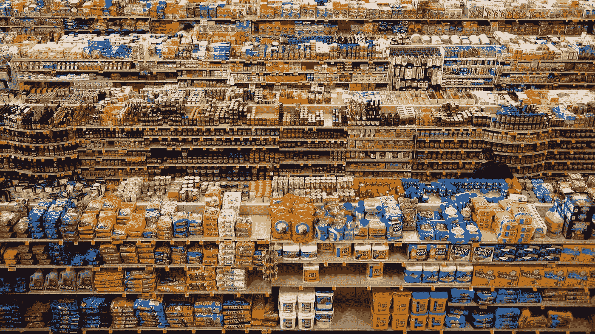

# 还剩下什么要建？

> 原文：<https://medium.com/hackernoon/whats-left-to-build-1637501c9696>

## 番茄酱和苏打水如何教会我们关于网络的知识

近年来，如果你想开一家食品公司，只有几种策略:

1) **拿些小众的东西，跟着**建立一个邪教。例如[肯辛顿爵士番茄酱](http://blog.bondstreet.com/post/120190647289/kings-of-ketchup)(高档番茄酱)。大市场，主导者——随着时间的推移，努力[打造](https://hackernoon.com/tagged/build)一些突出的东西和品牌。

2) **打造一款脱颖而出且消费率极高的零食或软饮料**。例如[牛肉干](http://steveblank.com/2015/02/03/what-happened-when-krave-jerky-showed-up-in-class-with-a-435000-check/)(高档牛肉干)。[早期的精彩报道 via[Steve blank](https://medium.com/u/16b8f3e95f9b?source=post_page-----1637501c9696--------------------------------)】

后者比前者效果好得多——如果有人碰巧喜欢这个新的产品线，他们更有可能购买椰子汁或他们的新零食，购买频率远远高于可能在冰箱后面徘徊的一罐芥末或泡菜。

The battlefield for your attention.

当我们转向家居用品或化妆品时，这种模式随之而来——诚实的公司和新鲜的公司浮现在脑海中。

对于 Fresh 和 Krave 来说，这些故事有着相同的结局——分别卖给了拥有惊人分销和较低资本成本的大型消费品公司:好时和路威酩轩。那么我们为什么要谈论这类事情呢？因为同样的事情正发生在“网络”或“应用程序”——即“互联网”——或者更广泛地说，那些以数字方式将注意力货币化的公司身上。

建立一个新的“软饮料”越来越难，这个新的“软饮料”有足够的关注度来建立一个真正规模的独立业务。脸书、亚马逊和其他处于曲线肥端的公司都非常擅长这项业务——就像百事可乐可能会比你或你的投资者更看重你的新消费者品牌，因为他们渴望增长。

> 欢迎来到消费者网络的“CPG 化”。

因此，对于创业者来说，我们必须要问的问题是:Snapchat 会成为最后一家主要的独立消费互联网公司吗？

脸书当然希望如此。你认为他们为什么杀死了[解析](http://blog.parse.com/announcements/moving-on/)平台？我也不会放弃一个可能导致我死亡的免费工具。

> 我也不会放弃一个可能导致我死亡的免费工具。

这并不是说创业公司不会继续开发伟大的新应用和消费者体验。但问题是这些会有多大价值。(与此同时，当你读到这篇文章时，请关注我的广播时间或任何趋势。)

在我搬到湾区后不久，我遇到了一个刚毕业的 MBA，他向所有愿意倾听他的二手运动器材市场的人推销。一个接一个，任何一线机会都被切割成碎片，变成商品——就像一旦东西连接起来，集体互联网就会这样。

相对而言，最近*应用程序百万富翁和似乎一夜成名的独角兽的激增是一种异常现象。*

回到现实世界，肯辛顿爵士正在争夺货架空间，希望取代 800 磅的大猩猩海因茨。但 2010 年和 2011 年的应用商店是一个虚拟的全食超市，货架上几乎没有任何食品。Pocket Gems(较大的独立手机游戏工作室之一)诞生于第一款上市的 Farmville 风格的农业游戏。早期的独立游戏发行商受到了最严重的打击——许多剩下的公司都将他们的现实世界知识产权授权策略作为脱颖而出的筹码。Glu Mobile 的金·卡戴珊游戏可能是最臭名昭著的例子。

这次[寒武纪大爆发](https://en.wikipedia.org/wiki/Cambrian_explosion)(以及随之而来的当前的收缩)正在催生一个新的、更为严峻的现象:消费者的 SaaS。正如进化推动专业化一样，这些新的消费者体验专注于更小的利基垂直市场，比偶尔的应用内购买有更深的业务根基。例如，发展迅速的冥想应用 [Headspace](http://www.telegraph.co.uk/men/the-filter/11154773/Man-behind-meditation-app-goes-from-monk-to-millionaire.html) 每月收费 12.95 美元。(一年期预付 7.99 美元。)[mile IQ](https://www.mileiq.com/)——一个自动记录可扣税驾驶的工具——每月收费 5.99 美元。

这也超越了消费者。面向建筑行业的任何人或任何公司， [Plangrid](https://itunes.apple.com/us/app/plangrid-construction-collaboration/id498795789?mt=8) 是一款快速增长的订阅应用，旨在取代建筑蓝图。

所以现在和有志的移动创业者:[深入](http://www.smithsonianmag.com/science-nature/the-scariest-monsters-of-the-deep-sea-96438710/?no-ist)寻求生存和繁荣。

还是等它出来吧。正如他们在硅谷所说的“总会有另一辆公共汽车……”

还是创新的步伐会急剧加快——以至于没有一个明确的、可供创业收获的成熟平台？购物时的精神食粮…

> [黑客中午](http://bit.ly/Hackernoon)是黑客如何开始他们的下午。我们是 [@AMI](http://bit.ly/atAMIatAMI) 家庭的一员。我们现在[接受投稿](http://bit.ly/hackernoonsubmission)，并乐意[讨论广告&赞助](mailto:partners@amipublications.com)机会。
> 
> 如果你喜欢这个故事，我们推荐你阅读我们的[最新科技故事](http://bit.ly/hackernoonlatestt)和[趋势科技故事](https://hackernoon.com/trending)。直到下一次，不要把世界的现实想当然！

