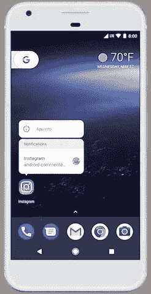
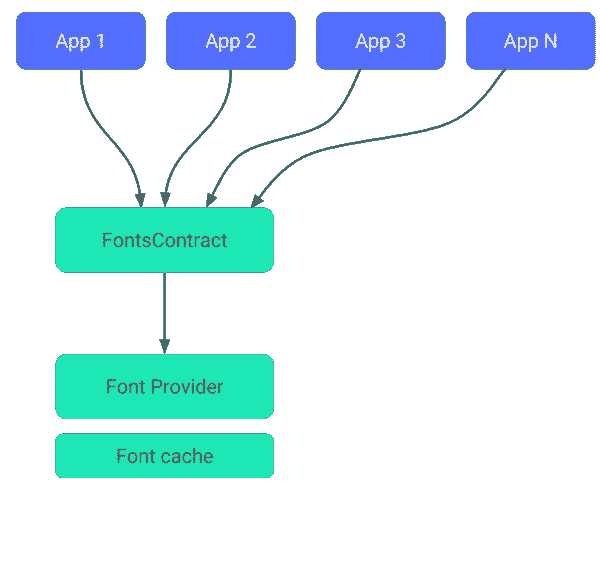

# Android Oreo 对开发者来说有什么新功能

> 原文：<https://medium.com/hackernoon/whats-new-in-android-oreo-for-developers-91e1c7e5531a>

随着安卓的每一次发布，更新你的应用程序以包含新功能的责任就来了。今年，谷歌确保你有很多选择，并挑选适合你的应用程序的功能。Android 操作系统的第八个主要版本以一种美味的饼干命名，奥利奥。除了新的特性和功能，Android 8.0 (API 级别 26)还包括各种系统和 API 行为变化。让我们看看每一个[开发者](https://hackernoon.com/tagged/developer)应该期待的新特性是什么。

这是用户和开发者最期待的 Android 特性之一。这项功能在以前的版本中可以在 Android TV 中使用，但在 Oreo 中，它可以在所有设备上使用。使用画中画模式，用户可以将你的应用最小化到一个更小的浮动窗口，并切换到另一个应用。此功能的完美用例是 a `Video calling app.`

Picture-in-picture in action (source: [https://developer.android.com/](https://developer.android.com/about/versions/oreo/android-8.0.html))

# 通知

Android Oreo 用户体验的另一大变化是通知变化。通知中增加了许多新功能。用户现在可以长按各个图标来获得该应用程序的通知以及应用程序快捷方式。

**通知频道**允许您为想要显示的每种类型的通知创建一个用户可定制的频道。

**通知圆点**用于在应用程序启动图标上显示圆点或徽章。通知点反映了用户尚未消除或处理的通知的存在。目前这个特性是作为第三方启动器提供的，但是现在它是操作系统中的一个功能。

通知**超时**、**打盹**、**设置**、**解散回调**、**背景颜色**是其他需要注意的特性。

# 自动填充框架

这是我们在填写表单时经常在浏览器中看到的一个常见功能。该功能对于用户填写长表单非常有帮助。现在它在 Android 操作系统中可用，您的应用程序可以利用它。您所需要的只是向操作系统提供一些元数据来自动填充输入数据。例如，为用户名提供`[AUTOFILL_HINT_USERNAME](https://developer.android.com/reference/android/view/View.html#AUTOFILL_HINT_USERNAME)`,或者为信用卡号提供`[AUTOFILL_HINT_CREDIT_CARD_NUMBER](https://developer.android.com/reference/android/view/View.html#AUTOFILL_HINT_CREDIT_CARD_NUMBER)`,以便在特定编辑文本框中填写。

# 后台执行限制

在这个版本中有很多努力来优化你的设备的电池寿命。

> 在后台运行的应用程序现在对它们访问后台服务的自由程度有所限制。
> 
> 应用程序无法使用其清单来注册大多数隐式广播(即不是专门针对该应用程序的广播)。

默认情况下，这些限制只适用于针对奥利奥的应用。但是，用户可以从**设置**屏幕为任何应用程序启用这些限制，即使该应用程序没有针对奥利奥。所以你应该重温那些 ***服务*** 类，并做必要的修改。

# 背景位置限制

Android 8.0 限制了后台应用检索用户当前位置的频率。应用程序每小时只能接收几次位置更新。这是优化电池使用的又一步。

**融合位置提供商、地理围栏、位置管理器、Wifi 管理器、GNSS 测量**和 **GNSS 导航消息**是受这些限制影响的 API。

# 可下载字体

Android Oreo 引入了对 API 的支持，以从提供商应用程序请求字体，而不是将文件捆绑到 APK 或让 APK 下载字体。该功能可通过**支持库 26** 在运行 Android API 版本 14 及更高版本的设备上使用。

这些字体将被下载和缓存，并在系统范围内可供所有应用程序访问。

**自动调整文本视图**、**自适应图标**、**色彩管理**、**多显示器支持**、**联网**和 **HTTP(S)连接**是许多其他值得一看的变化中的一些。