# Git 2.11 有什么新特性？

> 原文：<https://medium.com/hackernoon/whats-new-in-git-2-11-64860aea6c4f>

事实证明，很多！Git 2.11 已经发布了一系列的新特性和可用性改进，特别是对于那些从事具有深层历史、大文件或子模块的项目的人。以下是激起我们对 Bitbucket 团队兴趣的精彩内容:

*   [自动调整大小的 SHA-1 缩写](#bac5)
*   [子模块的替换](#a3a3)
*   [子模块差异](#4229)
*   [git ls 文件递归子模块](#42f1)
*   [实验差异改进](#892c)
*   [更简单的藏匿 id](#03fe)
*   [长时间运行的过滤程序](#ae8d)
*   [git 目录文件过滤器](#470c)
*   [receive.maxInputSize](#367e)
*   [合并比较速记](#5104)

# 自动调整大小的 SHA-1 缩写

Git 使用 SHA-1 散列，通常显示为丑陋的大十六进制字符串，来唯一地标识提交和其他对象。当开发人员从*集中式*版本控制(单调递增的 id 很容易，因为它们是集中生成的)切换到*分布式*版本控制(每个贡献者生成他们自己的 id)时,“如果两个不同的对象创建相同的散列，会发生什么？!"有时会出现。幸运的是，阿沙 1 号相撞的可能性微乎其微。《Pro Git》一书的作者斯科特·沙孔说得好:

> *如果地球上所有 65 亿人都在* [*编程*](https://hackernoon.com/tagged/programming) *，并且每一秒钟，每个人都在产生相当于整个 Linux 内核历史(360 万个 g it 对象)的代码，并将其推入一个巨大的 Git 存储库，那么大约需要 2 年时间，该存储库才会包含足够多的对象，以使单个 SHA-1 对象发生冲突的概率达到 50%。你的编程团队的每一个成员在同一个晚上被狼袭击并杀死的可能性更高。*

然而，为了节省终端空间，在 Git 2.10 之前，许多常见命令都将 sha 缩写为 hash 的前 7 个六位数。

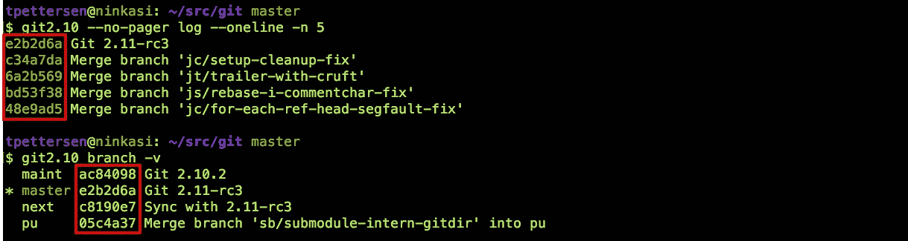

Abbreviated SHAs

这可能是一个问题，因为缩写的 sha 太短，最终可能会失去它们的唯一性。我说*最终*是因为 Git 将总是输出足够的字符，以确保缩写的 SHA 在命令运行时是唯一的。但是，如果您在提交消息、电子邮件或另一个外部系统中记录了一个简短的 SHA，那么当您在将来某个时候将它复制并粘贴回针对存储库运行的 Git 命令时，它可能不再是惟一的。

将 40 个十六进制数缩写为 7 会将可能 sha 的数量从难以想象的大 **1.46 x 10⁴⁸** 减少到仍然相当大的 **268，435，456** 。然而，Git 创建了一个 *lot* 对象，每个对象都需要自己的 SHA-1:每个提交和带注释的标签一个，每个文件的每个版本一个，每个树对象一个(每次创建目录或目录内容改变时都会创建一个)。更糟糕的是,[生日悖论](https://betterexplained.com/articles/understanding-the-birthday-paradox/)意味着你只需要相对较少数量的物品——实际上只有 **19，290 个】—就有 50%的机会让其中两个拥有相同的前 7 位六位数。**

Git 2.11 引入了一个新特性，SHA 缩写长度是根据对存储库中对象数量的估计来计算的。Linux 内核刚刚在其 Git 存储库中传递了 500 万个对象，在 Git 2.11 下默认为 12 个十六进制数字:

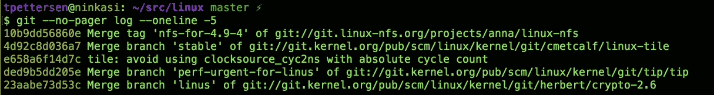

linux.git

Git 自己的存储库有 220，000 多个对象，默认为 9 个十六进制数字:

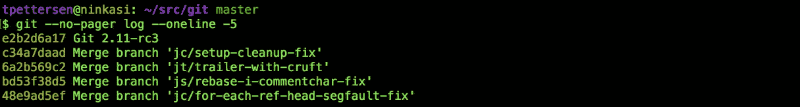

git.git

如果您习惯为自己的项目记录简短的 SHA，您可能希望通过手动覆盖 SHA 缩写长度来证明自己:

```
$ git config --global core.abbrev 12
```

另外，Git 2.11 还学会了列出由缩写的 SHA 引用的冲突对象:

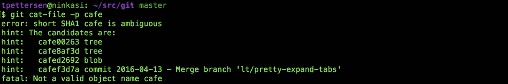

因此，如果您不幸遇到含糊不清的缩写 SHA-1，Git 现在会为您提供足够的信息，让您自己解决这个歧义。

# 子模块，子模块，子模块

Git 子模块在最近的 Git 版本中得到了大量的改进:

*   Git 2.8 中的并行获取
*   在 Git 2.9 中
*   `.gitmodules`2.10 中的“浅”标志

我仍然建议将子模块作为最后的手段，因为依赖管理系统对于组合项目通常更有效。然而，Git 2.11 确实有三个显著的改进，如果您确实需要子模块，它们会变得更容易使用。如果您对子模块不感兴趣，请随意跳到关于 `[git diff](#892c)` [改进](#892c)的[部分。](#892c)

## 子模块的替代

`--reference`选项可以与`git clone`一起使用，指定另一个本地存储库作为“备用”对象存储，以保存通过网络重新复制的对象，而这些对象是您已经在本地拥有的。语法是:

```
$ git clone --reference <local repo> <url>
```

从 Git 2.11 开始，您可以结合使用`--reference`和`--recurse-submodules`来设置*子模块*替换，指向另一个本地存储库中的子模块。语法是:

```
$ git clone --recurse-submodules --reference <local repo> <url>
```

这可能会节省大量的带宽和本地磁盘，但是如果引用的本地存储库没有您要从中克隆的远程存储库的所有必需的子模块，这将会失败。

幸运的是，方便的`--reference-if-able`选项会优雅地失败，并且对于引用的本地存储库中缺失的任何子模块，会退回到正常的克隆:

```
$ git clone --recurse-submodules --reference-if-able <local repo> <url>
```

## 子模块差异

以前，Git 有两种模式来显示更新存储库子模块的提交差异:

*   `git diff --submodule=short`显示您的项目所引用的子模块中的旧提交和新提交(如果您完全省略了`--submodule`选项，这也是默认设置):

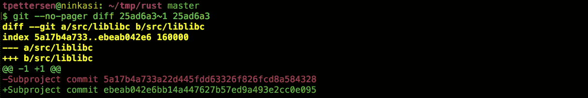

git diff --submodule=short

*   `git diff --submodule=log`更有用一些，它在更新的子模块中显示任何新的或删除的提交的提交消息的摘要行:

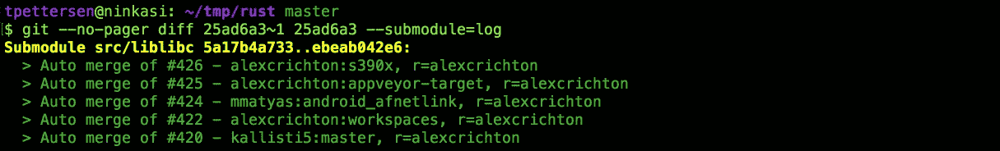

git diff --submodule=log

*   Git 2.11 引入了第三个选项:`--submodule=diff`。这将显示更新的子模块中所有更改的完整差异:

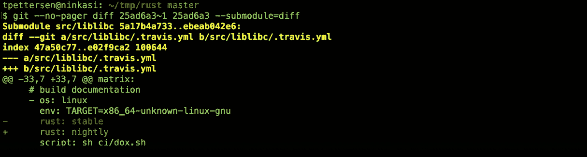

git diff --submodule=diff

## git ls-文件-递归-子模块

`git ls-files`学习了`--recurse-submodules`选项。传统上`git ls-files`会列出存储库中被跟踪的文件，从 Git 2.11 开始，也可以列出子模块跟踪的文件:

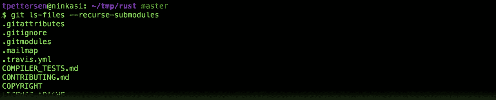

git ls-file --recurse-submodules

这可能不是您每天都要运行的命令，但是如果您想要编写一个脚本来遍历您的存储库*及其子模块*中的每个文件，这是很方便的。

# 实验差异改进

`git diff`当修改部分前后的行相同时，可能会产生一些稍微令人困惑的输出。当一个文件中有两个或更多结构相似的函数时，就会发生这种情况。对于一个稍显做作的例子，假设我们有一个包含单一函数的简单文件:

```
/* @return {string} "Bitbucket" */
function productName() {
	return "Bitbucket";
}
```

现在，假设我们已经提交了一个变更，在*前添加了另一个*函数，该函数具有类似的功能:

```
/* @return {string} "Bitbucket" */
function productId() {
	return "Bitbucket";
}/* @return {string} "Bitbucket" */
function productName() {
	return "Bitbucket";
}
```

您可能希望`git diff`显示添加的前五行，但是它实际上错误地将第一行归于原始提交:

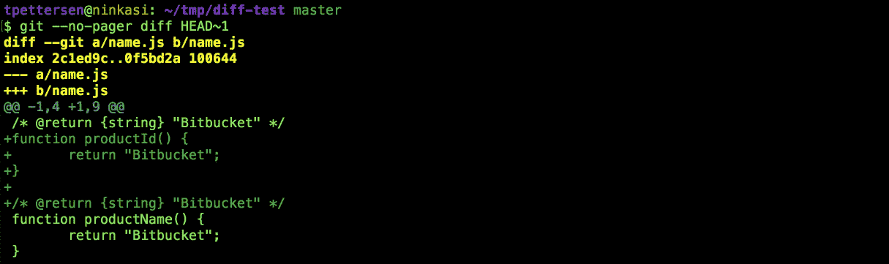

The wrong comment is included in the diff.

不是世界末日，而是来自 *whaaat 的几秒认知开销？*每次发生这种情况都会累加起来。

Git 2.11 引入了一个新的实验性差异选项`--indent-heuristic`，试图产生更具美感的差异:

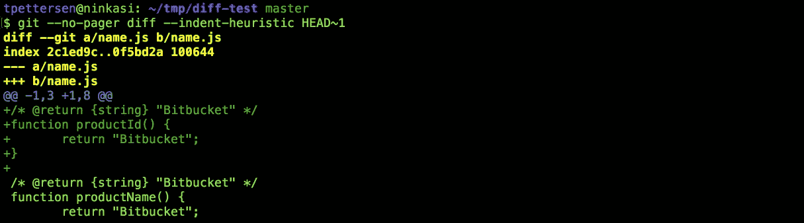

git diff --indent-heuristic

在引擎盖下，`--indent-heuristic`循环遍历每个变更的可能差异，并给每个差异分配一个“坏”分数。这是基于试探法的，比如 diff 块是否以不同级别的缩进开始和结束(这在美学上是不好的)，以及 diff 块是否有前导和尾随空行(这在美学上是令人愉快的)。则输出具有最低不良分数的块。

这个特性是实验性的，但是您可以通过将`--indent-heuristic`选项应用到任何`git diff`命令来测试它。或者，如果您喜欢生活在危险边缘，您可以通过以下方式在您的系统中启用它:

```
$ git config --global diff.indentHeuristic true
```

# 更简单的隐藏 id

`[git stash](https://www.atlassian.com/git/tutorials/git-stash/)`命令是一个漂亮的小工具，可以在你做其他事情的时候暂时搁置变更。如果你是一个粉丝，你可能知道你可以搁置多个变更，用`git stash list`查看它们:

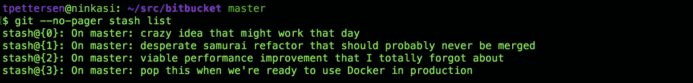

git stash list

然而，您可能不知道为什么 Git 的存储库有如此笨拙的标识符— `stash@{1}`、`stash@{2}`等等。——可能已经把它们当作“Git 的一种癖好”而一笔勾销了。事实证明，像许多 Git 特性一样，这些奇怪的 id 实际上是 Git 数据模型的一种非常巧妙的使用(或滥用)的症状。

在幕后，`git stash`命令实际上创建了一组特殊的提交对象，这些对象对您隐藏的更改进行编码，并维护一个 [reflog](https://www.atlassian.com/git/tutorials/refs-and-the-reflog/) 来保存对这些特殊提交的引用。这就是为什么`git stash list`的输出看起来很像`git reflog`命令的输出。当您运行`git stash apply stash@{1}`时，您实际上是在说“从 stash reflog 在位置 1 应用提交”。

从 Git 2.11 开始，您不再需要使用完整的`git stash@{n}`语法。相反，您可以用一个简单的整数来引用 stash，该整数表示它们在 stash reflog 中的位置:

```
$ git stash show 1
$ git stash apply 1
$ git stash pop 1
```

诸如此类。如果你想了解更多关于 stash 是如何存储的，我在[git stash 如何工作](https://www.atlassian.com/git/tutorials/git-stash/#how-git-stash-works)中写了一点。

# 长时间运行的过滤过程

Bitbucket 支持流行的 [Git LFS(大文件存储)](https://www.atlassian.com/git/tutorials/git-lfs/)扩展，以帮助需要有效跟踪其存储库中大型二进制文件的用户。Git 2.11 带来了一些改进，使得 Git LFS 变得更快更好用。最重要的变化是 Git 现在支持长时间运行的清洁和涂抹过滤过程来转换 LFS 指针，而不是每次都必须调用一个新的过程。

当您`git add`一个文件时， *clean filters* 可用于在将文件内容写入 Git 对象存储之前转换(或 *clean* )文件内容。Git LFS 通过使用一个干净的过滤器将大文件内容存放在 LFS 缓存中，并向 Git 对象存储中添加一个微小的“指针”文件，从而减小了存储库的大小。

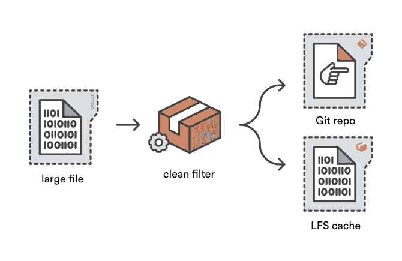

The Git LFS *clean* filter converts large files into tiny pointer files.

*涂抹滤镜*与清洁滤镜相反——因此得名。当在`git checkout`期间从 Git 对象存储中读取文件内容时，涂抹过滤器有机会在它被写入用户的工作副本之前转换它。Git LFS 涂抹滤镜通过将指针文件替换为相应的大文件来转换指针文件，这些大文件可以来自 LFS 缓存，也可以直接读取到 Bitbucket 上的 Git LFS 存储中。

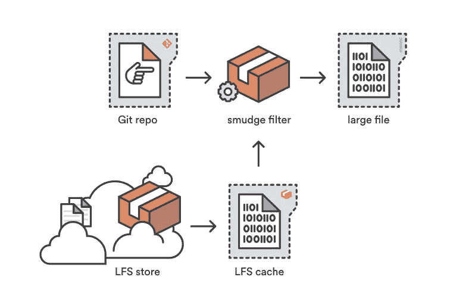

The Git LFS *smudge* filter converts pointer files back into the large file content.

传统上，对于正在添加或签出的每个文件,涂抹和清洁过滤过程被调用一次*。因此，一个用 Git LFS 跟踪了 1000 个文件的项目调用了 1000 次`git-lfs-smudge`命令来进行新的签出！虽然每个操作相对较快，但旋转 1000 个单独的涂抹过程的开销是昂贵的。*

从 Git 2.11 开始，涂抹和清理过滤器可以定义为长时间运行的进程，对第一个过滤的文件调用一次，然后馈送需要涂抹或清理的后续文件，直到父 Git 操作退出。为 Git 贡献了长期运行过滤器的 Lars Schneider 很好地总结了这种变化对 Git LFS 性能的影响:

> *过滤过程是💥* ***快 80 倍*** *💥* ***在 macOS 上*** *和💥* ***快 58x****💥****Windows 上的*** *为测试回购用 12k 文件。在 Windows 上，这意味着测试运行在* ***57 秒，而不是 55 分钟*** *！*

这是一个令人印象深刻的性能提升！注意，你需要升级到 Git 2.11 **和** Git LFS 1.5 来利用这些速度的提升。

# git 目录文件过滤器

对于 Git LFS 和其他基于过滤器的扩展的用户来说，另一个小的改进是针对`git cat-file`命令的新的`--filters`选项。`git cat-file -p`让您检查您的 Git 对象存储中的对象(`-p`表示“漂亮的打印”)。例如，我可以用以下命令查看分支`v2`上的文件`images/bitbucket.png`的内容:

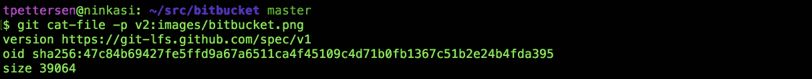

The contents of a Git LFS pointer file, courtesy of git cat-file -p

然而，`bitbucket.png`碰巧被 Git LFS 跟踪，而`git cat-file`跳过了 Git LFS 涂抹滤镜(以及我们定义的任何其他滤镜)，所以我们没有得到我们的图像，而是得到了 Git LFS 指针文件的内容。

从 Git 2.11 开始，您可以确保使用`--filters`选项应用适当的过滤器。对于 Git LFS 文件，这将取消对指针的引用并查找实际内容，通常会在您的终端上打印出大量的二进制垃圾:

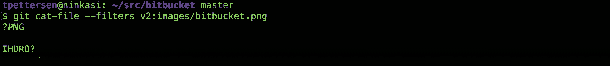

The actual LFS file content, courtesy of git cat-file --filters

对于二进制内容，通常最好将内容通过管道传输到一个临时文件，而不是您的终端。或者，如果你在 macOS 上，你可以用`open -a <app> -f:`一步到位直接把它传送到一个合适的编辑器

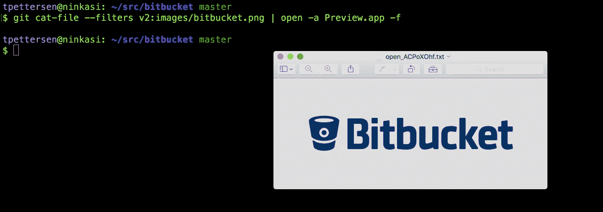

git cat-file --filters <commit-ish>:<path> | open -a Preview.app -f

或者，Atlassian 的免费 Git 客户端 [SourceTree](https://www.sourcetreeapp.com/) 对 Git LFS 有极好的支持，包括 LFS 追踪内容的二进制预览。我不会轻易使用术语*卓越*:source tree 的创始开发者 Steve“Sinbad”Streeting 也碰巧为 Git LFS 项目贡献了 31 KLOC。

# receive.maxInputSize

Git 2.11 还引入了一个服务器端设置，用于限制单次推送可以传输的字节数。这对于想要防止用户意外将大型二进制文件(使用 Git LFS 可以更好地跟踪)推送到上游存储库的回购管理员来说非常方便。如果您正在运行自己开发的 Git 服务器或者手动管理您的服务器配置，那么`receive.maxInputSize`设置非常有用。在您的 Git 服务器上运行以下命令**会将推送大小限制为 10mb:**

```
$ git config --global receive.maxInputSize 10485760
```

如果你正在使用 Bitbucket Server，我建议你使用一个类似于 [ScriptRunner](https://scriptrunner.adaptavist.com/4.3.0/bitbucket/PreReceiveHooks.html#_restrict_file_size) 的预接收挂钩插件来约束推送。 [Bitbucket hook API](https://confluence.atlassian.com/bitbucketserver/using-repository-hooks-776639836.html) 在文件大小和类型、命名约定和强制提交来源等方面为您提供了更大的灵活性，而不仅仅是限制推送的总字节数。

# 合并比较速记

Git 有一堆遍历提交历史的简洁简写。显示合并提交中合并的变更的一个常用命令是:

```
$ git log <merge commit>^..<merge commit>
```

大致意思是:

> *显示所有与* `*<merge commit>*` *合并的新提交！*

命令中的`^`表示“的父”,双点语法指定我们感兴趣的是合并提交可到达的提交，而不是第一个父级可到达的*。(合并的第一个父级是执行合并时位于签出分支末端的提交。)*

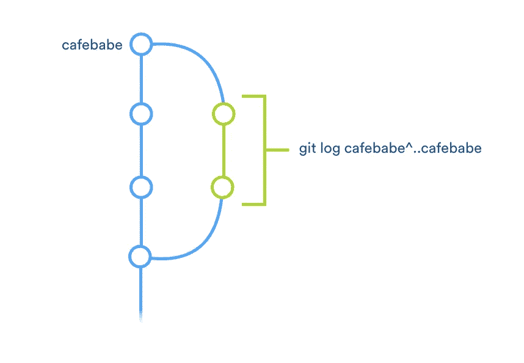

git log <merge>^..<merge> shows the commits merged into the target branch by <merge>

Git 2.11 引入了这种语法的简写:

```
$ git log <merge commit>^-1
```

您还可以用`^-2`替换`^-1`，将合并提交与其第二个父提交进行比较，以查看不在合并分支上的提交。

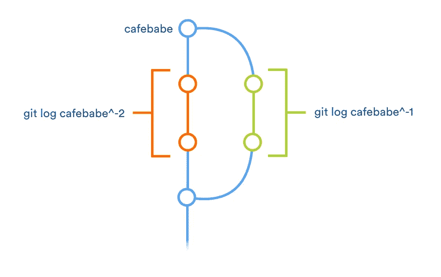

git log <merge>^-n shows commits from all branches that aren’t the nth parent of <merge>

或者，如果您喜欢 octopus 合并(涉及两个以上父代的合并)，您可以使用`^-n`与第 n 个*父代*进行比较。

这个新表单可以在任何你可以指定修改范围的地方工作！例如，您可以使用:

```
$ git diff <merge commit>^-1
```

生成由合并提交引入的所有更改的差异。

# 

你做到了，感谢阅读！这是一篇很长的帖子，但是我们只设法看完了 2.11 版本中 Junio 和他的 Git 向导们发布的 100 多个特性、修复和性能改进中的 10 个。查看[完整的发布说明](https://git.kernel.org/cgit/git/git.git/tree/Documentation/RelNotes/2.11.0.txt)，然后[安装最新版本的 Git](https://www.atlassian.com/git/tutorials/install-git/) (或者使用你喜欢的包管理器升级)。

如果你想聊 Git 或 [Bitbucket](https://bitbucket.org) ，在 Twitter 上找我:我是 [@kannonboy](https://twitter.com/kannonboy) 。

[](http://bit.ly/HackernoonFB)[](https://goo.gl/k7XYbx)[](https://goo.gl/4ofytp)

> [黑客中午](http://bit.ly/Hackernoon)是黑客如何开始他们的下午。我们是阿妹家庭的一员。我们现在[接受投稿](http://bit.ly/hackernoonsubmission)并乐意[讨论广告&赞助](mailto:partners@amipublications.com)机会。
> 
> 如果你喜欢这个故事，我们推荐你阅读我们的[最新科技故事](http://bit.ly/hackernoonlatestt)和[趋势科技故事](https://hackernoon.com/trending)。直到下一次，不要把世界的现实想当然！

