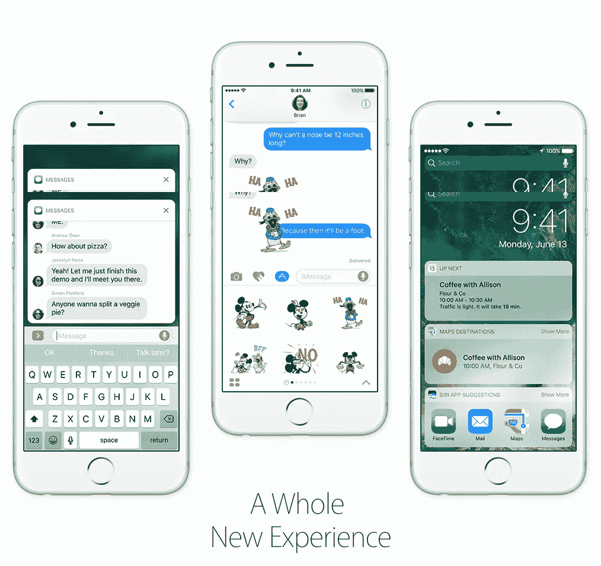
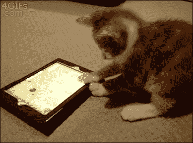

# IOS 10 丰富的通知有什么新功能？

> 原文：<https://medium.com/hackernoon/whats-new-in-ios-10-rich-notification-1350f267fe57>

苹果公司一直在运行和升级他们的操作系统，以使通知更加动态和可行。在 [iOS](https://hackernoon.com/tagged/ios) 9 中，你可以将提醒标记为完成，并直接在通知中回复短信。有了 iOS 10，通知的互动性更强，也更丰富。

许多第三方开发者现在正在尝试丰富的通知交互，几个月前在苹果 2016 年 WWDC 主题演讲中，他们看到了一个优步通知的样本，它向你显示了你的司机的路线地图，允许你给你的司机打电话或取消请求，而不必跳转到优步应用程序。

Apple WWDC 2016 HIghlight

现在，iPhone 用户可以直接在通知中查看**的照片**，观看**的视频**，收听**的音频**。该通知还可以显示实时数据和信息，因此他们可以在朋友键入对文本的响应时看到位置点实时移动。第三方开发人员可以使用所有这些功能为他们自己的应用程序创建丰富、交互式和强大的通知体验。

Push Notification on Apple Website

但还有更多！

苹果正在多方面翻新他们的通知系统，从这些通知的呈现方式到用户的回应方式。为了在 iOS 10 发布会上抢占先机，移动营销人员和应用开发机构需要联合工程师、创意人员和分析师。有两个新的强大功能的主要故障和采用建议。

## **让我们发财吧！**

Message Push Notification from Wired.com

iOS 10 中有两种新的内容类型:富媒体和自定义应用程序界面。富媒体意味着移动营销人员现在可以添加**图像**、**gif**、以及**音频**和**视频**文件来推送通知(详情请看[这里](https://developer.apple.com/reference/usernotifications/unnotificationattachment))。这些推送通知将以缩略图预览的形式出现，这与 iOS 9 的索引导向的视觉差异。一个新增的功能是，推送通知现在可以通过消息撤回来编辑**、删除**、或折叠**，这可能是今年多个移动营销人员的救星。******

****

**Cat GIF**

**我还预计，当营销人员实施这种推送通知时，将会有很多猫和狗的 GIF，我们知道，智能品牌将会测试各种各样的富媒体类型，如 GIF、tone 和 targeting。营销人员，尤其是零售商，应该考虑向个人客户推出个性化产品，并利用这一特点来展示他们的产品。像媒体和新闻这样的出版商也可以使用富通知来给出突发新闻的简短摘要。不管是什么行业，我认为 C 级的人现在需要和他们的工程团队开一次会，以确保每个可爱的猫 GIF 都找到一个移动的家。**

## ****弹出和锁定****

**iOS 10 中的推送通知可以在移动设备上以三种状态出现:通知中心、锁屏和活动屏幕顶部。终端用户的新变化很聪明，它们有可能极大地提高移动营销人员的参与度。**

**例如，iOS 9 Plus 中 iPhone 6s 和 6s 的解锁程序非常快，用户经常会绕过锁定屏幕，直接进入主屏幕。现在在 iOS 10 中，用户必须按下 Home 键并通过触控 ID(或手动代码)进行认证，这增加了一个额外的暂停，并将锁屏显示在视图中，给了锁屏通知一个参与的机会。苹果还将宣布新设备型号中的一项功能，即在举起手机时唤醒手机，使锁屏通知更加突出。此外，小工具现在从通知中心移除(但可以通过滑动访问)，这意味着更少的噪音和更多的通知。**

**这些更新让营销人员在聚光灯下只有宝贵的几毫秒时间。与其在每次推送中大胆使用颜色和品牌，不如测试、衡量和优化一种你的移动客户能够识别的视觉语言。零售商和出版商也可以使用特定的颜色和一致的标题来显示销售、折扣和促销信息。**

***来源*:【developer.apple.com】T4**

************

> **[黑客中午](http://bit.ly/Hackernoon)是黑客如何开始他们的下午。我们是 [@AMI](http://bit.ly/atAMIatAMI) 家庭的一员。我们现在[接受投稿](http://bit.ly/hackernoonsubmission)并乐意[讨论广告&赞助](mailto:partners@amipublications.com)机会。**
> 
> **如果你喜欢这个故事，我们推荐你阅读我们的[最新科技故事](http://bit.ly/hackernoonlatestt)和[趋势科技故事](https://hackernoon.com/trending)。直到下一次，不要把世界的现实想当然！**

****