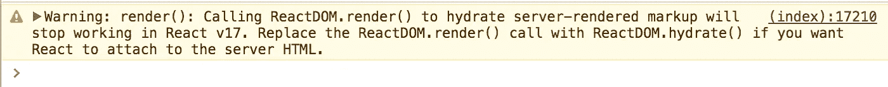
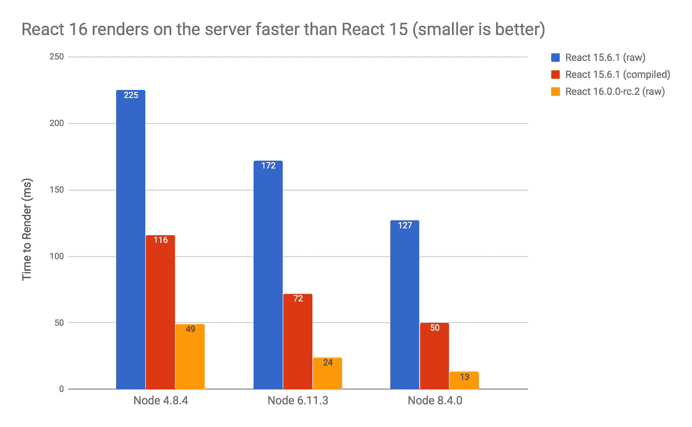

# React 16 中服务器端渲染的新特性

> 原文：<https://medium.com/hackernoon/whats-new-with-server-side-rendering-in-react-16-9b0d78585d67>

## 快速介绍 React 16 SSR 中的新功能，包括阵列、性能、流等。

React 16 来了！🎉🎉🎉

有许多令人兴奋的新内容(最明显的是纤程重写)，但就个人而言，我最兴奋的是 React 16 对服务器端渲染的许多改进。

让我们深入了解一下 React 16 中 SSR 的新功能和不同之处，我希望您最终会和我一样兴奋！

## SSR 在 React 15 中如何工作

首先，让我们回顾一下 React 15 中的服务器端渲染。要进行 SSR，通常需要运行基于节点的 web 服务器，如 Express、哈比神或 Koa，并调用`renderToString`将根组件呈现为字符串，然后将字符串写入响应:

```
// using Express
import { **renderToString** } from "react-dom/server"
import MyPage from "./MyPage"app.get("/", (req, res) => {
  res.write("<!DOCTYPE html><html><head><title>My Page</title></head><body>");
  res.write("<div id='content'>");  
  **res.write(renderToString(<MyPage/>));**
  res.write("</div></body></html>");
  res.end();
});
```

然后，在您的客户端引导代码中，您告诉客户端呈现器使用`render()`对服务器生成的 HTML 进行“再水合”，这与您在客户端呈现的应用程序中使用的方法相同:

```
import { render } from "react-dom"
import MyPage from "./MyPage"render(<MyPage/>, document.getElementById("content"));
```

如果您正确地做到了这一点，客户端呈现器就可以使用现有的服务器生成的 HTML，而无需更新 DOM。

那么，React 16 中的 SSR 是什么样子的呢？

## React 16 是向后兼容的

React 团队对向后兼容性表现出了强烈的承诺，因此如果您能够在 React 15 中运行您的代码而没有任何反对警告，它应该在 React 16 中“正常工作”。例如，上一节中的代码在 React 15 和 React 16 中都运行良好。

如果你偶然将 React 16 放入你的应用程序并发现了错误，请[将它们归档](https://github.com/facebook/react/issues)！这将有助于核心团队清除 16 版本中的任何错误。

## render()变成水合物()

但是，当您将 SSR 代码从 React 15 升级到 React 16 时，您可能会在浏览器中遇到以下警告:



Yet another helpful React warning. render() is now hydrate()!

原来，在 React 16 中，现在有两种不同的客户端呈现方法:`render()`用于在客户端单独呈现内容，而`hydrate()`用于在服务器端呈现的标记上呈现内容。因为 React 是向后兼容的，所以在 React 16 中，当在服务器生成的标记之上进行渲染时，`render()`将继续工作，但是您应该将这些调用更改为`hydrate()`以消除警告，并为 React 17 准备您的代码。我们上面展示的代码片段将变成:

```
import { **hydrate** } from "react-dom"
import MyPage from "./MyPage"**hydrate**(<MyPage/>, document.getElementById("content"));
```

## React 16 可以处理数组、字符串和数字

在 React 15 中，组件的`render`方法必须总是返回单个 React 元素。然而，在 React 16 中，客户端渲染器允许组件从`render`方法返回字符串、数字或元素数组。自然，React 16 的服务器端渲染也支持这个特性。

因此，您现在可以服务器呈现如下所示的组件:

```
class MyArrayComponent extends React.Component {
  render() {
    return [
      <div key="1">first element</div>, 
      <div key="2">second element</div>
    ];
  }
}class MyStringComponent extends React.Component {
  render() {
    return "hey there";
  }
}class MyNumberComponent extends React.Component {
  render() {
    return 2;
  }
}
```

您甚至可以将一个字符串、一个数字或一个组件数组传递给顶级的`renderToString`方法:

```
res.write(renderToString([
      <div key="1">first element</div>, 
      <div key="2">second element</div>
    ]));// it’s not entirely clear why you would do this, but it works!
res.write(renderToString("hey there"));
res.write(renderToString(2));
```

这应该可以让您消除刚刚添加到 React 组件树中的任何`div`和`span`，从而减小 HTML 文档的整体大小。

## React 16 生成更高效的 HTML

说到更小的 HTML 文档大小，React 16 还从根本上减少了生成的 HTML 中的 SSR 开销。在 React 15 中，SSR 文档中的每个 HTML 元素都有一个`data-reactid`属性，其值由一个单调递增的 ID 组成，文本节点有时会被带有`react-text`和一个 ID 的注释包围。要查看这是什么样子，请参考下面的代码片段:

```
renderToString(
  <div>
    This is some <span>server-generated</span> <span>HTML.</span>
  </div>
);
```

在 React 15 中，这个代码片段生成如下所示的 HTML(为了可读性，添加了换行符):

```
<div data-reactroot="" data-reactid="1" 
    data-react-checksum="122239856">
  <!-- react-text: 2 -->This is some <!-- /react-text -->
  <span data-reactid="3">server-generated</span>
  <!-- react-text: 4--> <!-- /react-text -->
  <span data-reactid="5">HTML.</span>
</div>
```

然而，在 React 16 中，所有的 id 都被从标记中删除了，所以相同代码片段的 HTML 要简单得多:

```
<div data-reactroot="">
  This is some <span>server-generated</span> <span>HTML.</span>
</div>
```

这不仅读起来更清晰，还可以大大减小 HTML 文档的大小。耶！

## React 16 允许非标准的 DOM 属性

在 React 15 中，DOM 呈现器对 HTML 元素的属性要求相当严格，它剔除了所有非标准的 HTML 属性。但是，在 React 16 中，客户机和服务器呈现器现在都可以传递您添加到 HTML 元素中的任何非标准属性。要了解更多关于这一特性的信息，请阅读[丹·阿布拉莫夫在 React 博客](https://facebook.github.io/react/blog/2017/09/08/dom-attributes-in-react-16.html)上关于这一变化的帖子。

## React 16 SSR 不支持错误边界或门户

React 16 客户端渲染器中有两个服务器端渲染器不支持的新特性:错误边界和门户。如果你想了解更多关于错误边界的知识，可以看看 Dan Abramov 在 React 博客上的[精彩文章，但是要知道(至少现在)错误边界并不能捕捉服务器上的错误。据我所知，门户还没有解释性的博客文章，但是门户 API 需要一个 DOM 节点，所以它不能在服务器上使用。](https://facebook.github.io/react/blog/2017/07/26/error-handling-in-react-16.html)

## React 16 执行不太严格的客户端检查

当您在 React 15 中的客户端重新合并标记时，`ReactDOM.render()`会与服务器生成的标记进行逐字符比较。如果由于任何原因出现不匹配，React 会在开发模式下发出警告，并用客户机上生成的 HTML 替换服务器生成的整个标记树。

但是，在 React 16 中，客户端呈现器使用不同的算法来检查服务器生成的标记是否正确。比 React 15 宽松一点；例如，它不要求服务器生成的标记的属性顺序与它们在客户端的顺序相同。当 React 16 中的客户端渲染器检测到标记不匹配时，它只会尝试更改不匹配的 HTML 子树，而不是整个 HTML 树。

一般来说，这种变化对最终用户应该不会有太大影响，除了一个事实: **React 16 在调用** `**ReactDOM.render()/hydrate()**`时不会修复不匹配的 SSR 生成的 HTML 属性。这种性能优化意味着你需要额外确保修复你在`development`模式下看到的任何标记不匹配警告。

## React 16 不需要编译就能获得最佳性能

在 React 15 中，如果您直接使用 SSR，即使在`production`模式下，性能也不会达到最佳。这是因为 React 中有许多优秀的开发人员警告和提示，每个警告看起来都像这样:

```
if (process.env.NODE_ENV !== "production") {
  // check some stuff and output great developer
  // warnings here.
}
```

遗憾的是，[原来](https://github.com/facebook/react/issues/812) `[process.env](https://github.com/facebook/react/issues/812)` [并不是一个普通的 JavaScript 对象](https://github.com/facebook/react/issues/812)，从中获取一个值的代价相当大。因此，即使当`NODE_ENV`的值被设置为`production`时，仅仅*如此频繁地检查*环境变量也会给服务器渲染增加大量时间。

为了在 React 15 中解决这个问题，你必须编译你的 SSR 代码来删除对`process.env`的引用，使用类似 Webpack 的[环境插件](https://webpack.js.org/plugins/environment-plugin/)，或者 Babel 的[转换-内联-环境-变量](https://www.npmjs.com/package/babel-plugin-transform-inline-environment-variables)插件。然而，以我的经验来看，许多人*不*编译他们的服务器端代码，结果他们得到了明显更差的 SSR 性能。

在 React 16 中，这个问题已经解决了。在 React 16 的最开始只有一个检查`process.env.NODE_ENV`的调用，所以没有必要为了获得最佳性能而编译你的 SSR 代码。开箱即可获得最佳性能。

## React 16 也更快

说到性能，在生产中使用 React 服务器端渲染的人们经常抱怨大型文档渲染缓慢，即使有了所有的最佳实践*。

因此，我非常高兴地报告，我所做的一些[初步测试](https://github.com/aickin/react-16-ssr-perf)显示了 React 16 中服务器端渲染的显著速度提升，跨多个不同版本的 Node:



React 16 renders on the server faster than React 15

当与编译了`process.env`的 React 15 进行比较时，节点 4 的性能提高了约 2.4 倍，节点 6 的性能提高了约 3 倍，新的节点 8.4 版本的性能提高了整整 3.8 倍。而如果和没有编译的 React 15 对比，React 16 在 Node 最新版本的 SSR 上有整整一个数量级的增益！

为什么 React 16 SSR 比 React 15 快那么多？在 React 15 中，服务器和客户端渲染路径差不多是相同的代码。这意味着维护一个虚拟 DOM 所需的所有数据结构在服务器渲染时就已经建立起来了，即使这个 vDOM 在调用`renderToString`一返回就被丢弃了。这意味着在服务器渲染路径上有很多浪费的工作。

然而，在 React 16 中，核心团队从头开始重写了服务器渲染器，它根本不做任何 vDOM 工作。这意味着它可以快得多。

现在，有一个警告:我做的测试只是用一个非常简单的递归 React 组件生成了一棵巨大的`<span>`树。这意味着它是一个非常合成的基准，几乎肯定不能反映真实世界的使用。例如，如果你的组件中有一堆复杂的`render`方法，它们占用了大量的 CPU 周期，那么 React 16 对此无能为力。因此，虽然我绝对希望看到 React SSR 时间随着迁移到 16 而显著改善，但我不希望你在现实世界的应用程序中看到 3 倍的改善。有趣的是，我从一些早期采用者那里听说他们看到了 1.3 倍的加速比[。在你的应用中找到答案的最好方法就是测试一下，看看！](https://github.com/facebook/react/issues/10294#issuecomment-319220586)

## React 16 支持流媒体

最后，React 16 现在支持直接渲染到节点流。

呈现到流可以减少内容的第一字节时间(TTFB ),在生成文档的下一部分之前就将文档的开头发送到浏览器。当内容以这种方式从服务器流出时，所有主流浏览器都会更早地开始解析和呈现文档。

渲染到流的另一个好处是能够响应**背压**。实际上，这意味着如果网络阻塞，无法接受更多的字节，渲染器会收到信号并暂停渲染，直到阻塞被清除。这意味着您的服务器使用的内存更少，对 I/O 条件的响应更快，这两者都有助于您的服务器在充满挑战的条件下保持运行。

要使用 React 16 的 render to stream，需要在`react-dom/server` : `renderToNodeStream`或者`renderToStaticNodeStream`上调用两个新方法中的一个，分别对应`renderToString`和`renderToStaticMarkup`。这些新方法不返回字符串，而是返回一个`[Readable](https://nodejs.org/api/stream.html#stream_readable_streams)`，用于发出字节流的对象的节点流类。

当你接收到从`renderTo(Static)NodeStream`返回的`Readable`流时，它处于暂停模式，还没有进行渲染。只有当你调用`[read](https://nodejs.org/api/stream.html#stream_readable_read_size)`或者更可能的是`[pipe](https://nodejs.org/api/stream.html#stream_readable_pipe_destination_options)``Readable`到`[Writable](https://nodejs.org/api/stream.html#stream_writable_streams)`流时，渲染才会开始。大多数节点 web 框架都有一个继承自`Writable`的响应对象，所以您通常可以通过管道将`Readable`传递给响应。

作为一个例子，上面的 Express 示例可以重写为如下的流:

```
// using Express
import { **renderToNodeStream** } from "react-dom/server"
import MyPage from "./MyPage"app.get("/", (req, res) => {
  res.write("<!DOCTYPE html><html><head><title>My Page</title></head><body>");
  res.write("<div id='content'>"); **const stream = renderToNodeStream(<MyPage/>);
  stream.pipe(res, { end: false });
  stream.on('end', () => {**
    res.write("</div></body></html>");
    res.end();
  **});**
});
```

注意，当我们通过管道连接到响应对象时，我们必须包含可选参数`{ end: false }`来告诉流不要在渲染器完成时自动结束响应。这允许我们完成 HTML 主体，并在流完全写入响应后自己结束响应。

## 流媒体有一些问题

虽然渲染到流在大多数情况下应该是一种升级，但目前有一些 SSR 模式并不适合流。

一般来说，任何使用服务器渲染过程来生成标记的模式都需要在 SSR-ed 块之前添加到文档中。这方面的一些例子是动态确定将哪个 CSS 添加到前面的`<style>`标签中的框架，或者在呈现时将元素添加到文档`<head>`中的框架。如果您使用这些类型的框架，您可能必须坚持使用字符串呈现。

另一个在 React 16 中还不能工作的模式是将对`renderToNodeStream`的调用嵌入到组件树中。在 React 15 中，通常使用`renderToStaticMarkup`来生成页面模板，并嵌入对`renderToString`的调用来生成动态内容，如下所示:

```
res.write("<!DOCTYPE html>");
res.write(renderToStaticMarkup(
  <html>
    <head>
      <title>My Page</title>
    </head>
    <body>
      <div id="content">
        { renderToString(<MyPage/>) }
      </div>
    </body>
  </html>);
```

但是，如果将这些呈现调用替换为它们的流调用，这段代码将停止工作，因为还不可能将`Readable`流(从`renderToNodeStream`返回)作为元素嵌入到组件中。不过，我希望这一点能在以后添加进去！

## 就是这样！

这些就是 React 16 中主要的 SSR 变化；我希望你和我一样对它们感到兴奋。

在我结束之前，我想衷心感谢 React 核心团队的所有成员，他们致力于使服务器端渲染成为 React 生态系统的一流部分。这组人包括(但绝不限于)[吉姆·斯普洛克](http://www.jimsproch.com)、[索菲·阿尔珀特](https://twitter.com/sophiebits)、[汤姆·奥奇诺](https://twitter.com/tomocchino)、[塞巴斯蒂安·马克贝格](https://twitter.com/sebmarkbage)、[丹·阿布拉莫夫](https://twitter.com/dan_abramov)和[多米尼克·甘那韦](https://twitter.com/trueadm)。谢谢，谢谢，谢谢！

现在:让我们出去，服务器渲染一些 HTML！

*拜* [*苏尼尔帕*](https://twitter.com/threepointone)*[*丹阿布拉莫夫*](https://twitter.com/dan_abramov)*[*亚历克弗莱特*](https://twitter.com/alecf)*[*斯瓦普·卡拉瓦迪*](https://twitter.com/@swazza85)*[*海伦翁*](https://twitter.com/helenaut)****

****另外，我在 9 月 23 日的*[*React Boston*](http://www.reactboston.com)*演讲中谈到了这些话题，以及一些关于 React 16 后服务器端渲染下一步我们该何去何从的思考。如果你想看那个演讲，就在存档的活动直播* [*这里*](https://www.youtube.com/watch?v=2iPE5l3cl_s#t=57m10s) *。如果您想跳过本文中的内容，只观看 SSR 未来的想法，请单击此处的*[](https://www.youtube.com/watch?v=2iPE5l3cl_s#t=1h28m16s)**。*****

***说到这里:拜托，拜托，请确保在生产中使用 React SSR 时，始终将`NODE_ENV`设置为`production`！**