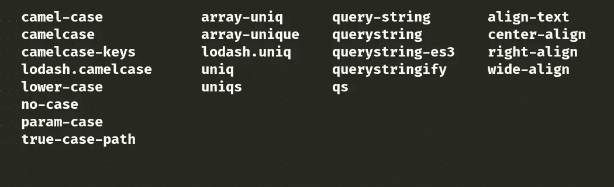
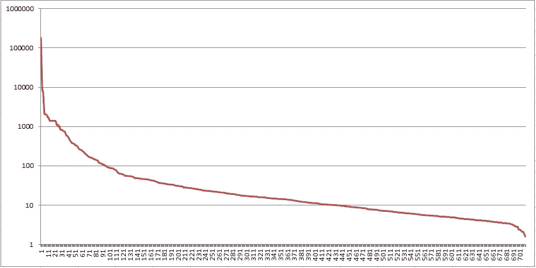
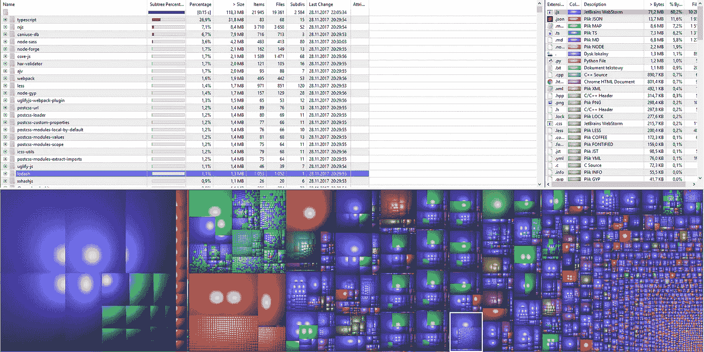

# node_modules 到底有什么问题，为什么这是您的错

> 原文：<https://medium.com/hackernoon/whats-really-wrong-with-node-modules-and-why-this-is-your-fault-8ac9fa893823>

我从来没有真正关心过`node_modules`的大小——我的想法是，你不应该太在意完成工作所需的工具。如果你需要一个 20 公斤重的锤子来钉钉子，你就拿着它。与`node_modules`相同的故事，它可能有几千字节或几兆字节重，因为我们想象的锤子带有一套重钉子，对吗？嗯，也许，理论上。

让我们放下那个花哨的类比，看看现实世界的例子。我将研究一些@angular/cli 依赖项——但只是因为它是一个相当大的库。我不想让它看起来很糟糕——它只是一个平均包装的良好代表。我用 npm@5.5.1 安装在空目录下。Npm 报告安装后“在 107.13s 内增加了 976 个包”(磁盘上有 141 兆字节)。

好的，cli 包是一个非常强大的库，它的依赖项列表有点太长，但也许所有的依赖项都是需要的。让我们来关注一下第一个被选中的包`common-tags`。快速浏览它的文档，你可以说它是某种 utils 库，有许多处理文本的常用方法。到目前为止还不错——通用方法，易于重用。

只有一个小瑕疵——在`common-tags`的 deps 中我们看到了`babel-runtime`。有点令人惊讶的是，我们只需要一些常见的文本函数，但是-嘿-这是 2017 JS 给你的。哦等等，原来它想要`core-js`和`regenerator-runtime`。幸运的是，它在这里结束了，更重要的是，`core-js`也是 utils 库，老实说，相当大的一个库！它有这么多的功能，我敢打赌，很多其他软件包将使用它！

不完全是。只有`babel-runtime`的 dep 里有。哦，太好了。
回到起点，cli 只使用了`common-tags` — `stripIndents`、`stripIndent`、`oneLine`中的 3 个(琐碎的)方法。哦，我的雏菊。

为了使用这 3 种方法`node_modules` 需要 1826 个文件。这只是提到的 976 个已安装软件包中的 4 个。

This is your dream about lightweight package collapsing

下一个依赖项是`core-object`——它总共下载了 8 个包和 45 个文件——所以还不错。而且其他包也用这些文件，大多是`chalk`。
真正令人失望的是这 8 个中的 6 个是`chalk` 的依赖项，并且`chalk`在`core-object`中只使用了一次，以绘制黄色的反对消息。

其他随机发现:

*   解决“查询字符串”主题的几个包
*   从`minimalistic-assert`到`assert-plus`复杂性不同的断言方法的一些尝试
*   几十种不同的`is-*`包
*   **许多的**包会“美化”错误和控制台打印
*   数百个多孔填料/垫片或本地方法的重新实现
*   当然先前的断言坐在满的`lodash`旁边的`node_modules`
*   …和来自`lodash` 的一些分部方法作为单独的 dep

所谓随机，我的意思是只挑选一些包，然后简单地搜索相似的包，这通常很容易，因为这些包有相似的名字。

Some of the found duplicates

我们到此为止吧。我敢打赌，其他依赖是必要的，也是经过深思熟虑的。

这对于 JS 开发者来说并不新鲜，已经有一段时间了，这种情况不应该被接受——`node_modules` 的大小是一个笑话的话题，删除像“left pad”这样的包是灾难的原因。

那么如何修复呢？通过创建*适当的*标准库。

*适当的*意味着它应该是完整的，包含各种对文本、数字、集合进行操作的常用函数和很多函数，这样在 99.99%的时间里你就不需要任何其他的库了。那是幻想吗？我不这么认为。以提到的一些 utils 库为基础，并将其与其他库合并将是一个很好的开始。

只有一个问题，这甚至不是一个技术问题——创建这样一个包需要有人担任领导者。我想的是绝对权力而不是民主——如果你想知道民主如何处理这个问题，再看看你的 node_modules。它需要一个强有力的领导者，因为它需要一个坚实的计划，而不仅仅是几个月的讨论。我们已经实现了所有的包，我们只需要以一种逻辑的方式把它粘在一起。

现在，为了追求可重用性和“保持干燥”,典型的`node_modules`目录最终完全变湿了。仅仅因为我们认为几十个功能重叠的包比一个精心设计的库要好。

Which is the bigger number, five or one? One army, a real army, united behind one leader with one purpose.

关于 jQuery 有一点需要注意——不久前，jQuery 几乎出现在每个项目中。为什么？有许多确凿的理由:

*   它以一种方便使用的形式提供了一组常用的函数。jQuery 方法很容易相互链接(由一个组织开发的结果)。
*   这是众所周知的，所以加入一个项目很容易，因为没有额外的学习曲线。
*   虽然有些人抱怨 jQuery 的大小，但这几乎无关紧要，因为它通常是从 CDN 加载的——所以 90%的时间它已经存在于用户的计算机上。

最后一点非常重要——如果你不需要下载，一个库有多大并不重要。我想到了`lodash`——它真的有很多功能，可以取代很多不必要的依赖。如果您需要 JavaScript 中缺少的东西，那么它的模块化结构和缺乏依赖性是一个很好的选择。

仅仅因为库的大小而选择一些较小的库，这与您在进行一些不成熟的优化实践时所做的事情是一样的——最终没有获得性能提升，并且代码混乱。这里也是一样——更小、无组织的包会导致冗余、不兼容和整体更大的`node_modules`尺寸。

On the vertical axis is a size in KB, on horizontal individual packages

在开始的时候，我说过我不在乎`node_modules`的大小，这在一定程度上是正确的——我不在乎它占用的空间，但是我在乎文件的数量。在@angular/cli 的情况下，几乎 70%的磁盘空间是 20 个最大的包([帕累托法则](https://en.wikipedia.org/wiki/Pareto_principle)在任何地方都适用！).

更重要的是，如果你看看下面的 WinDirStat 的报告，你会发现很多包都包含大文件(例如 sourcemaps，这些是绿色的)。就复制文件而言，计算机在处理几个大文件时比处理成千上万个小文件时工作得更好。

The node_modules report from WinDirStat. Packages in the right bottom corner can have only fractions of Planck length

大量的包还有一个缺点——潜在的版本不兼容。我们假设每个包都有 1.0 和 2.0 两个版本。在最坏的情况下，一些软件包可能需要 1.0，而其他的可能需要 2.0。我们的应用程序中的软件包越多，您获得的组合就越多。解析这些组合需要时间、CPU 和空间来保持某个同样旧的包所需的旧版本的每次出现。

## 收场白

这就是我们生活的世界。最糟糕的事情是“它有点工作”,所以它不会很快改变。创建 JS 标准库会有所帮助，但是开发者的心态需要真正的改变。

所以，如果你能从我的 looong 文章中记住一件事，那就是“使用 lodash”。如果可以的话，也要“使用已经被其他人使用的流行包”。编程不是个性竞赛，所以选择经过测试、久经沙场的库，不要增加 JavaScript 熵。

Mandatory joke, I almost forgot about it