# 颤振的革命性在哪里

> 原文：<https://medium.com/hackernoon/whats-revolutionary-about-flutter-946915b09514>

# 什么是颤振？

Flutter 移动应用程序 SDK 是一种构建*漂亮的*原生移动应用程序的新方法，它脱离了过去非常普遍的“千篇一律”的应用程序。尝试 Flutter 的人真的很喜欢；比如看[这个](/@aubykhan/how-i-built-a-cross-platform-connected-app-in-7-days-93728a987424)、[这个](/@germansaprykin/flutter-first-steps-fffd906f093b)，或者[这个](https://code.tutsplus.com/tutorials/developing-an-android-app-with-flutter--cms-28270)。或者这里有一个第三方整理的[文章和视频列表](https://github.com/Solido/awesome-flutter)。

与任何新系统一样，人们想知道是什么让 Flutter 与众不同，或者换句话说，“Flutter 有什么新的和令人兴奋的？”这是一个公平的问题，本文将试图从技术角度回答这个问题——不仅仅是*什么*令人兴奋，而是*为什么*。

但首先，我要讲一点历史。

# 移动应用开发简史

移动应用程序开发是一个相对较新的领域。第三方开发者开发移动应用的时间还不到十年，所以工具仍在不断发展也就不足为奇了。

## 平台 SDK

苹果 iOS SDK 发布于 2008 年，谷歌 Android SDK 发布于 2009 年。这两个 SDK 分别基于不同的语言:Objective-C 和 Java。

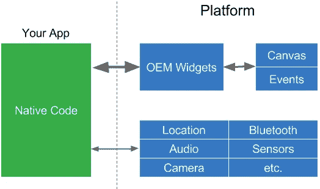

你的应用程序与平台对话来创建小部件，或者访问像相机这样的服务。小部件呈现在屏幕画布上，事件传递回小部件。这是一个简单的架构，但是你几乎必须为每个平台创建单独的应用程序，因为小部件是不同的，更不用说本地语言了。

## 网络视图

第一个跨平台框架是基于 JavaScript 和 WebViews 的。例子包括一系列相关的框架 : PhoneGap、Apache Cordova、Ionic 等等。在苹果发布他们的 iOS SDK 之前，他们鼓励第三方开发者为 iPhone 开发 web 应用，所以使用 web 技术开发跨平台应用是一个明显的步骤。

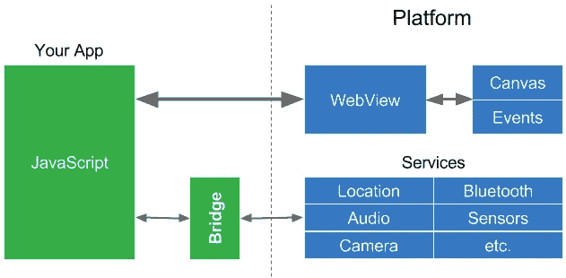

您的应用程序创建 HTML，并在平台上的 WebView 中显示它。请注意，像 JavaScript 这样的语言很难直接与本机代码(如服务)对话，因此它们要通过一个“桥梁”在 JavaScript 领域和本机领域之间进行上下文切换。因为平台服务通常不经常被调用，所以这不会导致太多的性能问题。

## 被动观点

像 [ReactJS](https://facebook.github.io/react/) (和 [others](https://github.com/Raynos/mercury) )这样的反应式 web 框架已经变得流行起来，主要是因为它们通过使用从[反应式编程](https://en.wikipedia.org/wiki/Reactive_programming)借鉴来的编程模式简化了 web 视图的创建。2015 年，React Native 的创建是为了给移动应用程序带来反应式视图的许多好处。

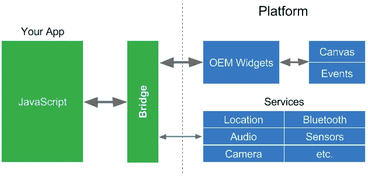

React Native 非常受欢迎(也理应如此)，但是因为 JavaScript 领域访问本机领域中的平台小部件，所以它也必须[通过桥](/@talkol/performance-limitations-of-react-native-and-how-to-overcome-them-947630d7f440)才能访问这些平台小部件。小部件通常被频繁访问(在动画、过渡或用户用手指在屏幕上“滑动”时，每秒钟多达 60 次)，因此这可能会导致性能问题。正如一篇关于 React Native 的文章所说:

> 这是理解 React 本机性能的关键之一。每个领域本身都快得惊人。当我们从一个领域转移到另一个领域时，经常会出现性能瓶颈。为了构建高性能的 React 本机应用程序，我们必须尽量减少过桥次数。

## 摆动

像 React Native 一样，Flutter 也提供了反应式视图。Flutter 采用了一种不同的方法，通过使用编译的编程语言，即 [Dart](https://www.dartlang.org/) ，来避免由于需要 JavaScript 桥而导致的性能问题。Dart 被“提前”(AOT)编译成多平台的本机代码。这允许 Flutter 与平台进行通信，而不需要通过 JavaScript 桥进行上下文切换。编译成本机代码还可以缩短应用程序的启动时间。

事实上，Flutter 是唯一一个提供反应式视图而不需要 JavaScript 桥的移动 SDK，这足以让 Flutter 变得有趣并值得一试，但 Flutter 还有更具革命性的东西，那就是它如何实现 widgets。

# 小工具

小部件是影响和控制应用程序视图和界面的元素。毫不夸张地说，小部件是移动应用程序最重要的组成部分之一。事实上，光是 widgets 就能*让*或*攻破*一个 app。

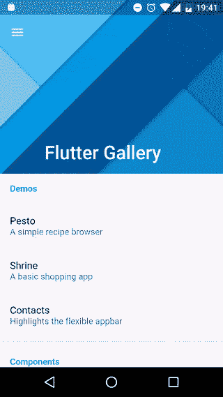

*   小部件的**外观**和**手感**至关重要。小工具需要看起来很好，包括各种屏幕尺寸。他们也需要感觉自然。
*   小部件必须执行 **fast** : 来创建小部件树，膨胀小部件(实例化它们的子部件)，将它们布置在屏幕上，呈现它们，或者(特别是)制作它们的动画。
*   对于现代的应用程序，窗口小部件应该是可扩展的和可定制的。开发者希望能够添加令人愉快的新部件，并定制所有部件以匹配应用的品牌。

Flutter 有一个新的架构，包括外观和感觉都很好、速度很快、可定制和可扩展的小部件。没错，Flutter 不使用平台小部件(或者 DOM WebViews)，它提供自己的小部件。

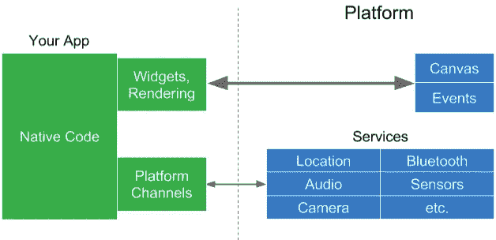

Flutter 将窗口小部件和渲染器从平台提升到应用程序中，这使得它们可以定制和扩展。Flutter 对平台的所有要求是一个画布，在其中呈现小部件，以便它们可以出现在设备屏幕上，并访问事件(触摸、计时器等)。)和服务(位置、相机等。).

Dart 程序(绿色)和原生平台代码(蓝色，iOS 或 Android)之间仍有一个接口进行数据编码和解码，但这可能比 JavaScript 桥快几个数量级。

将微件和渲染器移动到应用程序中确实会影响应用程序的大小。Android 上的 Flutter 应用程序的最小大小约为 4.7MB，与使用类似工具构建的最小应用程序相似。由您来决定颤振的好处是否值得任何权衡，因此本文的其余部分将讨论这些好处。

# 布局

颤振最大的改进之一是它的布局方式。**布局**根据一组规则(也称为约束)确定小部件的大小和位置。

传统上，布局使用一大套规则，这些规则可以应用于(几乎)任何小部件。这些规则实现了多种布局方法。我们以 CSS 布局为例，因为它是众所周知的(虽然 Android 和 iOS 中的布局基本相似)。CSS 有属性(规则)，这些属性应用于 HTML 元素(小部件)。CSS3 定义了 375 个属性。

CSS 包括许多布局模型，包括(多个)盒子模型、浮动元素、表格、多列文本、分页媒体等等。后来添加了额外的布局模型，如 flexbox 和 grid，因为开发人员和设计人员需要对布局有更多的控制，并使用表格和透明图像来获得他们想要的东西。在传统布局中，开发人员不能添加新的布局模型，因此 flexbox 和 grid 必须添加到 CSS 中，并在所有浏览器上实现。

传统布局的另一个问题是，规则可能会相互影响(甚至冲突),元素通常会应用许多规则。这使得布局缓慢。更糟糕的是，布局性能通常是 N 的平方，因此随着元素数量的增加，布局速度会更慢。

Flutter 最初是由谷歌 Chrome 浏览器团队成员进行的一项实验。我们想看看，如果我们忽略传统的布局模型，是否可以构建一个更快的渲染器。几周后，我们取得了显著的性能提升。我们发现:

*   大多数布局相对简单，例如:滚动页面上的文本，大小和位置仅取决于显示器大小的固定矩形，可能还有一些表格、浮动元素等。
*   大多数布局对于部件的子树是局部的，并且该子树通常使用一种布局模型，因此这些部件只需要支持少量的规则。

我们意识到，如果我们*把它颠倒过来*，布局会大大简化:

*   每个小部件将指定自己的简单布局模型，而不是有一大套可以应用于任何小部件的布局规则。
*   因为每个小部件需要考虑的布局规则要少得多，所以布局可以大大优化。
*   为了进一步简化布局，我们将几乎所有东西都变成了一个小部件。

下面是创建带有布局的简单小部件树的 Flutter 代码:

```
new Center(
  child: new Column(
    children: [
      new Text('Hello, World!')),
      new Icon(Icons.star, color: Colors.green)
    ]
  )
)
```

这段代码足够语义化，您可以很容易地想象它将产生什么，但结果显示如下:


在这段代码[中，一切都是小部件](https://flutter.io/widgets/)，包括布局。`Center`小部件将它的子部件放在它的父部件的中心(例如，屏幕)。`Column`布局小部件垂直排列其子部件(小部件列表)。该列包含一个`Text`小部件和一个`Icon`小部件(它有一个属性，它的颜色)。

在 Flutter 中，居中和填充是小部件。主题是小部件，适用于它们的子对象。甚至应用程序和导航都是小部件。

Flutter 包含了很多用于布局的小部件，不仅仅是列，还有行、网格、列表等等。此外，Flutter 有一个独特的布局模型，我们称之为“长条布局模型”，用于滚动。Flutter 中的布局非常快，可以用于滚动。想一想。滚动必须是即时和平滑的，当用户在物理屏幕上拖动屏幕图像时，他们会感觉屏幕图像附着在他们的手指上。

通过使用滚动布局，Flutter 可以实现高级滚动，如下所示。请注意，这些是动画 GIF 图像，颤振甚至更平滑。你可以(也应该！)自己运行这些 apps 参见本文末尾的参考资料部分。


Flutter Gallery app

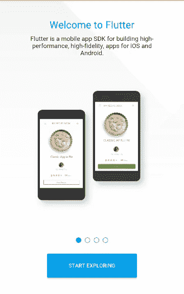

Posse Gallery app


Posse Gallery app

大多数时候，Flutter 可以一次完成布局，这意味着是线性时间，所以它可以处理大量的小部件。Flutter 也做缓存和其他事情，所以它可以尽可能避免布局。

# 定制设计

因为小工具现在是应用程序的一部分，所以可以添加新的小工具，也可以定制现有的小工具，以赋予它们不同的外观或感觉，或者与公司的品牌相匹配。移动设计的趋势是远离几年前常见的千篇一律的应用程序，转向取悦用户并赢得奖项的定制设计。

Flutter 为 Android、 [iOS](https://flutter.io/widgets/cupertino/) 和[材质设计](https://material.io/)提供了丰富的可定制小部件集(事实上，我们被告知 Flutter 拥有最高保真度的材质设计实现之一)。我们使用 Flutter 的可定制性来构建这些小部件集，以匹配多种平台上的本机小部件的外观和感觉。应用程序开发人员可以使用相同的可定制性来进一步调整小部件，以满足他们的需求。

# 关于反应视图的更多信息

引入了**虚拟 DOM** 的反应式 web 视图库。DOM 是 HTML 文档对象模型，是 JavaScript 用来操作 HTML 文档的 API，表示为元素树。虚拟 DOM 是使用编程语言(在本例中是 JavaScript)中的对象创建的 DOM 的抽象版本。

在反应式 web 视图中(由像 [ReactJS](https://facebook.github.io/react/) 和其他系统实现),虚拟 DOM 是不可变的，并且在每次有任何变化时都从零开始重建。将虚拟 DOM 与真实 DOM 进行比较，以生成一组最小的更改，然后执行这些更改来更新真实 DOM。最后，平台重新渲染真实的 DOM，并将其绘制到画布上。

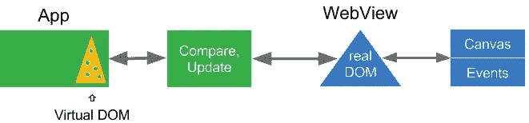

这听起来像是一个可怕的额外工作，但它是非常值得的，因为操作 HTML DOM 是非常昂贵的。

React Native 做了类似的事情，但针对的是移动应用。代替 DOM，它操纵移动平台上的本地小部件。它不使用虚拟 DOM，而是构建一个虚拟小部件树，并将其与原生小部件进行比较，只更新那些发生变化的小部件。

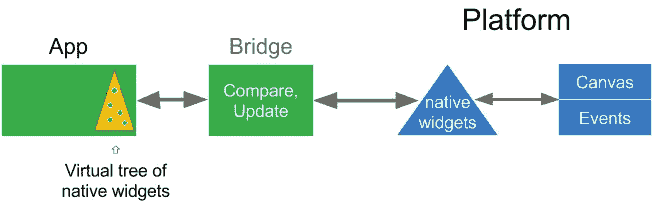

请记住，React Native 必须通过桥与本机小部件通信，因此虚拟小部件树有助于将桥上的传递保持在最低限度，同时仍然允许使用本机小部件。最后，一旦本地小部件被更新，平台就会将它们呈现到画布上。

React Native 是移动开发的一大胜利，也是 Flutter 的灵感来源，但 Flutter 更进了一步。

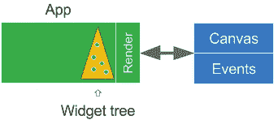

回想一下，在 Flutter 中，窗口小部件和渲染器已经被提升出平台，进入用户的应用程序。没有本地平台小部件可以操作，所以虚拟小部件树现在是*小部件树。Flutter 渲染小部件树并将其绘制到平台画布上。这很好，很简单(也很快)。此外，动画发生在用户空间，因此应用程序(以及开发者)对它有更多的控制权。*

Flutter 渲染器本身很有趣:它使用几个内部树结构来只渲染那些需要在屏幕上更新的小部件。例如，渲染器使用合成使用[结构重画(“结构”的意思是通过小部件使用*，这比通过屏幕上的矩形区域更有效)。没有改变的窗口小部件，甚至那些已经移动的小部件，都从缓存中被“*](https://youtu.be/UUfXWzp0-DU)*[位块传输](https://en.wikipedia.org/wiki/Bit_blit)，速度非常快。这就是为什么在 Flutter 中滚动如此高效的原因之一，甚至在高级滚动中也是如此(如上所述)。*

为了更好地了解 Flutter 渲染器，我[推荐这个视频](https://youtu.be/UUfXWzp0-DU)。也可以看看代码，因为 [Flutter 是开源的](https://github.com/flutter)。当然，您可以定制甚至替换整个堆栈，包括渲染器、合成器、动画、手势识别器和(当然)小部件。

# Dart 编程语言

因为 Flutter 像其他使用反应视图的系统一样-为每个新帧刷新视图树，所以它创建了许多可能只存在一帧(六十分之一秒)的对象。幸运的是，Dart 使用“[分代垃圾收集](https://en.wikipedia.org/wiki/Tracing_garbage_collection#Generational_GC_.28ephemeral_GC.29)”，这对于这类系统非常有效，因为对象(尤其是短命的)相对便宜。此外，对象的分配可以通过一次指针碰撞来完成，这很快并且不需要锁。这有助于避免 UI [抖动](https://en.wiktionary.org/wiki/jank)和口吃。

Dart 还有一个“[树摇](/@Rich_Harris/tree-shaking-versus-dead-code-elimination-d3765df85c80)编译器，只包含你 app 里需要的代码。即使您只需要其中的一两个，您也可以随意使用大量的小部件。

有关 Dart 的更多信息，请阅读“[为什么 Flutter 使用 Dart](https://hackernoon.com/why-flutter-uses-dart-dd635a054ebf) ”。

# 热重装

Flutter 最受欢迎的特性之一是它的快速、有状态的热重载。你可以在 Flutter 应用程序运行时对其进行更改，它会重新加载已更改的应用程序代码，并让它从停止的地方继续运行，通常不到一秒钟。如果您的应用程序遇到错误，您通常可以修复错误，然后继续运行，就好像错误从未发生过一样。即使你不得不做一个完整的重新加载，它是快速的。

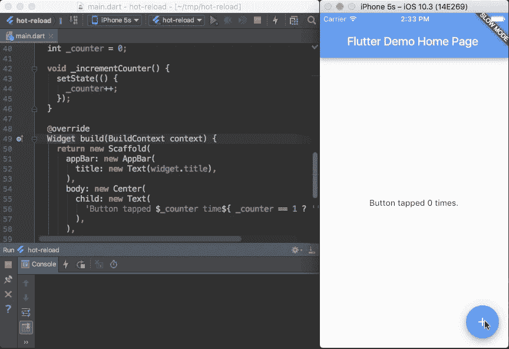

hot stateful reload

开发人员告诉我们，这让他们可以“绘制”他们的应用程序，一次做一个更改，然后几乎立即看到结果，而不必重新启动应用程序。

# 和睦相处

因为小部件(以及这些小部件的渲染器)是你的应用的一部分，而不是平台的一部分，所以不需要“[兼容库](https://developer.android.com/topic/libraries/support-library/index.html)”。你的应用程序不仅可以工作，而且在最近的操作系统版本上也可以工作——Android Jelly Bean 和更新版本以及 iOS 8.0 和更新版本。这大大降低了在旧版本操作系统上测试应用的需求。此外，你的应用很可能可以在未来的操作系统版本上运行。

我们会被问到一个潜在的问题。因为 Flutter 不使用原生平台小部件，所以当支持新类型小部件的新版本 iOS 或 Android 出来时，或者改变现有小部件的外观或行为时，Flutter 小部件是否需要很长时间才能更新？

*   首先，谷歌是 Flutter 的内部大用户，所以我们有很强的动力去更新小部件集，使它们保持最新，尽可能接近当前平台的小部件。
*   如果有一次我们在更新小工具时太慢了，谷歌不是唯一一个有动机让小工具保持最新的 Flutter 用户。Flutter 的小部件是如此的可扩展和可定制，任何人都可以更新它们，甚至是你。人们甚至不需要提交一个拉取请求。你永远也不需要等待 Flutter 自己更新。
*   只有当你想在你的应用程序中反映新的变化时，以上几点才适用。如果你*不想*改变你的应用程序的外观或行为，你很好。小部件是你的应用程序的一部分，所以小部件永远不会从你下面变出来，让你的应用程序看起来很糟糕(或者更糟，破坏你的应用程序)。
*   作为一个额外的好处，你可以编写你的应用程序，这样它甚至可以在旧的操作系统版本上使用新的小部件。

# 其他好处

Flutter 的简单性使它速度很快，但它强大的地方在于它无处不在的可定制性和可扩展性。

Dart 有一个软件包的[库，因此您可以扩展应用程序的功能。例如，有许多软件包可以让](https://pub.dartlang.org/flutter/packages/)[轻松访问 Firebase](https://github.com/flutter/plugins/blob/master/FlutterFire.md) ，这样你就可以构建一个“无服务器”的应用。一个外部贡献者创建了一个包，让你访问一个 [Redux 数据存储库](https://pub.dartlang.org/packages/flutter_built_redux)。还有一些名为“[插件](https://flutter.io/developing-packages/)的包，它们可以更容易地以独立于操作系统的方式访问平台服务和硬件，如加速度计或摄像头。

当然，Flutter 也是[开源](https://github.com/flutter)，再加上 Flutter 渲染栈是你的应用的一部分，这意味着你可以为一个单独的应用定制几乎任何你想要的东西。图中所有绿色部分都可以定制:

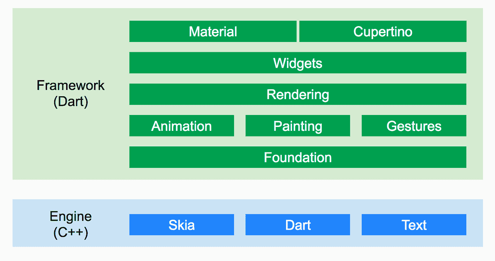

# 所以，“关于 Flutter 有什么新的和令人兴奋的？”

如果有人问你关于 Flutter 的问题，现在你知道如何回答他们了:

*   反应式视图的优点是没有 JavaScript 桥
*   快速、流畅、可预测；代码将 AOT 编译成本机(ARM)代码
*   开发人员可以完全控制小部件和布局
*   附带漂亮的、可定制的小部件
*   出色的开发工具，具有惊人的热重装功能
*   更高的性能，更好的兼容性，更好的乐趣

你注意到我在单子上漏掉了什么吗？这通常是人们谈论颤振时首先提到的事情，但对我来说，这是颤振最不有趣的事情之一。

事实是，Flutter 可以从一个代码库为多个平台构建漂亮而快速的应用程序。当然，那应该是给定的！正是可定制性和可扩展性使得在不牺牲性能或功能的情况下将 Flutter 应用于多个平台变得非常容易。

# 革命的

我也从来没有完全解释过为什么 Flutter 是“革命性的”。这似乎很合适，因为由外部开发人员用 Flutter 构建的第一批主要应用程序之一是“[Hamilton:a American Musical](http://www.hamiltonbroadway.com/)”的官方应用程序，该应用程序发生在美国独立战争时期。[汉密尔顿是有史以来最受欢迎的百老汇音乐剧之一。](http://www.cnn.com/2017/08/14/entertainment/hamilton-app/index.html)


这家名为 [Posse](http://goposse.com/) 的代理公司表示，他们选择 Flutter 是因为他们需要在短短的三个月内开发出应用程序“[”。他们称之为“革命性节目的革命性应用”，并表示“Flutter 是美丽、高性能、品牌驱动的移动体验的绝佳选择。”](https://developers.googleblog.com/2017/08/hamilton-app-takes-stage.html)[他们还在谷歌开发者日大会上发表了一次演讲，讲述了他们用 Flutter 开发应用的经历。该应用在](https://youtu.be/prlK_QL_qOA) [Android](https://play.google.com/store/apps/details?id=com.hamilton.app) 和 [iOS](https://itunes.apple.com/us/app/hamilton-the-official-app/id1255231054) 上可用，[好评如潮](http://www.cnn.com/2017/08/14/entertainment/hamilton-app/index.html)。

# 加入革命！

2018 年 12 月 4 日 [Flutter 1.0 发布](https://developers.google.com/events/flutter-live/)。我们将继续为它添加更多的功能，并计划进行更多的优化。Flutter 的使用已经起飞，全世界有超过 250，000 名开发者。Flutter 目前是 Github 上活跃软件库的前 20 名。

如果你对 Flutter 感兴趣，[你可以安装它](https://flutter.io/setup/)并且[使用安装时附带的一些示例应用。请务必查看有状态热重装。](https://flutter.io/getting-started/)

如果你不是开发者或者只是想看看一些应用，你可以安装用 Flutter 构建的应用，看看它们的外观和性能如何。我推荐[汉密尔顿 app](http://www.hamiltonbroadway.com/#newyork-app) ，还有其他的。你也应该看看谷歌 I/O 上的[视频，他们在那里编写了一个抖动的应用程序。](https://goo.gl/csEr1f)

# 资源

*   观看来自 Google I/O 2018 的[颤动视频](https://www.youtube.com/results?search_query=io2018+flutter)
*   观看 2018 年 1 月 23 日至 24 日在加利福尼亚州洛杉矶举行的 DartConf 2018 视频
*   [介绍颤振视频](https://youtu.be/fq4N0hgOWzU)。

## 网站:

*   [颤振网站](https://flutter.io)
*   [源代码库](https://github.com/flutter/flutter)(欢迎拉请求！)
*   [更多有用链接](https://github.com/Solido/awesome-flutter)
*   [Gitter 频道](https://gitter.im/flutter/flutter)

## 视频:

*   [在 GDD 体验构建 Hamilton 应用](https://youtu.be/prlK_QL_qOA)
*   [在谷歌 I/O](https://goo.gl/csEr1f) 现场编写一个抖动应用程序
*   [谷歌 I/O 的设计师现场编码](https://goo.gl/N29fiK)
*   “颤动，新的希望”意大利展
*   [颤动渲染管道](https://goo.gl/RH3N4Y)

## 应用程序:

*   汉密尔顿的应用程序:一部美国音乐剧
*   颤振图库:Android 上的，Github 上的(也包含在 examples/flutter_gallery 的颤振安装中)
*   [波塞画廊](https://github.com/flutter/posse_gallery)
*   friendly chat:Github 上的[首个 codelab](https://codelabs.developers.google.com/codelabs/flutter/index.html) 、 [Firebase codelab](https://codelabs.developers.google.com/codelabs/flutter-firebase/index.html) 、

## 延伸阅读:

*   [为什么 Flutter 要用飞镖](https://hackernoon.com/why-flutter-uses-dart-dd635a054ebf)
*   [向你的公司或客户推销颤振](/flutter-io/pitching-flutter-to-your-company-or-client-2d4f494e47d1)