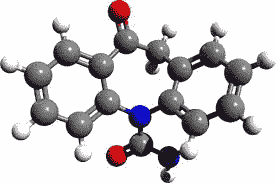

# 什么适合我的加速器？

> 原文：<https://medium.com/hackernoon/whats-right-for-my-accelerator-aad8da919248>

> 透视资本、股权和公司阶段…

有一段时间，我有兴趣投资一家种子公司。他们有一个粗略的原型，一些感兴趣的客户和少量的资金。我渴望给这家公司开一张支票，但事情就是不顺利。经过 5 次会面后，他们终于有了令人兴奋的消息与我分享。我准备好了。出门的时候我拿了我的支票本。他们会告诉我，他们与一些大客户达成了几笔试点交易，我就知道。

我到达会场。桌子上放着我的支票本。团队看起来很兴奋；我感到兴奋。首席执行官笑着说，“嗯，我们刚刚发现我们被接受在一个活动上做宣传，哇，哇，哇，哇……”我真的不再听了。让他说完后，我说，“太好了。说说你的客户获取。你有任何感兴趣的新顾客吗？你准备好发布你的私人测试版了吗？你现在总共有多少客户？”

有时候筹集资金是一个里程碑，但对我来说，作为一个投资者，这通常是我认为的重大事件。

那么，作为一个加速器，你实际上需要给你的公司什么，以帮助他们进入下一步？你如何定义你的加速器中的下一步是什么？加速器模式并不全是 X.X%股权的 XX，XXX 美元。在许多情况下，人们甚至都没有想到这一点；你做行业标准就行了。如果你乐于成为行业标准，这很好，但你很可能并不乐意。否则你不会读到这个。

这里有一些问题，你可以问自己，以帮助确定每家公司需要多少资金，以及你的加速器将使用什么来定义成功:

# 进入我的加速器的公司处于什么阶段？

*   想法
*   原型
*   最有价值球员
*   公共测试版
*   全面发行

# 他们离开时，我需要他们处于什么阶段？

*   私人测试版
*   初始收入
*   初始牵引力
*   增长
*   规模

# 如果我能成功地将他们从一个阶段转移到另一个阶段，他们将能够实现什么？

*   实际上只有三个选择
*   以更高的估值筹集更多资本
*   获得初始牵引力
*   多创造 X%的收入

只有当你回答了这些最初的问题，你才能回过头来考虑每家企业需要多少资金，以及你打算收购多少股权。在你知道你的模型将会是什么之前，试图确定资本和股本的数量将会导致你塞进一些根本不适合的参数。

例如，了解这些事情将有助于你淘汰那些要么太早要么太晚的公司。这些团队最终不会从您的编程中受益，并且从长远来看，可能对您的投资组合没有好处。

如果你接受拥有 MVP 的团队，目标是让他们获得初始牵引力，以便他们能够以更高的估值筹集更多资金，你需要为他们提供足够的资金，以放弃 MVP，开发一个合适的产品，吸引客户至少花一些钱。在今天的世界里，这个价格仍然在 10 万美元以上。然而，如果你试图让他们从想法到私人测试所需的资金将会大大减少。

并非所有加速器都是平等的，也没有一种尺寸适合所有人。你是独一无二的小雪花。抱歉，但真诚地说，为了给你的团队提供正确的结构以确保最佳结果，理解你要去哪里是必要的。

**TLDR**；扔掉旧型号。它曾经有效，但现在不再有效了。你的独特情况决定了你的加速器的结构，如果你不批判性地分析你的资本存量，你就会对你自己、你的投资者和你的团队造成伤害。

> [黑客中午](http://bit.ly/Hackernoon)是黑客如何开始他们的下午。我们是 [@AMI](http://bit.ly/atAMIatAMI) 家庭的一员。我们现在[接受投稿](http://bit.ly/hackernoonsubmission)并乐意[讨论广告&赞助](mailto:partners@amipublications.com)机会。
> 
> 要了解更多信息，[请阅读我们的“关于”页面](https://goo.gl/4ofytp)，[在脸书上点赞/给我们发消息](http://bit.ly/HackernoonFB)，或者简单地说， [tweet/DM @HackerNoon。](https://goo.gl/k7XYbx)
> 
> 如果你喜欢这个故事，我们推荐你阅读我们的[最新科技故事](http://bit.ly/hackernoonlatestt)和[趋势科技故事](https://hackernoon.com/trending)。直到下一次，不要把世界的现实想当然！