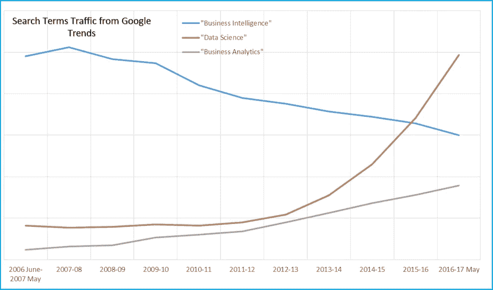

# 数据科学和商业分析有什么区别？

> 原文：<https://medium.com/hackernoon/whats-the-difference-between-data-science-and-business-analytics-117a2125e86b>

作为一名分析专家，我对各种趋势都有浓厚的兴趣。多亏了[谷歌](https://hackernoon.com/tagged/google)趋势，我们不必质疑这一趋势的准确性——在我的生意中，从周日开始，任何其他趋势都可以而且将会被质疑六种方式！

我知道 IT 投资不是受欢迎程度的竞赛，但我认为搜索词流量是一个很好的代理，它代表了在某个给定的时间点上全世界的企业对什么感兴趣。在这篇博客中，我的目标是试图强调我对这些趋势驱动因素的理解。我在陈述这张图表中显而易见的东西。

1.  在过去的十年中，人们对“商业智能”的兴趣已经明显减弱
2.  经济衰退后，人们对“[数据科学](https://hackernoon.com/tagged/data-science)”的兴趣呈指数级增长(仅在一年前就超过了 BI！)，而
3.  “商业分析”十年来一直保持着马拉松式的流行趋势

(Image Credit: BRIDGEi2i Analytics Solutions)

整整 11 年前，我开始了我的分析职业生涯。我认为这恰好与分析作为一种合法的商业功能的出现相吻合。我在惠普公司工作，可以负担高性能软件和研究的投资。

商业智能非常受欢迎，每个人都对 ETL 和数据仓库以及“把 2 和 2 放在一起”非常着迷。这是学习新东西的令人兴奋的时刻。

**阅读更多:** [**在进行你的分析投资之前清楚地掌握思考的艺术**](http://bridgei2i.com/blog/master-art-thinking-clearly-making-analytics-investment/)

商业分析——一个科学与艺术相结合的新兴领域——有明显坚定的信徒和非信徒。高层领导当时仍持怀疑态度，而年轻的经理们则将其视为进一步强化和证明其决策合理性的工具。

因为现在老生常谈的“速赢”，早期的信徒看到了快速的成功，这反过来推动了高层领导更好地理解这个领域。我不记得“数据科学”这个术语在当时有谷歌说的那么流行，但 2006 年至 2011 年的平稳无趋势期进一步证明了这一点。

事实上，我们在这里看到了三种不同的流行趋势，这意味着它们有非常不同的驱动力。我认为分析社区不会互换使用这些术语，因为它们不应该互换。做了十多年，我发现自己不得不阐明数据科学和商业分析之间的二分法。只考虑其中一个而不考虑另一个是天真的。然而，我认为这里有一些关键的细微差别。

# 商业分析是数据科学的超级集合

我喜欢将数据科学视为车轮中的一个齿轮，它穿越了商业分析为货币化数据资产所铺设的道路。业务分析利用领域和行业知识来提供正确的数据，这是数据科学的自然输入。它在采用和使用数据科学方面应对组织挑战。It 部门必须反复为数据科学辩护，反对反对者，并让领导层相信数据科学在组织中的价值。

数据科学以数据可用性为条件；商业分析不是。我最近为一家大型高科技公司完成了一个成功的需求预测项目，在项目结束时，供应链的 SVP 问我，我们建立的模型预计会产生多大的准确度。我马上回答说——66%。六个月后——我们显然准备好了我们的模拟和材料。然后他说了一些不寻常但很有见地的话——“你需要什么数据才能让它达到 75%？”

**阅读更多:** [**关于数据科学、分析学和大数据的 10 本必读书籍**](http://bridgei2i.com/blog/10-must-read-books-data-science-analytics-big-data/)

令决策者恼火的是，在数据科学中，总有更多你没有考虑到的数据。分析的赞助者期望对这类问题有一个理性的商业答案，这就是让他们迷上数据科学之旅的原因。

# 业务分析使数据科学方面的支出合理化

数据科学的成本很高，不仅是昂贵的数据科学家，还有它所需的硬件、软件、时间、精力和思想。所有这些投资的产出始终只是组织没有投资所能实现的增量！这使得一个组织内的支票簿拥有者有时在睡觉前质疑他或她的动机。

我认为商业分析有助于企业看到数据科学的长期价值。表面上，确立数据科学在制定运营决策中的价值更简单，而业务分析必须在制定战术和战略决策时证明这一价值(这是一个非常贴近我内心的主题)。

# 商业分析诠释数据科学

您无法向业务经理解释多重共线性和可变重要性——除非我们有数据科学家领导业务职能部门(我们最终会实现这一点！).业务分析的一个关键作用是在程序运行时将数据科学分解成可消耗的数据块。

**阅读更多:** [**12 种情况数据科学家会完全联想到**](http://bridgei2i.com/blog/12-situations-data-scientists-will-totally-relate-to/)

分析投资的 95%的边际回报来自于 5%的可能性，即你会从数据科学中发现一些机会主义的和反直觉的(至少是非直觉的)业务功能知识。如果你没有很好地从每一个可能的攻击角度捍卫这种宝贵的洞察力和价值(这样做时你将面临地狱)，它就消失了——被归入几个 PowerPoint 页面、Excel 表格和 R 模型，再也不会看到双击。

那么，上述趋势将走向何方？以下是我的想法。

*   BI 将成为公理，对于任何以盈利为目的的组织和职能部门来说都是绝对必要的。这才是毕人气下滑的真正原因。
*   商业分析将继续其上升趋势——物联网、机器学习和人工智能将致力于运营决策的自动化。战略和战术决策中最划算的商业分析在其马拉松式的步伐中是安全可靠的。这是公司投资数据科学研发的唯一原因。
*   数据科学将持续受欢迎，直到机器学习和人工智能接管运营决策。除此之外，我希望数据科学和商业分析能够融合。

我很想听听分析从业者社区对这个问题的看法。请留下你的评论。

*(本文由*[*Arun Krishnamoorthy*](https://www.linkedin.com/in/arun-krishnamoorthy-7ba86430/)*撰写，首次出现在*[*LinkedIn*](https://www.linkedin.com/pulse/dichotomy-between-data-science-business-analytics-arun-krishnamoorthy/)*和* [*BRIDGEi2i 博客*](http://bridgei2i.com/blog/dichotomy-between-data-science-and-business-analytics/) *。)*

# 更多内容:

以为自己对物联网及其应用了如指掌？观看视频(如下),了解关于物联网你可能不知道的 7 件事！

 [## 数据科学-黑客正午

### 阅读《黑客正午》中关于数据科学的文章。黑客如何开始他们的下午？

hackernoon.com](https://hackernoon.com/tagged/data-science)