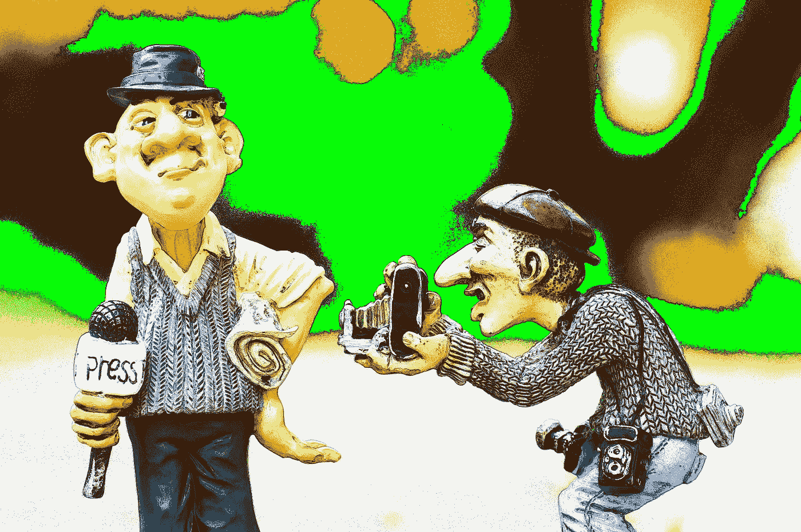

# 在数字世界中，新闻业的未来是什么？

> 原文：<https://medium.com/hackernoon/whats-the-future-of-journalism-in-the-digital-world-786b0640fe85>

> 丹·泰南(Dan Tynan)已经为国家出版物工作了 20 多年。另外:一个优秀的拼写者。[原载](https://www.quora.com/What-is-the-future-of-journalism-in-the-digital-world/answer/Dan-Tynan)于 [Quora](http://quora.com?ref=hackernoon) 。

凄凉？

有趣的是，新闻业本身正在经历复兴，至少在美国是这样。你可以为此感谢猩猩首领。自选举以来,《第四等级》已经完全升级了它的游戏，提醒我们所有人在直面法西斯主义时，自由的新闻/媒体是至关重要的。它也许能把我们从特朗普治下拯救出来。

不幸的是，商业模式没有改变。因此，尽管《纽约时报》数字版的订阅量上升了(我想可能也是所有主要酒吧的订阅量上升了)，但这种收入模式是不可持续的。新闻太快被商品化了；一旦《纽约时报》的独家报道公之于众，它就变成了 GoodEnoughNews.com 的三流翻版(不要试图点击它，这是我编造的)，而《纽约时报》看不到一美元的广告收入或任何重要的推荐流量。

据我所知，没有人想出一个真正能够将数字新闻转化为利润的解决方案。付费墙、免费增值/付费模式、像 [Blendle](https://blendle.com/) 这样的单点微支付系统——所有这些都在尝试中，但我还没听说有一个能解决这个问题。这让我们所有人都受到财大气粗的恩人(比如《华盛顿邮报》的新东家杰夫·贝索斯)和/或坏人(比如鲁珀特·默多克和任何掌管布莱巴特、信息战争、世界新闻日报等网站的邪恶克苏鲁崇拜者)的摆布。

所以报纸/网站继续裁员。最近，我的一个为美国最大的全国性报纸之一做科技报道的好朋友在工作了 17 年后被解雇了。这只是生意，弗雷多。

幸运的是，他在一家著名的商业杂志找到了另一份新闻工作。但他是幸运儿之一。刚刚在 Mashable 被解雇的员工中，大多数人的经验要少得多，他们可能会发现找到另一份新闻工作有点困难，最终可能会做别的事情(可能是营销或公关)。

然后是机器人。像叙事科学和观众洞察这样的公司已经在使用机器人为美联社和洛杉矶时报这样的媒体[制作体育和财经故事](https://www.wired.com/2017/02/robots-wrote-this-story/)。欢迎来到我们的新机器人霸主。

但是没有记者是做不了新闻的，不管你的 AI 有多聪明。至少，我希望你不能。

现在我需要喝一杯。谁买单？

> 作者[丹·泰南](https://www.quora.com/profile/Dan-Tynan)，20 多年来一直为国家级出版物工作。另外:一个优秀的拼写者。[最初发表于](https://www.quora.com/What-is-the-future-of-journalism-in-the-digital-world/answer/Dan-Tynan) [Quora](http://quora.com?ref=hackernoon) 上的。
> 
> 更多来自 Quora[的趋势科技答案，请访问](https://medium.com/u/3853f85f7d5e?source=post_page-----786b0640fe85--------------------------------)[HackerNoon.com/quora](https://hackernoon.com/quora/home)。