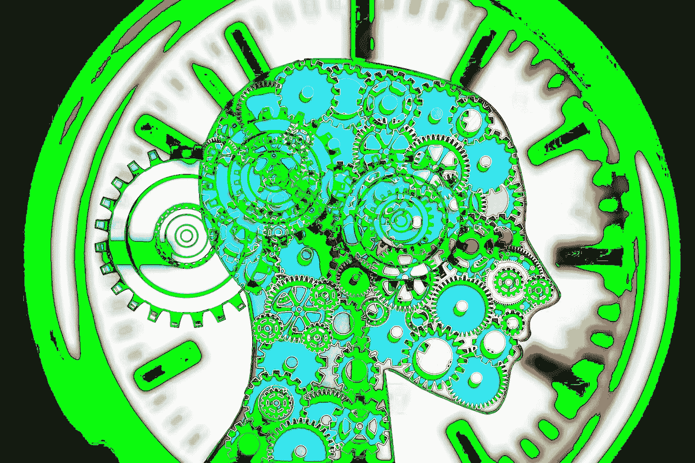

# 计算机科学和心理学有什么关系？

> 原文：<https://medium.com/hackernoon/whats-the-relationship-between-computer-science-psychology-f6ee15646981>

> 到了 [Tikhon Jelvis](https://www.quora.com/profile/Tikhon-Jelvis) ，学习并研究编程语言。[原载](https://www.quora.com/What-is-the-relationship-between-psychology-computer-science/answer/Tikhon-Jelvis)于 [Quora](http://quora.com?ref=hackernoon) 。

这个问题有两种解析方式:计算机科学*和学术心理学*是什么关系，计算机科学和心理学在“人如何思考”的意义上是什么关系。

为了说明这种差异，考虑一下艺术和文学:没有人能否认艺术和文学与人类心理学深深交织在一起，然而大多数有洞察力的、高影响力的艺术和文学是由很少或根本没有接触心理学作为一门学术学科的艺术家和作者创造的——他们肯定没有使用心理学研究方法来创造他们的艺术！

那么这如何应用于计算机科学呢？

嗯，计算机科学研究的一个重要部分是由非正式意义上的心理学决定的——或多或少。计算机系统最终是由人类使用的，或者至少是为人类运行的；系统的设计必须考虑到这一点，研究的目标最终归结到人的因素。完全包含在一个领域的研究之外——理论工作意味着进一步发展其他理论工作；系统研究回答问题以改进其他系统——你期望大多数项目至少受到某种人为因素的引导。

当然，通常这个“指南”是非常通用的:我们设计这个系统是为了更快，因为人类下意识地认为响应时间> 100 毫秒是慢的。这是一种真正的心理学见解，但它广为人知——其余的研究，实际上需要人们在项目上花费时间的东西，都将基于提高性能。从某种意义上说，是的，心理学很重要；另一方面，它真的没有。

即使当作品与人类思想联系更紧密时，它也不一定与学术心理学或其研究方法有关(就像艺术一样！).编程语言设计是一个很好的例子:它从根本上来说是一门设计学科，虽然它可以(T21)尝试使用像心理学这样的经验方法，但它并不必须这样做——就像视觉设计一样。It *可以*，就像视觉设计可以使用 AB 测试一样——但是最好的设计例子很少涉及广泛的经验测试，无论是在编程语言还是视觉设计中。

我还选择了编程语言设计作为例子，因为我认为它比人们意识到的更接近艺术。印刷术是一个很好的类比:没有人能否认它完全是关于心理学的，然而大多数参与印刷术的人没有正式的心理学背景或者使用心理学研究方法。CS 也一样。

真正依赖“正式”心理学的领域只有两个:人机交互(HCI)和软件工程。这两个领域始终依赖于心理学研究，并使用心理学家开发的研究方法。(HCI 研究人员进行的用户研究和实验对心理学家来说会很熟悉！)

> 到了 [Tikhon Jelvis](https://www.quora.com/profile/Tikhon-Jelvis) ，学习并研究编程语言。[原载](https://www.quora.com/What-is-the-relationship-between-psychology-computer-science/answer/Tikhon-Jelvis)于 [Quora](http://quora.com?ref=hackernoon) 。
> 
> 更多来自 Quora 的趋势科技答案，请访问[HackerNoon.com/quora](https://hackernoon.com/quora/home)。