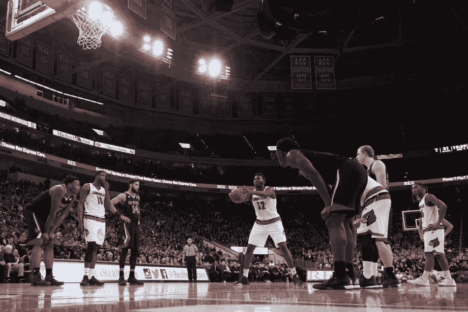

# 老奶奶的智慧拍摄

> 原文：<https://medium.com/hackernoon/whats-your-granny-shot-76cf9b956569>

credit: Lance King/Getty Images

## 克服“风格蠕变”如何帮助你在别人勉强应付的地方取得成功

2016 年 12 月 26 日，齐纳努·欧努阿库在休斯顿火箭队首次亮相职业篮球比赛。这有点历史性，尽管他在比赛中只花了 8 分钟，得到 6 分。

从各方面来看，对于这位年轻的新秀来说，这是一场平淡无奇的比赛——直到比赛还剩 2 分 46 秒。在那个时候，Onuaku 被犯规了，他第一次来到了犯规线。在那里，Onuaku 做了一些他已经做了几年的事情，但是在丰田中心出席的人很少有人准备看到:[他低手罚球](http://www.espn.com/nba/story/_/id/18355721/chinanu-onuaku-houston-rockets-channels-rick-barry-debut)。他开了两枪——都打沉了。

如果你对篮球稍有了解，你可能会意识到没有人会用手投篮。这还没有完成。然而，Onuaku 正在这样做。他是自近 40 年前的里克·巴里以来，第一个在 NBA 做到这一点的球员。但是为什么呢？

这实际上是个不该问的问题。更好的问题是为什么其他人不这么做？从各方面来看，这是一种——一旦经过充分练习——更加机械的射击方式。它不像传统的单手高射那样容易出现弹道偏差。但是不要相信我的话，[相信专家的话](http://discovermagazine.com/2008/the-body/07-physics-proves-it-everyone-should-shoot-granny-style):

> 下手投掷也能使球的漂移最小化。西雅图华盛顿大学教授篮球物理学的研究人员汤姆·斯泰格说:“投掷开始时的轻微侧推会转化为投掷结束时的大动作。”。Steiger 说，下手投掷比上手投掷提供了更好的稳定性，“因为你用双手持球”。这有助于玩家平衡手部微妙的运动肌肉，使其更加放松。下手投掷的动作是简单、易于控制的向上[钟摆运动](http://www.myphysicslab.com/pendulum1.html)。斯泰格说，相比之下，更传统的上手罚球包括手腕、肘部和肩膀的单独运动，这会增加失误。“如果球最终从你手的一边滚出哪怕一点点，你都会错过。”

## 你奶奶喝了什么？

这听起来像是一个显而易见的事情:如果你想罚球更好，那就用低手投篮。那么为什么玩家不去做呢？因为看起来很傻。

那些选择采用它的人获得了好处。里克·巴里对此深信不疑，他是一个 89.3%的罚球手。当威尔特·张伯伦(短暂地)使用它时，他将罚球命中率提高到了职业生涯最好的 61%，包括在他著名的 100 分比赛中的 28/32。

我在这里不再深入老奶奶的镜头，但是由马尔科姆·格拉德威尔提供的一个[精彩的播客片段很好地研究了这个问题。](http://revisionisthistory.com/episodes/03-the-big-man-cant-shoot)

我提出这个问题的原因基本上是一个问题:你奶奶拍了什么？或者，更具体地说:

> 有什么事情你可以做得与众不同，但你没有——都是因为它似乎与时尚背道而驰？

## 风格蔓延

事情是这样的:不管你从事什么行业，或者你从事什么行业，有一种现象我喜欢称之为**风格蠕变**。这是实践或原则被选择的地方，主要是因为风格上的原因，而不是功能或目标相关的原因。而且很危险。它会让我们看不到打破常规可能带来的好处。

因此，如果有一种方法可以在一大堆想出人头地的人中脱颖而出，那就是克服时尚怪癖。但这并不容易。你必须愿意从别人那里挖掘建议——那些看起来古怪、不性感、或许太老套的建议。

然后，你必须愿意接受那些不时尚、不性感的建议，而*遵循这些建议就会变得*不时尚、不性感。然后你要愿意被嘲笑，古怪，不合拍。你必须这样做一段时间，直到你最终成功。

然后你可以陶醉于你的成功。作为一个奖励，一旦你展示了你的怪异、不酷的方法是多么成功，你可能会变得很酷。现在*那是*非常酷！

***知道还有什么很酷吗？*** [***我的每周简讯—wool gathering***](http://tinyletter.com/mike_sturm)***。订阅的话，你会每周(只)收到我的一封电子邮件，里面有一些很酷的想法，就像这样。***

> [黑客中午](http://bit.ly/Hackernoon)是黑客如何开始他们的下午。我们是这个家庭的一员。我们现在[接受投稿](http://bit.ly/hackernoonsubmission)并乐意[讨论广告&赞助](mailto:partners@amipublications.com)机会。
> 
> 如果你喜欢这个故事，我们推荐你阅读我们的[最新科技故事](http://bit.ly/hackernoonlatestt)和[趋势科技故事](https://hackernoon.com/trending)。直到下一次，不要把世界的现实想当然！

