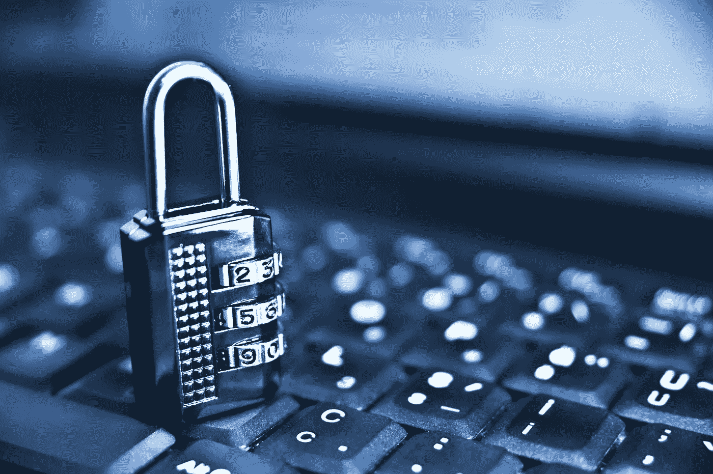

# 你的身份对你有什么价值？

> 原文：<https://medium.com/hackernoon/whats-your-identity-worth-to-you-4e8a302ed340>

就在几个月前，雅虎！声称他们超过 5 亿的用户帐户被黑客攻击，在更早的情况下，超过 10 亿的帐户被盗。威瑞森有超过 150 万客户的账户信息被盗。LinkedIn 超过 1.17 亿用户的电子邮件和密码被盗，然后发布到网上。Dropbox 有超过 6800 万次登录和密码泄露。成人交友网站 AdultFriendFinder.com 有 4.12 亿用户的个人信息被盗。

黑客攻击几乎每天都在新闻中出现，人们不断地问我他们的信息是否安全。他们有危险吗？他们能做些什么来得到更多的保护？他们应该使用 VPN 还是 Tor？

最好的办法就是*简单的开始*。从你的密码开始。你的账户有好的密码吗？

现在，我已经做了 25 年了。你可能会想，过了这么久，没什么能让我吃惊的了。你可能会想，随着 90 年代的人们上网，他们会知道什么是好的密码，以及如何保持他们的密码私密和安全。

因此，当有人向我寻求如何保护账户安全的专业建议时，你会认为他们至少知道最基本的账户安全规则；不要与任何人分享您的密码。

然而，当我问他们第一个问题时；"你的账户有好的密码吗？"他们告诉我‘是的，我用 Fluffy123！用我的电子邮件地址登录我的所有账户！我的头几乎爆炸，从我内心的声音敦促我打他们的愚蠢尖叫。哦，我多么想倾听自己内心的声音。

但是，与其听我内心的声音刺激我造成身体伤害，让我陷入困境，我要在沙子里画一条线，首先声明: ***没有完全安全的账户或电脑。*谓 T5 时期。即使有，你也不会愿意做的。**

你知道我是怎么知道的吗？因为人们抱怨他们的密码太复杂了。他们不想在密码中使用多达八个字符，也不想使用数字，也不想必须使用特殊字符。他们不想每 30 天、60 天或 90 天更改一次密码，他们希望重新使用旧密码。他们不希望在使用 2FA(双因素身份验证)登录时，不得不输入他们收到的短信号码。

你说得对。又烂又烦。你知道还有什么吗？太糟糕了。

> 您的数据的安全性取决于您愿意投入的努力程度。

我明白了。记住你所有的密码是件令人讨厌的事。我也要经历一下，跟你一样。但其实没什么大不了的。为了帮助你克服在设法保护你的信息时遇到的压力，我想做以下这些事情来帮助自己免受黑客攻击。不过要记住，如果你觉得记住四个、六个或十几个账户会给你带来压力，那就记住，在我的工作中，我需要保护数千个账户的安全。

以下是一些技巧，可以帮助我保护帐户安全、创建良好的密码、记住它们以及如何确保数据受到保护。

# **密码提示。**

*   用一句令人难忘的私人话的首字母缩写:“我 35 岁的时候就要当副总统了！”转换为:IwbVPwI35！
*   使用密码管理器。我使用来自[agilebits.com](http://agilebits.com)的 1 个单词。将他们的密码生成器用于更复杂的密码，这样您就不必记住自己。
*   对每个帐户使用不同的密码。在这方面，密码管理器很有帮助。如果你的雅虎账户被黑了，人们得到了密码，那么他们就有可能得到你的 Visa 和其他银行密码。
*   永远不要写下你的密码。
*   永远不要告诉任何人你的密码。

# **访问控制提示。**

*   所有设备都要有密码:手机、智能手表、电脑、一切。
*   确保所有设备(计算机、电话、智能手表等)在关闭、从手腕上取下或打开屏幕保护程序时自动锁定(这应在 10 分钟或更短时间内自动完成)。
*   如果可能，请在电脑或手机上使用生物识别技术(指纹识别器)。这只是让事情更容易当你有复杂的密码。
*   切勿将您的工作电子邮件地址用于 LinkedIn 或脸书等个人帐户。[请在此处阅读原因。](http://blog.briangreenberg.net/2017/04/09/orphaned-data-ghost-accounts-and-their-mysteries-solved/)
*   使用 2FA(双因素身份验证)—始终！以下是一些已经提供 2FA 的网站/应用程序:Google/Gmail、LinkedIn、Dropbox、WordPress、苹果、微软、脸书、TeamViewer、MailChimp、亚马逊等。而且每天都越来越多。

# **全力支援！**

*   始终使用多种方法备份数据*和*。(例如云存储[例如 Google Drive、Dropbox]、云备份[例如 Crashplan.com]和离线备份(例如可移动硬盘)等)。)
*   [查看我的帖子，了解更多如何帮助你从勒索赎金的袭击中恢复的技巧。](http://blog.briangreenberg.net/2017/04/16/backup-the-panacea-for-computer-viruses-and-ransomware/)

祝你好运！

你有什么建议或故事可以分享吗？你或你的朋友有过这样的经历吗？希望在评论中听到你的想法。

*联系我:* [*脸书*](http://facebook.briangreenberg.net/)*|*[*LinkedIn*](http://linkedin.briangreenberg.net/)*|*[*Twitter*](http://twitter.briangreenberg.net/)*|*[*博客*](http://blog.briangreenberg.net/)*|*[*Google+*](http://plus.briangreenberg.net/)

> [黑客中午](http://bit.ly/Hackernoon)是黑客如何开始他们的下午。我们是 [@AMI](http://bit.ly/atAMIatAMI) 家庭的一员。我们现在[接受投稿](http://bit.ly/hackernoonsubmission)并乐意[讨论广告&赞助](mailto:partners@amipublications.com)机会。
> 
> 如果你喜欢这个故事，我们推荐你阅读我们的[最新科技故事](http://bit.ly/hackernoonlatestt)和[趋势科技故事](https://hackernoon.com/trending)。直到下一次，不要把世界的现实想当然！

