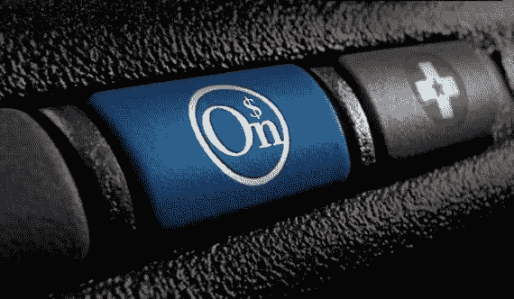
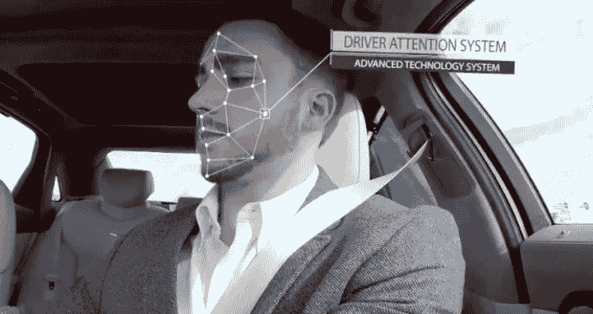
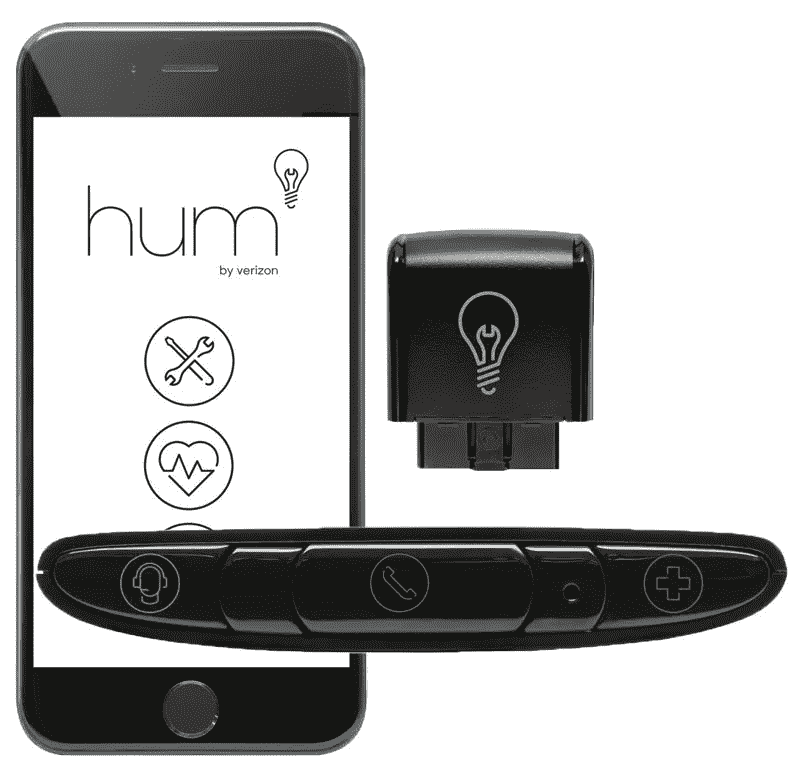
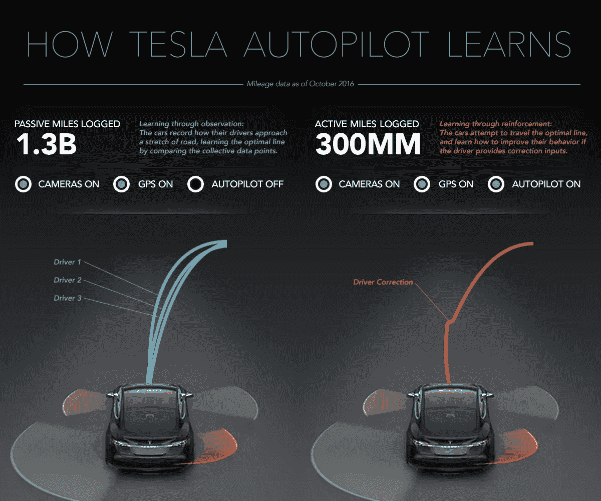
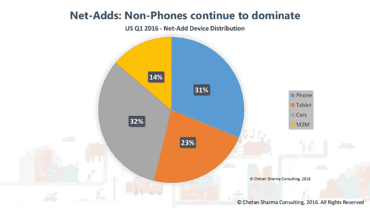

# 黄金之轮:谁在你的里程上赚钱

> 原文：<https://medium.com/hackernoon/wheels-of-gold-whos-making-money-on-your-mileage-4d41acd8ebea>

通用汽车刚刚向消费者发布了其首款半自动产品，即凯迪拉克的超级巡航功能。在某种程度上，我们可以说这项技术证明了通用汽车是一个领导者。[但从另一个更准确的角度来看](https://www.youtube.com/watch?v=6ntb3hbX6_0)，它证明了通用汽车在为盈利而侵犯消费者隐私方面基本上是个领导者...因为超级游轮是建立在像你这样的顾客的背上的。

为什么让我们细数一下:

1.  通用汽车是第一个[通过“打开”](https://www.wired.com/2016/01/gms-building-self-driving-car-maps-with-cameras-on-customer-cars/)[客户车辆中的外部摄像头](http://gmauthority.com/blog/gm/general-motors-technology/gm-safety-technology/gm-active-safety-technology/gm-surround-vision-camera-technology/)来扩展其地图数据的公司之一(具有讽刺意味的是，一旦车辆行驶，客户就被禁止访问相同的摄像头视图。)简而言之，如果你驾驶一辆配有摄像头的新型通用汽车，[你有可能帮助创建了地图](http://fortune.com/2015/10/02/gm-1-million-connected-cars/)他们会以 2500 美元的超级巡航选项返销给你。但我相信他们的律师已经向你解释得很清楚了。
2.  等等，通用汽车公司是怎么从你车里拿到地图数据的？哦对了，安吉星。根植于安心的 GM 创新已经迅速成为公司的主要利润中心，并成熟为双向数据交付平台。虽然你可能知道 OnStar 是你打开车门和免提通话的方式，但你可能不知道通用汽车一直在使用你的 OnStar 订阅来定期收集你的驾驶数据。不过，我相信他们的律师已经说得很清楚了。
3.  配备 Super Cruise 的 CT6 轿车提供外部摄像机，不仅允许驾驶员捕捉镜头，还可以在重大“事件”期间[自动开始记录，如碰撞或触发警报。不管你喜欢与否，后者都会发生，并且是制造商多年来能够在汽车上访问的黑匣子遥测数据的演变。但是超级巡航增加了另一层监控，它是自动驾驶能力的一个关键组成部分:虽然特斯拉和奔驰等公司受到州法规(和一般常识)的阻碍，要求司机把手放在方向盘上，但凯迪拉克通过](https://arstechnica.com/cars/2016/06/meet-the-surveillance-sedan-cadillacs-ct6-and-its-360-degree-videocam/)[持续扫描你的面部](https://www.wired.com/2017/04/cadillac-cracks-self-driving-puzzle-shoving-camera-face/)为你提供了免提驾驶的甜蜜释放。如果看起来你没有注意，你会被责骂，必须重新使用你的肉钩。律师说得很清楚，这个摄像头什么都不会记录；他们只对其他摄像机这样做。
4.  鉴于上述所有软件的古怪行为，你可能会举手宣布，*“你知道吗？不。我不赞成这样做，我要在引擎盖下乱搞一点，以确保他们无法跟踪我。”*但是通用汽车领先你一步，朋友:[他们试图使软件修改非法](https://consumerist.com/2015/05/20/gm-that-car-you-bought-were-really-the-ones-who-own-it/)，借口不是你，而是他们，拥有你的车。你只需要许可所有的东西。不过，好消息是:律师已经批准你使用空气清新剂。

现在，尽管通用汽车[是](https://electrek.co/2016/02/23/tesla-gm-direct-sales-indiana/)[常年的](http://www.chevyhardcore.com/news/top-5-chevy-moments-of-all-time-2-chevy-overtakes-ford-in-sales/) [混蛋](http://jalopnik.com/what-general-motors-did-to-flint-1794493131) [的](http://www.washingtonpost.com/wp-dyn/content/article/2008/12/08/AR2008120803423.html)[行业](https://www.theguardian.com/world/2004/oct/22/uselections2004.usa)并且可能实际上只是碰巧制造汽车的世界上最大的律师事务所，重要的是要注意，他们不是唯一一个利用不知情的客户来丰富他们的自动驾驶数据的人。通用汽车与相机/软件供应商 mobile eye 签署的[协议与 mobile eye 与大众、日产](http://speedlux.com/mobileye-sees-earnings-maps-self-driving-cars-release/)[和宝马](http://speedlux.com/bmw-has-2-new-techonlogy-partners-for-self-driving-cars/)签署的协议相同。[丰田也在游戏中](http://www.businessinsider.com/toyota-maps-routes-with-production-vehicles-2015-12)。

那些是制造商。你想继续吗？

[三星最近收购了哈曼](http://news.harman.com/releases/samsung-electronics-to-acquire-harman-accelerating-growth-in-automotive-and-connected-technologies)，在你不知道的情况下，除了 Bose，他几乎拥有所有的汽车收音机/信息娱乐品牌。这有助于三星融入通用汽车与安吉星的客户数据关系。

您可能已经看过 [Progressive 的 Snapshot 产品](https://www.progressive.com/auto/snapshot/)，该产品插在您汽车的 OBDII 端口上，并与一个移动应用程序连接，有望获得很好的驾驶员折扣。

嗯，这显然也收集了你的驾驶和电话使用数据。但是也有很多其他公司在这样做，包括威瑞森，他的产品“T24”试图将任何一款汽车变成安吉星的复制品。

然后是特斯拉。

特斯拉的 Autopilot [将客户驾驶数据作为早餐](https://electrek.co/2017/05/06/tesla-data-sharing-policy-collecting-video-self-driving/)，就像这里的其他人一样。然而:亲爱的消费者，在你做决定时，我希望你记住一个重要的区别点……因为通用汽车和其他公司正试图为你做决定。

每个人都想要你的驾驶数据，每个人都想使用你的车辆。不仅仅是制造商和保险公司，他们意识到[这是他们在不久的将来唯一可行的利润来源](http://www.autonews.com/article/20130527/OEM/305279958/not-satisfied-with-onstars-steady-profits-gm-wants-to-create-a-global-)；[这是移动已经要去的地方](https://techcrunch.com/2016/06/20/more-cars-than-phones-were-connected-to-cell-service-in-q1/)，我们甚至还没有开始[自主共享交通的进军](http://jalopnik.com/general-motors-ditched-google-over-data-control-report-1774585778)。

但是——当你买一辆特斯拉，或者当你试驾谷歌的一辆自动驾驶汽车，或者当你真的[把你的驾驶视频发送到 Comma.ai](https://beta.comma.ai/leaderboard.php) ，你知道你在做什么。您正在帮助一家对这些数据有着非常具体目标的公司—不仅仅是在财务上支持他们，而是实际上帮助他们。你把自己放在他们的团队中，与他们的愿景保持一致。

有多少凯迪拉克的购买者知道他们在为通用汽车做同样的事情？我就大方的说是 1%。虽然一些竞争对手要求你参与其中，或者至少相当明显地表明你正在参与其中，但通用汽车和其他制造商只是想打开他们庞大而无知的客户群的监控开关，因为这是他们将无人驾驶汽车推向市场的优势。

服务员:比那更糟。通用汽车和通用汽车的律师事务所甚至游说立法[阻止任何不符合“传统汽车制造商”](https://www.21centurystate.com/articles/state-autonomous-vehicle-bills-put-technology-companies-at-disadvantage/)模式(即通用汽车的模式)的人从事自动驾驶汽车的工作。长话短说:阻挠创新+使用无偿劳动力=通用汽车的自主计划。

我想像你我这样有责任感的人会愿意有一天醒来，对我们为自己建立的世界不满意，然后说，“我没有任何人可以责怪。”但我们不能忍受的是在那个世界醒来，意识到这一切都是在我们背后精心策划的，为了少数人的私利。我不是隐私警察——事实上，远非如此——但是当你开车的时候，你应该知道你在为谁工作。

> [黑客中午](http://bit.ly/Hackernoon)是黑客如何开始他们的下午。我们是 [@AMI](http://bit.ly/atAMIatAMI) 家庭的一员。我们现在[接受投稿](http://bit.ly/hackernoonsubmission)并乐意[讨论广告&赞助](mailto:partners@amipublications.com)机会。
> 
> 如果你喜欢这个故事，我们推荐你阅读我们的[最新科技故事](http://bit.ly/hackernoonlatestt)和[趋势科技故事](https://hackernoon.com/trending)。直到下一次，不要把世界的现实想当然！

