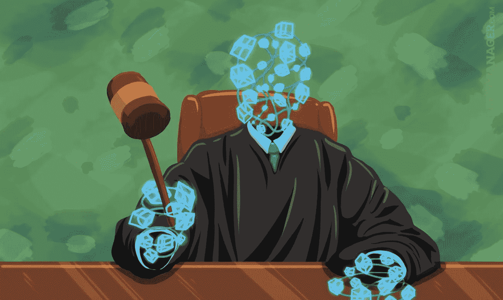

# 当“代码即法律”遇上“法律即法律”——美国律师协会年度最大的区块链活动

> 原文：<https://medium.com/hackernoon/when-code-is-law-meets-law-is-law-inside-the-american-bar-associations-biggest-blockchain-c76e3bafbb9a>

Image Credit: [BTC Manager](http://www.btcmanager.com)

## 为期一天的探索，探索此时塑造分布式账本技术生态系统的法律环境

当[公司](http://www.nasdaq.com/article/asset-manager-fidelity-to-join-blockchain-group-ic3-cm772925)之后的[公司](http://www.businessinsider.com/ibm-is-going-all-in-on-blockchain-for-trade-finance-2017-4)和[国家](http://www.coindesk.com/russia-eyes-legal-recognition-for-bitcoin-in-2018/)之后的[国家](https://www.americanbanker.com/news/uk-mint-testing-blockchain-trading-platform-for-digital-gold)拥抱“区块链”技术时——记录加密货币或其他价值转移交易的[可验证、安全的分布式账本系统](https://www2.deloitte.com/ch/en/pages/strategy-operations/articles/blockchain-explained.html)以及一些人所谓的“[自互联网](http://fintechnews.ch/blockchain_bitcoin/ubs-exec-blockchain-the-biggest-disruptor-since-the-internet/5365/)以来最大的颠覆者”——许多人质疑法律将如何适应这些系统——甚至质疑它们是否合法。随着围绕这一运动的大肆宣传，许多律师都争先恐后地熟悉这个话题。

4 月 10 日星期一，美国律师协会(“ABA”)聚集了来自全国各地的一些最有成就的技术和法律头脑，在 NYU 法学院举办的 ABA 第三届年度区块链技术和数字货币研究所上讨论了围绕区块链生态系统的当前法律环境。这标志着美国律师协会迄今为止参加人数最多的区块链事件，标志着对分散分类账领域法律能力的兴趣和需求迅速增长。五个专家小组就从 ICOs 到知识产权，从逃税到丝绸之路上的 Dred Pirate Roberts 等话题提供了他们对区块链法律的理解。

# **第一小组——与区块链领域最有成就的学者进行“炉边谈话”**

*小组成员:阿里·朱尔斯——联合主任:IC3，康乃尔大学；neha naru la——麻省理工学院媒体实验室数字货币倡议研究主任。*

主持人:帕特里克·默克——库利·LLP 律师事务所的特别顾问，哈佛大学伯克曼·克莱恩互联网研究中心的研究员。

上午开始了一个关于区块链将如何影响未来几年的社会和法律实践的一般性讨论。像业内许多人一样，该小组努力给区块链一个统一、简洁的定义，但给出了美国顶尖大学的顶尖团队如何处理这一问题的见解。

## **亮点:**

*   **“区块链”是一个可怕的术语！** —专家组一致认为该术语对不同的人有不同的含义。对一些人来说，区块链一般指的是[去中心化分类账技术](https://www.youtube.com/watch?v=oO2RlI9FmNY)；对其他人来说，这意味着潜在的“工作证明”结构，激励公众参与比特币或以太坊等网络。对于其他人来说，它指的是一个完美的事务存储数据集，其中每一批新信息都与之前的每一批信息加密链接。Ari Juels 建议“业务逻辑自动化”将是一个更准确的术语，但他承认“区块链”这个术语已经流行起来，可能暂时不会流行。
*   **智能合同:更接近于“数字奥普拉”而不是律师的替代品** —每个小组成员都认为 JavaScript 开发人员不会很快取代合同律师(在一个有 50 名律师的房间里，这可能是一个明智的断言)。Neha Narula 评论说，法律制度已经运行得相当好，她认为，到目前为止，区块链在一些领域提供了最大的价值，在这些领域，传统法律制度由于实用性(如发展中国家的记录保存)或选择(如毒品和暗杀市场或未注册证券和向公众出售资产)而无法有效监管。Ari Juels 称智能合同是一个广泛可信的来源，每个人都可以参考它来解决争议和冲突，就像“数字奥普拉”
*   **区块链和智能合约面临的最大挑战** —专家组一致认为，在当前模式下，最广泛使用的区块链系统无法实现其最大潜力，并确定了主要的[免许可/公共](https://cointelegraph.com/news/private-public-blockchain)加密货币和智能合约系统(如比特币和以太坊)必须克服的五个基本挑战，以实现大规模采用:

1.  *可扩展性* —当前的系统太慢，无法支持国际企业使用所需的高吞吐量。虽然比特币试图通过 [Segwit](https://bitcoincore.org/en/2016/01/26/segwit-benefits/) 或[无限块大小](https://www.cryptocompare.com/coins/guides/what-is-bitcoin-unlimited/)来解决这个问题，但它的社区仍然必须克服[一场极其激烈(可能无法克服)的政治斗争](http://www.coindesk.com/bitcoins-scaling-debate-devolving-twitter-war/)才能推进解决方案。相比之下，以太坊希望通过[股权共识算法](https://www.ethnews.com/proof-of-work-vs-proof-of-stake-explained)的证明来解决可扩展性问题，尽管[以太坊的开发者仍然没有生产出其新系统的可测试原型](https://btcmanager.com/buterin-confirms-ethereums-proof-of-stake-75-percent-complete/)和[这一概念仍然面临着许多对其安全性的理论挑战](http://bitfury.com/content/5-white-papers-research/pos-vs-pow-1.0.2.pdf)。
2.  正确性——错误是编程不可避免的一部分。必须开发一种标准化的审计和测试方法(可能通过模板方法),以实现无风险的普遍依赖。此外，不明确的问题(如“意图”)不是清晰可编程的，这可能导致编码智能合同和必须并行设计的独立法律文件的低效系统。指导相同交易的两个合同之间的错误和不一致风险可能会使智能合同不如传统的合同系统范式可靠，但律师、技术专家和商人尚未找到更好的解决方案。
3.  *保密性* —隐私、可预测的速度和透明度都是监管机构批准和大规模企业参与所必需的。但目前的系统无法将所有三种功能整合到一个公共网络中。一个能够通过内置审计跟踪即时匿名处理成千上万笔交易的链是一种圣杯，必须为大规模采用而构建。
4.  *链外交互* —智能合约的“智能”取决于其条件下的编程以及触发这些条件的数据范围。例如，可以触发无佣金的体育博彩合同，根据足球比赛的最终得分自动支付赢家。然而，对于区块链来说，目前还没有有效的方法从体育页面中以触发这种智能合同的格式提取数据。
5.  *可逆性* —如上所述，bug 是编程的一个固有方面；无论您执行多少调试或代码审查，总会有相当大的不完善率。虽然在某些情况下，合同各方可以同意将有缺陷的合同中的所有数据和条件基本上“转储”到修订版本中，但是这种解决方案效率不高，并且依赖于各方的同意——并不总是有保证。此外，通过被盗私钥或其他非法方法进行的交易目前不能被撤销，这使得不太倾向于个人安全的用户很容易永远无法从被盗中恢复。

# **专题讨论 2——令人困惑的区块链监管是否导致美国在发展方面落后于世界其他国家？**

*小组成员:玛丽·贝丝·布坎南——布莱恩·凯夫律师事务所的合伙人；鲁本·格林伯格——大卫·波克律师事务所律师；Michael lem pres——比特币基地首席法律和风险官；伊维特·瓦尔迪兹——莱瑟姆·沃特金斯律师事务所的律师。*

*主持人:马尔科·桑托里——库利·LLP 公司的合伙人，特拉华州区块链倡议的法律大使。*

该小组意识到，尽管复杂的监管通常意味着律师的收费时间更长，但法律应该是明智和直截了当的，以免让害怕监管反弹的企业家泄气。当小组讨论最近被拒绝的比特币交易所交易基金、为考虑 ico 的客户提供咨询的困难，以及州和联邦监管机构相互冲突的权力动态时，他们(可能并不奇怪)似乎对区块链的监管状况留下了更多的问题，而不是答案。

## **亮点:**

*   **监管噩梦** —小组成员 Michael Lempres 将区块链当前的法律环境称为“监管噩梦”——至少有三个监管机构声称对某种形式的加密资产拥有管辖权，有时在相同的交易中会发生冲突。例如，美国证券交易委员会依靠半个世纪前的判例法对任何未能通过[豪威测试](http://consumer.findlaw.com/securities-law/what-is-the-howey-test.html)的资产主张权利，但未能就如何在该测试下评估数字资产提供任何明确的指导。同样，CFTC [发现虚拟货币属于他们根据商品交易法](http://www.coindesk.com/cftc-ruling-defines-bitcoin-and-digital-currencies-as-commodities/)对“商品”的管辖范围。此外，各州和联邦银行监管机构已经表示，虚拟资产转移属于他们的权限范围。该小组指出，缺乏明确的监管规则已经创造了一个扼杀区块链实验的环境，并指出最近美国证券交易委员会拒绝比特币交易所交易基金的决定就是这方面的证据。马尔科·桑托里(Marco Santori)将这一决定总结为证交会自相矛盾地声称比特币“太不受监管了，无法监管。”
*   **美国在区块链竞赛中失利**—**Mary Beth Buchanan 对“虚拟货币将继续存在”充满信心，但也认同[穆迪的担忧，即与合规要求不那么繁重的其他国家相比，这种令人困惑的监管框架使美国处于不利地位](http://www.coindesk.com/blockchain-disruption-moodys-gives-idea-low-rating/)。**
*   ****OCC 金融科技宪章** —小组成员对即将由货币监理署(OCC)发布的“[金融科技宪章](https://www.occ.treas.gov/news-issuances/news-releases/2016/nr-occ-2016-152.html)”的可能性感到非常兴奋。该宪章将宣布某些区块链公司为“特殊目的银行”，从而取代各州的监管。然而，Michael Lempres 指出，在 OCC 发布最终文件之前，我们无法确定这样的章程是否会比目前的制度更具限制性。鲁本·格林伯格还指出，向 OCC 提出申请可能成本过高，大约需要 100 美元的停车费，外加两年的审批期。**
*   ****谁知道这将走向何方** —小组结束时，每个小组成员都表达了对区块链监管的全面长期期望，从迈克尔·伦普雷斯的“我用我的职业生涯和我的孩子们的晚餐打赌，我们将(在即将到来的监管下)繁荣发展”，到马可·桑托里对该领域金融自由和自由收缩的“黑暗而严峻”的预测。**

# ****第 3 小组——前沿创新和机遇****

***专题小组成员:克里斯·奥斯丁——奥瑞克赫灵顿律师事务所的技术合伙人；大卫·弗拉加尔——普华永道战略情报和区块链总监；verun Gupta——bit fury 的首席法律官；Dana Syracuse——LLP 柏金斯律师事务所高级律师。***

***主持人:丽贝卡·西蒙斯——沙利文律师事务所的合伙人&克伦威尔·LLP。***

**这一部分重点关注创新者和企业家如何使用分布式账本技术来优化业务流程和改善世界。该小组一致认为，区块链是推动金融科技运动的引擎，一些小组成员建议，金融公司应该围绕技术核心能力迅速进行重组，否则就有被更具活力的新来者取代的风险。每个小组成员都谈到了未来可能经历区块链颠覆的其他行业或服务，声称分布式分类账将促使我们重新思考欺诈分析、供应链、数字版权管理、国家安全甚至我们的个人身份概念等领域背后的流程。Chris Austin 提出了或许是当时最恰当的口号，他说“[每个人]都觉得(在区块链)有巨大的机会，但没人知道机会在哪里。”**

## ****亮点:****

*   ****发展中国家—** David Fragale 倡导区块链有潜力以多种方式帮助弱势群体。他提出了一些例子，如如何利用区块链为难民提供身份识别解决方案，为全球 45 亿银行服务不足的个人提供可靠的银行服务，或以比现金更低的风险跨境转移移民人口的资金。然而，他对区块链在西方世界的发展不太乐观，在西方世界，现有的金融服务凭借其根深蒂固的经济政治影响力，对新产品实施了巨大的准入壁垒，消费者在使用信用卡和银行账户等根深蒂固的金融产品时缺乏心理摩擦。**
*   ****更多监管问题—** 该小组还对监管的未来表达了负面看法。虽然 David Syracuse 指出，一些运动，如[纽约州的 Bitlicense](https://en.wikipedia.org/wiki/BitLicense) 和[特拉华州对其公司法的拟议修正案，允许 DLT 支持的股票交易](https://hackernoon.com/how-proposed-changes-to-delaware-corporate-law-enables-blockchain-corporations-and-stock-ce3b24bf5b57)代表着积极的步骤，但监管通常是向后看的，通常只在应对非常不幸的事件时才颁布——这往往会通过旨在防止重复此类事件的宽泛语言来创建顺便禁止发展的规则。**
*   ****风险投资待遇** — Chris Austin 分享了他对投资者进入该领域的看法，指出他的印象是资金往往流向技术上不受监管的区块链服务，或者能够采用“优步模式”的服务——即在监管雷达下推出，并在常用系统已经到位后迫使监管机构进行调整。**

# ****主题演讲人 DLTs 如何防止最近股份管理法律诉讼中的三起最大事故****

***Caitlin Long，共生体首席执行官***

**在 45 分钟的精彩演讲中，凯特琳·龙(Caitlin Long)概述了特拉华州法院是如何认识到 DLT 在解决现代公司治理制度缺陷方面的潜力的。她指出了三个具体案例，她认为如果相关公司使用分布式分类账发行证券，就可以避免昂贵的诉讼:**

*   ***都乐食品案*——都乐食品最近发现[在 2013 年转换回私营公司时，低估了 1200 万股流通股](https://www.bloomberg.com/view/articles/2017-02-17/dole-food-had-too-many-shares)。特拉华州副总理在脚注 1 中特别呼吁区块链采纳他的决定，以避免这种情况发生，你可以在这里阅读。**
*   ***戴尔管理层收购案*——当迈克尔·戴尔对自己公司的股票进行杠杆收购时，股东 T·罗·普莱斯(T.Rowe Price)两次“意外”未能反对收购*。*在那种情况下，T.Rowe Price 的一些反对票被取消资格，因为在复杂的遗留系统中，存托信托公司技术上拥有所有股票[意外地导致一些股票在相关时间](https://www.bloomberg.com/view/articles/2015-07-14/banks-forgot-who-was-supposed-to-own-dell-shares)技术上易手，尽管 T.Rowe 从未实际出售它们。她断言，DLTs 可以取代存托公司系统，允许更有效的投票，而没有这种令人困惑的股份管理框架，这种框架可能会导致像这样的意外监管失败。**
*   **雅虎首席执行官投票——2008 年，雅虎前首席执行官杨致远以 85%的赞成票轻松赢得了股东的批准，继续担任公司的关键高管。然而，一位持反对意见的股东注意到，所有被否决的投票总数几乎等于其在公司的持股。投票结果被重新统计，雅虎发现它没有将一个大股东的反对股份计算在内，尽管杨仍然保住了他的职位，但他只获得了 66%的支持。虽然这一错误计算对选举没有任何实际影响，但龙表示，DLT 的股票管理将防止这种类型的错误计算，并可能防止未来出现更为不利的结果。**

**龙女士主张，追踪股票证书和维护内部股权分类账的高昂企业成本，可以通过自动追踪数字资产移动的 DLT 来削减。她还指出，一些州报告了伪造股票证书的问题，她认为这个问题可以通过州政府用私人钥匙认证的签名对证券进行数字签名来解决。任何没有听说过 Symbiont 的证券律师都应该看看 Caitlin Long 公司的 DLT 解决方案，并思考它们如何帮助他们的客户避免类似的情况。**

# ****第四小组——知识产权如何赋能区块链？区块链如何赋能知识产权？****

***小组成员:Aaron Wright——卡多佐法学院科技创业诊所的创始人/主任，即将出版的区块链法律书籍的作者；Theodore“Ted”Mlynar——Hogan Lovells 美国 LLP 公司的知识产权合伙人；Alexander Greenberg——巴克莱银行知识产权、技术和网络安全顾问；Kate Walters——R3 CEV 的律师。***

***主持人:Grant Fondo——Goodwin Proctor LLP 公司区块链和数字货币合伙人。***

**该小组探讨了区块链生态系统中的知识产权(“IP”)战略，特别是区块链迄今为止是如何接受开源思想的。一些小组成员认为，区块链协议和框架的核心标准化对于未来的扩展是必要的，但他们乐观地认为，当前渗透到生态系统中的联盟和财团运动促进了通用性的行业范围的好处。然而，小组成员也同意，一旦竞争在未来具体化，特别是，正如亚历克斯·格林伯格所说，“在银行和技术不可避免的融合中”，痛苦的专利控制和诉讼可能会出现。。。当银行开始变成微软，或者当微软开始变成一家银行，“最终会导致现任者为保护自己的地位而进行代价高昂的战斗。**

## ****亮点:****

*   ****【无牙财团】**——当前的财团体系鼓励研究共享和开源，导致许多传统上守口如瓶的公司发布研发成果，认为他们的区块链盟友可能会发现更多的用例。但一些小组成员担心，公司可能会滥用这一制度，因为财团协议往往缺乏执行机制，以确保其成员公平对待彼此。Ted Mlynar 指出，如果出现问题，一些公司正在考虑向联邦贸易委员会或其他监管机构提起上诉，要求强制执行，但他也表示，鉴于区块链其他监管机构的困境，这些公司也在犹豫不决。目前，还不清楚这将如何发展。**
*   ****区块链知识产权注册和管理** —专家组注意到，有一些令人兴奋的项目正在研究使用分布式分类账的方法，以国际上可执行的统一格式注册知识产权。然而，Aaron Wright 评论说，这将需要谈判新的知识产权和其他类型的条约。他还暗示，这可能会促使整个知识产权体系的重新概念化。莱特先生总结说，“[这样的]愿景是伟大的，但实现这一愿景的操作步骤仍然很遥远。”**
*   ****“替代方法”理论** — Alex Greenberg 表示，他认为区块链正处于“非常早期的阶段，我们仍在使用替代方法”，DLTS 主要是用来替代遗留系统，而不是设想工业范式的大规模转变。他相信这最终会发生，但他认为知识产权法(事实上，许多其他法律领域)不会进入新的领域，除非发生大规模的破坏。**

# ****第 5 小组——区块链和监管执法；当局如何才能跟上一个由秘密无政府主义者设计的系统？****

**专题小组成员:Eun Young Choi——美国纽约南区律师；瓦莱丽·什切帕尼克；Valerie Szczepanik——SEC 分布式账本技术工作组负责人；Bryan skar latos——Kostelanetz 的税务合伙人&芬克 LLP；布莱恩·克莱恩——贝克·马夸特律师事务所合伙人。**

**众所周知，区块链的一些加密匿名和隐私功能使它们成为邪恶用途的理想选择。这个小组的成员包括来自证券交易委员会和美国检察官办公室的执法官员，以及两名在刑事和税务诉讼案件中的全国顶级辩护律师。这种结合导致了当天最有趣的讨论之一，因为小组成员从有时截然相反的角度给出了见解。**

****亮点****

*   ****美国国税局的比特币基地无名氏传票**——布莱恩·斯卡拉托斯提出了他的观点，即美国国税局正在使用“无名氏传票”来调查比特币基地用户的交易历史是不合适的，因为它过于宽泛。对于那些不熟悉 2013 年至 2015 年期间所有比特币基地用户个人和财务信息调查的人(你可以在这里阅读此案扭曲的程序历史[或在这里](https://www.forbes.com/sites/kellyphillipserb/2017/03/20/irs-tries-again-to-make-coinbase-turn-over-customer-account-data/#6066baa7175e)阅读成功的无名氏传票的要求[)。虽然有些人质疑，仅仅交易比特币是否可以作为认为用户没有遵守税法的合理依据，但斯卡拉图斯解释说，一些法院已经授予无名氏传票广泛的权力，基本上可以用作“捕鱼探险”，在一大群大多无辜的成员中抓捕个别肇事者。尽管如此，他认为这种机制不能用于传唤整个银行所有账户的账户活动，因为合规对银行来说是不公平的负担和代价。在他看来，同样的理论应该适用于比特币基地。](https://www.bragertaxlaw.com/what-is-a-john-doe-summons.html)**
*   ****税收，通常为**——对于担心其应税活动的加密交易者，Bryan Skarlatos 解释说，美国国税局似乎将交易所的活动作为目标，因为这比通过整个比特币区块链跟踪个人历史更有效、更可执行。他指出，某些活动可能会引发美国国税局的个别调查，例如将公司资产存储在比特币中，并将其作为商品销售成本冲销，或者使用比特币来避免离岸避税银行的处理费用。Eun Young Choi 指出，她不知道美国司法部对使用加密资产进行税务欺诈或逃税的任何刑事调查，尽管她说这种情况可能存在。如果你担心，布莱恩·克莱恩建议尽快与会计师或税务律师解决任何税务问题，因为在非自愿调查开始后，罚款(和头痛)可能会增加。**
*   **未申报的处罚 —该小组警告了许多区块链实体或投资者在考虑其申报义务时忽视的后果。Bryan Skarlatos 警告说，利用外汇或钱包的加密投资者必须提交[fbar](https://www.irs.gov/businesses/small-businesses-self-employed/report-of-foreign-bank-and-financial-accounts-fbar)，否则每年的累计罚款可能高达 50%(例如，这意味着在三年未提交文件后，你可能会欠下 150%的收入)。专家组指出，秘密投资本身可能不符合国际金融权益的条件，因为权力下放意味着利用海外节点，但这一问题从未正式解决。Valerie Szcepanik 恳求交易所和其他经纪人或银行家类型的服务遵守[反洗钱](https://www.sec.gov/news/speech/anti-money-laundering-an-often-overlooked-cornerstone.html)规则，如[了解你的客户](http://www.investopedia.com/terms/k/knowyourclient.asp)和[可疑活动报告](https://www.fincen.gov/resources/statutes-regulations/guidance/frequently-asked-questions-suspicious-activity-reporting)(“SAR”)备案要求，因为这些是引发 SEC 审查的最常见方式。她指出，SAR 故障导致每年 6%的 SEC 调查。布莱恩·克莱因重申了这一建议，但也表达了他的担忧，特别是非典造成的负担过重。他提到，每年有超过 100 万份 sar 表格被归档，其中大多数 sar 可能是例行检查，意识流声明无法实现要求的反洗钱目标。Valerie Szczepanik 似乎理解这种担忧，但指出，只要它们仍然是法律，金融服务就需要遵守。**

**为期一天的事件是一个充满希望的迹象，表明法律行业认识到监管演变的必要性，以赶上这一革命性的技术。一些与会者考虑了缺乏明确的监管结构如何在互联网法律的其他领域创造了一种痛苦的政治气氛——例如，目前关于联邦贸易委员会或联邦通信委员会是否应该有权制定网络中立规则的辩论——并思考了国会是否应该在类似的气氛有机会出现之前，现在就建立一个专门处理这些区块链相关问题的新监管机构。重申克里斯·奥斯汀的话，这里有一个巨大的机会——但没有人知道它会去哪里。**

***关于作者:Jason Civalleri 是一名法律系学生和 MBA 毕业生，对区块链和分布式账本创新充满热情。他第一次接触区块链是在 2011 年，当时他投资了比特币，用这笔钱资助了他在法学院的第一年。2016 年 1 月，他为以太坊网络建造了他的第一个“矿工”，并从那时起指导初创公司、中型公司和财富 500 强公司在考虑流程优化和幸存中断时如何更好地理解分散系统。在他的空闲时间，杰森喜欢酿造啤酒，航海，和他的狗“开罗”玩耍。***

**【jcivalle@lawnet.uci.edu】邮箱:
推特:@jasonthehealer
领英:[*https://www.linkedin.com/in/jasoncivalleri/*](https://www.linkedin.com/in/jasoncivalleri/)**

************

> **[黑客中午](http://bit.ly/Hackernoon)是黑客如何开始他们的下午。我们是阿妹家庭的一员。我们现在[接受投稿](http://bit.ly/hackernoonsubmission)并乐意[讨论广告&赞助](mailto:partners@amipublications.com)机会。**
> 
> **如果你喜欢这个故事，我们推荐你阅读我们的[最新科技故事](http://bit.ly/hackernoonlatestt)和[趋势科技故事](https://hackernoon.com/trending)。直到下一次，不要把世界的现实想当然！**

****