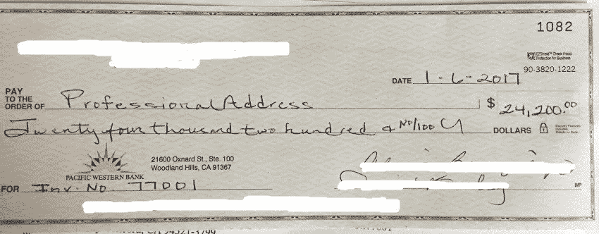

# 当上帝给你一个愿景，等待它，永远不要放弃！

> 原文：<https://medium.com/hackernoon/when-god-gives-you-a-vision-wait-for-it-and-never-give-up-9c9f530b3936>

Professional Address First Check

当我 19 岁的时候，上帝告诉我他会让我成为亿万富翁来传播耶稣基督的福音。当时，我是纽约市[君悦酒店](https://newyork.grand.hyatt.com/en/hotel/home.html)的安保人员，时薪 16.20 美元。那是 20 年前的事了…下面更新一下。

那是 1997 年，互联网泡沫仍在积聚。我发现自己每天晚上都盯着新闻，因为新诞生的百万富翁们讨论他们最近的首次公开募股([首次公开募股](https://en.wikipedia.org/wiki/Initial_public_offering)……因为我所有的“什么？？?"读者)。就在那时，我知道有一天我会有自己的十亿美元首次公开募股。每一天我都在等待上帝来揭示这个伟大的计划。在此期间，我成为了一名房地产经纪人，一名日间交易员，一名 Primerica 的保险代理人，创办了一家媒体公司，并加入了安利，以及其他几家多层次营销公司。所有的努力都是为了帮助上帝。八年过去了，我每次冒险都失败了。尽管我现在在酒店业挣着六位数的收入，但每次晋升都让我过上了朝九晚五的生活，这是我永远无法完全接受的。我注定要成为亿万富翁，所以上帝保佑我…然后他们解雇了我。

**“上帝现在就帮帮我吧！！！你说你会让我成为亿万富翁，怎么这么久？？?"**

我认为我新获得的自由是上帝轻轻地推了我一下，让我离开了舒适区。虽然我很害怕，但我更兴奋。我听到励志演说家莱斯·布朗说:“只需要一个想法就能让你变得富有。”所以每天晚上，我都在床边放上笔和拍纸簿，等待上帝给我一个主意。然后就来了！在两个星期的过程中，上帝给了我不是一个，而是两个想法，上传工作室和专业地址的生动梦想。我向当时我所认识的最成功的人——为甲骨文公司工作的杰姆·帕甘——寻求建议。我向他解释了这两个商业概念，虽然对这两个概念都印象深刻，但他建议我先搞上传工作室。他帮我写了商业计划，我介绍的第一批人，纽约市[中城餐厅](http://www.midtownrestaurant.info/)的老板给了我 25000 美元的投资，不久后另一位投资者给了我 15000 美元。有了这样的开始，我想我很快就会成为亿万富翁。那是大约 10 年前。那 40，000 美元支持了我大约三个星期。我会见了大量投资者，并试图在一年多一点的时间里让 Upload Studios 离开地面，但变得如此破产，我甚至无法支付 7.99 美元来保留域名。[微软](https://www.microsoft.com/en-us/)在我让它过期后买下了它， [UploadStudios](http://www.xbox.com/en-US/entertainment/xbox-one/live-apps/upload-studio) 现在是他们 Xbox 家族的一部分。我仍然相信这个概念，但是时机不对。

重返职场是我一生中最艰难、最沮丧的时刻。我在纽约长老会医院找到了一份安全主管的工作。作为每周 40 多个小时的回报，他们每年付给我大约 90，000 多美元，包括加班费……*与仍然在我心中肆虐的梦想相比，这只是九牛一毛。我这样做了 3 年，讨厌其中的每一刻。我不属于这里。我当时 35 岁……老了！！！我感觉我的梦想正在溜走，但我就是放不下…然后它发生了。*

《美国的黑人》是 CNN 记者[索莱达·奥布莱恩](https://twitter.com/soledadobrien?ref_src=twsrc%5Egoogle%7Ctwcamp%5Eserp%7Ctwgr%5Eauthor)主持的一系列纪录片。其中一个片段的标题是[“新的应许之地——硅谷”](http://money.cnn.com/technology/newme_incubator/)。现在，如果你不知道关于约书亚(我的名字)和应许之地的故事，我强烈建议你在这里读一读。这是上帝给我的信号，他终于带我进入了应许之地，在荒野中度过了这么多年。CNN 特别报道了硅谷的“ [NewM](http://www.newme.in/) e”加速器，这是一个由[安吉拉·本顿](https://twitter.com/ABenton?ref_src=twsrc%5Egoogle%7Ctwcamp%5Eserp%7Ctwgr%5Eauthor)和[韦恩·萨顿](https://twitter.com/waynesutton?ref_src=twsrc%5Egoogle%7Ctwcamp%5Eserp%7Ctwgr%5Eauthor)创办的组织。这个项目是为那些有想法，但没有资源或技术来实现它的少数民族设计的…我我我我！！！2012 年 7 月 6 日，我在工作中发了通知，用我名下的 6000 美元，我把我所有的财产装进了我的福特探险者，并遵循了一些有史以来最好的建议“去西部吧，年轻人。”六天后我到了加州，没地方住。我将圣何塞州立大学作为我的目的地输入到 GPS 中，因为我希望他们成为我在专业地址平台上的第一批客户。头三天真的很难熬。我不知道要花多长时间才能找到住的地方，所以我住在我能找到的最便宜的汽车旅馆...还需要我多说吗？
那时我可以在南圣何塞租一个房间，每月 500 美元，但房东要我预付六个月租金和两个月押金。我儿时的朋友，斯蒂芬妮·马西埃，支付了全部费用。现在我只需要一个风投、一张餐巾纸和一支笔……至少我听说硅谷是这样的。我是不是突然醒悟了！不仅没有神秘慷慨的风投在沙丘路的一家餐馆里拿着一张百万美元的支票等着我，而且 NewMe 加速器也拒绝了我的申请。我的整个世界迅速而猛烈地崩溃了。现在怎么办？？？他们说我至少需要一个线框，最好是 MVP(最小可行产品)。我听到的都是“废话，废话，废话，你刚刚辞掉高薪工作，白跑了 3000 英里，你的降落伞是什么颜色的？”

**天哪，这是怎么回事？…上帝？？上帝？？？你在吗？？？？**

我从恐惧到恐慌，到沮丧，到无法动弹。然后我想起了上帝告诉另一个约书亚的话…

> 你当刚强壮胆，不要惧怕，也不要惊惶，因为我与你同在，我必不撇下你，也不丢弃你。你将带领这些孩子进入我向他们的祖先起誓应许的乐土”。

我知道这些话也是对我说的，那里仍然有一片乐土，我将带领许多人进入。所以我去给自己买了一个线框和一个 MVP…然后继续撞向紧闭的大门。我曾经去过[谷歌在三藩市的](https://twitter.com/google)办公室，带着无比兴奋的心情向接待员宣布我的公司将改变世界！！！她叫来保安，保安礼貌地护送我离开了。当我听说[米切尔·卡普尔](https://twitter.com/mkapor?ref_src=twsrc%5Egoogle%7Ctwcamp%5Eserp%7Ctwgr%5Eauthor)，CNN 节目的风投之一，承诺给[4000 万美元给少数族裔](https://www.usatoday.com/story/tech/2015/08/04/mitch-kapor-freada-kapor-klein-tech-diversity-40-million-investment-pledge-white-house-demo-day/31069481/)在硅谷起步时，我才知道现在一切都将改变。我有我的线框，我有我的 MVP，我要用我的惊人故事和将要“改变世界”的公司让他们大吃一惊。我收到了其中一位合伙人布莱恩·迪克森的回复邮件，邮件中写道，如果有问题，请联系我们。

**“什么？？?"**

好了，适可而止，我来 CA 已经三年了，我遵守所有的规则。我不知道如何写一行代码，我的钱在三年前就用完了，但是由于上帝的恩典，我设法组织了一个团队，建立了一个 MVP，…是的，这是令人惊讶的蹩脚，但是你肯定看到了愿景，毕竟，上帝亲自告诉我，我将成为亿万富翁…你们这些人怎么了？？？哈哈，权利心态达到了创纪录的水平。

我的开发者想要更多的钱来让我的 MVP 真正发挥作用，投资者想要一个……嗯，真正发挥作用的产品，我的妻子，现在怀上了我们四年内的第三个孩子，想要稳定，我的房东想要他的租金，我想放弃。但是我就是不能…

就在圣诞节前，我妻子怀孕 5 个月的时候，我们被赶出了家门。我们无家可归了几个月，睡在教会成员埃伦和基奥纳尼·阿基诺的沙发上，但这实际上是故事中最精彩的部分。因为正是在这里，在我人生的最低谷，当我所有的恐惧都实现的时候，我发现上帝比任何可能降临在我身上的东西都要伟大。我学会了只信任他一个人，而不是风投、开发者，甚至是我自己。他给了我超越所有理解的希望和平静，我只是简单地知道一切都会变好。我经历的和现在知道的财富，远远超过任何数量的银和金…或摇滚明星首次公开募股的股票。

然后我遇到了我现在的商业伙伴，他拥有一家网络开发公司。他投资了近 30 万美元，为我从零开始打造了一个新平台。它完成于今年早些时候，就在我 40 岁生日前夕。完工后两周内，我收到了第一个客户(一所 2200 名学生的高中)和一张 24200 美元的支票。其他两份合同很快跟进。没有愿景，人就会灭亡。在愿景烙在我心中 21 年后，我第一次得到了切实的确认。

人们经常把职业地址比作 LinkedIn，对此我完全不同意。 [LinkedIn](https://hackernoon.com/tagged/linkedin) 建立在一句古老的格言之上:“重要的不是你知道什么，而是你认识谁”。但对于那些拥有前沿知识，但没有[人脉](https://hackernoon.com/tagged/network)的学生，或者拥有宝贵技能，但可能在 LinkedIn 上看不到同龄人的蓝领工人，我们会说，“对任何雇主/企业主来说，重要的不是你认识谁*，而是你知道什么*我们给学生和成年人一个平台，向全世界展示是什么让他们成为专业人士。然而，当 LinkedIn 被…请击鼓…你猜对了，微软，以比他们支付给我的上传工作室域名多 260 亿美元的价格收购时，我开始说“嗯，这有点，有点像 LinkedIn…尽管是针对不同的一代。”专业地址是一个品牌管理平台，围绕三个基本组件构建，您可以通过链接创建、托管和共享；你的简历、作品集和面试视频。简单。**

**我还不是亿万富翁，但感谢上帝，我正在前进。当我到达那里的时候，我将更新你。感谢您抽出时间阅读。**

*****在 Jsamuel.com@gmail.com 可以找到约书亚*****