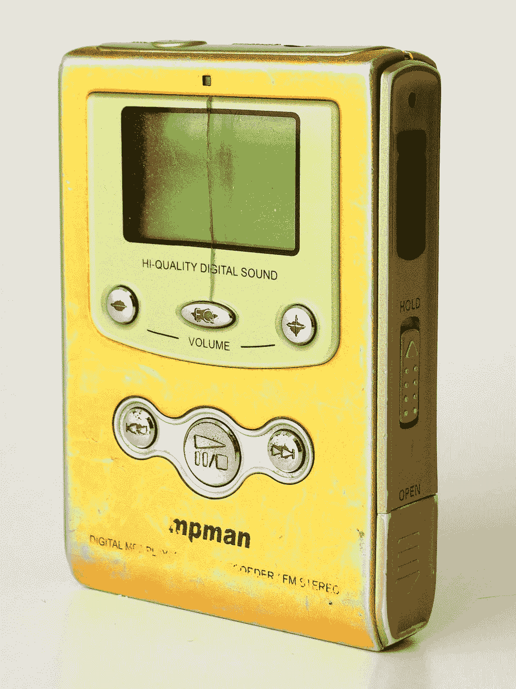
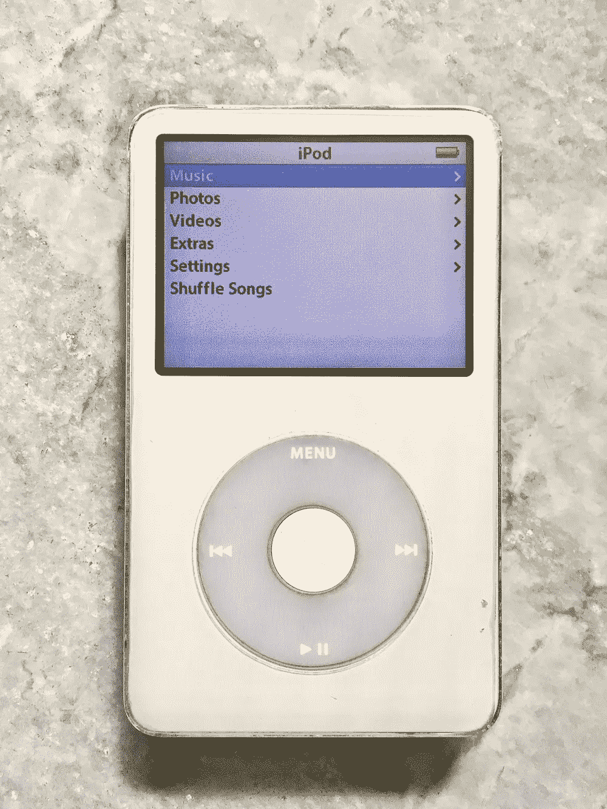
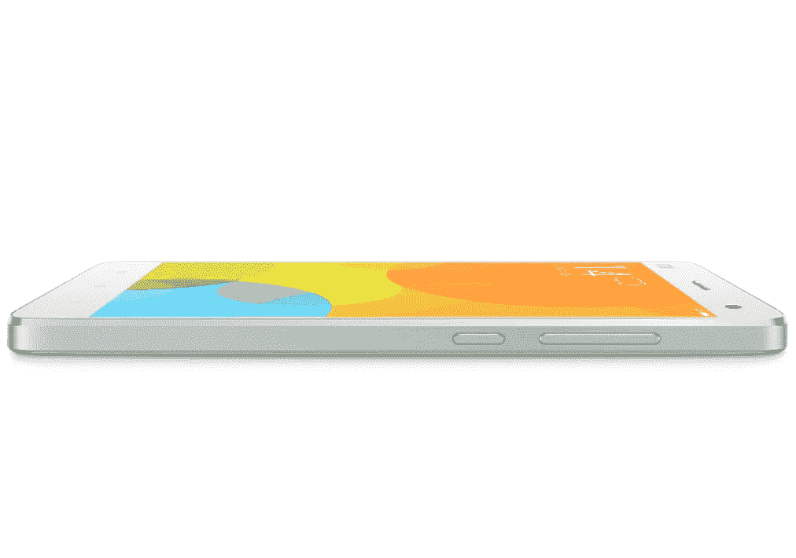
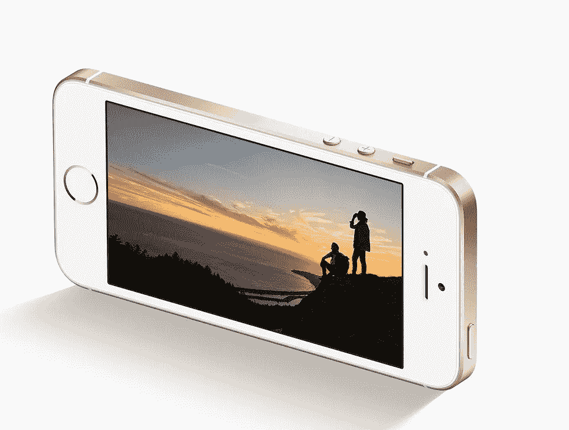
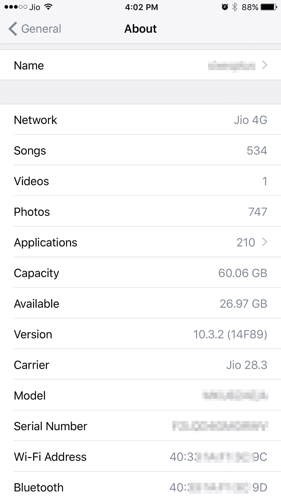
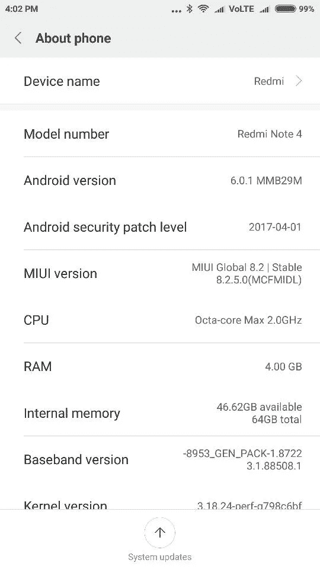
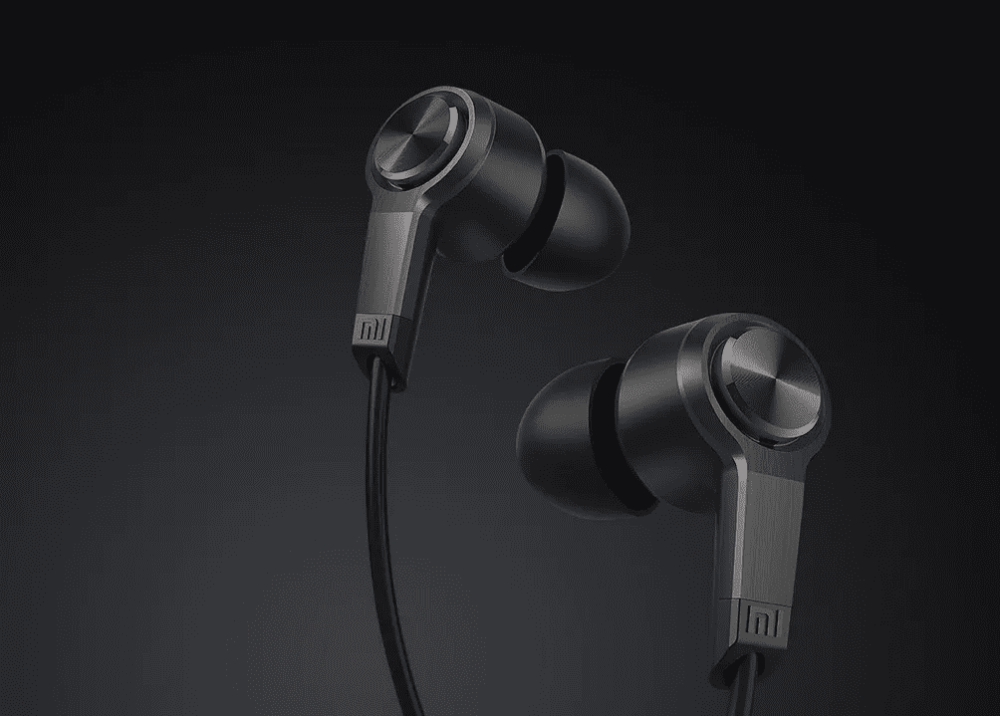
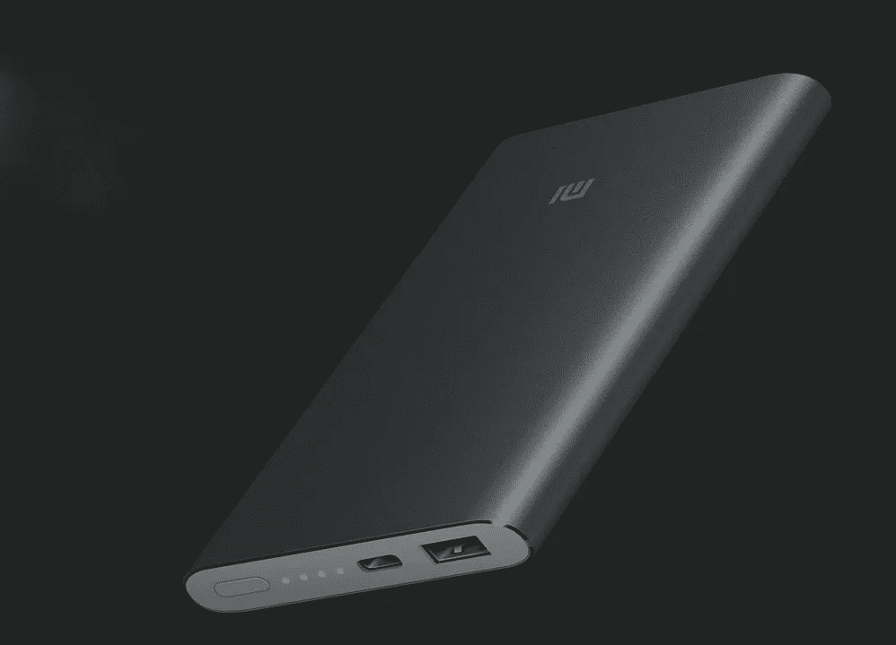

# 当模仿变得可以接受时

> 原文：<https://medium.com/hackernoon/when-imitation-becomes-acceptable-426aa8325344>

Reinventing the clunky MP3 player as the iconic iPod (credit: wikipedia)

苹果没有发明 MP3 播放器。1998 年，一家名为 SaeHan 的公司开始以 400 美元的价格销售基本的 32MB 固态播放器。苹果所做的是在两个层面上改进那个丑陋、难用的 MP3 播放器。第一个目标是为玩家创建一个易于使用、可靠的软件。第二步是把它变成一件精雕细琢、富有美感的工业设计作品。今天，最初的点拨轮 iPod 看起来过时了。但其用户友好的界面和吸引人的设计为消费产品树立了新的标杆。迄今为止，iPod 及其后续产品已经售出了 3.9 亿台，为今天的苹果奠定了基础。

这种将现有技术与用户友好界面和优秀设计相结合的理念，而不是发明一项新技术，现在几乎是苹果的商标，也是其成功的主要因素。拿着手机。也不是苹果发明的。但 2007 年发布的第一部 iPhone 改变了人们对手机功能、与我们互动的方式以及外观的看法。时间机器是另一个例子。备份软件存在于 Windows 平台上(如 GoBack ),但苹果公司跳出来将硬件和软件结合成一个无缝的体验，自动化备份甚至无需我们考虑。这甚至适用于软件。以手机通知系统中的小部件为例。在它最终出现在 iOS 上之前，Android 早就有了。

他们说“模仿是奉承的最好形式。”正如史蒂夫·乔布斯在 1996 年所说:“毕加索有一句话:‘好的艺术家临摹；伟大的艺术家偷窃，‘而我们一直对偷窃伟大的思想不要脸’。”我认为毕加索的意思是，许多艺术家首先是通过模仿和掌握他们崇拜的另一位艺术家的笔触来学习他们的艺术。一旦他们能够完美地再现这种风格，他们就以此为基础发展自己的风格，独辟蹊径。

这么看，我看不出苹果抄袭和提炼竞争对手的技术有什么不对，只要不侵犯任何专利就行。毕竟，当用户不断获得更好的产品时，他们会脱颖而出。无论如何，复制是一个双向的过程。例如，Android 现在有了指纹识别功能，这是作为 iPhone 上的触控 id 首次向世界推出的。

很自然，许多公司试图复制苹果的设计理念，当苹果开始起诉他们时，可能已经太晚了。举例来说，三星已经为其设计优雅的手机树立了一个名字，而且实际上其部分手机的定价高于 iPhones。但是三星还没有完全掌握苹果的软硬件组合。

而这也是小米进场的时候。

这家中国初创公司的目标似乎是复制苹果模式。从几年前开始，这些家伙几乎复制了苹果的一切，从产品完成，网站设计，品牌简单性，以及 MiUI(修改后的 Android 用户界面)的外观和感觉。我认为苹果到目前为止还没有起诉小米的一个原因是他们还不在美国。

Lookalikes: Xiaomi’s Mi4 and Apple’s iPhone SE

小米有一个强大的差异化优势，让它鹤立鸡群。与苹果和其他机器人不同，小米以实惠的价格提供高端规格。

而这也是导致我第一次接触小米的原因。

对我来说，苹果的主要问题一直是它的价格。我更愿意支付更少的费用，拥有更短的升级周期，而不是被过时的硬件所困。(例如，我的 iPad 3 是 32 位的，苹果将在 iOS 11 中停止 32 位应用程序。)如果不是苹果软件和硬件的完美结合，再加上我对苹果应用商店应用的投资，我很可能会选择安卓系统。

事实上，当我的 iPhone 4 开始出现扬声器问题时，我确实改用了 Android(一款 Nexus 4)。我得到了一个 Nexus 4 但我不习惯 Android，当我以低价获得一个翻新 iPhone 5 的机会时，我回到了苹果。那部 iPhone 5 在显示屏意外崩溃之前用了几年。我将 Nexus 4 作为第二部手机，并将其换成了小米的 Mi4i，因为我一直听说这是苹果的克隆产品，并想尝试一下。但当我妻子送我一部 iPhone 6s+时，我又换回了苹果。她的解释是这是她第一次能够给我一份我珍视的礼物。

军情四处跟了我将近两年。对₹10000(155 美元)来说，这是一部相当不错的手机。但随着时间的推移，它出现了一些问题:它的电池会很快耗尽，而且它不能很好地处理 VoLTE。

后者对我来说是一个交易破坏者，因为我使用 Jio 网络，需要 VoLTE 来打电话。所以我把 Mi4i 换成了 Redmi Note 4，这是小米在印度最热销的产品之一。我还没有时间尝试红米，但我所看到的一点点是相当令人印象深刻的。它的全金属表面看起来非常光滑，摸起来很紧凑。修改后的 Android 像 iOS 一样工作，所以对于 iPhone 用户来说没有太多的学习曲线。

iOS-inspired MiUI

Redmi 甚至比我的 iPhone 6S+还有些优势。比如它的指纹扫描仪即使我的手指湿了也能工作。不像我 iPhone 6S+上的触控 ID，它总是拒绝我出汗的手指。iPhone 更高的价格确实体现在其功能更强的摄像头等方面。

但我觉得有趣的是，小米如何试图应用苹果的哲学，即利用现有技术，并试图让它变得更好。

以截屏业务为例。iOS 有这个系统，你可以同时按下 home 键和电源键来捕捉屏幕。后来，他们想出了这种“辅助触摸”功能，允许使用浮动菜单球，可以定制为具有屏幕捕捉按钮等功能。

Android 忠实地跟随 iOS 的脚步，很快通过按下电源和音量按钮实现了屏幕捕捉(尽管我永远也不记得必须按下的是“调高音量”还是“调低音量”按钮)。这是后来补充了更容易下拉截图部件。

小米在这方面更进一步。它最近推出了 Quick Ball，这是一个浮动菜单，类似于 iOS 的辅助触摸。更好的是，他们还配置了 MiUI，用三个手指向下滑动来捕捉屏幕。甚至有一个向下滚动屏幕捕捉功能，允许你在一个长屏幕截图上捕捉长滚动页面。不幸的是，这个滚动截图功能在我的 Redmi 上不起作用。

这就是苹果与众不同的地方。如果苹果有什么东西不能用，你可以谷歌一下，找到一个由苹果众多知识丰富的用户之一在网上发布的解决方案。但小米太年轻，也太小众，没有如此庞大的可以相互支持的用户群。他们确实有一个类似于苹果论坛的 MiUI 论坛，但我甚至找不到一个不能工作的滚动菜单的参考。小米确实任重道远。

这些微小的用户界面调整只是表明小米将努力融入其基因构成苹果的精细设计和用户友好技术的哲学。在某些方面，这个学生超过了大师。

以 Apple Watch 统治的智能手表类别为例。这是一款让我不感冒的苹果设备。让我却步的不仅仅是价格。这东西每天晚上都要充电。我已经受够了充电设备，我的两部手机，iPad，Mac 的键盘和跟踪板，还有我的蓝牙耳机。

这就是我选择 Mi 乐队的原因。就功能而言，它不在 Apple watch 之列。但它的价格仅为₹1999(31 美元)，配有一个小屏幕来显示时间，跟踪我的脚步，提醒我有来电，检查我的心跳，甚至可以作为我手腕上的无声振动闹钟。蛋糕上的糖衣是我只需要一个月给它的电池充一次电。

简而言之，Mi 波段简单、用户友好，而且工作正常。我以前在哪里听过这句话？

或者看看每部手机自带的苹果耳机。它的工作效率很高，但非常基础。例如，没有噪音消除功能。大部分小米手机都是低预算，不自带耳机。所以我从小米网站上为₹999 订购了一副入耳式耳机(15 美元)。

我把那些耳机拿在手里的那一刻，是我意识到小米已经超越了模仿，发展了自己的风格。耳机的金属和黑色塑料抛光表面、坚韧的尼龙编织无缠结线缆、线缆缠绕器、完美贴合的耳塞……它们都表现出对细节的关注。在小米网站上的一点研究表明，我不是唯一一个印象深刻的人。这款特殊的耳机赢得了 2015 年的红点设计奖。

质量不仅仅局限于设计，还延伸到功能。耳机消除了外界噪音，尽管我不是发烧友，但我可以说音质肯定比标准的苹果耳机好，后者 29 美元几乎贵了一倍。

Going beyond imitation: Xiaomi’s Red Dot Design award winning headset, and its much copied power bank.

小米对质量的重视也体现在我试用的另一款产品 Mi Power bank 上。这又是一块精工细作的金属，几年前我给我哥哥推荐了一块。他经常出差，经常使用它，而且它仍然很强劲。

具有讽刺意味的是，许多其他中国品牌已经开始模仿小米 Powerbank 的外观，以至于其销售受到了影响。

生活绕了一个完整的圈，模仿者变成了被模仿者。

> [黑客中午](http://bit.ly/Hackernoon)是黑客如何开始他们的下午。我们是 [@AMI](http://bit.ly/atAMIatAMI) 家庭的一员。我们现在[接受投稿](http://bit.ly/hackernoonsubmission)，并乐意[讨论广告&赞助](mailto:partners@amipublications.com)机会。
> 
> 如果你喜欢这个故事，我们推荐你阅读我们的[最新科技故事](http://bit.ly/hackernoonlatestt)和[趋势科技故事](https://hackernoon.com/trending)。直到下一次，不要把世界的现实想当然！

