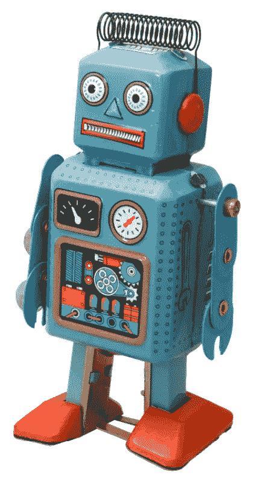
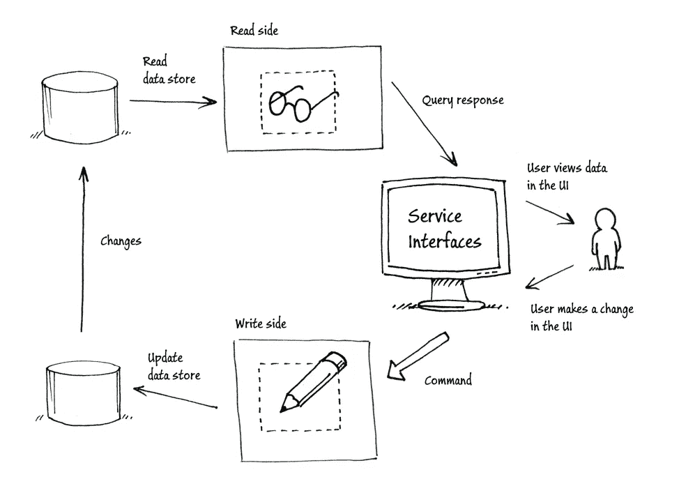
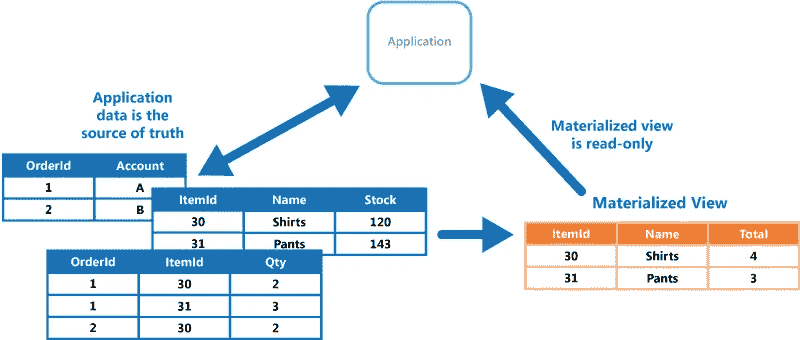
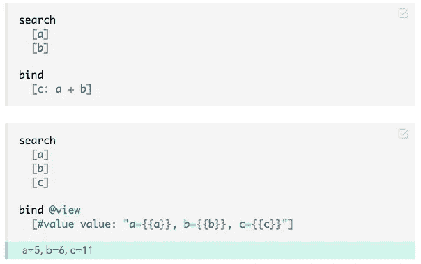

# 当逻辑编程遇到 CQRS

> 原文：<https://medium.com/hackernoon/when-logic-programming-meets-cqrs-1137ab2a5f86>

## Eve 将把一个有抱负的设计模式变成现实

欢迎来到我的关于 Eve 的系列文章的第二部分，这是一种令人兴奋和着迷的新编程语言。

*   [*I .*Eve 如何统一你的整个编程栈](https://hackernoon.com/how-eve-unifies-your-entire-programming-stack-900ca80c58a7)
*   ***二世。*当逻辑编程遇上 CQRS**
*   [*三世。*挣脱我们的镜链](https://hackernoon.com/throwing-off-our-scope-chains-7567beb2d0b6)
*   [*四世。* Smalltalk 和蛋白质编程](https://hackernoon.com/smalltalk-and-protein-programming-4da245ac93e2)
*   [*五、*夏娃远大理想的坚实基础](https://hackernoon.com/the-rock-solid-foundation-for-eves-big-vision-225b80b91e11)
*   [*六。*为什么 Eve 是实时应用的完美选择](https://hackernoon.com/why-eve-will-be-perfect-for-realtime-apps-92b965b80ad)

# 逻辑编程

你知道 Eve 是一种逻辑编程语言吗？Eve 基于 [Dedalus](https://databeta.wordpress.com/2010/01/05/introducing-dedalus/) ，是 [Datalog](https://en.wikipedia.org/wiki/Datalog) 的扩展，是基于 [Prolog](https://en.wikipedia.org/wiki/Prolog) 的逻辑编程语言。

逻辑编程的工作方式是:你写下一堆事实，然后你立即开始查询一个世界，在这个世界中，这些事实及其所有逻辑含义都是真实的。如果那没有意义，检查这个[序言](https://bernardopires.com/2013/10/try-logic-programming-a-gentle-introduction-to-prolog/)的温和介绍。

Datalog 从 20 世纪 70 年代就已经存在了。那么如果逻辑编程这么伟大，为什么它还没有成为主流呢？也许是因为它不如过程式和函数式编程风格直观？

不，我认为逻辑编程只是到现在还没有完全成熟。迪达勒斯的[研究论文](https://www2.eecs.berkeley.edu/Pubs/TechRpts/2009/EECS-2009-173.pdf)在 2009 年才发表，在我看来这是一个重大的理论进步。与传统的逻辑编程不同，Dedalus 明确地对随着时间的推移以及通过不可靠的异步通信通道发生的事实更新进行建模。《迪达勒斯》的合著者之一约瑟夫·m·赫勒斯坦这样描述:

> 一些人可能会感到惊讶，Datalog 是数据库理论的首选语言，却无法对更新和删除进行建模。通过将时间整合到 Dedalus 逻辑中，更新和删除可以被捕获为逻辑时间戳(版本)数据的演绎。

当然，伊芙现在才出来。所以我们才刚刚开始看到逻辑编程的潜力。

# CQRS

我想我们会看到，逻辑编程能做的最令人兴奋的事情之一就是实现 CQRS 模式。

## 这是什么？

[命令查询责任分离(CQRS)](https://msdn.microsoft.com/en-us/library/jj591573.aspx) 是一个冗长的术语，但它仅仅意味着将你的读模型和写模型分开。

例如，在一个称为[事件源](https://msdn.microsoft.com/en-us/library/dn589792.aspx)的 CQRS 特例中，您决定您的应用程序的写模型是一个单一的仅附加事件对象序列，如:

*   `{event: “deposited", accountId: 123, amount: 100}`
*   `{event: “deposited", accountId: 456, amount: 100}`
*   `{event: “withdrew", accountId: 123, amount: 30}`

您的应用程序的读取模型看起来更像:

*   `{accountId: 123, balance: 70}`
*   `{accountId: 456, balance: 100}`

当您的应用程序接收到一个事件(如存款)时，它会发出一个对写模型的更新。当您的应用程序需要数据时，例如获取帐户的当前余额，它会查询读取模型。同时，您告诉您的数据库层如何始终保持读模型与写模型同步。

## 为什么好？

对于高可伸缩性、高可靠性和高可靠性的应用程序来说，事件源已经是一种流行的模式。格雷格·杨的这个演讲很好地解释了它的优点。

即使你不关心事件源，你也可能关心[数据反规范化](https://en.wikipedia.org/wiki/Denormalization)。好吧，任何时候你认为你只是在“反规范化数据”，你实际上是在“预计算 CQRS 的阅读模型”。

嘿，我告诉过你 CQRS 是一个免费的长流行语，因为它很简单。但是你可以看到命名和关心是一个重要的概念。

# 问题:CQRS 现在有点不太可能

CQRS 的问题是，从来没有一个好的方法来“告诉你的数据库层如何总是保持读模型与写模型同步”。如果你放大上面的 CQRS 图，标有“变化”的箭头实际上是一座摇摇晃晃的桥:

理论上，CQRS 是伟大的。但是在实践中，这并不是你能真正做到的事情，至少不能优雅而有力地做到。

声称帮助实现 CQRS 的系统通常是[流处理](https://martin.kleppmann.com/2016/01/29/event-sourcing-stream-processing-at-ddd-europe.html)系统，例如:

*   [事件存储](https://geteventstore.com/)
*   基于 Apache [Samza](http://samza.apache.org/) 和 [Kafka](https://kafka.apache.org/) 的[解决方案](https://www.confluent.io/blog/introducing-kafka-streams-stream-processing-made-simple/)

您还可以使用 SQL 数据库来实现 CQRS:只需将您的写模型放入一个或多个表中，然后使用[触发器](https://en.wikipedia.org/wiki/Database_trigger)对更改做出反应，并发出正确的`INSERT` / `UPDATE` / `DELETE`操作来同步您的读模型。

不幸的是，无论您选择上面的哪一个，您都必须使用自己混乱的过程逻辑来对传入的写操作做出反应。也就是说，你必须告诉数据库*如何*保持两个模型同步。你不能仅仅宣布*这两种模式之间的关系总是需要什么。*

此外，一致性保证也不确定。当您的写模型改变时，您不能保证您的整个读模型相应地从一个一致的快照跳到下一个。

## 物化视图模式

好吧，那么……用一个[物化视图模式](https://msdn.microsoft.com/en-us/library/dn589782.aspx)来实现 CQRS 怎么样？

理论上，物化视图模式很棒。但是实际上——尽管它有自己的 MSDN 页面——它缺少一个令人满意的实现！如果你放大图表，那个小的水平箭头实际上是一个泄漏的管道:

物化视图只适用于基本的数据转换。它们不够聪明，无法针对写模型操作进行增量更新。另外，它们的一致性保证也很弱。

我之前在“[数据反规范化被打破](https://hackernoon.com/data-denormalization-is-broken-7b697352f405)”中指出了物化视图的局限性。当我渴望一个“反规范化引擎”时，我基本上指的是优雅且健壮地实现物化视图模式的任何东西。

在我看来，CQRS 似乎是一个我们都应该用于数据层的关键模式——然而，目前很少看到具有优雅的 CQRS 架构的生产系统，甚至很少听到在对话中提到“CQRS”。可悲的是，我认为我们懒得讨论它，因为没有工具让我们建立它。

# 逻辑编程遇见 CQRS

很快，我们将不再需要物化视图模式、SQL 触发器或流处理——因为我们将拥有 Eve。

Eve 的最新版本，0.2，只是一个内存演示；它还不够像数据库。但我敢说，它已经走上了成为 CQRS 的最佳实现的轨道。

在 Eve 中，用`search`和`bind`编写一个块有点像定义一个物化视图。这里有一个小小的单记录物化视图/ CQRS:

我将`c`绑定为总是等于`a + b`。现在`a`是`5`，`b`是`6`，`c`是`11`。如果我将`b`增加到`7`，那么我会自动看到`c`的值为`12`。

看，这是 CQRS！我的写模式是`a`和`b`，我的读模式是`c`。这是一个微不足道的例子，但它阐明了核心概念。我将在[第六部](https://hackernoon.com/why-eve-will-be-perfect-for-realtime-apps-92b965b80ad)中展示一个更详细的`bind`的例子。

有了 Eve 的`bind`操作，你可以同步你的读模型和写模型，让 CQRS 模式成为现实。现在请看“改变”箭头:

既然我们已经看到了逻辑编程是使 CQRS 成为现实的一种有前途的方法，我还应该提到 [Datomic](http://www.datomic.com/) ，它可能是当今市场上最知名的逻辑编程数据库。[这篇文章](http://yuppiechef.github.io/cqrs-server/)和[这篇演讲](https://www.youtube.com/watch?v=qDNPQo9UmJA)展示了建立在 Datomic 基础上的 CQRS 建筑。两者都不“纯”；它们都需要其他系统的定制组合来完成一些工作。尽管如此，他们还是朝着 CQRS 独立的方向取得了可喜的进展。

**下篇:** [*三。*挣脱我们的镜链](https://hackernoon.com/throwing-off-our-scope-chains-7567beb2d0b6)

> [黑客中午](http://bit.ly/Hackernoon)是黑客如何开始他们的下午。我们是 AMI 家庭的一员。我们现在[接受投稿](http://bit.ly/hackernoonsubmission)并乐意[讨论广告&赞助](mailto:partners@amipublications.com)机会。
> 
> 如果你喜欢这个故事，我们推荐你阅读我们的[最新科技故事](http://bit.ly/hackernoonlatestt)和[趋势科技故事](https://hackernoon.com/trending)。直到下一次，不要把世界的现实想当然！

