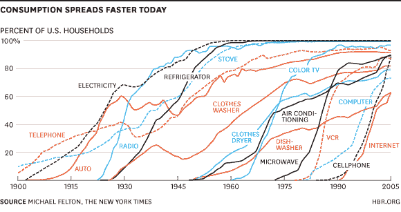
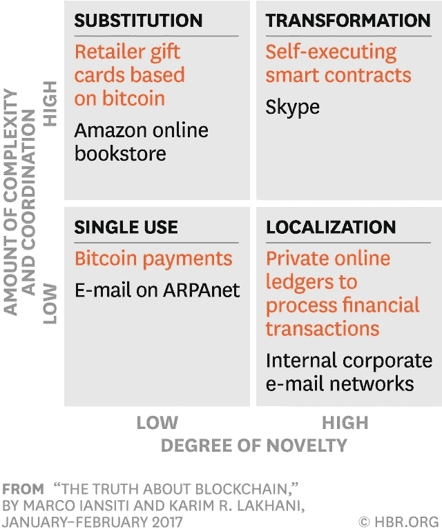
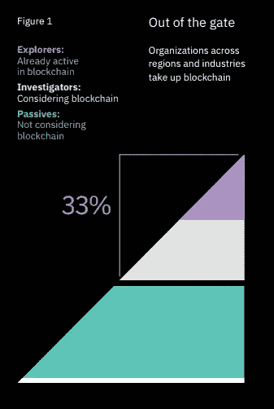
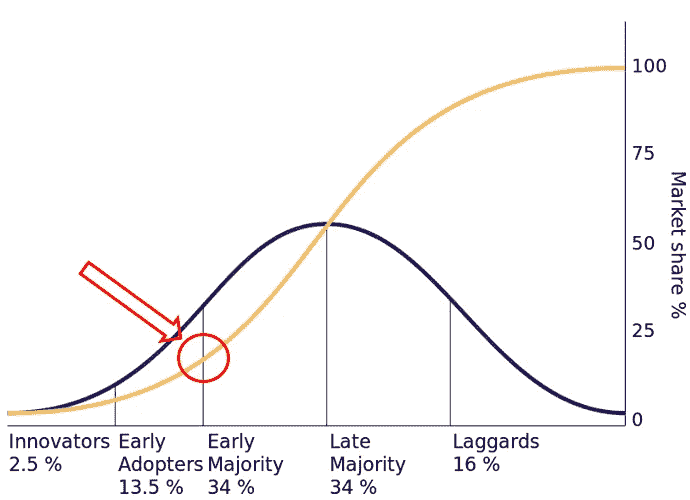

# 大规模区块链采用:我们离成功还有多远？

> 原文：<https://medium.com/hackernoon/when-should-your-business-think-about-blockchain-f1937c7c35e1>

> “不管背景如何，区块链很有可能会影响你的业务。一个非常大的问题是什么时候”——HBR，区块链的真相

无论你参与[【区块链】](https://hackernoon.com/tagged/blockchain)和[加密货币](https://hackernoon.com/tagged/cryptocurrency)领域的性质如何，每个管理者、消费者、创始人、投资者和爱好者都应该了解**企业**将开始实施基于区块链的解决方案的速度，以提高[效率](https://hackernoon.com/the-security-token-thesis-4c5904761063)、安全性、竞争力或彻底改变其**消费者**和**股东** [在其商业生态系统中的互动方式](https://media.consensys.net/tokenwork-introducing-the-token-utility-canvas-tuc-9a1f32979dc0)。为了在宏观层面上理解这一点，我们可以探索该技术目前在采用的 S 曲线上所处的位置。

虽然许多人主要将区块链与比特币和其他加密货币联系在一起，但这项技术改变企业运营方式的潜力往往被忽视。采用分散式账本技术有可能在企业和零售层面彻底改变企业创新和利用其内部或云功能的方式。

以下文章概述了区块链的采用速度，并在已建立的商业和消费者采用框架下进行了分析。

# 我们现在在哪里？

## 技术采用的 S 曲线

随着时间的推移，采用过程通常被描述为经典的正态分布或“钟形曲线”。

Everett Rogers Technology Adoption Life-Cycle Model

尽管如此，对这种描述的一个有益的补充是把技术性能看作是努力的函数，而不局限于时间。

“一项新技术的技术改进的 S 曲线描述了相对于投入该技术的努力和金钱的改进绩效” [1](https://www.finextra.com/blogposting/13317/blockchain-and-the-technology-diffusion-cycle) ，因此描述了一项技术的生命周期将如何由于学习曲线、收益递减法则和其他因素而结束。

Shifting Foster’s S-Curves

在整个 20 世纪，几乎被普遍采用的每一项主要的大众市场技术都表现出某种形式的 S 曲线，如下图所示。随着技术进步，s 曲线变得越来越压缩，导致更明显的垂直增长采用阶段。

虽然区块链已经出现在一个充满积极的竞争者和快速的技术进步的体育场中，但在技术基础上仍有很大的改进空间。

让我们调查一下区块链目前在 S 曲线上的位置:

## 基础技术是如何扎根的

> “B **锁链技术不是颠覆性技术，而是基础性创新。它有希望为我们的经济和社会结构创造新的基础。”**

在最近一期《HBR》中，Marco Iansiti 和 Karim R. Lakhani 开发了一个有用的框架，详细介绍了采用基础技术的四个阶段。他们探索新颖性和复杂性，这是企业转变技术环境必须解决的两个方面:

## 步骤 1 —一次性使用

基础技术的早期阶段始于单一用途、低新颖性和低协调性的应用。应用程序高度关注简单的解决方案。很好的例子包括电子邮件作为电话的替代，或者比特币作为规避当前金融系统限制的替代支付方式。

## 步骤 2 —本地化

在这个高度新奇但复杂性较低的阶段，开发通常由一个小型公司网络组成，这些公司协调使用能够从根本上改变公司运作方式的新应用程序。就金融机构而言，这可能适用于它们交易、结算和处理交易的方式。这些创新“新颖度很高，但只需要有限数量的用户就能立即创造价值，所以推广它们还是相对容易的。”

**在不久的将来**，我们将会看到更多的企业开发单一用途的应用程序，通过私有的区块链网络创造更高的流程效率，但是它们要取代整个业务运营还需要时间。

## 步骤 3——替代

替代阶段的创新需要大量的协调，因为它们旨在取代深深植根于机构中的整个流程。解决各利益相关方之间的复杂协调需要时间。

电子邮件在企业界的采用提供了一个很好的例子。自从电子邮件流行 20 年以来，它仍然被认为是一个必要的，但难以管理的工具。它取代了传真、电话和办公室备忘录；但是批评家和用户已经受够了这个工具。

## 第 4 步—转型

最后，转型描述了高新颖性和高复杂性，因为涉及到许多行动者，如政府、企业和消费者。作者指出，随着标准的建立和达成，法律，社会和政治的影响。政府、企业和消费者对区块链的怀疑甚至缺乏了解就是明证；这个技术肯定不是现阶段的。

🤔*来自 HBR 框架的第一个结论:* ***企业区块链采用目前处于本地化阶段；新颖度高但非常有限。***

## IBM 最近的一项研究证实了本地化阶段

IBM 商业价值研究所最近进行了最大规模的[全球高管区块链研究](https://www-01.ibm.com/common/ssi/cgi-bin/ssialias?htmlfid=GBE03835USEN)[【2】](#_ftn1)，调查了来自 80 个国家和 20 个行业的近 3000 名高管，寻求他们对区块链的看法。

Three ways blockchain Explorers chart a new direction — IBM Institute for Business Value

他们将受访者分为三组:探索者、调查者和被动者。**积极参与区块链发展的探索者(早期采用者)**占各行业受访者的 **8%** 。(研究发现，就竞争定位而言，这一群体是他们在 15 年的首席执行官研究中调查的最独特的组织群体。从收入和利润增长以及创新来看，他们往往是所在行业的领导者。**调查人员(早期多数)**，他们正在考虑但尚未准备好部署区块链解决方案，占调查对象的 **25%** 。剩下的被调查者被称为**被动(后期多数&落后者)采纳者，67%** 甚至没有考虑区块链解决方案。

这些结果**证实了**伊恩斯提和拉哈尼提出的定位阶段。回顾采用的 S 曲线，这些发现与采用的 S 曲线一致，并使区块链技术处于早期多数的边缘:

Blockchain technology in Rogers Everett’s Diffusion of Innovation

这项技术的潜力已经推动了少数有远见的早期采用者接受这项技术，他们将这项技术视为“信任加速器”，而早期的大多数人仍然保持好奇但持怀疑态度。

了解我们在技术采用曲线中所处的位置可能有助于决策者了解他们的具体[战略](https://link.springer.com/article/10.1186/s40854-016-0031-z)和行动时间表。特别令人感兴趣的是，如同电力、电话或互联网一样，S 曲线和确定区块链目前在图上的位置可以吸取过去成功和失败的教训。似乎我们正站在鸿沟的边缘，早期的大多数人都在窥视这个空间。主流媒体、企业和机构投资者的兴趣越来越大，这无疑强化了这一观点，所有这些人都尝试过，但还没有采取行动。我的下一篇文章将探讨他们这样做需要什么。

## 感谢阅读！如果你喜欢，请鼓掌支持👏🏻，分享帖子，在下方评论或关注我的 Twitter 页面:

 [## 凯文尼尔森加西亚(@KevinNielsen94) |推特

### 凯文尼尔森加西亚的最新推文(@KevinNielsen94)。@康奈尔@甲骨文纽约//马德里// SF。加利福尼亚州旧金山

twitter.com](https://twitter.com/KevinNielsen94) 

> “区块链的全面转型影响将在几十年而不是几年内显现出来，因为这种创新必须克服许多障碍——技术、组织、治理和政治。区块链的影响很可能是巨大的，但它的全面转型影响将需要相当长的时间。”
> 
> —欧文·沃道斯基-伯杰，区块链准备好“跨越鸿沟”了吗？

*   *共同前进:区块链探索者绘制新方向的三种方式*。IBM 商业价值研究所，2017 年 5 月 18 日
*   团队，编辑部。"区块链和技术扩散周期."Finextra 研究
*   梅丽莎·a·希林和梅丽莎·埃斯蒙德。"可再生能源替代品中的技术 S 曲线:对工业和政府的分析和意义."能源政策
*   罗杰斯，E. (1962)创新的扩散。美国纽约伦敦自由新闻