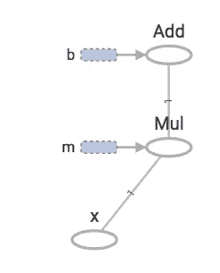
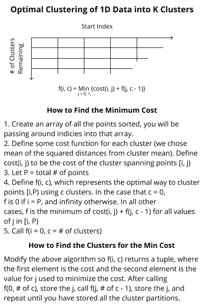
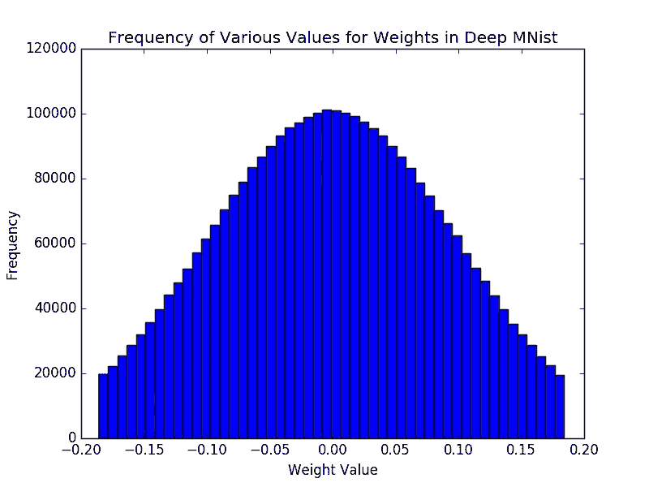
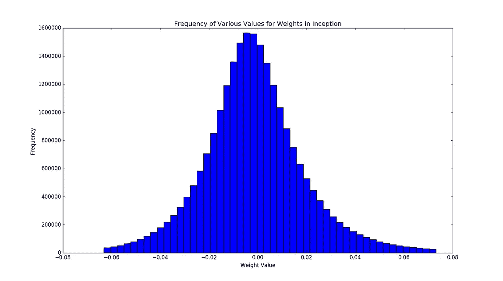

# 越小越好

> 原文：<https://medium.com/hackernoon/when-smallers-better-4b54cedc3402>

## 张量流图形文件中神经网络的有损压缩

*(此贴激励并描述了来自* [*韩、毛和戴利的关于神经网络压缩的论文*](https://arxiv.org/abs/1510.00149) *的发现在 TensorFlow 图形文件上的应用。感谢迈克尔·舒米欣**[*安尼施·阿萨莱*](http://www.anishathalye.com/) *和* [*沙伊·苏兰斯基*](https://github.com/iahs)*——他们帮助激励和推进了这项工作。)**

***TL；神经网络很大。有时当它们更小的时候是有用的(这样你可以存储更多，或者用更少的带宽部署它们)。[本文](https://arxiv.org/abs/1510.00149)阐述了对神经网络进行理论压缩的方法。您可以使用现成的压缩算法和[我们的库](https://github.com/tomasreimers/tensorflow-graph-compression)来实现 TF 图表文件大小的 3 倍缩减，而不必重新训练图表，并且没有(注意到)显著的准确性损失。***

*人工神经网络在过去几年里越来越受欢迎…*

*…是一种保守的说法。机器[学习](https://hackernoon.com/tagged/learning)可能是*目前计算机科学中最热门的领域*，神经网络被用于几乎所有的“机器学习”:情感分析、决策、图像分类等。神经网络的工作原理是接受一组“训练”数据(输入和输出对)，并根据输入学习预测输出；一旦经过训练，神经网络可以预测“测试”集的输出(以前没有看到的数据)。输入和输出对的一个例子可能是图像的像素，输出可以是值 0 或 1，指示该图像是否包含狗。另一个例子可以是来自图像的像素输入，并且输出是三维向量，其中第一维度是 0 或 1 以指示狗的存在，第二维度指示猫的存在，并且第三维度指示鸟的存在。总的来说，神经网络已经被证明是不可思议的强大，目前已经在许多顶级公司的生产中部署，包括[谷歌](https://hackernoon.com/tagged/google)/脸书/亚马逊等。*

**

**Canonical image of a neural net. Figure from* [*http://cs231n.github.io/neural-networks-1/*](http://cs231n.github.io/neural-networks-1/)*

*神经网络的本质是一系列加权线性回归，结合回归输出的变换(这些变换范围从恒等函数到 tanh，再到 [ReLUs](https://en.wikipedia.org/wiki/Rectifier_(neural_networks)) )。神经网络可以通过一种称为反向传播的算法来“学习”这些权重，这种算法依赖于梯度下降来不断调整权重，以提高训练数据集的准确性。*

**注意:这是一个过于简化的问题，CNN**和*[*RNNs*](https://en.wikipedia.org/wiki/Recurrent_neural_network)*可能会使这个问题变得复杂——但是它可以用于演示目的。如果你有兴趣了解更多，我强烈推荐阅读斯坦福大学 CS231n* *的介绍。**

*回想一下八年级的代数，线性回归接受一个值，通过一个系数和一个偏差产生一个值。这是经典的`y=mx+b`方程。其中`m`是权重，`b`是偏差。在多维空间中，这也是一样的，唯一的区别是`x`和`m`是向量。*

*在一个神经网络中，人们正在进行许多许多高维回归——权重和偏差的值会占用大量内存。以 Google 开源的热门机器学习库 [TensorFlow](https://www.tensorflow.org/) 为例:一个经过训练的深度 mnist 图(对[手写数字](http://yann.lecun.com/exdb/mnist/)进行分类，并作为 TensorFlow 的[入门演示)占用 **12MiB** 。](https://www.tensorflow.org/versions/r0.10/tutorials/mnist/pros/) [Google Inception V3 图](https://arxiv.org/abs/1512.00567)(用于[图片分类](https://github.com/tensorflow/tensorflow/tree/master/tensorflow/examples/label_image))占用**91mb**(此处找到[，警告:下载量大)。当我们继续在这些网络上迭代并存储多个版本时，大小就成问题了。如果有一个更小的表示来存储多个版本，通过网络发送到服务器(或自动驾驶汽车……)上，并存储在移动设备上，那就太好了。](https://storage.googleapis.com/download.tensorflow.org/models/inception_dec_2015.zip)*

## *张量流图速成班*

*图中张量流结构的计算。这些图形存储操作(ops)以及操作的输入和先前操作的输出之间的关系。*

*这些关系存储为“张量”，基本上是 n 维数组，其值不一定已知，其形状可能部分已知。您可以运行一个张量流图，方法是向图中输入一些张量的值，并通过运算运行它们，直到达到所需的输出。例如，如果我想在 TensorFlow 中对方程`y=mx+b`建模，我可以用下面的 Python 来实现:*

```
*import tensorflow as tfy = tf.add(
    tf.mul(
        tf.Variable(2, name="m"),
        tf.placeholder(tf.int32, shape=1, name="x")
    ),
    tf.Variable(1, name="b")
)*
```

**

*The example TensorFlow graph for y=mx+b.*

*如你所见，ops 是:“Add”、“Mul”、“m”、“b”和“x”。张量由`OPERATION:OUTPUT_INDEX`命名，所以例如`Mul`有一个输出(`m*x`的结果)，它将被命名为`Mul:0`。变量和占位符(占位符是其值必须在任何图形运行中输入的变量)也是具有一个输出张量(它们自己的值)的操作。在这个例子中，`m:0`、`x:0`、`b:0`的值是相当明显的，`Mul`操作接受`m:0`和`x:0`作为输入来产生`Mul:0`，而`Add`接受`Mul:0`和`b:0`来产生`Add:0`。你可能会注意到在这个图中没有`y`，这是因为`y`实际上是`Add:0`，尽管如果我们真的想要的话，你也可以创建一个`y`变量并把它赋给`Add:0`(尽管这看起来有些多余)。要运行这个图，可以使用类似于`sess.run(["Add:0"], feed_dict={"x:0": (5,)})`的命令，为`x:0`输入一个值并请求`Add:0`。*

*这些图形被编码并存储在一个 [GraphDef](https://github.com/tensorflow/tensorflow/blob/master/tensorflow/core/framework/graph.proto) protobuf 中。变量值不存储在图形定义中(因为它们可以在多次执行中赋值)，因此不是图形的一部分；但是，变量可以保存在检查点文件中(基本上是一个包含变量名和值的字典……至少根据 Google 的说法，文件类型比 GraphDefs 不透明得多)。当我们拟合回归(或训练神经网络)时，变量是有用的，但是一旦我们知道我们将不再改变它们，将它们保持为变量就没有多大意义了。相反，我们可以将它们转换为常量值(使用[convert _ variables _ to _ constants](https://github.com/tensorflow/tensorflow/blob/64edd34ce69b4a8033af5d217cb8894105297d8a/tensorflow/python/framework/graph_util_impl.py#L178)函数或与 TensorFlow 一起发布的 [freeze_graph](https://github.com/tensorflow/tensorflow/blob/master/tensorflow/python/tools/freeze_graph.py) 工具)并简化我们的图形。冻结我们的 toy `mx+b`模型后的示例 GraphDef 包含一组节点和(可能)它们所包含的张量的值:*

```
*node {
  name: "m"
  op: "Const"
  attr {
    key: "dtype"
    value {
      type: DT_INT32
    }
  }
  attr {
    key: "value"
    value {
      tensor {
        dtype: DT_INT32
        tensor_shape {
        }
        int_val: 2
      }
    }
  }
}...node {
  name: "Add"
  op: "Add"
  input: "Mul"
  input: "b/read"
  attr {
    key: "T"
    value {
      type: DT_INT32
    }
  }
}*
```

**注意:具有多个标量值的张量作为* [*压缩字节存储在字符串*](https://github.com/tensorflow/tensorflow/blob/master/tensorflow/core/framework/tensor.proto#L36) *中。它们可以与带有*[*TF . contrib . util . make _ ndarray 和的数组相互转换。make_tensor_proto 函数*](https://www.tensorflow.org/api_docs/python/contrib.util/) *。**

*要了解更多关于 TensorFlow 模型文件的内容，[请点击这里](https://www.tensorflow.org/versions/master/how_tos/tool_developers/)。*

## *压缩*

*[https://github . com/to MAS reimers/tensor flow-graph-compression](https://github.com/tomasreimers/tensorflow-graph-compression)*

*想要压缩 TensorFlow 图形文件，我们做的第一件事就是尝试 gzip，一个流行的压缩工具。Gzip 并不是非常有效。它并没有显著减小保存的深度 mnist 图的文件大小(压缩前后舍入到**12 MIB****)并将初始图的文件大小从 **91MiB** 减小到 **85MiB** (即使使用了`gzip -9`压缩)。面对其他无损压缩算法的类似结果，我决定考虑有损神经网络压缩。***

***张量流图形文件很大程度上是权重。从 GraphDef 文件中剥离包含各种权重的张量，深度 mnist 图只有 **3.7KiB** ，初始图只有 **120KiB** 。知道了这一点，我开始寻找有损压缩权重的方法。***

***神经网络重量不精确已经开始成为一个研究领域，原因有很多:硬件制造商对它感兴趣，因为它可能允许他们制造更多[不精确的硬件，可以更快地运行神经网络](https://www.technologyreview.com/s/601263/why-a-chip-thats-bad-at-math-can-help-computers-tackle-harder-problems/)(NVidia 的 TensorRT 对 INT8 和 Float16 模式提供硬件级支持，可以更快地运行网络)，软件工程师对它感兴趣，因为它可能允许他们[减少神经网络](https://arxiv.org/abs/1602.07360)占用的空间，甚至可能[软件级加速或](http://www.jmlr.org/proceedings/papers/v37/gupta15.pdf)***

***在权重压缩领域的开创性研究是由[韩、毛和戴利进行的，研究表明神经网络可以通过剪枝、量化和霍夫曼编码来减小规模](https://arxiv.org/abs/1510.00149)。这项研究假设人们仍然可以访问神经网络的训练集；然而，出于我们的目的，我们将假设我们无法访问该数据集(例如，如果我们有一个来自模型动物园的预训练网络)。这意味着我们不能做剪枝(这是建立在[韩之前的工作](https://arxiv.org/abs/1506.02626)之上的)，因为那需要能够训练网络；然而我们仍然可以做量子化。***

***量化背后的见解是，神经网络中的权重从根本上说是不精确的，这是由反向传播算法的本质决定的，这意味着它们不一定需要我们为它们分配的所有精度。目前，权重(假设它们是标准的 32b 浮点数)可以取 2 个不同值中的任何一个，这意味着它们的表示必须至少有 32 位。然而，如果我们只让权重采用 2⁸值(8 是任意的，我们可以在这里选择任何整数< 32), we would only need 8 bits to represent them (you could imagine replacing each weight with an integer 0–255, and having a codebook of negligible size to translate the integer to a floating point value for that weight).***

******

***The dynamic programming solution to find optimal clustering in 1D.***

***So now the problem becomes, how can we select 2⁸ values to appropriately represent all of our weights? Well this becomes a clustering problem, and Hans et al. did this using K-Means clustering (which finds a local optima) on the collection of scalar values from all of the weights, and replacing each scalar with its cluster centroid. We implemented this algorithm, and realized we could actually improve it (shout out to Shai), because the collection of the scalars in all the weights exists in one-dimensional space, and we can use dynamic programming to find the global optima for clustering in 1D in O(kN²) time and O(kN) space, where k is the number of clusters and N is the number of points being clustered. We implemented optimal clustering ，尽管如果我们希望它足够快以用于实际网络，它可能需要在 C++中重新实现。***

****注意:我们一直在最小化每个标量和我们替换它的值之间的距离，使用预定数量的聚类；然而，如果你对你的网络有更多的了解，并想使用另一个损失函数，你应该看看这篇文章*[](https://arxiv.org/pdf/math/0309285.pdf)**，它提出了一个 O(N)的聚类，而没有预先确定的聚类数。*****

****用聚类的质心替换了所有权重标量后，我们应该有完全相同的文件大小，因为聚类质心仍然具有与它们替换的值相同的位数。为了减小尺寸，我们需要实现一个码本，并用索引到码本中的较低位表示代替每个权重。如果我们将 32 位权重替换为码本中的 8 位索引，这将实现 **4x 的缩减**。此外，韩等人指出，我们可以使用[霍夫曼编码](https://en.wikipedia.org/wiki/Huffman_coding)来实现更大的压缩比(假设权重不是均匀分布的)。****

****************

****Evidence that weights are not evenly distributed in nets, and that Huffman encoding may be useful. The images above depict 98% of the data, I’ve removed the 1st and 99th percentile as they are outliers and extend the range by so much it renders the graphs difficult to read.****

****然而，用 Huffman 编码实现一个码本是痛苦的(或者至少是耗时的),我们没有理由必须自己去做(大声告诉 Michael 指出这一点):通过用重心替换权重，我们增加了文件中的冗余；这意味着我们可以使用现成的压缩算法，他们将为我们创建一个霍夫曼编码的码本(但可能比我们手动创建码本的压缩比更低)。****

****对新文件使用 GZip，我们将 mnist 从**12mb 压缩到 5mb**(使用全局码本)，将 inception 从**91mb 压缩到 37mb**(使用每层码本)。我们还发现[脸书的 zstd](http://facebook.github.io/zstd/) 异常，并进一步将 mnist 减少到 **4MiB** 和 inception 减少到**34 MIB；**虽然这些比我们理论上应该看到的 4 倍要少，但它仍然比我们最初的压缩比要高，并且我们不依赖于自定义编码。****

****具有新权重的网络没有显示出显著的误差增加。使用砝码替换的 Mnist 获得了 **0.9644** 的精度(与砝码替换前的 **0.9642** 相比……精度的提高很可能是随机的)。进一步研究的一个有趣领域是尝试用更少的比特对权重进行编码(想象一个 2⁶条目码本，其中每个权重可以用 6 比特进行编码),并绘制大小/精度权衡图。****

*****我已经开源了权重压缩脚本，这里* *有* [*。欢迎改进和拉动请求:)*](https://github.com/tomasreimers/tensorflow-graph-compression)****

## ****结论****

****神经网络非常强大，被部署在越来越多的地方。目前，神经网络的表示是空间密集型的，随着我们开始将神经网络导出到越来越多的平台，这可能会成为一个问题(无论是移动平台还是 web 平台，想想像 [Keras.js](https://transcranial.github.io/keras-js/) 这样的项目，它令人难以置信地兴奋，推动了可能性的前沿，但其[演示](https://transcranial.github.io/keras-js/)要求用户下载约 100 兆字节的权重，以在浏览器中运行 inception)。我们证明了我们可以对权重进行聚类编码，以减少文件大小。此外，我们表明不需要实现定制的解码器，因为通过简单地用一些类似的值替换权重，我们可以增加网络表示中的冗余，从而增加我们可以用现成的压缩算法预期的压缩率(*添加 win: gzip 在大多数服务器和浏览器中默认实现；)*)；所有这些都没有太大的准确性损失。****

*****附:在整个项目中，Apple Finder 对*[*base-10 MB*](https://en.wikipedia.org/wiki/Megabyte)*vs Terminal 对*[*base-2 MiB*](https://en.wikipedia.org/wiki/Mebibyte)*的理解有时可能会令人困惑-_-* [*相关 XKCD*](https://xkcd.com/394/) *。*****

******更新:**你现在也可以使用 TensorFlow 的 [quantize_weights 图形变换](https://github.com/tensorflow/tensorflow/tree/master/tensorflow/tools/graph_transforms#quantize_weights)做类似的事情。****