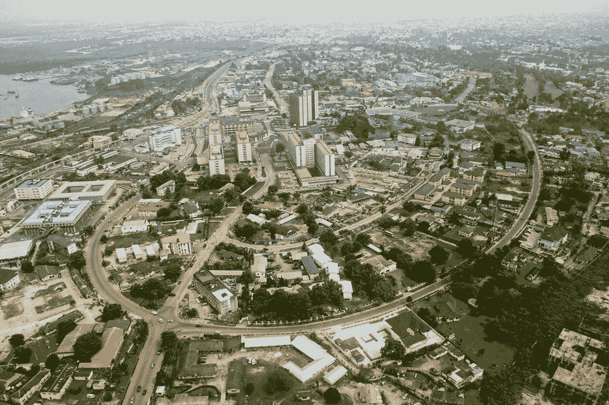

# 当特斯拉在非洲流行起来的时候

> 原文：<https://medium.com/hackernoon/when-tesla-would-become-popular-in-africa-24cfc3016008>

[http://koukuujinja.net](http://koukuujinja.net)

很快。当未来的模型配备了由透明太阳能电池板组成的屋顶时，这是由他们的能源(SolarCity)部门提供的。

## 太阳能车顶

这太有意义了。特斯拉能源公司已经取得了巨大的进步。他们已经为家庭屋顶创造了独立的太阳能瓦片，这些瓦片使用专有技术相互连接。它们也是防风雨的，可以持续使用几十年。世卫组织表示，在不久的将来，他们不会制造一个大型玻璃太阳能电池板或两个中型玻璃电池板(用于滑动屋顶概念)，这些电池板使用他们已经拥有的[技术](https://hackernoon.com/tagged/technology)连接。

这些电池板会将从太阳获得的能量储存在特斯拉汽车电池中。然后在你开车或休息时为汽车提供动力，有点像你的 MacBook。那太棒了。目前，汽车太阳能车顶所能产生的能量还不多。

今年早些时候，特斯拉的电池和太阳能电池供应商松下为丰田普锐斯开发了一种 180 瓦的太阳能车顶。这是对 2012 年 50W 版本的合理升级。肯定不是摩尔定律类型的增长，但它只会变得更快。

## 可持续能源社区

埃隆·马斯克已经迈出了第一步。2014 年，他宣布特斯拉汽车公司的所有专利都向公众开放:

> “特斯拉汽车公司的创立是为了加速可持续交通的到来。如果我们为制造引人注目的电动汽车扫清了道路，但随后却埋下知识产权的地雷来阻止他人，我们的行为就与这一目标背道而驰。
> 特斯拉不会对任何真诚希望使用我们技术的人提起专利诉讼。”——埃隆·马斯克

这些专利包括非洲市场目前需要的与电池存储和电源优化相关的技术。
以非洲为目标的公司可以利用它们，进而在这里发展可持续的能源文化。我的大多数邻居已经拥有一个带电池系统的逆变器，随着时间的推移，他们将在屋顶安装太阳能电池板。大约在那个时期，特斯拉会像老板一样接手他们开创的事业。

将来，会有超级充电站和特斯拉相遇(尼日利亚人喜欢相遇)，就像在挪威和澳大利亚一样。
它们将成为与可持续能源部落中的其他人会面的绝佳场所。社区意识很强。

Port Harcourt, Rivers State. Image by hotels.ng

这一点超级重要。我住在尼日利亚的河流州，过去因石油泄漏而闻名，最近因 T2 煤烟危机而闻名。
这是石油对非洲一小部分地区造成负面影响的两个例子。
有了特斯拉和类似的公司，我这一代非洲人的未来更加光明。

此外，无需担心 sun 的可用性。我们这里有极好的阳光覆盖，简直可以燃烧。

感谢阅读。