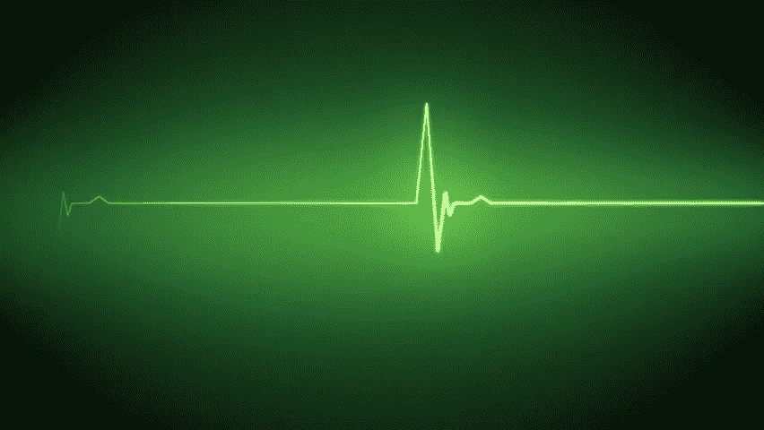
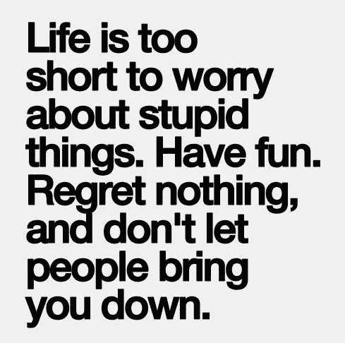

# 当这条线变平时，你知道之后会发生什么

> 原文：<https://medium.com/hackernoon/when-the-line-becomes-flat-you-know-what-happens-after-50776339fd85>

是什么让你换工作或职业？

我从 18 岁开始在 IT 和[咨询](https://hackernoon.com/tagged/consulting)领域的职业生涯。当时的首要任务是学习，被认为是最好的，并能够继续发展我的学业。

不久，在. com(.我不得不换一份新工作。我注意到我必须在短时间内学习很多新的东西。幸运的是，我有机会为许多不同的客户工作，每天都遇到新的人，并以非常高的频率学习新的技术和技巧。

事情开始发生得很快，我的表现也很好。再次被邀请换工作，我接受了。这个循环又发生了:

1.  学到了很多
2.  结识新朋友
3.  交付的结果

但在第三年，一种新的感觉出现了:需要再次换一份工作，以加速我的自我教育，了解不同思维模式的人，新的组织文化，并继续提供新的创新成果。

Imagine this is your “heart line”…

我会说，不知何故，不管是不是巧合，在我工作的第三年，我需要改变。我没有[学](https://hackernoon.com/tagged/learning)那么多，挑战完成了，例行公事成了新的标准。

当这种情况发生时，动机水平下降，你花在自我激励上的精力变成了一种负担。

当你的动力水平下降，醒来时没有良好的“训练”去工作做事情时，你有三个选择。选项包括:

1.  你变成了僵尸——你去上班，送完最少的东西，然后回家
2.  你试图在你的组织中创建一个新的具有挑战性的项目
3.  你换了一份工作

> 这个瞬间，就是我所说的“线变平的瞬间”。当这种情况发生时，是时候尽快改变了。无所事事会让你变成僵尸——你可以动，但你的心脏会停止跳动！

让我告诉你——我认识很多僵尸。

人们不喜欢他们所做的事情，因为工作环境中的有毒文化，或者有一个糟糕的经理，工资低于专业水平，…以及许多不同的原因，需要做一些事情。变成[僵尸](https://hackernoon.com/tagged/zombie)超过一定时间完全是浪费时间。

当然，有时候你不知道你的选择是不是一个更好的决定。但是你必须努力改变你的职业生活。如果你已经是僵尸了，还会有什么问题呢？

对于那些不关心或不理解员工发生了什么的公司(无论是上市公司还是私营公司)来说，这是一个巨大的问题。

很多真正知名的品牌都遭遇了僵尸。当这些僵尸开始向公司以外的人分享他们所遭受的痛苦时，这在当今社交网络中发生得非常快，品牌开始受到影响，他们迟早会赔钱，甚至更糟的是，他们的整个业务可能会下滑。

这个“提醒”是给你的:

1.  如果你是一家公司——确保你的员工快乐，因为他们不仅是你的员工，还是你的大使，是你成功的依靠
2.  如果你是一名员工——如果你的线是平的或即将变平，你必须采取行动。你宁愿在公司内部创造一个新的挑战，或者尽快离开，即使你会损失一些钱——没有什么比拥有快乐的一天更重要的了，你的工资将不会是你生命结束时想到的
3.  如果你是一名企业家——如果你的想法或公司没有让你开心，你真的必须思考你能做些什么来改变——这对于企业家来说尤其重要，因为压力水平非常高，会严重损害一个人的生活

有三个非常简单的症状可以检测出“你的线条变平了”:

1.  你在工作中不开心超过 6 个月
2.  你不会在早上醒来时有“让我们去踢一些屁股！！!"
3.  你醒来有困难

继续前进。一直都是。生命太短暂，你没有时间浪费。

当一扇门关闭时，其他的会打开。

改变就好。

