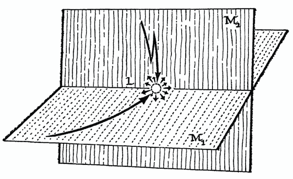
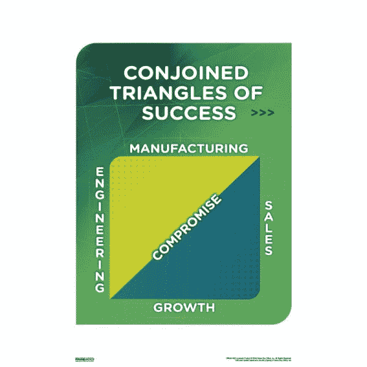

# 当硅谷的紧张局势爆发时

> 原文：<https://medium.com/hackernoon/when-the-tension-snaps-in-silicon-valley-671b0a64708e>

我听我的创业朋友说，他们不能看 HBO 的*硅谷*，因为它“太真实了。”我的感觉正好相反。虽然意识到初创公司的人(像我一样)应该因为某些行为而受到嘲笑令人不安，但我喜欢这个节目，部分原因是它帮助我了解我所处的环境。尤其是这一系列，让我记忆犹新。

我没怎么想过*为什么*我会如此开心，直到我开始读亚瑟·库斯勒 1964 年的书 [*创造的行为*](https://en.wikipedia.org/wiki/The_Act_of_Creation) 。科斯勒认为，喜剧包含“双向交流”，即两个看似不相容的参照系的连接。以下是他如何解释引起突然大笑的幽默类型:

Koestler 写道，潜在的模式，“……是在 M1 和 M2 这两个自洽但习惯性不相容的参照系中对一种情况或想法的感知。两者相交的事件 L，可以说是在两个不同的波长上同时振动。当这种不寻常的情况持续时，L 不仅仅与一个关联语境相关联，而是与两个关联语境相关联。

在我上面贴出的硅谷系列的例子中，幽默在于将晦涩的技术创新与改善世界的观念联系在一起的可笑之处；例如，“通过共识协议的 paxos 算法，让世界变得更美好”“让世界变得更美好”意味着什么是主观的，但世界级的变化意味着它是巨大的和基础性的。相比之下，许多初创企业的宣传在外人看来都是琐碎的、小众的。硅谷的嘲弄简明地揭示了许多初创公司充斥着的浮夸废话的一个元素:更高目标的拙劣构建。

科斯勒写道:

> 幽默家的创造性在于把两种习惯上不相容的基质暂时融合在一起。科学发现……可以用非常相似的术语来描述——以前认为不相容的物质的永久融合。

简而言之:“喜剧发现是一个悖论——科学发现是一个悖论……

硅谷通过讽刺揭露的许多相同的悖论，是我在这个博客和我作为产品经理的职业生涯中一直在努力解决的。在我最新的系列文章中，从*产品的基本张力开始，我提供了一些启发，让你在驾驭现实工作和市场信号的同时，保持对改变世界的愿景的承诺。虽然 TechCrunch 上的主持人在驾驭紧张局势方面失败了，但一些公司能够实现它。可以说，亚马逊通过商品化云计算“改变了世界”。“基于云的计算”对于外行人来说，表面上可能听起来很深奥，但它通过使网站的创建变得更加便宜和容易而产生了世界级的影响。*

*许多伟大的科技公司的愿景可以用硅谷的令人发笑的语法来表达:“我们将通过(插入听起来隐晦的技术进步)让世界变得更美好。”特斯拉的愿景有着类似结构的不同风味。埃隆·马斯克表示，他将通过为富人制造汽车来拯救世界。他的[总体规划](https://www.tesla.com/blog/master-plan-part-deux)实际上可能站得住脚，但表面上听起来可能是可笑的妄想。*

*一家科技初创公司改变世界的雄心的悖论只是硅谷揭示的有趣矛盾之一。另一个这样的紧张关系存在于销售和工程之间，由 Pied Piper 的创造盒子的支点来说明:*

*从 [*产品管理三角*](https://productlogic.org/2014/06/22/the-product-management-triangle/) 开始，我已经深入地写了业务、技术和客户之间围绕产品出现的紧张关系。这些紧张关系可以表现为工程和销售之间的冲突。工程通常希望从事独特、创新和巧妙的工作。销售人员希望工程团队制造出可以销售的产品。硅谷第二季滑稽地描绘了这种紧张关系的极端解决方案:简单地让销售团队完全决定工程团队构建什么。结果当然是不可行的。工程队造反了。销售团队被解雇后，钟摆会摆向另一个极端。Pied Piper 推出了一款从未在工程师以外的用户身上测试过的产品。这种产品在技术上非常出色，但普通大众却买不到。*

*我想不出更好的舞台背景来解释产品管理的必要性。产品经理的工作就是管理类似导致盒子的紧张关系。产品经理必须将看似矛盾的输入综合(或联想)成一个能在多个思维层面产生共鸣的叙述。*

*尽管我很想逃离硅谷的嘲笑，但显然我做不到。花衣魔笛手的临时首席执行官用他的“成功的连体三角”击中了我的要害。*

********

> *[黑客中午](http://bit.ly/Hackernoon)是黑客如何开始他们的下午。我们是 [@AMI](http://bit.ly/atAMIatAMI) 家庭的一员。我们现在[接受投稿](http://bit.ly/hackernoonsubmission)并乐意[讨论广告&赞助](mailto:partners@amipublications.com)机会。*
> 
> *如果你喜欢这个故事，我们推荐你阅读我们的[最新科技故事](http://bit.ly/hackernoonlatestt)和[趋势科技故事](https://hackernoon.com/trending)。直到下一次，不要把世界的现实想当然！*

**