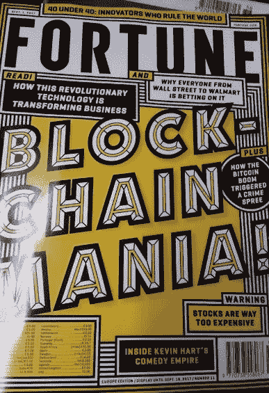
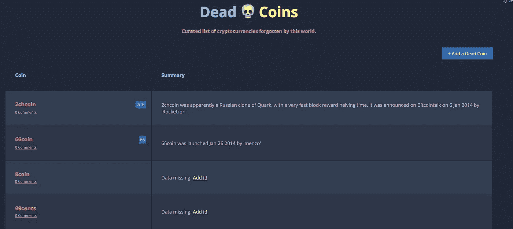
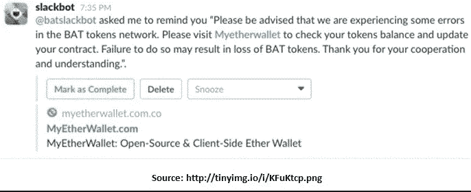
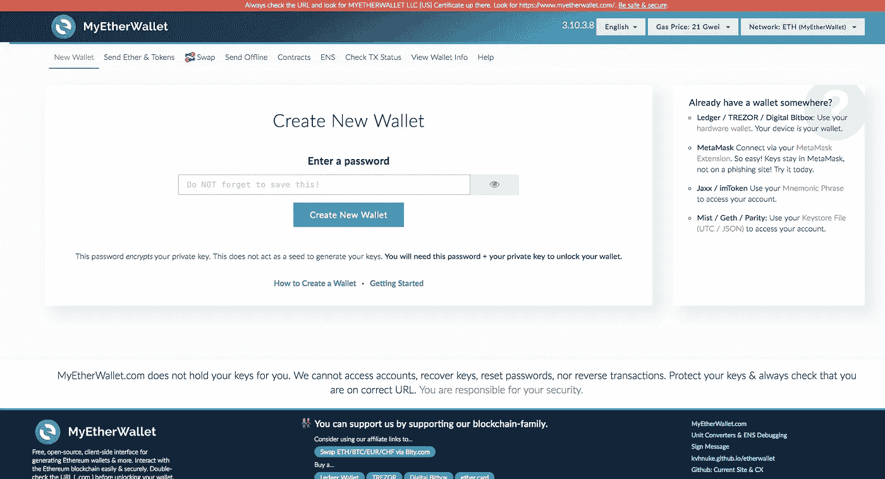
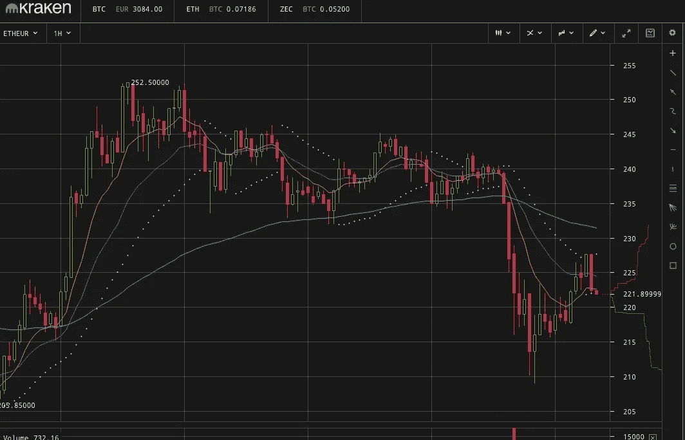
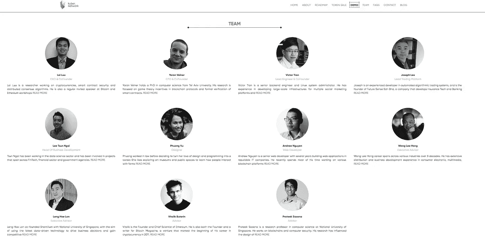

# 加密货币何时会大规模主流化？

> 原文：<https://medium.com/hackernoon/when-will-crypto-currencies-massive-mainstream-breakout-out-happen-c44f6fbc19a8>

我们承认吧。无论环境噪音有多高，加密货币都很少引起人们的兴趣(非常响亮)。我最大的猜测是，世界上大约有 1000 万到 2000 万人与他们进行了积极的互动(购买、销售、使用……)，而在区块链(1 万到 5 万开发者)中编码或构建的人要少得多。相比之下，世界上有 10 亿用户连接到互联网，使用智能手机和不同的技术，有几百万应用程序开发人员提供或接受。

> 总的来说，所有密码的市场价值加在一起都低于脸书…

比特币和加密技术已经存在多年了，尽管这项技术有着巨大的潜力，但我们至少可以说，它们远未被采用，它们对我们日常生活的有形影响毫无意义。没有区块链狂热。还没有。

Media Mania, Not Usage Mania

当然，更广泛的受众对 cryptos 感兴趣，甚至更多的人已经接触到一些信息、网上渠道的谣言或朋友的谈话，因为这种嗡嗡声是不可能逃脱的，除非你在过去的一年里住在一个上锁的冰箱里。"*嘿，那个比特币是什么东西*？"*什么是 ICO* ？，你一定听说过身边的。我相信，对科技感兴趣的人，哪怕是很少的人，都不太可能听说过比特币。比特币和密码是一回事。所以在某种程度上，你可以说比特币的概念已经成为主流，特别是当你看到星际名人在谈论它的时候。但同样，使用、采用为零，理解接近于零。这是有原因的。

# 真的很难得到

要理解仅仅数百万谈论和买卖加密货币的人的兴奋，你需要深入一个极其复杂的生态系统，了解密码学、经济学和博弈论、协议、治理、法律框架、金融交易和不断的新闻，并在一个由开发者为开发者创造的世界中发展。不完全是日常 iPhone 或 android 用户的那杯茶。在过去的几个月里，我一直在深入了解这个领域，但是，不管它有多吸引人，都很难找到。即使你这样做了，装载任何为它构建的应用程序都是乏味和痛苦的。有没有试过在交易所买一些硬币或者参加 ICO？祝你好运…他们说发送比特币应该像发送电子邮件一样简单。它不是。

而且区块链仍然有潜力成为 ***驱动应用程序的主要引擎，更广泛地说，驱动经济中任何类型的交易*** (毫不逊色)，甚至可能驱动我们的社会，使其具有更加可靠、安全、快速和廉价的基础。

> 在我看来，区块链可能是人类最大的工业革命，因为它将实现的升级将在许多层面上改变生活(不仅仅是相互支付)

那么，为什么我们在兴奋(**泡沫**有些人会称之为兴奋)和实际采用/理解之间会有这样的差距呢？发生这种情况缺少什么？如果这场革命是如此巨大，为什么没有人真正理解它，甚至是大人物？(是的，我在看着你[杰米·戴蒙](/breathe-publication/dear-jamie-dimon-a1ee72af1ba)

那么，区块链的生态系统 ***真的*** 向主流观众爆发了吗？

# 更快、更高效的协议

现在让区块链工作太贵了，而且肯定不够快。一个比特币/以太块在当前交易级别下需要 10 分钟才能被挖掘出来(每秒 3/6 个比特币/以太坊交易)。**如果我们希望每天能够处理数十亿或数万亿的数据事务，那么挖掘一个数据块应该是几秒或几分之一秒的事情。**

这在目前是不可能的。[首先是因为这些协议最初的设计并不支持这种规模](/@ameerrosic/blockchain-scaling-problem-and-ico-doom-bf76797c97b9)(例如，每台计算机都必须在“内存中”保存每一个链交易)，这解释了为什么它们目前正在被分叉(Segwit2，stage Proof，…)，但涉及的节点数量不够多(甚至可能随着中国的禁令而减少)。

**什么能解决这个问题？**更好的代码和耐心和时间。

目前，维持区块链的电力和计算能力成本无法适应更大的规模。我怀疑电力成本是否会下降，即使是太阳能，所以我们依赖于更便宜/更强大的硬件材料，这是摩尔定律迄今为止帮助实现的，但也依赖于更好的协议。

我相信这是目前该行业的最高优先级。当我问他这方面的问题时，Vitalik Butterrin [强调了这一点](/@ourielohayon/meeting-with-vitalik-buterin-q-a-on-scale-personal-spending-and-country-coins-e5dfcdd245bf)

# **更好的开发工具和脚本框架**

如果开发人员不大量采用特定的计算框架，就不会有大量的消费者或企业采用。如果你有任何疑问，看看 App Store 如何极大地促进了 iPhone 的采用。苹果在 iOS 开发者堆栈、文档和工具方面投入了大量资金，以使这一切成为可能。更多的开发者，意味着更多的应用，从而创造更多的应用。我邀请你阅读这篇精彩的文章，它会比我更好地解释这个问题。

> 首先，脚本语言太有限了。脚本语言是一种编程语言，您可以在其中编写代码来执行一些操作。今天在网络上广泛使用的脚本语言的一个例子是 JavaScript。

区块链开发工具需要变得更好，以便开发人员可以方便地创建更好的应用程序。但是在这里，我们没有一个“苹果”来管这个。我们需要开发人员集中精力共同努力，使之成为可能。

# **多一些法规，多一些引导，少一些骗局**

我喜欢这里的空间，但我开始对过度的空间感到严重的[烦恼](https://hackernoon.com/icos-10-things-that-cool-me-off-f79a26b0cffa)。太多的硬币，很快就会成为 [**死硬币**](http://deadcoins.com/) ，太多的人没有得到它，但想“翻转”，赚快钱，没有正确的意图，太多的骗子。这就是在一个新的蓬勃发展的行业中发生的事情，在这个行业中，兴奋超越了现实。当然，你不可能一边拥有脸书和谷歌，一边却没有看到广告技术领域曙光的诈骗公司，或者 Instagram 和 Snap 等伟大的应用程序，而没有诈骗应用程序开发者在它们的同行中嵌入跟踪恶意软件，或者网飞和 Spotify，而没有海盗湾和 Napster。你不能责怪协议 TCP/IP 或 Xcode 启用了它。

**这是任何具有高潜力的新兴转型产业不可避免的弊端**。但事情必须改变，监管必须清除目前占据主导地位的过剩(是的，占据主导地位)。如果没有明确的规则来区分广告和一篇社论内容，或者为一个假冒产品做广告是可以的，那么广告业将会一片混乱。我们需要更清晰的方法来保证项目的管理规则在区块链公司中得到很好的遵守，ICO 资金被用于承诺的用途，路线图被实际遵守，活动被报告给投资者。

另一方面，我们还需要更清楚地了解法律和税务部门如何对代币进行资格认证和授权。我们需要税务部门对如何鉴定代币(证券与否)有更明确的立场。)，硬币上的利润(资本利得与否？).

我们不能像应用程序商店中的开发者一样，任由灰色的变化规则摆布，这些规则可能会在几天内扼杀一个企业。我们需要一个稳定的商业框架，这样企业家才能安心地做他们想做的事情。

> 事实上，我确实相信风险投资在为 ICO 世界带来更多指导方面发挥着重要作用。

[一旦他们通过了是否可以/应该进入这个领域的门槛(因为他们会以某种方式进入)，我相信他们会带来几十年的经验，指导企业家建立一个真正的公司，而不仅仅是一个协议。](/@etiennebr/so-you-want-to-start-or-invest-in-an-ico-blockchain-crypto-fund-2209460bd86)

# **安全性明显更好**

没有一个星期没有黑客和安全盗窃。不是因为区块链不安全，而是因为人们、[创始人或公司没有很好地建立他们的安全堆栈。他们没有很好地建立它，因为，让我们承认，我们所知道的世界充满了漏洞。安卓可以被破解，移动运营商可以被忽悠。](https://www.wired.com/story/enigma-ico-ethereum-heist/)[看看 Slack 吧，](https://motherboard.vice.com/en_us/article/zmvg58/hacker-allegedly-steals-dollar74-million-in-ethereum-with-incredibly-simple-trick)它是开发者用来管理社区的主要工具之一。它每天都被找到出路的假机器人和骗局轰炸。

A fake bot in slack pointing to a scam URL

我们还需要比 2FA(双因素认证)更好的东西。[撇开安全漏洞不谈](https://www.wired.com/2016/06/hey-stop-using-texts-two-factor-authentication/)，我只是不认为自己会一天使用 20 次认证器和密码管理器应用程序。只是有太多的摩擦。我相信 FaceID 是未来的暗示，一个基于我们每个人独特之处的数字足迹。我还认为**从安全角度来看，浏览器应该更好地支持区块链生态系统，突出或阻止安全威胁，就像它们对 javascripts 已经做的那样**。他们可以突出一个网站、一个链接甚至一个区块链钱包地址的声誉。浏览器应该成为我们未来需要的第三方受托人。

# 一个新词汇

如果我们想让任何人都能够理解并采用这些技术，我们，密码极客，需要以一种更容易理解的方式交谈。我们必须禁止并替换那些令人生畏的抽象词汇，比如 ***、分类账、数据库、协议、dapps、分散的*** ，并找到比 ***更简单的新术语:助记短语、钥匙串、私人/公共钥匙、白皮书、黄纸、煤气、GWE、区块链、链锁探索者、txn、***

> 如果搜索框被称为网络查询工具，网络就不会发展。

一个新的术语和一套惯例将会出现，可能是在一些由社区构建的杀手级应用程序的增长下(就像我们“打电话”某人而不是说“voip 我”)，或者是因为一些伟大的头脑将会创造一个将被大量采用的新术语…

但是我们非常需要这个*。*

# ***显著更好的 UX/UIs***

*比特币是可编程货币，区块链是开发者为开发者创造的世界。你会意识到，只要你使用或触摸任何一种加密应用程序。以任何人使用区块链的主要工具之一为例。密码钱包。关注细节、入职、用户流程、可读性和易用性绝对不是重点。这对数百万渴望快速加入的人来说并不是障碍，但对数百万使用简单明了的应用程序的人来说却是一种威胁，这要归功于苹果和谷歌。*

**

*one of the most popular Ether wallet out there. good luck.*

***这不仅仅是设计。这也与体验有关(它是如何工作的，而不是看起来如何)。**如今，人们觉得进入一个网页的唯一方法不是输入网址或搜索谷歌，而是输入它的 IP 地址。*

*这个行业正在走向成熟，我很有信心，产品和设计人才将有助于推动这一进程。*

# ***教育与学校***

*如果我们在学校学习英语和数学，为什么不学习什么将是我们日常生活中最重要的话题。孩子们实际上会比任何人都更快地获得密码，因为他们首先是数字化的，并随着游戏文化的发展而成长，而游戏文化是任何密码经济学的核心。学校应该给每个孩子提供一个钱包，几个硬币，并让他们做作业去“玩”。*

**

*但是，如果我们想建设超级国家，教育系统必须拥抱革命，教授革命的理念、限制、规则和原则。它不能被遗忘在野外。孩子们也需要在早期接受关于**个人数字安全**的教育，我怀疑这将是未来几年我们必须处理的最重要的个人问题之一。*

# ***亚马逊，苹果***

*除非主流零售商不接受密码，否则无论如何都不会有规模。我要做一个大胆的预测。5 年内，亚马逊或苹果或两者都将允许任何人在他们的网站上用加密货币购物(不确定是哪一种，可能是比特币，也可能不是)。那么每个人都会有一个内置的加密钱包。包括孩子。*

*其他零售商可能会引领潮流，但没有哪家会有亚马逊和苹果的影响力。他们的经济速度是首屈一指的。*

**

*wouldn’t it be cool?*

*已经有迹象表明主流浏览器将能够支持加密货币交易*

****9 月 23 日更新*** :一些[传言](https://squawker.org/technology/breaking-amazon-will-accept-bitcoin-by-october/)亚马逊实际上正在朝那个方向发展*

# ***加密稳定性***

*让我们清楚地说:cryptos 的大部分增长是由纯粹的盲目投机和兴奋驱动的，而不是由明确的指标和实际创造的价值驱动的。*

**

*Ether in the past 24h…not really stable..*

*我们还没有达到协议或硬币的核心价值与其内在使用价值直接挂钩的阶段。这解释了人们每天都能观察到的疯狂波动。大规模采用不会解决事物的这种不稳定性，但会使它变得更可预测。菲亚特，石油和黄金也不稳定，但它们是可以预期和理解的。没有加密。FUD，FOMO，有时恐惧，欺诈，[不负责任和不知情的公开声明](/breathe-publication/dear-jamie-dimon-a1ee72af1ba)和梦想是驱动市场的因素。*

*我们将达到这样一个阶段，协议的规模，即使还不是主流，也将大到足以创造内在的经济价值，并将给予更多的信心，即它们的价值和挥发性可以得到遏制。也许各国政府，而不是国内政府，会在这个意义上提供帮助。*

# ***经理越多，团队越多样化***

*密码世界是开发者和男性的世界。如果你有任何疑问，花时间在 reddit 或任何行业活动。不过，最重要的是，这是一场全球性的运动，有一种强烈的社区意识和许多次级社区，但存在着严重的不平衡。它由开发者和男性主导。一方面，这是必要的，因为我们正在建立行业的基础层，但这不足以让它进入下一步:建立业务，获得各种各样的想法和应用程序。这个行业需要商业头脑、营销头脑、人力资源专家、流程专家、首席运营官、男人和女人来使这个行业成为一个伟大的行业。今天，当你浏览这个领域中任何一家公司的团队部分时，很难找到这些简介。*

**

*Kyber (one of the best ICOs lately) very male-ish team*

# *银行呢？*

*几周前，我试着用 Transferwise 和 N26 连接一个加密交换。经过几次痛苦的尝试后，我发现 Transferwise 会阻止任何类型的加密服务。没有理由会发生这种情况，特别是对于完全受监管和合规的服务。在一个银行不参与游戏的世界里，加密货币不可能有未来。但我也预计，大多数银行最终将把区块链作为其陈旧基础设施的支柱和替代品。在某种程度上，区块链可能会被主流受众使用，而他们甚至不会意识到这一点(银行对银行协议，如 Ripple)*

# *最后一句话:耐心*

*我非常看好未来会是这样。我们将经历一波又一波的大起大落，但最终我们会到达那里。就我记忆所及，网络的早期是这样，博客的早期是这样，移动应用的早期是这样。*

*这就是早期的样子。不要因为一个行业不是从第一天就开始微调的，就不看好它。但是我们也不要迷失自己。这个行业不可能超越纯粹的投机模式而发展壮大。上述许多措施应该是可行的，而且现在就可以实施，但结果和回报需要很长时间。*

*在事情改变之前需要耐心:我估计至少需要 3 到 5 年。但一旦我们超过这个时间框架，我相信区块链将是自硅发现以来科技领域发生的最好的事情。*

# *法律效力如何？【更新】*

*我刚刚意识到最后也是最关键的一点。如果我们没有一个新的法律框架来为区块链提供的证据元素提供法律效力，那么区块链作为一个行业是无法被采纳的。为了理解其重要性，让我们与数字签名做一个比较。电子签署文件的技术在法律认为其合法之前已经存在了很多年。只有他们行业大量采用电子签名，律师不再害怕使用和推荐它，像 docusisgn 这样的服务真的增长了。区块链也一样。我们怎么能整天声称区块链将托管我们所有的数据或合同我们的身份，这将更好地证明数据的有效性和真实性，如果法律不这样验证它。如果法律不理解和接受，证明的技术有效性又有什么意义。我们绝对需要这一点，但我担心这将需要最长的时间。在那之前，区块链的生态系统仍将是一个副业*