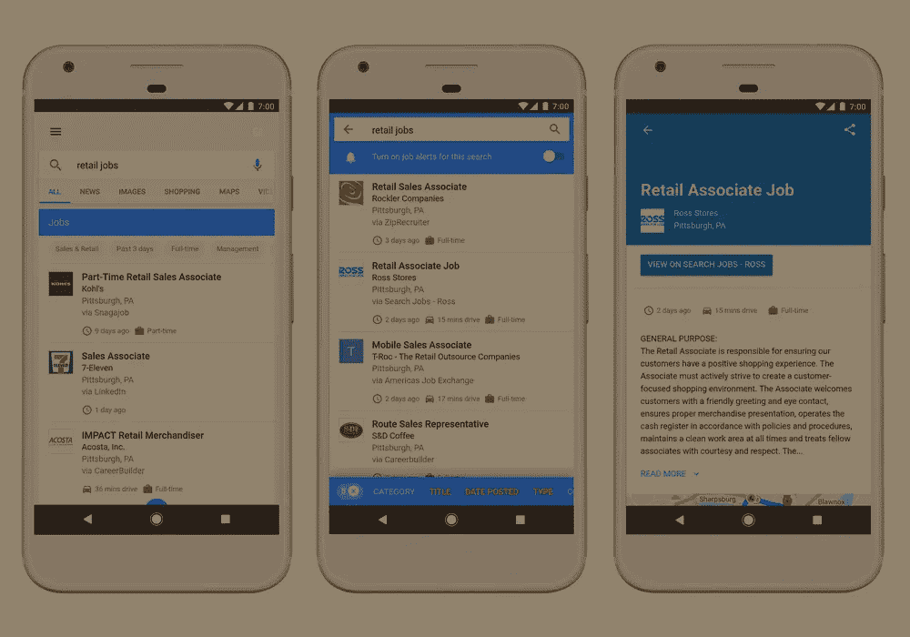
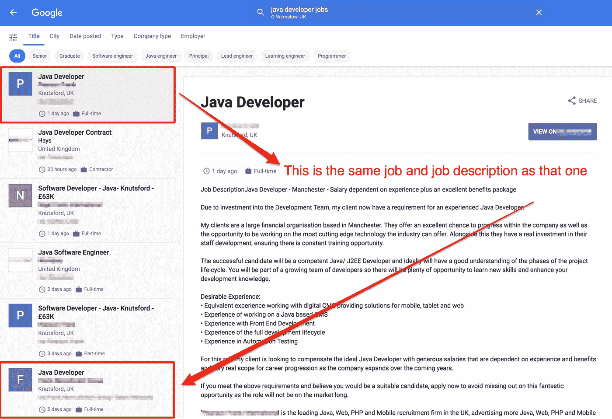

# Google For Jobs 什么时候才能理解雇主、招聘机构和工作委员会之间的区别？

> 原文：<https://medium.com/hackernoon/when-will-google-for-jobs-understand-the-difference-between-an-employer-recruitment-agency-job-51feb80b9e13>

[Google](https://hackernoon.com/tagged/google) For Jobs 于 2017 年 6 月推出，它只需要[三个要素](https://developers.google.com/search/docs/data-types/job-postings)就能从你的网站上找到工作列表，放到它的用户界面上

*   唯一页面上的职务列表。
*   一个至少每天更新的网站地图。
*   实现[招聘](http://schema.org/JobPosting)模式，你可以在[谷歌的结构化数据测试工具](https://search.google.com/structured-data/testing-tool/u/0/)中验证。

就是这样！

然后，谷歌的算法中的 100 个甚至可能 1000 个元素应该能够理解你页面的上下文，并向相关求职者展示你的工作清单，确保体验完美无瑕。

[对于在现场实施了上述加价的客户，Venn 已经看到工作细节](https://www.venndigital.co.uk/blog/blog-the-initial-impact-of-google-for-jobs--92313/)[信息](https://hackernoon.com/tagged/information)的印象大幅提升。但谷歌需要继续开发该产品，因为求职者的体验远非完美。

# 重复的工作列表

如果网站不遵守搜索引擎[网站管理员指南](https://support.google.com/webmasters/answer/35769?hl=en)的话，在谷歌的常规搜索引擎中被发现会有很大的问题，网站管理员指南是一份旨在增强搜索者体验的文件。例如，你不太可能在谷歌搜索结果的第一页看到两个完全相同的内容。但这条规则似乎没有传到 GFJ。

在 GFJ 快速搜索“java 开发人员职位”,在前六个结果中会出现重复的职位描述，这份工作似乎是在同一家公司。一份招聘清单由一家招聘机构填写，第二份也由同一家机构填写，只是他们将这份工作描述发布到了一个知名的求职网站上，而 GFJ 正在将这份工作描述添加到它的 feed 中。

**提示:**如果你是一家现场使用 GFJ 的招聘机构或内部雇主，那么请确保你也通过知名的求职网站来宣传该职位，因为你很有可能能够在界面中占据更大的比例。

如果你是求职者…那么你已经两次申请了同一个职位！真是浪费时间。

# 空白列表

谷歌创建新平台的原因之一是将“更有动力的申请人”推向雇主和招聘人员。但是下面的列表有多大的激励作用呢？

当求职者看到空白的职位描述时，他们寻找雇主的动力会非常低。

GFJ 有明确的指导方针，其中之一是“[不要在列表页面(显示工作列表的页面)](https://developers.google.com/search/docs/data-types/job-postings)”上面的列表违反了这一点，突出了这样一个事实，即在其初期，GFJ 算法远不如常规搜索算法那样严格。

用户不希望被发送到职位列表页面，他们希望转到职位详细信息页面，在那里他们可以快速方便地直接申请该角色。

这就引出了我的最后一点。

# 不准确的通勤时间

大多数人的工作地点离他们的家很近。GFJ 的一个主要好处是，它能够理解位置数据并使用谷歌地图，增强了求职者了解其潜在新工作地点的地理信息的能力。

然而，为了有效地工作，GFJ 依赖于结构化数据的实现。但是结构化数据应该只适用于地图，如果它实际上显示了工作的位置。

以下工作列表是否来自一家雇佣 Java 开发人员的酒吧？我想那是可能的。

还是工作列表来自不同的招聘机构，使用同一个大的工作板，实现了指向其本地办公室的地址模式？

这有点误导，不是吗？

通勤时间可能是一个人申请和得到一份工作之间的差异，或者是一个人申请一份工作，发现它不在他们认为的地方，认为他们浪费了时间，并决定在未来不再使用该招聘机构。

# 为了让 GFJ 充分发挥潜力，谷歌需要了解求职板、招聘机构和内部雇主之间的区别。

**招聘机构**不太可能透露一个职位的位置，因为担心另一个招聘人员会过来填补这个职位。这意味着，作为一项规则，由招聘机构填充的角色不应该包括地图数据，因为它很可能是不准确的。

**GFJ** 需要工作板，因为他们有大量的工作以结构化的方式列出，使搜索引擎能够快速理解和抓取新的职位空缺来填充提要。

然而**，求职板**也依赖招聘机构在求职板网站上发布职位。这意味着相同的信息将从最初的招聘机构描述转移到求职公告板网站，造成重复。这也意味着工作公告板通常会有不准确的位置数据。

实际**雇主**是唯一可能准确实施 jobLocation 模式的一方，因为不存在来自外部公司填补该角色的威胁。从居住在离办公室可互换距离的员工中选择职位也符合雇主的利益，那么这是唯一应该保证位置数据将被拉到他们的列表中的一方吗？

GFJ 非常接近成为求职者的开创性工具，但要做到这一点，谷歌需要像对待其主要搜索算法一样严格对待其工作算法。如果不是，那么申请人从谷歌工具集中获得的体验会比他们习惯的少，他们只会回到他们习惯的地方，也就是谷歌搜索。

*原载于 2017 年 10 月 20 日*[*www.venndigital.co.uk*](https://www.venndigital.co.uk/blog/when-will-google-for-jobs-understand-the-difference-between-an-employer-recruitment-agency-and-job-board-105204/)*。*