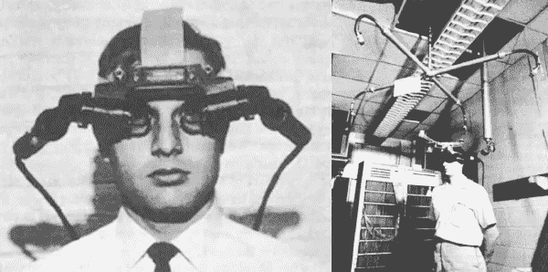
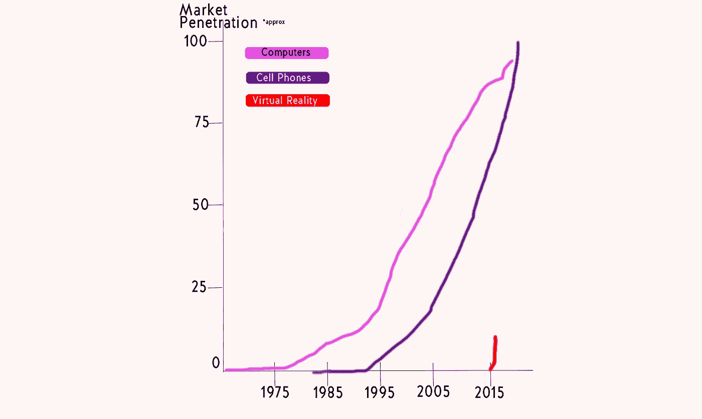

# VR 有前途吗？

> 原文：<https://medium.com/hackernoon/when-will-the-future-42c1419533bb>

去年，我们似乎看到了关于虚拟现实未来的无尽文章。麻省理工学院发明了你可以触摸的视频，眼球追踪在今年年初发布，有人启动了全方位跑步机，本应迎来一个 Ready Player One 风格的娱乐未来。

但是今天，一个人仍然不能浏览他们孩子生日聚会的照片。在北美，没有玩家可以将自己绑在完全沉浸式跑步机上的视频游戏(或者如果有，它们肯定还不为人所知)。如果你伸手触摸视频，你会得到一个空空如也的拳头。批评家们开始问，VR 的未来怎么了？

互联网上充斥着哀叹虚拟现实的文章，哭喊着这一媒介的末日即将来临。他们列举了低销售数字和承诺技术的缓慢推出(如微软的天蝎座)。虽然与其他技术相比，虚拟现实可能感觉进展缓慢，但我们必须记住，这是我们长期以来第一次推出真正的新媒体。我们能休息一下吗？

第一台个人电脑于 1975 年问世。(这忽略了许多年来计算机只有实验室的规模，或者只有昂贵的大公司才有的权限。)这是一个未组装的套件，在构建时，只能显示 256 个离散值或字符代码。这意味着没有图形——只有数字、字母和基本符号。12 年后，丹·古特曼写了一篇文章，哀叹预言中的革命“一团糟”，只有 15%的美国家庭拥有电脑。这是个人电脑的终结吗？

好吧，显然不是。但是在 T2，又过了十年，我们才意识到电脑现在是不可或缺的，75%的美国人至少拥有一台电脑。

但是等等，你说！手机呢？手机从我们汽车上的巨大砖块发展到今天我们所知道和喜爱的微型电脑，并没有花 20 年的时间。对吗？

太，太不对了。

第一部手机于 1979 年在日本上市，1983 年在美国上市。它们的平均通话时间为半小时，充电时间约为 10 小时——但尽管如此，还是有很多人在等待购买，并且售出了数千台。(许多热切的早期用户。听起来熟悉吗？)又过了 9 年，第一款智能手机才发布，而且不是 iPhone，再过 15 年才出来。这是 IBM 在 1992 年制造的西蒙个人通讯器[。大多数人不会认出它，但从它到智能手机的轨迹很容易看到。](http://www.businessinsider.com/worlds-first-smartphone-simon-launched-before-iphone-2015-6)

所以，下次你读到一篇关于虚拟现实死亡的文章时，提醒批评者，从商用个人电脑到市场渗透花了 22 年时间，智能手机花了 24 年时间(T2)。智能手机是在并行创建的计算机基础上构建的！虚拟现实完全靠自己起步，并等待计算机变得足够好来真正震撼它。

我们只是处于虚拟现实发展轨迹的起点——我们迫不及待地想看到它在哪里着陆。

*由雷恩汉德曼为*[*www.hammerandtusk.com*](http://www.hammerandtusk.com/blog/article/when-will-the-future)*所写。*

> [黑客中午](http://bit.ly/Hackernoon)是黑客如何开始他们的下午。我们是 AMI 家庭的一员。我们现在[接受投稿](http://bit.ly/hackernoonsubmission)并乐意[讨论广告&赞助](mailto:partners@amipublications.com)机会。
> 
> 如果你喜欢这个故事，我们推荐你阅读我们的[最新科技故事](http://bit.ly/hackernoonlatestt)和[趋势科技故事](https://hackernoon.com/trending)。直到下一次，不要把世界的现实想当然！

