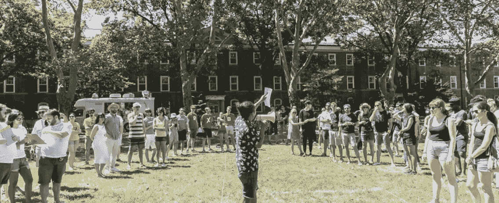
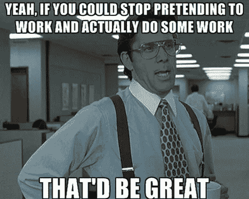
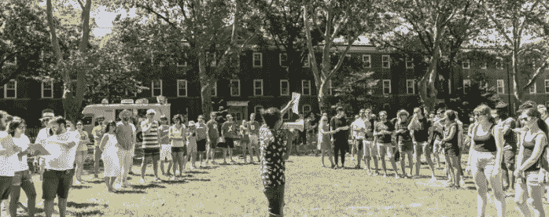

# 当工作是娱乐时，每天都是星期天。

> 原文：<https://medium.com/hackernoon/when-work-feels-like-play-everyday-is-sunday-135b66f8964d>

> 变化再也不会如此缓慢。而 *Hyperloop One* 已经是 [**内测**](https://www.youtube.com/watch?v=_jAPZRbF8tI) 。曾经堆满整个地板的计算机处理器现在可以轻松地躺在你的 [**耳朵里**](https://hereplus.me/) 。随着工作的本质和实践的彻底转变，工作世界正在被颠覆。

已经有四分之一个世纪历史的网络，给了许多在网络世界中的人穿着内裤工作的特殊自由。更重要的是，它把工作变成了一种快乐的活动。我们都应该可以穿着内裤工作，记得吗？已经有四分之一个世纪历史的网络，给了网络世界中的许多人这种特殊的自由。对另外一些人来说，它有助于把工作变成一件快乐的事情。

# 那么，这些热爱自己工作的幸运儿是谁呢？它们到底是如何运作的？我已经开始了采访数百人寻找答案的美妙旅程。

以下是我发现的三个主题，它们是那些不把工作视为工作的人所共有的。

# **生产力超过姿态**

师师**何官职已死。生产总是胜过存在，只是在过去我们需要在工作中才能工作*。对于许多行业来说，这种情况已经不复存在了。露面和无用的姿态——即使只是为了给人留下富有成效的印象——对个人或更广泛的组织没有什么好处。***

**

*谈到社交媒体宠儿，[**谢芷蕙·法姆**](https://twitter.com/cammipham) ，这是她所在部落中越来越流行的观点:*

> *“以前有办公室很酷，现在没有办公室也很酷。*

*事实上，她最好的工作是在她所知道的最适合她正在做的特定类型工作的环境中完成的(思考、写作、张贴、喜欢、闲聊，你懂的)。她在飞行中和适合她特定心情的环境中工作得最好。*

**

*当昔日的实体办公室奋起直追的时候，进步的组织已经通过停止他们陈旧的方式和拆除他们陈旧的围墙来吸引顶级人才。取而代之的是，它们提供了一个以功能为前提的滋养环境。*

> *这种被称为***的新精英正在引领一个工作世界，在那里，重要的不是你在哪里 [**，而是你在做什么**](https://creator.wework.com/how-to-guides/will-future-work-work/) 。****

# ******坚持不懈地专注做好一件事******

********

****我是终身学习的大力支持者。尝试新事物(即使你仍然很糟糕)是好奇心和成长的源泉。令人震惊的是，有多少人继续在他们并不擅长的工作中从事特定的活动(无论是出于选择还是出于需要)。事实上，在公共部门，这种情况被放大了，因为无能似乎无处不在。****

> ****学会花最多的时间做你擅长的事情是优秀和卓越的区别。****

****就拿 [**杰夫·瓦西卢克**](https://twitter.com/jeff_wasiluk) 来说。他帮助社交企业在网络上讲述强有力的故事。杰夫带着热情和真实性这样做。他大部分时间都在做他擅长的事情(思考、写作、故事板和与他人合作讲故事)。他每天都狂热地努力改进自己的手艺——不是为了保持相关性，而是因为他热爱自己的工作。****

****简单的方法就是敏锐地意识到你在工作中擅长什么，并尽可能多地花时间去做这件事。假设你也非常喜欢做这种工作，并且拥有*知道如何*让自己周围都是赞美你独特才能的高绩效者(也就是说，他们在你擅长的领域很棒)。****

****揭穿**[**的神话**](http://lifehacker.com/5939374/a-better-way-to-practice) 深思熟虑的练习** 意味着花更多的优质时间去做你擅长的事情——这样你就成为了你给定领域的绝对忍者。****

# ****周日工作是最好的****

********

****F 漫长的酒吧午餐或大型比赛——真的绝对是任何需要最少脑力而且肯定不会工作的事情。****

****然而，这个神圣的日子实际上是我一直与之交谈的那类人做一些他们最深层的工作的时候；制定战略，赶上阅读，写作，似乎提前一周。****

****对于**的文化专家卡伊里·姆德诺来说，周日为他提供了玩耍和工作的终极空间(又名*)。把有创造力的人聚集在一个有趣和吸引人的环境中是他应该做的事情。这听起来可能很梦幻，但对哈里来说，每天都是星期天。但是不要被愚弄了，在外人看来毫不费力的事情实际上需要数月的后勤、计划、营销等等。*******

> *******这种现代形式的令人愉悦的产品通常只保留给创意、体育和娱乐领域。随着它像热蛋糕一样迅速蔓延到其他行业，尝到甜头的人可能再也不会回来了。*******

********感谢敲打* **💚** *下面撒满了爱。********

******************************************

> *******[黑客中午](http://bit.ly/Hackernoon)是黑客如何开始他们的下午。我们是阿妹家庭的一员。我们现在[接受投稿](http://bit.ly/hackernoonsubmission)并乐意[讨论广告&赞助](mailto:partners@amipublications.com)的机会。*******
> 
> *******如果你喜欢这个故事，我们推荐你阅读我们的[最新科技故事](http://bit.ly/hackernoonlatestt)和[趋势科技故事](https://hackernoon.com/trending)。直到下一次，不要把世界的现实想当然！*******

**************