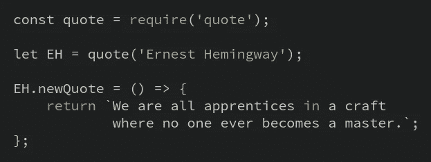

# 当你发现别人的代码很棒的时候

> 原文：<https://medium.com/hackernoon/when-you-discover-other-peoples-code-is-awesome-6732776a6dc3>

> HackAway。世界在等待你的顿悟。

所以，你走在 **Github** 镇的 **trending** 车道上，你偶然发现了这个繁星点点的顶层公寓，男孩从他们的角度看到了美丽的风景。

我的意思是，你没有办法绝对确定从阳台上看会是什么样子，但你可以想象在那个露台游泳池里潜水，那里目前居住着大约 900 人，喝着酒，享受着他们一生的时光。

你所能希望的就是能够

**1。**成为它的一部分，并且

**2。把某样东西做得如此之好，以至于其他人都想成为它的一部分。**

然而，不知何故，二十年过去了，我们还是在这里。

> 这是对那些相信自己能够揭开代码库内部秘密的勇敢者的大声呼喊。

这是对所有在 GitHub 上偶然发现这些库的人的一个大喊，也是对很酷的新 JS 项目的一个欢呼。

这是对那些**勇敢的人**的大喊，他们相信他们可以揭开代码库里面的秘密，他们点击那个`package.json`，希望他们能得到它，但不知何故最终在他们的笔记本电脑上敲打他们的头，因为到底什么是 **WEBPACK** 和为什么**吞下**和什么甚至**反应** …

对于那些在他们喜欢的每个存储库中寻找`good-first-bug`标签的人来说，这是一个大喊，因为他们想要贡献并成为*事物/工具/闪亮的 JS* 的一部分——他们真正关心的东西。

你并不孤单。著名作家欧内斯特·海明威的诗也许是你下次坠入深渊时想读的，他曾经说过:

Image made by [code-snipper](https://codeprose.me/code-snipper/)

> 我们都是这门手艺的学徒，没有人会成为大师。

我认为这是我在编程世界的启蒙之旅中最大的灵感来源。

事实是，我们都在学习。(对！那边的人也有反应。大概也是。但是谁在乎呢？)

你所要做的就是继续跌跌撞撞，继续在那个池子里潜水，希望有一天会有意义，相信我，如果你给它时间，那一天会比你想象的更快到来。

> HackAway。世界在等待你的顿悟。

> [黑客中午](http://bit.ly/Hackernoon)是黑客如何开始他们的下午。我们是 [@AMI](http://bit.ly/atAMIatAMI) 家庭的一员。我们现在[接受投稿](http://bit.ly/hackernoonsubmission)，并乐意[讨论广告&赞助](mailto:partners@amipublications.com)机会。
> 
> 如果你喜欢这个故事，我们推荐你阅读我们的[最新科技故事](http://bit.ly/hackernoonlatestt)和[趋势科技故事](https://hackernoon.com/trending)。直到下一次，不要把世界的现实想当然！

