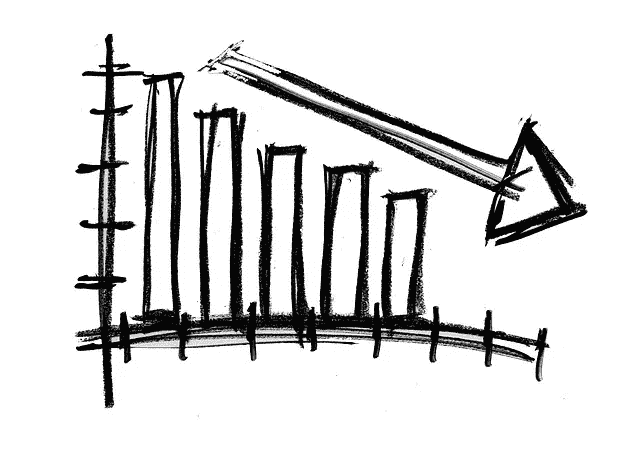

# 当你的密码在 24 小时内损失了 40k 美元，就这样做:

> 原文：<https://medium.com/hackernoon/when-your-crypto-loses-10k-in-36-hours-do-this-689157d9d64c>

Image courtesy of Pixabay

强制性免责声明:我不是财务顾问，在没有与合格的专业人士交谈之前，不应采纳任何建议。此外，不要投资超过你愿意失去的，先做自己的研究。

## 多买。就这么简单。

许多加密投资者的本能反应是卖出，卖出，卖出。为了避免进一步的损失，投机者敦促每个人都加入他们弃船，但我认为现在是双倍下注的好时机。为什么？因为如果你一直投资于由有能力的人经营的可靠公司，市场先生最终会成倍地回报你的耐心。

我刚刚读完一本我一直以来最喜欢的关于沃伦·巴菲特的书，书名是 [*巴菲特:一个美国资本家的形成*](http://amzn.to/2suKrq0) ，我认为密码界可以从中吸取急需的教训。

作者通过巴菲特生命中的每一个主要章节，记录了他所有的开拓性方法，并引出了一个有趣的主题。奥马哈先知遵循一个简单却非常成功的哲学:永远不要赔钱。他是怎么做到的？通过投资长期价值。

如果你是加密货币的新手(即使你是经验丰富的老手)，投机可能很有诱惑力。代币以极低的价格开始其生命周期，并在短短几个月内看到令人难以置信的收益。那你为什么不尽可能多的加入呢？

因为情绪。巴菲特教给我的另一个教训是，情感在价值投资中没有一席之地。不幸的是，当所有令牌下降 20%以上时，如果你阅读加密社区的标题，你将得到的只是情绪。寻找“下一个大新闻”的出版物会诱使你认为你要破产了，你应该立即卖出。但是如果你已经投资了价值，你不应该恐慌。

不要关注媒体。不要注意公式和图形结构。最重要的是，不要在意情绪。相反，从巴菲特身上吸取教训:

From “Buffett: The Making of an American Capitalist” by Roger Lowenstein. [You can get his book here](http://amzn.to/2suKrq0).

对于加密货币价值投资者来说，这些指针可以这样想:

*   不要听巨魔的。信任在公司中表现出色的团队。市场会回报他们的辛勤劳动。
*   投资你所知道的。如果不能理解，要么深潜，要么退一步。
*   寻找真正关心他们的社区并希望每个人都过得更好的开发团队和首席执行官。
*   学习上要详细！阅读白皮书，加入团队懈怠或不和，并提出问题。不要相信别人说的某个令牌比另一个更好。寻找“七英尺”
*   如果一个令牌不能立即吸引人，忽略它。FOMO 只会导致失眠。挑几个结实的代币，全力以赴。

当我的投资组合在 24 小时内下跌(不是损失，因为我没有卖出)4 万美元时，我增加了持股。在某些情况下，我实际上把我的持有量增加了一倍。然后，我打开我团队的 Slack 频道，鼓励每个人也多买一些。我相信我所参与的社区正在做着不可思议的工作。我也相信，市场会对他们(以及我)的辛勤工作给予回报。

你能对你持有的代币说同样的话吗？如果没有，也许是时候修改你的投资策略了。不知道从哪里开始？[看看这个我为新来者制作的工具箱](/blockchannel/the-crypto-noobs-toolbox-b405fb0916b6)。

我很想听听你是如何帮助建立你所信仰的社区的。给我留言告诉我吧！

*如果你还没有投资比特币，而你想加入这场运动，最简单的方法就是从比特币基地开始。* ***当您****[***使用此链接***](https://www.coinbase.com/join/589a032d2c1f1600ed8731e2)*——这是我的推荐链接——并立即开始！**

**如果你想开始使用交易所而不是比特币基地，* [***币安是一个很好的起点。在这里报名***](https://www.binance.com/?ref=10273605) *！**

*如果币安现在不接受新用户， [**让 Kucoin 试试**](https://www.kucoin.com/#/?r=1v2af) 。他们也很棒！*