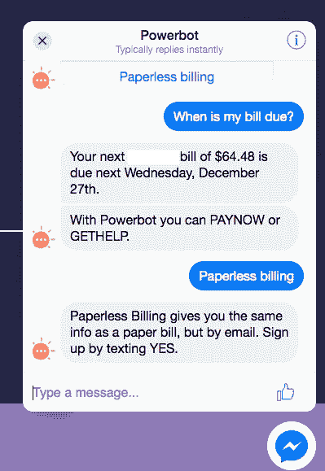
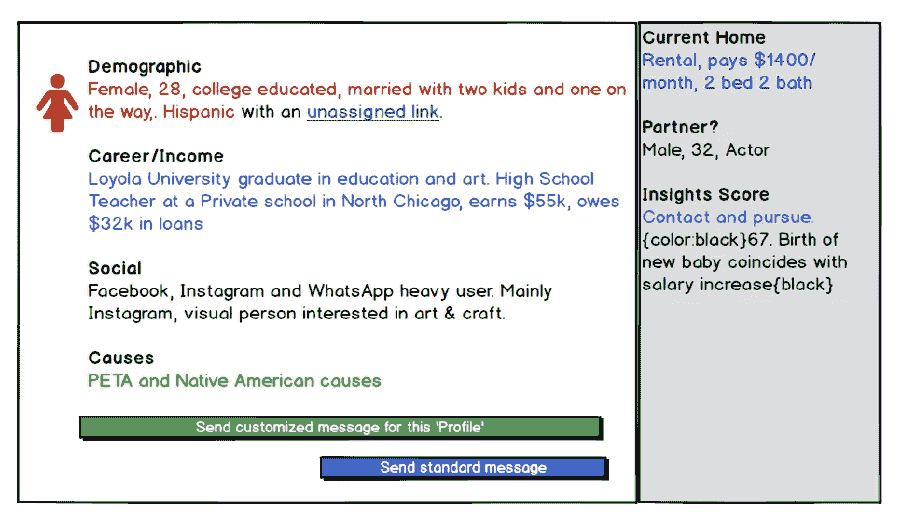

# 当你的顾客坚持说他们想要错误的产品时该怎么做。

> 原文：<https://medium.com/hackernoon/when-your-customer-insists-they-want-the-wrong-product-978cf51c20fb>

如果一个创始人每次告诉我“如果我相信我的直觉，我会以另一种方式做这件事，而不是把事情搞砸”,我现在会很富有。当它是产品决策时，这变得更加混乱。尤其是当在所有的客户发现对话之后，客户要求的产品不能满足你的直觉告诉你的用户需求时。在这种情况下，我给创始人的建议是，他们相信自己的直觉，按照产品团队认为应该做的那样，打造一款服务于用户的产品。我知道'['精益创业的人](/@seyi_fab/is-it-time-to-dump-the-lean-startup-approach-4eb6be23c941)'会为此恨我入骨，但我不只是轻率地提出这个想法，我身体力行。

## 顾客误解需求的两种情况

在过去的一年里，在 [Asha 实验室](http://asha-labs.com)，我们已经推出了两款聊天机器人产品，在这两种情况下，如果我们在产品开发过程中听取了客户的意见，我们就会打造出绝对错误的产品。我们选择忽略客户，相信我们的勇气，并根据我们对用户的了解来开发产品。最初吸引我们抓住这些机会的洞察力。

## [Powerbot.co。](Powerbot.co )

凭借我们在[为公用事业行业](http://power2switch.com)消费者打造面向客户的产品方面的背景，我们了解到客户通常不希望与他们的电力/水供应商合作。客户对其提供商的参与度往往是负面的——支付账单、停电整改等——而公用事业提供商(上帝保佑他们)永远渴望提高他们的客户参与度指标。

我们收到的请求往往是"*我们想要消费者参与！我们希望与我们的消费者接触，这样我们就可以增加我们的净推广分数或 JD Power 分数！*”。而用户想要的只是在他们与实用程序的交互上花费尽可能少的时间。消费者想要的是[*【互动而非参与】*](http://trendwatching.com/quarterly/2017-06/the-future-of-customer-experience/attention-saving/)*，尤其是他们的公用事业公司。正如 [Trendwatching](http://trendwatching.com/quarterly/2017-06/the-future-of-customer-experience/attention-saving/) 指出的那样，聊天机器人的目标是节省产品和消费者体验的注意力，在这种情况下，确保与消费者的互动节省消费者在行动上的时间，这些行动可以自动实现，同时无缝地使用公用事业公司已经拥有的关于这些消费者的数据。允许公用事业公司在适当的上下文中对待消费者的数据。*

**

*与实用程序的要求相反，我们决定构建一个 [*注意力节省*上下文感知聊天机器人](http://powerbot.co)。它解决了账单问题或提供了关于未来费用的信息，通过观察用户的社交媒体行为发展出的上下文，引导用户到我们收集的最能满足他们需求的方向。实验仍在进行中，但迄今为止的结果表明，我们忽略了客户的要求，让我们对消费者的直觉引领产品开发，这是正确的。*

## *RealAssist*

*违背客户要求的第二个例子可以被认为是 [powerbot](https://hackernoon.com/tagged/powerbot) 例子的反面；在这种情况下，用户(潜在的购房者)与我们的机器人保持接触的时间越长，我们可以收集的信息就越多，这有助于我们更好地为客户(房地产经纪人)服务。RealAssist 是一个聊天机器人，帮助房地产经纪人更好地了解谁真正感兴趣并有能力购买代理人提供的房屋。我们正在解决这样一个问题:房地产经纪人向一位看到待售房屋、不能立即查看但想了解更多信息的潜在买家提供房屋的详细信息。*

*如果我们听了房地产经纪人的话，他们想要的只是对房子更多的看法。更多的人进来了。尤其是在不那么热的房地产市场。代理人认为这是一个数字游戏，出售一个地方的关键是让尽可能多的人通过参观门。但我们不同意这个前提，我们的直觉告诉我们不同(我们自己也是购房者)；我们认为，如果代理对潜在购房者有更多的了解，他们就能更好地与潜在购房者接触。因此，我们在手机/短信聊天机器人中内置了功能，使我们能够向代理人显示谁是潜在客户 *(下图线框)*。我们提供了一个匿名视图，显示是谁发送的文本，并通过定制的消息增强代理与客户的互动。这种额外的功能才是真正的价值所在，而不是代理商最初的要求，只是“*让更多的人走进家门，以增加我卖掉房子的机会*”。同样，测试正在进行，但我们已经知道我们忽略客户的要求是正确的。*

**

## *跟随你的直觉开发产品*

*什么时候可以生产与客户所说的不同的产品？以上两个例子突出表明的是,*客户*(例 1 中的公用事业公司和例 2 中的房地产代理商实际上向我们付费)并不真正了解*用户*的需求。但是当你/你的团队了解用户时，因为你是(真正的)用户，跟着感觉走，打造你认为正确的产品是有意义的。还有另外一点，跟着感觉走是可以的。*

*当创始人问我，当他们面临这类决定时该怎么做时，我给他们的建议是，他们应该相信自己的直觉，但只有当决定受到时间限制，并且他们必须迅速拿出一些东西时。**见，** [**本能倾向于偏颇和过度自信**](http://www.mckinsey.com/business-functions/strategy-and-corporate-finance/our-insights/strategic-decisions-when-can-you-trust-your-gut) **如果是我们用来做决策的唯一数据点**。研究表明，在两种情况下，基于直觉的决策是最佳途径。有在*

1.  *低湍流和高结构的情况(即不用于选股)或*
2.  *当情况允许你获得反馈并利用反馈来改进你的决策时，如果将来出现类似的情况，你就增加了将来做出基于直觉的决策的机会。*

*正如[丹尼尔·卡内曼](http://www.mckinsey.com/business-functions/strategy-and-corporate-finance/our-insights/how-to-test-your-decision-making-instincts)在《[思维敏捷&思维迟钝](http://amzn.to/2CRKY7l)》中所指出的，另外一点是*的本能/直觉*在一定程度上受到你长期接收和储存的数据和信息的磨练。这是一个数据储备，当你要做决定时，它会以某种方式提醒你。将其作为一套[工具](https://hackernoon.com/tagged/tools)的一部分，用于决策。但绝不是唯一的工具。*

*有时候你只需要超越客户(付钱的人)，因为你比你的客户更了解产品用户。当你的产品成功了，顾客也就成功了。你的目标是抓住用户的痛点，并以你的客户可以向利益相关者传达成功的方式传达你的解决方案。只是不要让客户觉得他们错了！*

**请分享、点赞、发推文并注册* [*Polymathic 每月简讯*](https://www.getrevue.co/profile/seyifabo?utm_campaign=Issue&utm_content=forwarded&utm_medium=email&utm_source=Seyi+Fabode)*——如果你已经读到这里，我打赌你会爱上它。**