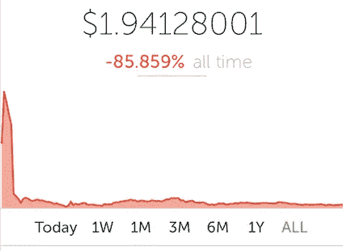
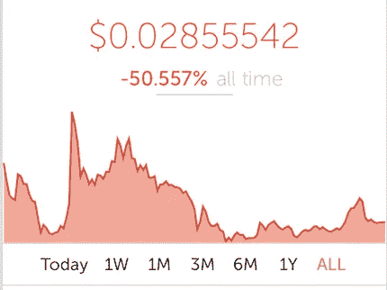
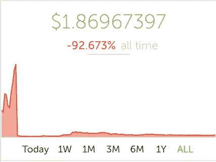

# 2017 年 5 大 ico 在哪里？

> 原文：<https://medium.com/hackernoon/where-are-top-5-icos-of-2017-203358d4adb5>

**Tezos** 在 2017 年 7 月融资 2.32 亿美元。一项[诉讼](https://www.thestreet.com/story/14380889/1/tezos-ico-falls-from-grace-as-lawsuit-filed.html)今天已经提交。

**Bancor** raised $132 Million in June 2017

**Status** raised $108 Million in June 2017

**EOS** raised $185 Million in June 2017

TenX raised $64 Million