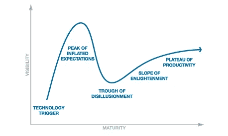

# 我们在区块链的炒作周期中处于什么位置？

> 原文：<https://medium.com/hackernoon/where-are-we-in-the-hype-cycle-with-blockchain-7cc215d9c6e5>

From Banking to Power Grids we have all heard the hype….what is the reality ?

电话是一项伟大的发明，要让它变得有用，需要不止一个用户。区块链技术也是如此。真的只有多方参与才有用。

会议上的许多讨论都围绕着“用例”和“假设”场景，由技术专家、顾问和业务人员参与。争论仍然激烈，认为[区块链](https://hackernoon.com/tagged/blockchain)在很大程度上仍然是一种寻找商业问题来解决的[技术](https://hackernoon.com/tagged/technology)。在金融服务业，高管们对前景感到兴奋，但很少有人愿意投入大量资源、现金和时间来实现解决方案。一些公司将有限的资源分配到“T6”概念验证“T7”项目上，这样他们就可以率先将解决方案推向市场，或者至少不会错过技术成熟时的机会。在金融服务领域，大多数公司都参与了这些“概念验证”项目，但很少有公司超越了这一参与水平。谁会首先将部分业务投入区块链解决方案？每个人都在等待勇敢的先驱加入进来，这样他们就可以从区块链的先行者那里吸取经验教训。

目前，除了比特币之外，很少有解决方案在现实世界中使用区块链，用户可以用它来说明分布式账本的价值。金融服务业的现实是，区块链的真正价值在于加密保护的记录和智能合约，但需要克服的障碍和进入壁垒太多，以至于很难推出区块链解决方案。

互换和衍生产品是区块链的一个很好的使用案例，能够在智能合约中自动执行大多数交易后功能，并与交易对手直接共享资产、价格、合约和支付，这对金融服务公司来说是极具吸引力的。当你考虑到大多数一级银行已经花费了数亿美元来整合他们的前、中、后台系统，包括风险和控制系统时，困境就出现了。交易后互换和衍生产品功能的简单替换必须比简单地节省交易后处理的资金更有说服力。假设银行决定在它们之间运行区块链解决方案，并且每家银行都成为区块链上事实上的节点，那么监管和治理的进一步困境就会出现。谁在运营区块链/解决方案？是财团吗？现在算不算市场基础设施？您如何管理标准和监管报告？

最近的[R3“corda”版本](http://news.bitcoin.com/r3cev-corda-is-not-building-a-blockchain/)很好地表明了公司如何发展他们的思维，因为人们意识到“不变的”区块链可能不适用于金融服务解决方案，因为在大多数情况下，编辑、取消/更正的能力对于交易处理非常重要。[埃森哲](http://www.ft.com/content/f5cd6754-7e83-11e6-8e50-8ec15fb462f4)也关注同样的问题，这提出了关于区块链不变性的潜在价值的问题，如果区块链可以被“编辑”,那么它是真正的区块链技术还是简单的分布式数据库，通过一些非常好的加密技术来确保记录的安全。不管语义如何，一旦采用了管理、互操作和监管技术的标准，分布式密码安全数据库对全球贸易就有很大的价值。

正如 Gartner 的炒作周期预测的那样，我们正处于区块链周期的“膨胀预期的顶峰”，并正在进入“幻灭的低谷”阶段，需要一些现实世界的成功才能最终走向更广泛的采用。我还认为，大多数被誉为改变游戏规则的金融服务解决方案仍处于规划和开发阶段，最终将进入现实世界，但不会像专家预测的那样快。正如我从一开始就指出的那样，电话是一项了不起的发明，但当不止一个人开始使用它时，它很快成为关键的基础设施，并受到严格监管，从一开始就采用了标准。我认为，2017 年将会推出新的金融服务解决方案，尽管速度会很慢。随着时间的推移，这是一个令人兴奋的变化，值得密切关注。

*感谢阅读*

最诚挚的问候:**诺曼·金**

如果你喜欢这篇文章，请点击“喜欢”按钮；发表评论或与您的网络分享。另外，请查看我在 Linkedin 上的其他帖子 [**这里**](http://www.linkedin.com/in/normanmking) **，** *也在 Medium 上[这里](/@normanking)。*邮件:*[***normanking@brook-port.com***](http://normanking@brook-port.com)***。*** 可用于咨询、顾问和演讲活动*

> [黑客中午](http://bit.ly/Hackernoon)是黑客如何开始他们的下午。我们是 [@AMI](http://bit.ly/atAMIatAMI) 家庭的一员。我们现在[接受投稿](http://bit.ly/hackernoonsubmission)并乐意[讨论广告&赞助](mailto:partners@amipublications.com)机会。
> 
> 如果你喜欢这个故事，我们推荐你阅读我们的[最新科技故事](http://bit.ly/hackernoonlatestt)和[趋势科技故事](https://hackernoon.com/trending)。直到下一次，不要把世界的现实想当然！

