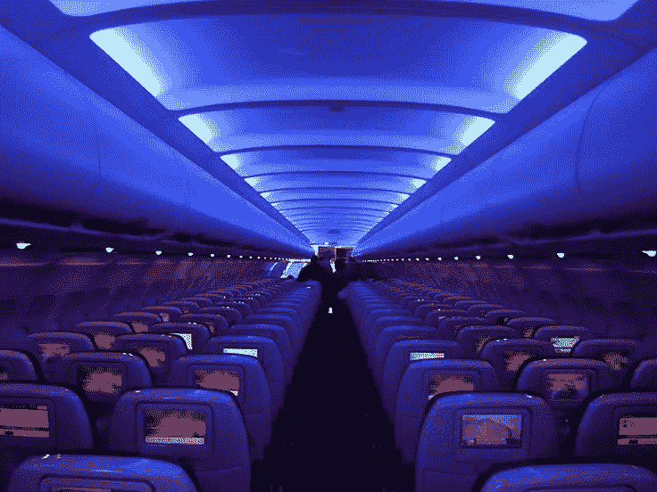

# 商人，今晚你们要开着闪亮的飞机去哪里？

> 原文：<https://medium.com/hackernoon/where-are-you-going-in-your-shiny-airplane-tonight-cf9eeb4a4eb5>

## 30，000 英尺的礼貌黑暗

旧金山正在下雨。我们已经预订了镇上最后几个旅馆房间。这是在里脊肉里。

大厅是大理石和木头的，造型被涂上了一层釉。

没有植物，没有椅子，没有地方坐。

只是一个警卫，肩膀靠在墙上，看着门。我们入住了。我们了解到，WiFi 密码是“储蓄”。

楼上的地毯已经磨出了灰色的车辙。镜子遮住了走廊的墙壁。你走着，看见自己走着。电视声和说话声从每扇门里传来。

一个男人说:做吧。

*我已经做过了*，一位女士回答道。

*我把你带到这里，你却不尊重我，*男人说，不生气只是累了，已经辞职了。

继续走。找到你的门。把卡滑进去。当锁发出咔嗒声时，你会想到握手。

早上我们开车去雷德伍德城，那里的街道平坦而整洁。

有一家菲尔茨和一家星巴克。

有一个苹果蜂和一个灯光明亮的健身房。

餐馆都是空的，午饭前都是空的，然后五点前都是空的。

普锐斯很多但人很少。红木城似乎在等待着什么。[红木城](https://hackernoon.com/tagged/redwood-city)让你想起一个[的外景](https://hackernoon.com/tagged/backlot)。

在客户的大厅里，所有的东西都是白色的和蓝色的，好像要电死任何不干净的东西。家具的精确布置给人一种印象:决策就是在这里做出的，而且非常干脆。楼上有几排不用的桌子。

在会议室里，人们频频点头，白板上的笔发出轻轻的吱吱声。窗外，云层聚集在 Morena 山脊的后面，就在丛林狼、黄色灌木和 yerba santa 的细鱼苗的上方。

一阵键盘敲击声像鸟儿一样惊起。你注意到一个女孩在她的 iPhone 上。

她的图标按颜色排列。

回到城里，又下雨了。

一个穿着脏牛仔裤的男人，走在另一条路上，看见一只咬过的干净鸡腿在一个泡沫塑料容器里，捡起来，放进嘴里。

一个女人蹲在悬垂物下，手里拿着一根点燃的香烟，靠近自己的皮肤。她没有退缩。

富国银行的栗色和金色帐篷拔地而起。

在机场，你不会被要求脱鞋。一名男子在一家终端酒吧弹钢琴。这个女服务员年纪大了，嘴角有唾沫。一个坐在凳子上的温和迷人的男人说他“在激光行业工作”，调情，问她是否结婚了。他发 darling 这个词的每个音节。

慢慢滚动的[飞机](https://futuretravel.today/tagged/airplanes)像鱼一样滑过玻璃。

后来，当你醒来时，只会是机身的嗡嗡声和吸尘地毯的味道。机翼上的闪光灯。他们座位上头部的轮廓。

你旁边的乘客可能正在睡觉。

也许你会发现自己只是坐在那里。

也许你会发现自己只是坐在三万英尺的礼貌的黑暗中，静静地看着邻居的屏幕上播放的任何东西。

> [黑客中午](http://bit.ly/Hackernoon)是黑客如何开始他们的下午。我们是 [@AMI](http://bit.ly/atAMIatAMI) 家庭的一员。我们现在[接受投稿](http://bit.ly/hackernoonsubmission)，并乐意[讨论广告&赞助](mailto:partners@amipublications.com)机会。
> 
> 如果你喜欢这个故事，我们推荐你阅读我们的[最新科技故事](http://bit.ly/hackernoonlatestt)和[趋势科技故事](https://hackernoon.com/trending)。直到下一次，不要把世界的现实想当然！

