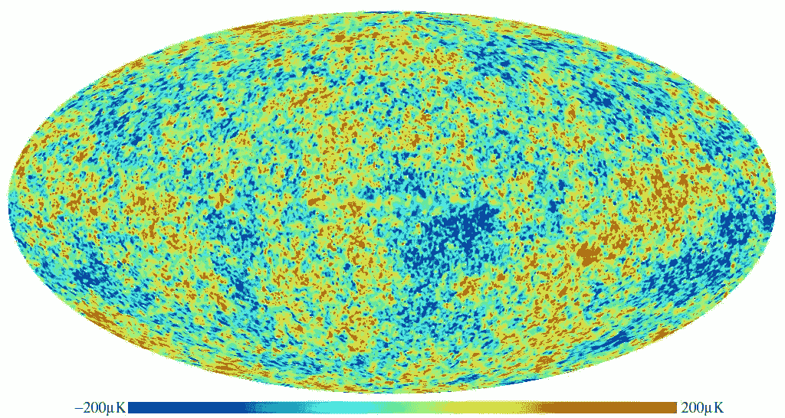
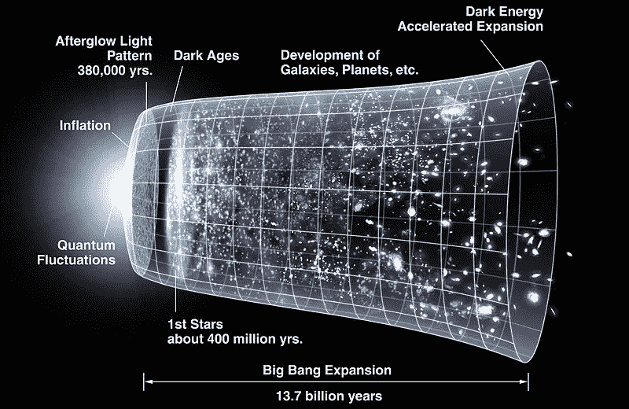

# 你是由星尘制成的！再生文化的宇宙学

> 原文：<https://medium.com/hackernoon/where-do-we-come-from-where-are-we-heading-bbd54eb154fd>

“设计”概要旨在重新设计人类对地球的影响，从主要的剥削和破坏，到大体上的再生和健康生成，邀请我们提出一些基本问题，这些问题定义了我们讲述的关于世界的故事以及我们在其中的角色。

创新和设计再生文化要求我们*面对问题*并反思我们与生命和自然的参与关系。我们需要重新审视我们起源的创始神话(和科学记录)，这个宇宙学框架定义了我们的背景，并提供了以下问题的答案:我们从哪里来？；我们是谁？；我们要去哪里？

那么，我们从哪里来？回答这个问题有很多方法。宇宙学是一种文化如何回答这个故事。在过去的 250 年里，我们的科学宇宙学已经成为起源的主要故事，科学讲述了一个多么令人敬畏的故事！

然而，当任何一个故事试图确立自己的地位时，都有一种倾向，那就是怀疑另类的观察方式和补充性的叙述。这似乎是由于我们倾向于用非此即彼式的排他性二元论来框定事物。

在改变像我们的文化和文明叙事这样重要的东西时，最大的挑战是避免将文化创造性叙事变成新的教条，并重视以前的叙事帮助创造的积极方面。

教条主义和意识形态的倾向已经剥夺了科学宇宙论在文化叙事中所扮演的*意义*的指导角色。科学向我们揭示了如此多的东西，部分原因是分离叙事(将世界客体化)促成了许多有用的科学和技术创新。

来自所有学科的科学见解讲述了一个关于我们与生命和意识过程的密切联系的令人敬畏和有意义的故事。我们不应该对科学不屑一顾，我们只需要问一问，教条主义的倾向可能会让我们对更深层的意义视而不见。

我们当前的科学宇宙观被过度狂热的理性主义和唯物主义扭曲了，偏向定量和还原论分析，偏向机械论而不是有机体隐喻。稀缺和竞争的经济学和生物学故事为不平等、战争和竞争行为提供了一个相辅相成的借口。

我们可能还没有准备好为更深层次的问题提供一个明确的答案，即意识还是物质是第一位的。我们可能不得不在这个问题上再坚持一段时间，探索世界精神传统提供的智慧财富，作为发展中的科学故事的补充视角。

这也可能不是一个合适的问题。也许意识遍布物质，在一定的复杂程度上，这导致了自我和世界之间的自创性差异(生命的出现)，而在更高的复杂程度上，生物变得具有自我反射能力，能够通过文化进化(通过他们讲述自己的故事)创造出越来越复杂的世界？

事实是，我们可以复述我们宇宙起源的非凡故事，利用科学来加深我们对*交互作用*以及共生与合作作用的理解，而不是强化分离与竞争故事的文化优势。

我的朋友 Brian Swimme 和他的导师 Thomas Berry 是第一批探索如何找到科学和精神宇宙学的更高综合的人。科学揭示的关于宇宙和地球上的生命的性质和历史的壮丽，可以为我们提供一个能够重新吸引地球的宇宙学，以及我们在宇宙故事中的参与角色。

## 宇宙

*宇宙*——我没有故意使用介词，因为外面什么都没有，因此宇宙不是一个“它”(物体)，而是一个跨越意识的内部和外部维度(象限)的过程。这个词指的是所有的连接和转换过程，在这个过程中我们所有的生活都是创造性的表达。宇宙既不是物体也不是纯粹的物质，简单地说，*宇宙*是*关系、视角和参与的*‘一个宇宙’。

宇宙在大约 140 亿年前的一次事件中形成，我们现在称之为大爆炸。这一开端是否仅仅是宇宙膨胀和收缩新周期的开始，这是一个我们尚未回答的问题。

Cosmic microwave background as echos of the time immediately after the ‘big bang’, little ripples that may have given the subtle gravitational impulses for galaxies to form and clouds of gas to form and densify until they ignited into stars.

事实是，组成我们的组织、骨骼、心脏和大脑的原子和分子是在亿万年的时间里形成的，当时巨大的气体云在重力的作用下聚合成恒星，照亮了它们周围的行星，仅在 5 亿年后的巨大超新星爆炸中坍塌，释放出的力量被认为塑造了我们今天在地球上发现的许多元素。

如果你戴着金色的结婚戒指或其他金色珠宝，请停下来，我邀请你惊叹于空间和时间的浩瀚，因为你想到地球上所有黄金的原子都是在地球形成之前很久，在巨大超新星中老化恒星爆炸产生的巨大压力和温度下锻造的。

地球，这个我们称之为家园的美丽的蓝色星球，一直是所有诗歌、艺术、舞蹈、音乐和科学的背景，我们发明了这些来理解我们存在的神秘。我们相对年轻的母星大约在 47 亿年前开始形成。

几亿年后，生命开始改变地球上的状况，遵循生命的普遍创造原则:生命创造条件，让更多的生命能够繁荣、多样化和进化。

又过了 14 亿年，地球(更恰当地称为“水”行星)才成为原始细菌的家园，这些细菌是通过原始海洋中复杂分子的化学转化生存的。

大约 3.2 亿年前，生命发明了光合作用的炼金术，即利用阳光将水和二氧化碳转化为糖的能力，糖可以作为结构性建筑材料或食物。早期生活在海洋中多样化和激增。光合作用的广泛应用开始通过这个过程中释放的氧气为地球大气创造机会。

大约 1800 万年前，早期细胞通过一个细胞吞噬另一个细胞而不破坏另一个细胞，开始进行深度协作和共生，而不是使角色和功能多样化，直到第一批复杂的真核细胞形成。

这些有核细胞成了越来越复杂的生命形式的基石，因此，到 5.7 亿年前，浅水海域已经聚集了各种形状和大小的奇怪而奇妙的生物。

陆地生物直到大约 4 亿年前才开始扎根，大约 3.8 亿年前，巨大的森林遍布地球。第一批冒险的两栖动物离开了水域，来到了陆地上。

在接下来的几千万年里，昆虫和爬行动物开始在巨大的超大陆盘古大陆上繁衍生息。大约 3 亿年前，盘古大陆连接了地球上的所有陆地。

突然间，灾难降临在大约 2.5 亿年前的二叠纪末期，当时，流星撞击和巨大的火山爆发共同触发了地球气候系统的一系列临界点，最终导致了气候的急剧变化。储存在深海的甲烷迅速释放，造成灾难性的全球变暖，导致超过 96%的海洋物种和 70%的陆地物种在相对较短的时间内灭绝。

生命花了 1000 多万年才从地球历史上最大的一次大规模灭绝中恢复过来。随后是恐龙和第一批小型(类似于啮齿动物的)哺乳动物的出现，以及各种开花植物的进化。大陆开始分开，形成我们今天所熟悉的形状。

大约 6，600 万年前，地球上最著名的灭绝事件发生在一颗巨大的小行星撞击墨西哥湾时，形成了巨大的烟和灰云，在黑暗中覆盖了地球，挡住了阳光，导致地球上 75%以上的生物灭绝，包括所有的非鸟类恐龙。

这场全球危机为哺乳动物进化的成功故事创造了机会。哺乳动物开始占据恐龙以前居住的生态位。阿尔卑斯山和喜马拉雅山的大山脉是随着大陆向彼此漂移而形成的。

在非洲，几百万年来，类似于今天马达加斯加狐猴的小哺乳动物开始多样化，变成许多种类的猴子，后来变成猿。直到大约 400 万年前，我们最早的南方古猿属祖先开始用双脚直立行走穿过非洲大草原，他们的大脑仍然不比现代黑猩猩大多少。露西，我们最著名的早期祖先生活在大约 320 万年前。

第一批人类进化于 250 万年前。从早期的*能人*到现代的*智人*，人类大脑的大小翻了一番，并发展了其特有的颞叶和额叶前部皮层。这使得许多高级大脑功能得以实现，这些功能使我们有别于其他猿类和动物界的其他物种。

虽然我们在这一时期很早就学会了使用工具和火，但我们可能还没有发展出说话和使用复杂语言的能力，直到 50，000 年前，一群早期的*智人*从非洲迁移出来，并成功地在欧洲、亚洲、澳大利亚和美洲定居。“现代”人类的最早代表(*智人智人*)是法国南部的克鲁马努人文化，其历史仅可追溯到 43000 年前。

数万年来，我们的物种依靠部落长老在壁炉旁讲述的指导性故事生存下来，传递着土著智慧，教导我们的祖先如何生存和繁衍，密切适应他们过着游牧生活的特定生态系统的具体条件。

直到 12，000 至 5，000 年前的一个非凡时期——我们现在称之为农业革命——越来越多的我们祖先的部落才开始发展农业技术，使他们能够在特定的地方定居，并专注于建设村庄、城镇和第一个帝国。

随着这种新的定居的农牧民生活方式的开始，人类对地球的影响开始加剧，人口开始稳步增长，但起初速度缓慢。虽然确切的数据显然很难获得，但可以合理地假设 10000 年前全球人口约为 500 万。

在我们(基督教)历的开始，全球人口已经达到大约 1.5 亿。第一个十亿(1000 亿)直到 1804 年才达到！到 1927 年，世界人口翻了一番，达到 20 亿，仅用了 123 年；到 1960 年，世界人口突破 30 亿大关，也只用了 33 年。

接下来的 20 亿人口仅用了 27 年就增加了。到 1987 年，地球上已经有 50 亿人口。仅用了 12 年时间就增加了 10 亿人口，因此到 1999 年，世界人口达到了 60 亿，再过 12 年，到 2011 年，世界人口将达到 70 亿()。我们未能理解这种指数增长的重要性，这让我们很危险！

根据联合国经济和社会事务部 2004 年发表的一项研究，到 2075 年，人类人口将达到 92 亿的峰值，然后开始略有下降，到 2300 年将达到 89.7 亿。

显然，这种预测不是一门精确的科学，也没有考虑到由于气候灾难、流行病、战争、饥荒和不可预见的灾难性事件(如另一次小行星撞击)而导致人口快速下降的各种可能性。

尽管人口数量(和我们的行为)是影响我们正在目睹的快速环境退化和生物多样性丧失的主要因素，但很少有环保主义者敢于正面解决人口过剩的问题。

这并不是说我们不能在地球的界限内共同创造一个拥有 80 或 90 亿人口的繁荣的人类文明。我们能否做到这一点，这个问题的答案将决定我们人类和地球上生命的未来。

这样做不仅仅是资源管理方面的技术创新和全球合作的问题。这将需要人类意识的更深层次的转变，这将引导我们庆祝生命的进化和宇宙的故事，作为一个统一的创造过程，我们都是这个过程的时间表达。

我们可以讲述一个鼓舞人心的科学故事，来帮助我们更好地了解我们到底是谁。只有到那时，我们才能培养智慧，帮助引导我们去我们想去的地方。

将我们自己视为普遍创造力和生命对新奇事物不断探索的表达——充分意识到我们对生态系统服务和生物圈生命支持系统的依赖——将引导我们对公平和生态正义提出更深层次的问题:

**我们如何通过在人类大家庭和生命共同体中——在今天活着的人和后代人之间——更公平地分享这个有生命的星球的丰富资源，使我们能够走向未来？**

我们开始明白，在整个进化过程中，生命创造了有利于生命的条件。我们的未来取决于维持地球上有利于人类和生命大家庭其他成员的条件。

[创造有利于生命的条件](https://hackernoon.com/how-does-life-create-conditions-conducive-to-life-713ae8d3535)是创造再生文化的基础，是人类长期生存的前提。在科学，特别是生态学(家庭知识)的启发和哲学(对智慧的热爱)的启发下，我们可以学会热爱我们与生命和自然的交流。对所有生物的爱(biophilia)和对作为我们家园和生存之地的自然的爱是再生文化的基石。

> "超越简单的生态学，生态智慧学是地球的智慧-灵性. "新的平衡“与其说是在人和地球之间，不如说是在*物质和精神*之间，在时空和意识之间。*生态智慧*不仅仅是“地球的*科学*”(*生态学*)甚至也不是“关于地球的*智慧”，而是“地球本身的*智慧”，当人类知道如何带着爱倾听她时，这种智慧就会显现出来。”**
> 
> 雷蒙·帕尼卡

【如果你喜欢这篇文章，你可能也会喜欢我的书 [*设计再生文化*](http://www.triarchypress.net/designing-regenerative-cultures.html) 三联书店 2016 年 5 月出版。这篇文章被删掉了，以保持全书引人入胜的长度。]

Image [Source](https://upload.wikimedia.org/wikipedia/commons/thumb/6/6f/CMB_Timeline300_no_WMAP.jpg/800px-CMB_Timeline300_no_WMAP.jpg)