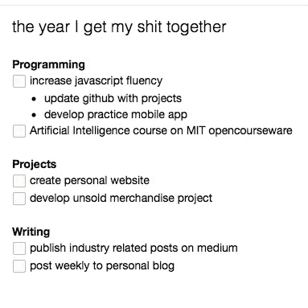
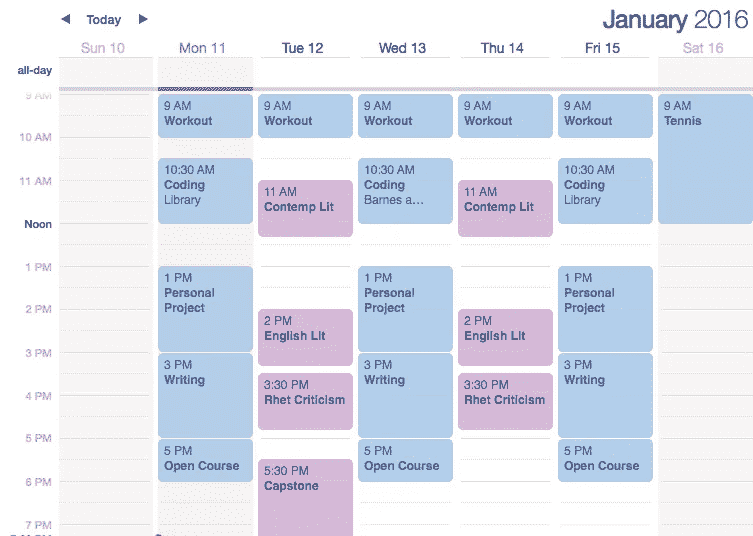

# 你认为自己 10 年后会怎样？

> 原文：<https://medium.com/hackernoon/where-do-you-see-yourself-in-10-years-155a7b411a4c>

如果你问我在未来想做什么，我可以编一个非常有说服力的故事。我可以告诉你我打算如何从事数字战略，我对管理“产品开发”很感兴趣。我甚至会加入一些有趣的短语，比如，*增长黑客*和*搜索引擎优化*。我可以告诉你的故事会很有说服力，但事实是我完全不知道。

这没关系——或者至少我是这么告诉自己的。作为一名即将毕业的大四学生，我的朋友和同龄人疯狂地申请工作，希望加入一个项目能明确他们的未来。然而，我们所有人都在一个混乱而疯狂的世界中寻求清晰。

**航行不确定性**

> *我们必须适应在不确定性中运营。*

我们可以列出一张又一张的清单，讨论 xyz 机会的利弊，但当它到来时，我们永远不会真正知道我们是否做出了正确的选择。我们所能做的就是选择我们能够支持和发展的选项，这样它就会成为我们的正确选择。

一旦我们接受了不确定性，我们就学到了最重要的经验。一旦我们承认我们永远不会真正知道我们的未来会怎样，我们就可以开始不那么惶恐地前进。尽管我们被教导要完全掌控自己的生活，但在这些时刻，我们可以放弃控制，承认“我们不知道”

我们一生都在学习，现在是时候运用这些知识来塑造我们的决定了。虽然我们可能无法清晰地表达我们未来的计划，但我们不能被恐惧所麻痹。

> 面对清晰的希望和恐惧，不确定性是痛苦的，但如果我们希望生活中没有令人欣慰的童话故事的支撑，就必须忍受这种不确定性——伯特兰·罗素，西方哲学史

**关注当下**

基于此时此地你是谁来评价你自己。如果你对自己是谁、能提供什么没有很强的认识，那么担心未来的自己是徒劳的。

当我第一次被 [Venture for America](http://ventureforamerica.org) 项目录取时，我异常兴奋，因为我知道我将加入一家[初创公司](https://hackernoon.com/tagged/startup)，周围都是和我一样积极进取的同龄人。然而，当我开始质疑自己如何才能在一家初创公司产生影响时，现实摆在了我面前。我的*技能*和*专长*将如何为公司做出贡献？我的*技能*和*专长*是什么？如何发展这些*技能*？我错过的那些课里有提到过这个吗？因为我真的不记得它在教学大纲里。

这种充满自我怀疑和不确定性的提问是有害的，没有建设性的。它所做的只是制造了一场生存危机，而这绝对解决不了任何问题。与其担心我可能(或可能没有)拥有什么技能，我反而需要把精力集中在确定我可以看到自己发展的兴趣领域上。这转化成了我现在可以采取的行动计划。

a list of my goals for the first half of the year

this is only slightly neurotic…

虽然这种方式看起来有点过分，但对我来说，这是让我对自己负责并清楚地跟踪我在目标上取得的进展的最好方式。因为我们有责任为我们可以自豪的未来打下基础。

最后，我唯一确定的是我的未来充满了不确定性——但我非常兴奋。

> [黑客中午](http://bit.ly/Hackernoon)是黑客如何开始他们的下午。我们是阿妹家庭的一员。我们现在[接受投稿](http://bit.ly/hackernoonsubmission)并乐意[讨论广告&赞助](mailto:partners@amipublications.com)的机会。
> 
> 如果你喜欢这个故事，我们推荐你阅读我们的[最新科技故事](http://bit.ly/hackernoonlatestt)和[趋势科技故事](https://hackernoon.com/trending)。直到下一次，不要把世界的现实想当然！

