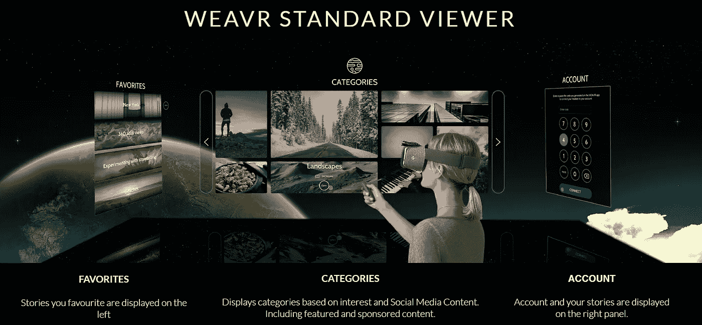

# 虚拟现实的意义在哪里？

> 原文：<https://medium.com/hackernoon/where-does-virtual-reality-make-sense-b6d92bdc13db>

我正在读安德烈·卡帕西关于 T2 虚拟现实的精彩文章。在他的文章中，他提到了许多应该用桶来运送的游戏，因为它们使用了我们的大脑无法处理的运动，从而使人生病。恶心的一个原因是，我们的身体从我们的感官获得矛盾的信号，因此认为我们已经中毒，并希望在为时已晚之前取出那些蘑菇。

在 [Weavr](https://weavr.space) 我们一直在帮助人们创造虚拟现实体验，我们已经看到它在一些领域表现出色。所以我决定继续传统，继续写 Andrej 工作的后续故事，就像我写他关于 [AI](/@ursushorribilis/the-intelligent-way-of-being-emotional-short-story-on-ai-part-2-c4e7421a67ac#.9t8qfrasp) 的[文章一样，并分享我们在虚拟现实确实有意义并且已经成功应用的领域的发现。我会坚持应用，不玩游戏。](https://karpathy.github.io/2015/11/14/ai/)

Layout of the Weavr standard viewer in Virtual Reality

## 房地产

如果你搬到了一个新城市，你就会知道找房子的挑战。你不是本地人，所以在搬家前的几天里，你会尽可能多的临时抱佛脚，最终选择了错误的地方。想象一下，如果你可以在虚拟现实中参观一个公寓，并以你的速度四处看看。这是我们在 Weavr 平台上看到的首批应用之一。下面的视频提供了某人在虚拟现实中参观公寓时屏幕的视角记录。当然，这也可以在任何使用网络虚拟现实技术的网络浏览器上观看。

VR tour of an apartment in England

> 想象一下，如果你可以在虚拟现实中参观一个公寓，并以你的速度四处看看。

## 展览品

在我们的应用程序在 Oculus 商店上线几天后，阿布扎比的一家教育机构联系了我们。他们计划举办一个展览，在那里他们将安装一个虚拟现实耳机，为参观者提供探索他们装置的机会。想象一下，你正在为你自己或你的孩子寻找一所学校，在做出决定之前，不需要去他们的实验室、图书馆和宿舍就能看到他们，那会怎么样？同样，下面是一个视频，其中有一个 POV 屏幕截图，显示有人在虚拟现实中参观这些装置。

## 当你不能旅行的时候去旅行，又名:辅助生活和医院

同样，在应用上线后的第一周，我们收到了两个互补的想法。当我们向一位医学博士展示这一点时，她提到用虚拟现实眼镜来分散在医院呆更长时间的孩子的注意力是多么美妙。她提到，当他们的伤口需要护理时，孩子们看到他们的伤疤时会有一种受伤的感觉。她想在虚拟现实中分散他们的注意力，这样他们就不必经历这些痛苦的时刻。

大约在同一时间，我们的一位投资者也参与了退休之家(又名，辅助生活)的建设，他找到我们，告诉我们他们想为他们的居民提供参观虚拟现实中的地方的方法。我们把这个叫做 ***【不能旅行的时候】*** 。在某种程度上，目的是保持他们的思维活跃，但也具有前瞻性的想法，使他们的家人能够分享他们不能再参加的家庭时刻的沉浸式体验。就像人们聚集在一起看电视的社交房间一样，他们现在会去不同的地方旅行。下面是一个 POV 视频，其中有我们[类别](https://weavr.space/CategoryView.aspx?CategoryID=d06bd471-c588-46e3-b173-a2a6f0d01f16)中的一些旅行故事。

## 工业应用

我有个朋友以前在飞机维修公司工作。早在几年前，他们就在考虑使用混合现实耳机来帮助他们的工程师和技术人员更有效地进行维护工作。他们确实在不同制造商和不同型号的飞机上工作。一方面，他们希望维修人员能够回忆起混合现实眼镜的示意图和手册，另一方面，他们希望使用眼镜上的摄像头来记录维修工作。

行业将推动虚拟和混合现实技术的采用。一个例子是我们的合作公司 Bitforge 为一家瑞士工厂完成的项目。目标是让每个人都能在设施建成之前进入其中，这样设计就可以调整，避免建成后昂贵的改动。

## 品牌推广

当我们还在测试阶段时，Martin Landstrom 团队中的一些人找到了我们，他是一位著名的演讲者和作家。他们想创造一个身临其境的故事“[马丁·兰德斯特伦](http://vr.weavr.space/Showstory.aspx?id=b9085866-03a4-4f71-9a72-73b86e4c7a8b)生活中的一天”，这个想法是为了向人们展示这样一个事件所需的所有准备工作。

> 想象和你最喜欢的篮球运动员有一次身临其境的体验？

我们现在看到了其他类似的请求。想象和你最喜欢的篮球运动员有一次身临其境的体验？或者在沙滩排球锦标赛的最佳位置？。像这些，还有其他在虚拟现实中体验最好的体验，将个性和品牌与他们的追随者联系起来。

## 教育

增强、虚拟和混合现实擅长帮助我们可视化事物。不管它是地图、身体部位、飞机组件、分子结构，还是只是复杂数据的可视化。如果你能想象它，你就能理解它。去年圣诞节，我把 Oculus 从办公室带回家，向妻子展示了新的谷歌地图。(是的，如果你遵循[这个简单的指南](https://github.com/Shockfire/FakeVive)这是可能的)我妻子是那种容易迷路的人。我仍然记得当她“飞过”一些她经常使用的地点时，她声音中的情感。这是一个接一个的啊哈时刻:“*现在我明白了，这些街道并不是真正平行的，现在奇怪我总是迷路*”。她接过耳机，准备回到自己的家乡，在脑海中的地图上填空。你可能会认为这就是你使用普通地图所得到的结果，但是有些人并不了解地图。另一方面，每个人都理解 3D 可视化。

上面的视频通过凯斯西储大学的 Hololens 应用程序说明了 AR/VR/MR 在教育中的可能性。我相信这将是一个领域，我们将看到许多应用程序来帮助学生和普通人理解复杂的概念。

## 结论

Andrej 是对的，目前还没有应用程序让你想每天都使用 VR 耳机。与任何新技术一样，虚拟、增强和混合现实现在正经历一个探索阶段。在 [Weavr](http://weavr.space) 我们从[讲故事](https://hackernoon.com/storytelling-in-virtual-reality-cf8efc5e78f1#.ppdbsyve7)的角度走近田野。我们看到了在以下领域有意义的应用:

*   房地产
*   展览品
*   辅助生活和医院
*   工业
*   品牌推广
*   教育

我们确信开发者社区将停止生产令人作呕的游戏，开始关注相关领域的优质应用。如果你有兴趣尝试创造你自己的虚拟现实体验，[看看我们简单易用的工具](https://www.weavr.space/vrbusiness/)。我们期待看到你创造的东西。

还有 [Andrej Karpathy](https://medium.com/u/ac9d9a35533e?source=post_page-----b6d92bdc13db--------------------------------) ，至于 VR 中的 AI，那将是另一篇帖子的话题:-)

> [黑客中午](http://bit.ly/Hackernoon)是黑客如何开始他们的下午。我们是 [@AMI](http://bit.ly/atAMIatAMI) 家庭的一员。我们现在[接受投稿](http://bit.ly/hackernoonsubmission)并乐意[讨论广告&赞助](mailto:partners@amipublications.com)机会。
> 
> 如果你喜欢这个故事，我们推荐你阅读我们的[最新科技故事](http://bit.ly/hackernoonlatestt)和[趋势科技故事](https://hackernoon.com/trending)。直到下一次，不要把世界的现实想当然！

