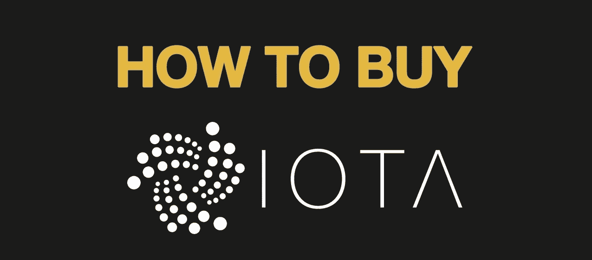
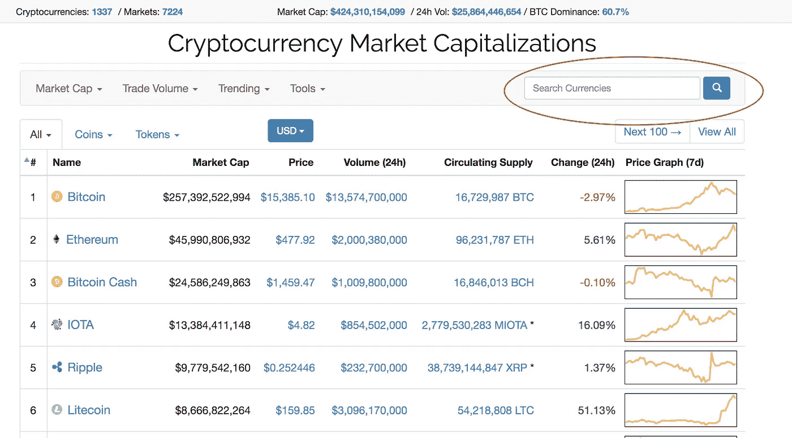
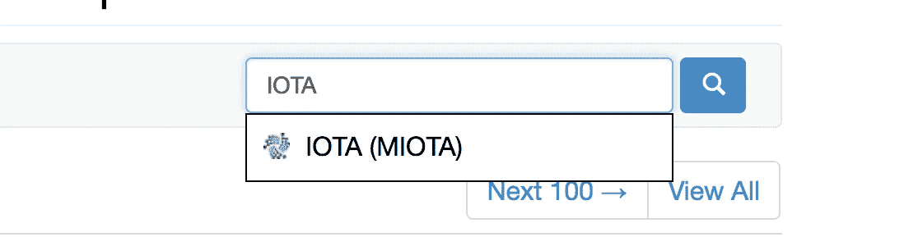
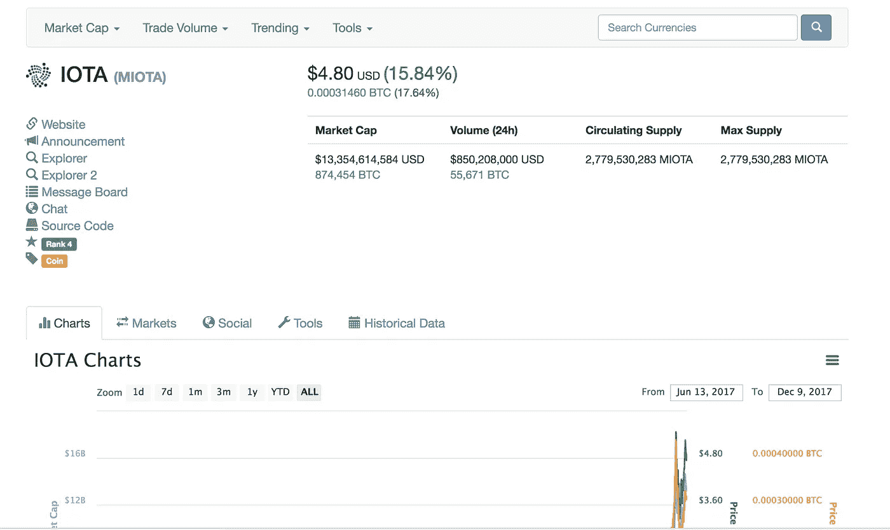
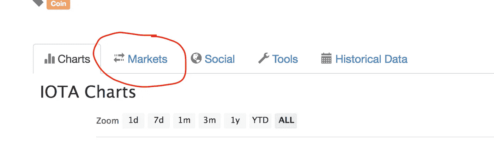
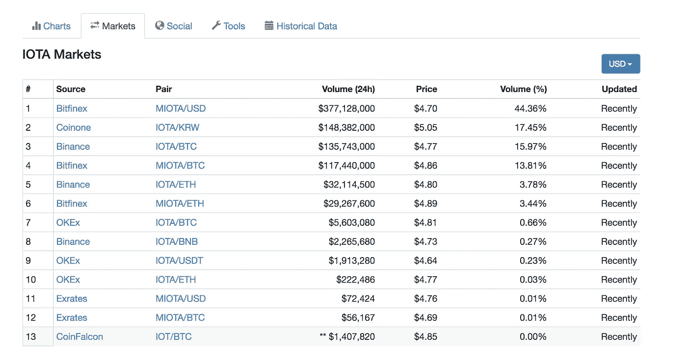

# 怎么买 IOTA？

> 原文：<https://medium.com/hackernoon/where-how-to-buy-iota-6a84dcadb470>

这是加密社区中的一个常见问题。因为我们有超过 600 个活跃的交易硬币，其中一个或多个会在每一天暴涨。这引出了那天最热门的问题

> 如何购买 X 币？或者去哪里买 X 币？

小组里会有人慷慨地回答这个问题。然而，有一个简单的方法可以得到这个问题的答案。不仅仅是一点点，而是在公共交易所交易的任何硬币或代币。

> TL；DR:你可以在[币安](https://www.binance.com/?ref=11705133)上注册并购买——将你的 BTC 或 ETH 从[比特币基地](https://www.coinbase.com/join/5922da0103b62e7e9e6b9df8)转移到[币安](https://www.binance.com/?ref=11705133)并购买 IOTA。

**CoinMarketCap.com 是你这里的朋友。**

**进入[coinmarketcap.com](https://coinmarketcap.com)，右上角有搜索栏提示“ ***搜索货币*****

****

**在这种情况下，因为我们正在寻找 IOTA，键入它，它会提示下面的硬币，选择它并按下`return`或`enter`键，或者只需单击搜索框旁边的蓝色按钮。**

****

**网站现在将显示加密货币“IOTA”的详细信息，包括其官方网站、源代码、沟通渠道和更多金融细节，如该特定货币的市值、24 小时交易量、发行量和最大供应量。这些参数通常有助于分析特定货币的交易者理解其价值。**

****

**在有关货币的信息下方，您会看到多个选项卡，其中“图表”选项卡被选中，并显示 IOTA(所选货币)的历史价格图表。**

**来回答我们的问题“在哪里可以买到硬币？”，它位于该部分的第二个选项卡中。即 ***市场*** 标签页**

****

**点击“市场”标签，它会显示所有交易市场的列表，同一交易所的多个条目会显示这些交易所的不同交易对。例如:IOTA 可以在一个交易所与 BTC、瑞士联邦理工学院和 USDT 进行交易，也可以在另一个交易所与 BTC 进行交易。**

****

**现在你知道在哪里购买 IOTA，你现在需要做的就是[购买比特币](http://hackernoon.com/a-beginners-guide-to-buying-bitcoin-8cf715421a9c)或[以太坊](https://hackernoon.com/a-beginners-guide-to-buying-ethereum-e11c73b5e5ed)并将其转移到上面列出的相应交易所并进行购买。我个人使用过[币安](https://www.binance.com/?ref=11705133)和 Bitfinex 来购买 IOTA——但是 Bitfinex 停止接受美国客户，所以不得不转移到[币安](https://www.binance.com/?ref=11705133)**

**无论你是交易员还是霍德勒，你都需要对加密货币交易负责并纳税。这里有一篇文章，试图减少混乱，并提供关于加密交易所得税的澄清。**

** [## 如何使用 BearTax 对加密货币收益征税

### 比特币基地、GDAX、Gemini 等地的密码交易员迫切需要计算他们从比特币中获得的收益

hackernoon.com](https://hackernoon.com/how-to-pay-bitcoin-cryptocurrency-tax-reliable-tools-beartax-bfce8bbb81bc)**