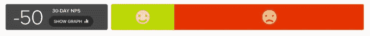

# Patreon 的定价变化哪里出错了

> 原文：<https://medium.com/hackernoon/where-patreon-went-wrong-with-their-pricing-change-c550e2667022>

你可能已经看到 [Patreon 最近宣布改变他们的定价模式](https://blog.patreon.com/updating-patreons-fee-structure/)，结果[在他们社区的强烈反对下取消了](https://blog.patreon.com/not-rolling-out-fees-change/)。

喧嚣声如此之大，以至于在拔掉插头之前[帕特里翁](https://hackernoon.com/tagged/patreon)被迫对他们的声明发表了一个深入的解释，就像厨师试图与顾客讲道理，因为他们的饭菜在他们的嘴里留下了酸味。在许多方面，损害已经造成。

作为一个局外人，我可以看到双方的观点。从帕特里翁的角度来看，这是一种简化事物的尝试，并揭示了顾客→被顾客交易的现实。毕竟，费用是存在的，而且是由顾客支付的，不管顾客是否意识到这一点。然而，从顾客的角度来看，他们的 5 美元承诺现在将变成 5.5 美元，这些额外的 50 美分没有进入创造者的口袋。真扫兴。

很大一部分问题在于，费用从承诺中扣除，变成了增加。这实际上意味着，如果顾客不改变任何东西，他们现在将支付更多。你可以看到人们为什么感到不安。

损失厌恶感很强，Patreon 社区的宗旨就是让独立创作者从他们的作品中赚钱。任何被视为企业攫取资金的举动，无疑都不会受到这一群体的欢迎。

这一举动是为了安抚创作者而不是资助者。双方都看到了有利的一面，但这里的驱动力是一部分创造者的不快。

Patreon 通过分享他们的 [NPS(净启动子得分)](https://usercompass.com/)结果的快照显示了这种不满。在过去的一个月里，那些提到费用的人的 NPS 得分是-50。这意味着，对于那些在考虑推荐 Patreon 的可能性时将费用视为首要问题的人来说，绝大多数人实际上会劝阻其他人使用这项服务。从表面上看，你可以理解为什么 Patreon 如此重视这个问题。

但是上下文是关键。我怀疑很多人会从正面提到费用，所以分数自然会严重偏向负面结果。更有见地的是，将费用列为得分主要原因的受访者比例。没有这些数据，很难形成强有力的观点。

所有的数据都要被解读，NPS 也不例外。它提供了突出问题领域和产品优势领域的信号。但是数据本身并不能保证一个积极的解决方案。

NPS 的真正好处是它给你一个“提示”,让你了解单个用户的想法，并且能够随着时间的推移在高水平上跟踪用户的快乐程度。产品的魔力在于获取数据、解释数据并持续改进，这反过来会反映在 NPS 得分中。如此循环往复。

Patreon 的联合创始人杰克·康特直言不讳地说:

> “人不是机器。我们必须尊重这一点。”

对 Patreon 来说，损害已经造成，对它自己和它的创造者都是如此。我相信这对帕特里翁总部的人来说是一个残酷的教训。在接下来的几个月里，看看 Patreon 的 NPS 分数(对创作者和赞助者而言)如何变化肯定会很有趣。

> 喜欢这篇文章吗？打👏让你的朋友知道

[**有兴趣和你的 SaaS 一起使用 NPS 吗？** UserCompass 自动向您的 Stripe 客户发送 NPS 调查，仅需 60 秒设置](http://usercompass.com/) ✉️💨