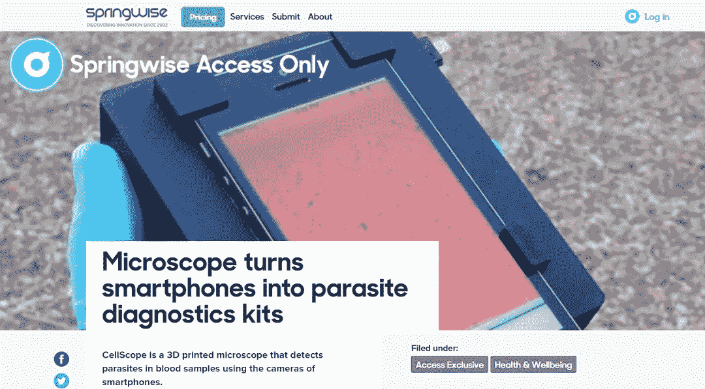

# 哪里可以找到令人惊叹的小型企业新创意

> 原文：<https://medium.com/hackernoon/where-to-find-awesome-new-small-business-ideas-cc32e2a9611c>

几乎不可能坐在办公桌前，想出一些全新的、创新的东西。更多的时候，想法来自那些在外面做事的人——比如结识新朋友，体验新事物。

这是一个普遍的误解，伟大的想法产生于灵感的闪光。事实上，大多数伟大的想法都是随着时间积累起来的，就像拼图游戏一样。因此，如果想出一个新的商业想法感觉像是一场磨难而不是一次冒险，那可能是因为你只是在追求一瞬间的灵感，而不是找到所有你需要的拼图。

有一个想法的最好方法之一是看到其他想法。随着越来越多的这些想法进入你的大脑，你有机会将它们重新整理成新的东西，或者可能改变世界的不同的东西。因此，探索新想法是每个有抱负的企业家应该经常做的事情。

考虑到这一点，我列出了三个寻找新商业想法的最佳地点，以帮助你开始创业冒险。

## 很酷的东西

[酷事](http://www.coolthings.com/)不一定是一个致力于帮助你发现新商业创意的网站。但他们真正做得好的是报道创新的、古怪的、不同的现有产品，这些产品肯定会激发你的想象力，让创意源源不断。

这是一个完美的网站，让你的思想在提供的无数可能性中漫游。如果这些磁性运动鞋能便宜地制造出来会怎么样？如果我们能让食物在变质时发光会怎么样？

这里有一个你可能会遇到的有趣的例子:

*Shot-glass that looks like it’s taken a shot… and survived*

可能是一个伟大的小生意，在你的地区和市场获得分销权，并出售给酒吧和酒馆，他们可能有兴趣在一些不寻常的事情上服务。

在创造力方面有丰富的收获，你一定会想出一些很棒的点子。虽然没有太多的想法支持，但你可以继续访问列表中的下一个资源…

## 中小企业伙伴([小企业](https://goo.gl/8A3HVV)创意)

[SME Pals ' s small business ideas](http://smepals.com/small-business-ideas)页面采用互动的方式建立一个极具创意和不寻常的商业创意列表，这些创意以分类列表的形式提供给你浏览。

SME Pals 鼓励你分享你的想法，而不是提供一个静态的列表，如果他们将你的想法添加到列表中，你的想法将会在世界范围内被分享。最棒的是，在这里分享你自己的[创业](https://hackernoon.com/tagged/startup)想法可能会让你被潜在的合作伙伴或投资者注意到，因为他们会在社交媒体上称赞你(通过你的 twitter 账号*)。*

这个列表的好处在于它充满了富媒体。图片有助于你将分享的想法形象化。视频剪辑展示了其他人是如何把类似的想法变成现实的。

也有一些创新思维的伟大例子——用无人机为农民放羊，针对千禧一代的扭曲的电子商务商店(*出售僵尸花园侏儒*等商品)，甚至还有一家在线无人机服务公司，以满足 40 多万起事故不断增长的维修需求。

这是最新的一个，基于日本的一个想法:

Magnetic Levitation house plants and bonsai

如果你能解决棘手的部分，确保你的花盆、土壤和植物的平衡和重量对磁铁来说是完美的，那么你今天就可以跳起来，走在未来几年肯定会成为大趋势的前面。

最后，网站上有大量实用的资源可以帮助你将想法进行到下一步。从免费的[商业](https://hackernoon.com/tagged/business)计划模板，到实用的一步一步的指南，到创建响应迅速的前沿网站，再到营销策略、SEO 等等，应有尽有。

## 明智的

Springwise 在世界各地有一个庞大的社区，人们发现并发布他们在自己地区发现的创新创业公司。然而，他们的很多注意力都集中在高科技想法上，这可能超出了个体企业家或小型创业团队的资源和技能。

但是，关注他们的最新内容有很大的价值，因为其中潜藏着大量的机会。创业并不总是意味着你必须提出想法。有时候，这意味着与一家出色的初创公司合作，帮助他们在你所在的地区或国家进行分销或营销。

3D printed microscope turn smartphones into disease detectors

发展中国家通过使用共享的、基于在线人群的分析工具——特别是那些可以非常便宜地获取现场样本并在世界任何地方进行在线分析的工具——可以节省多少钱？

你可能有当地的人脉，这些创新公司需要这些人脉来打开他们的大门。观看 Springwise 上发布的内容可能意味着你不是那个灵光一闪的人(*或拼凑拼图的人*)，但这可能意味着你在一个令人兴奋的行业中开始了一段有利可图和持久的业务关系——这并不坏。

所以，这些是我给那些想寻找商业点子的企业家的三大资源，从有创意的，独特的，原创的，到被证实的。你有没有发现一个你尝试过的网上创意？成功了吗？

请在评论中分享你创业的秘诀和经验。

> [黑客中午](http://bit.ly/Hackernoon)是黑客如何开始他们的下午。我们是 [@AMI](http://bit.ly/atAMIatAMI) 家庭的一员。我们现在[接受投稿](http://bit.ly/hackernoonsubmission)，并乐意[讨论广告&赞助](mailto:partners@amipublications.com)机会。
> 
> 如果你喜欢这个故事，我们推荐你阅读我们的[最新科技故事](http://bit.ly/hackernoonlatestt)和[趋势科技故事](https://hackernoon.com/trending)。直到下一次，不要把世界的现实想当然！

