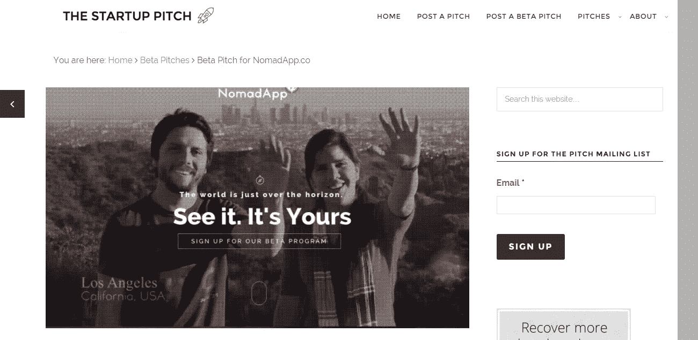
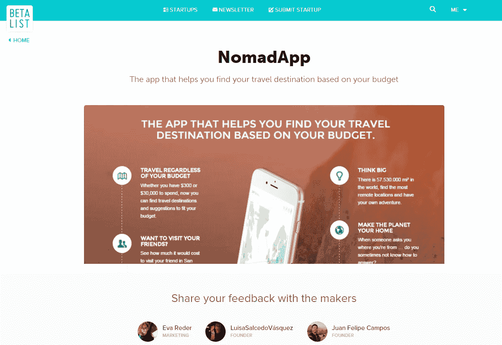
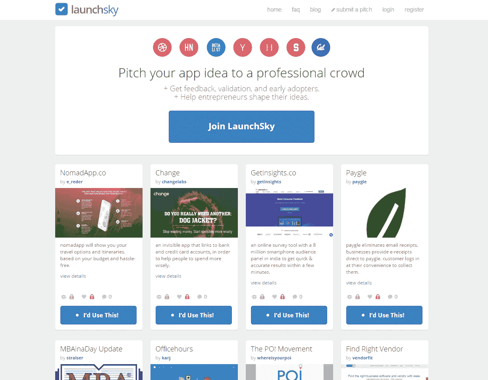

# 在哪里推广你的预启动创业

> 原文：<https://medium.com/hackernoon/where-to-promote-your-pre-launch-startup-fd934f2b38c6>

prepare your startup for take-off

## 获得早期用户关注的最佳平台

有什么有效的方法来获得用户的认可，增加 beta 计划的注册人数，并促进我们的预发布启动(几乎没有任何预算)？这是我们问自己的问题，也是许多其他初创公司创始人可能会问自己的问题。在这里，我们收集了一个可以免费推广你的创业的地方的列表。

****:****

**在 startup pitch 上提交您的 Startup Pitch，以获得有价值的客户反馈并增加您网站的流量→**

****

**[NomadApp.co’s startup pitch](http://thestartuppitch.com/beta/beta-pitch-for-nomadapp-co/)**

****

****Producthunt 是展示你的产品或创业的最大平台之一，拥有超过 9 万名订户。新产品、书籍或应用程序在平台上注册，用户可以在排名中投票。因此，你有机会出现在头版，得到病毒式的关注。许多初创公司，比如 Bram Kanstein 的 startup sth 成功地用 Producthunt 支持了他们的发布，并迅速走红(这里有一篇关于他们如何做到这一点的文章)。这绝对是推广你创业的地方。然而，它的重点更多地放在即将推出或已经上市的产品上。所以我们仍在等待把 NomadApp 放在那里，但一旦我们准备好推出→再见[产品搜索](https://medium.com/u/b8b4445269d0?source=post_page-----fd934f2b38c6--------------------------------)****

****[**Betalist**](http://betalist.com/)****

****BetaList 是一份即将到来的 beta 阶段创业公司的列表。它拥有大约 25000 名用户，并且已经有一些著名的初创公司，比如 Pinterest。注册是免费的，但是，在请求得到处理之前，可能需要一个月的时间。如果您想更快地获得推荐，您可以通过贡献 99 美元来支持该平台来插队。****

****编辑:我们刚刚上了 BetaList，对它的影响力感到非常惊讶。仅在 1 天内就有 200 名新用户和 100 名新的测试程序注册。我们的谷歌分析统计数据在这个小功能之后变得疯狂****

********

****[Reddit](https://www.reddit.com/r/Entrepreneur/)****

****Reddit 是一个很棒的社交网络；免费注册，这个地方可以引发对几乎所有事情的讨论，包括你的创业。这是向潜在用户提问和获得反馈的地方。但是注意:不要发垃圾邮件。社区讨厌自我推销。在社区中参与并建立长期、真实的关系。查看子编辑，如/r/Entrepreneur****

****[**Angellist**](https://angel.co/)****

****注册，创建[个人资料](https://angel.co/nomadapp-co)，联系投资者，获得大笔资金→这就是 [AngelList](https://medium.com/u/5f84314adf6?source=post_page-----fd934f2b38c6--------------------------------)****

****[**发射天空**](http://launchsky.com/)****

****[在 Launch Sky 上启动您的公司](http://launchsky.com/pitch/details/296)以获得客户反馈、验证和早期采用者。注册费用为 19 美元，除非你有促销代码；)如果你正在读这篇文章，你真幸运→ **我们可以帮你免费注册。**刚刚取得联系。(是的，Launch Sky 允许我们将推广代码传递给有前途的初创公司)。****

********

****Launch Sky’s front page****

****[**下水下一个**](http://launchsky.com/pitch/details/296)****

****有点类似于 Betalist，但同样有用。注册是免费的，处理过程可能需要两周时间。酷:你可以找到很多帮助你启动创业的资源，比如对创始人的采访。****

****[**Makerbase**](https://makerbase.co/)****

****新人-由 Mailchimp、Slack 和 Hover 赞助的平台。展示项目及其制作者的空间。****

********

******Springwise 以创新项目和业务为特色。你可以通过这个公式免费提示平台所有者你可能想在那里看到的创业公司【http://www.springwise.com/tipus/******

******[**反馈大军**](http://feedbackarmy.com/) :让专家从技术角度测试你的创业公司******

****[**【startupli . ST**](http://Startupli.st):将自己描述为一个寻找、关注和推荐创业公司的地方。****

****我们希望这篇文章能帮助你推广你的预启动创业！有什么要补充的吗？让我们知道并讨论策略！如果您喜欢您正在阅读的关于 NomadApp 的内容，请不要忘记 **→** [**注册我们的测试版计划**](http://nomadapp.co/)**↓**和**，一旦我们准备好启动**，您将是第一批获得通知的人！****

*******NomadApp.co:*** 根据预算帮你找到旅行目的地的 App。点击此处→ [NomadApp.co 的创业推介](http://thestartuppitch.com/beta/beta-pitch-for-nomadapp-co/)ⅲ****

************************

> ****[黑客中午](http://bit.ly/Hackernoon)是黑客如何开始他们的下午。我们是 [@AMI](http://bit.ly/atAMIatAMI) 家庭的一员。我们现在[接受投稿](http://bit.ly/hackernoonsubmission)并乐意[讨论广告&赞助](mailto:partners@amipublications.com)机会。****
> 
> ****如果你喜欢这个故事，我们推荐你阅读我们的[最新科技故事](http://bit.ly/hackernoonlatestt)和[趋势科技故事](https://hackernoon.com/trending)。直到下一次，不要把世界的现实想当然！****

********