# 沃尔多:终结者版在哪里

> 原文：<https://medium.com/hackernoon/wheres-waldo-terminator-edition-8b3bd0805741>

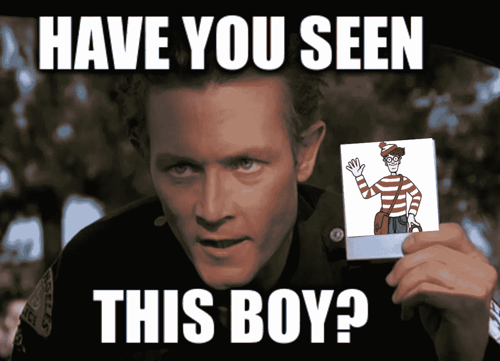

# 使用语义分割寻找瓦尔多&提拉米苏

*这篇文章的灵感来自与*[*@ Jeremy Howard*](https://twitter.com/jeremyphoward)*和*[*@ math _ Rachel*](https://twitter.com/math_rachel)*【s*[*fast . ai*](http://fast.ai)*实习时学习的材料，特别是他们的课程* [*第 14 课《程序员的前沿深度学习*](http://course.fast.ai/part2.html) *，在 USF 的*如果你想看我这个项目的端到端代码，请查看我的资源库 [*有瓦尔多*](https://github.com/bckenstler/TheresWaldo) *。*

到目前为止，业外人士可能都知道最近关于“脸书艾事件”的报道被大大夸大了(假新闻！).这是一种保守的说法；报道的故事是可怕的记者对一篇令人兴奋的研究论文的严重歪曲。

不，天网还没有意识到。然而，人工智能继续快速发展。特别是，自从深度学习的复兴以来，计算机视觉领域已经取得了长足的进步；卷积神经网络使得像图像分类和物体检测这样的任务变得微不足道。尽管电子人仍然是科幻小说中的东西，但他们的操作部件已经不是了(见自动驾驶汽车)。所以在某种程度上，我们*今天确实*有能力帮助一个终结者获得它的目标。

今天，目标是沃尔多。是的，每个人都喜欢的戴眼镜的流浪者和闭塞大师已经让自己陷入了困境；我们将看看如何使用语义分割和被称为 [**【提拉米苏】**](https://arxiv.org/abs/1611.09326) 的全卷积 DenseNet 来找到他。

对于那些不熟悉的人来说,《瓦尔多在哪里》(或《沃利》)是一系列儿童书籍，挑战读者在密集的插图中找到同名人物和他的伙伴。

这里有一个例子:

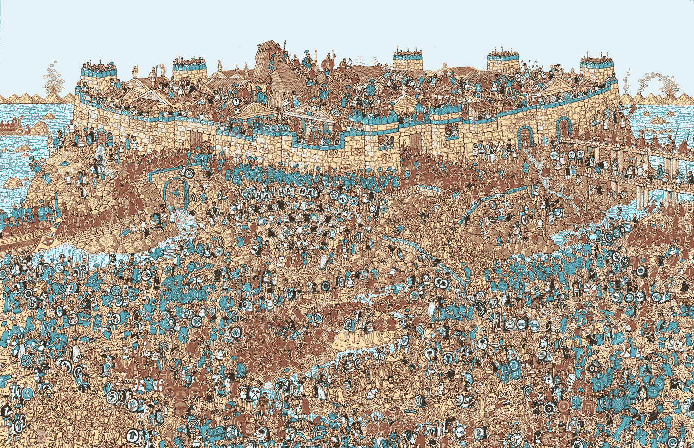

Holy shark-repellant Batman!!!

这是一个更荒谬的困难挑战，但代表了它们是多么的耗时和令人生畏。

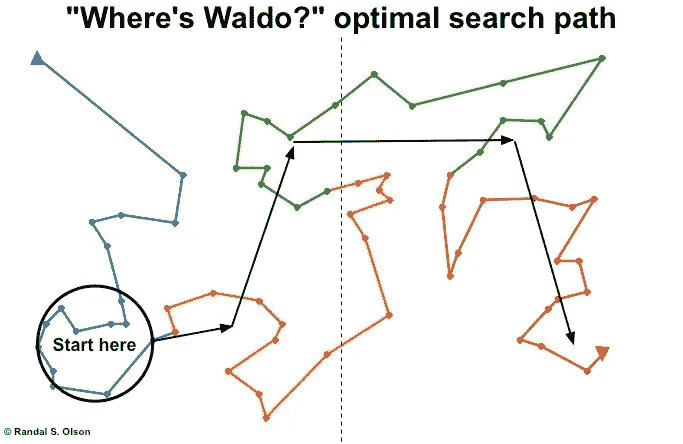

Olson’s optimal search path, determined using a genetic algorithm.

在谷歌上快速搜索一下，就能找到一些机器/深度学习解决方案来解决这个问题。最值得注意的是，宾夕法尼亚大学高级数据科学家兰迪·奥尔森的[最佳瓦尔多在哪里策略](https://www.wired.com/2015/02/created-perfect-wheres-waldo-strategy-machine-learning/)确定了在所有 68 张瓦尔多图像中找到瓦尔多的最佳搜索路径。

奥尔森的方法实际上并没有找到瓦尔多，它告诉**你**找到他的最好方法是知道他在所有 64 张图像中的位置。这是一个不同任务的伟大解决方案，一个利用瓦尔多位置的先验知识*的解决方案。其他方法只是在图像中找到 Waldo，给出他在该图像中的样子。*

*我们的目标是像人类一样找到瓦尔多。给定一张新的图像和对瓦尔多是什么的概念理解，模型应该定位瓦尔多，即使它以前从未在那张照片中见过他。*

*我把这个任务当作一个语义分割问题来处理。语义分割的目标是检测图像中的对象；它通过对每个像素进行分类来做到这一点。*

*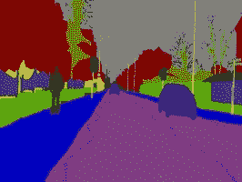*

*这张来自 [Camvid 数据集](http://mi.eng.cam.ac.uk/research/projects/VideoRec/CamVid/)的街道图像是这种工作方式的标准示例。图像中的每个像素都被标记为属于某类物体，无论是树、建筑物、汽车还是人。*

*接下来的任务是建立一个模型来预测每个像素的类别。为了检测 Waldo，我们的图像只有两类:Waldo 和 not-Waldo。*

*第一步是创建这些标签图像。我从瓦伦蒂诺·康斯坦蒂努的[系列](https://github.com/vc1492a/Hey-Waldo)中选取了 18 张沃尔多在哪里的图片，并使用[**labelImg**](https://github.com/tzutalin/labelImg)**创建了边框。***

* [## 训练图像

### 沃尔多训练图像在哪里

flic.kr](https://flic.kr/s/aHsm27sQSz) 

Zoomed in for clarity.

左边的这个边界框代表了另外 17 个:它们都正好围绕在瓦尔多的头部，并且自然地包含了一些周围的背景。传统上，对于语义分割，我们只想标记描述 Waldo 的像素。不幸的是，我不熟悉任何简单的逐个像素标记的方法，我也不认为有必要这样做。

一旦我设置了这些框，我就构建了代表非瓦尔多和瓦尔多的二进制标签图像。一般来说，这些看起来像这样:

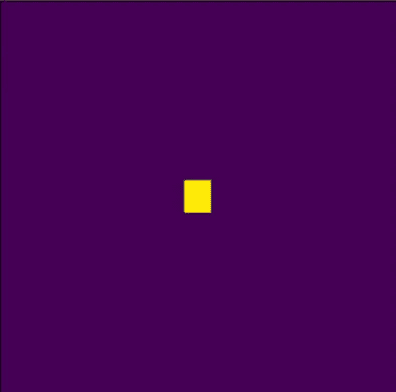

Example label image, zoomed in. Purple — no Waldo, Yellow — Waldo

太好了！现在我有了输入和目标，这是训练我们模型的基本要素。但在此之前，我们需要解决几个问题:

*   即使有适当的数据扩充(这在该领域中是有限的)，18 个图像也根本不足以充分训练神经网络。
*   这些图像太大了，即使在 Titan X 上也无法加载到内存中。
*   更糟糕的是，下采样使得这些精细的图像完全无法理解。

我通过从最初的 18 张在线图片中动态抽取 224 x 224 的子图片来解决这些问题:

*   图像尺寸为 2800 x 1760，随机水平反射，这为我们提供了大约。1.42 亿幅独特的样本图像。
*   这个图像大小在资源方面是完全可以管理的。
*   瓦尔多的头部通常为 60 x 60 像素。大小为 224 x 224 的样本很容易大到足以包含做出准确预测所需的局部信息。

第二点至关重要。提拉米苏是完全卷积的:它只利用本地信息。这意味着我们可以通过对精心管理的样本图像进行训练，来为完整的高分辨率图像(我们的主要目标)训练一个网络。当然，样本图像会有不存在于整个图像中的边缘，但是这种影响可以忽略不计。

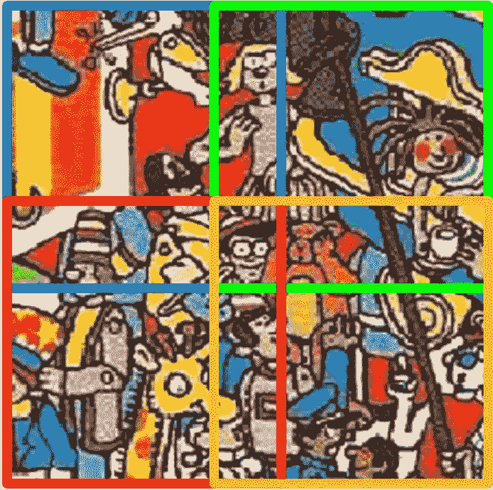

Four samples furthest from center of a “Waldo Image”, all completely contain Waldo.

关于小心管理采样:大量可能的样本图像和小批量(Titan X 上大约 6 张)意味着我必须确保每批中有适当数量的包含 Waldo 的图像。

为了做到这一点，我为每幅原作分离出 18 幅“沃尔多图像”。这些图像的构造使得每个随机的 224 x 224 样本包含一个完整的 Waldo。

我还确保当从完整的图像中取样时，我省略了任何包含 Waldo 的部分或其他图像。这有助于确保完整的图像采样产生否定结果，并避免迫使网络从无用/不完整的肯定结果中学习(例如，从仅包含 Waldo 的帽子尖端的图像中学习是没有用的)。* 

*现在我们已经理解了我使用的数据生成过程，让我们来谈谈模型。*

*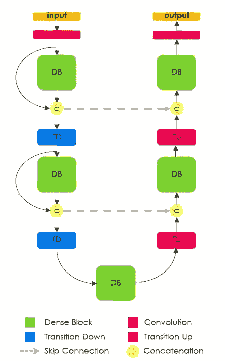*

***1\.** [https://arxiv.org/pdf/1611.09326.pdf](https://arxiv.org/pdf/1611.09326.pdf)*

*如果你不熟悉被称为提拉米苏的全卷积 DenseNet，我强烈推荐阅读 Jégou et。al 的原创论文[一百层提拉米苏:用于语义分割的全卷积 DenseNets】。](https://arxiv.org/abs/1611.09326)*

*对于实际的用法和指导，我也强烈推荐看一看杰瑞米·霍华德的[实现](https://github.com/fastai/courses/blob/master/deeplearning2/tiramisu-keras.ipynb)，作为 [fast.ai](http://fast.ai) 课程[程序员前沿深度学习第二部分](http://course.fast.ai/part2.html) ( **完全披露:**作为我在 [fast.ai](http://fast.ai) 实习工作的一部分，我用完整的描述注释了这个实现和其他实现。*

*如果您对这个领域相当熟悉，那么原始论文中的图表应该足以解释这个架构的本质。本质上，提拉米苏是语义分割中常用的 [**U-Net**](https://arxiv.org/abs/1505.04597) 架构与 [**DenseNet**](https://arxiv.org/abs/1608.06993) 中发现的前向层连接的优势的结合。*

*我使用 RMSProp 和分类交叉熵损失来训练这个网络。显然，包含 Waldo 的像素是稀疏的。我可以用两种方法来减轻这种阶级不平衡的影响:*

*   *通过控制生成器是否产生正/负图像，我能够在训练批次中以 2:1 的比例对正图像进行上采样。*
*   *我用负类损失频率的倒数来衡量它。*

*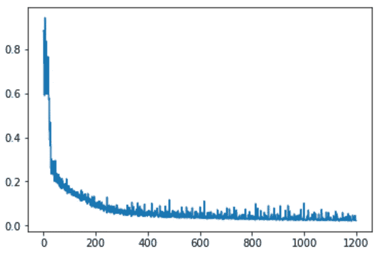*

*Loss vs Iterations*

*经过大约一个半小时的训练，我取得了一些可喜的成绩。*

*似乎这个模型很快就对大多数分类做出了决定。当然有很多噪音，这与在线数据生成是一致的。*

*我怀疑，如果我想出一种简单的方法，在不替换 **的情况下，从 1.42 亿张可能的图像**中进行采样，收敛会更加顺畅。**我没有，所以模型不断看到全新的图像，尤其是从完整图像中取样的底片。***

*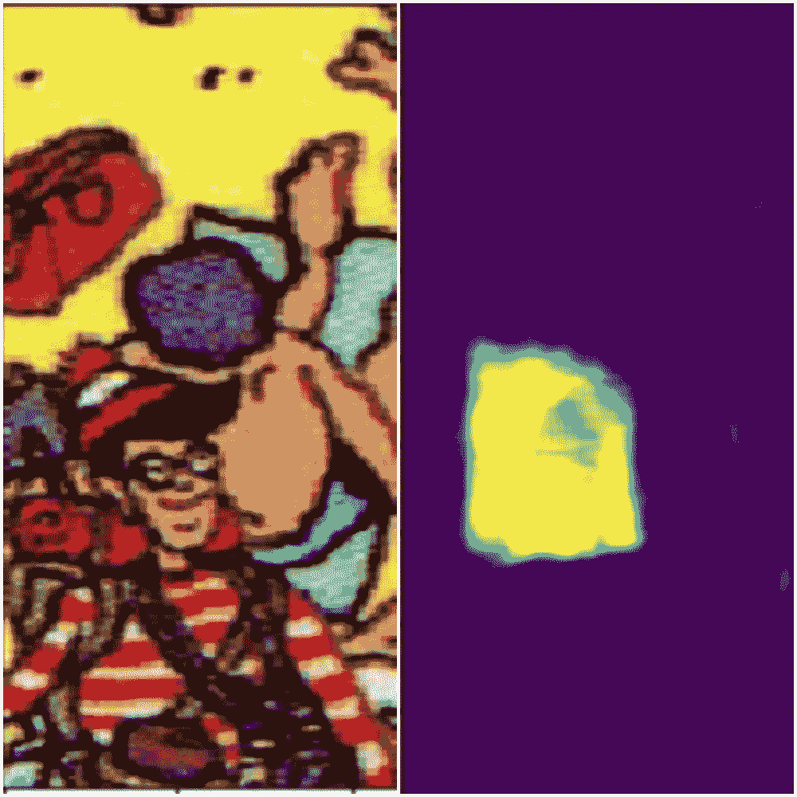*

*It’s learning…*

*从质量上讲，我们得到了非常令人鼓舞的结果！*

*在训练的早期阶段，很明显模型已经开始学习 Waldo 在哪里，同时有效地筛选出背景。*

*这是个好消息！以前的几个模型无法处理阶级不平衡，最终以零敏感度告终。在这个早期阶段看到这些结果说服了我继续通宵训练这个模型。*

**

*Difficulty with negative space.*

*经过一夜的训练，我注意到尽管这个模型已经变得非常敏感，但它在处理负面信息时仍然有些困难。鉴于底片的采样空间很大，我估计这是因为模型没有看到足够多的完整图像。*

*在平衡了正负批处理比率并训练了另外 2000 次迭代之后，我终于取得了一些显著的结果。我能够通过从预测中创建一个透明遮罩并将它们覆盖在原始图像上来可视化我的模型的性能。*

*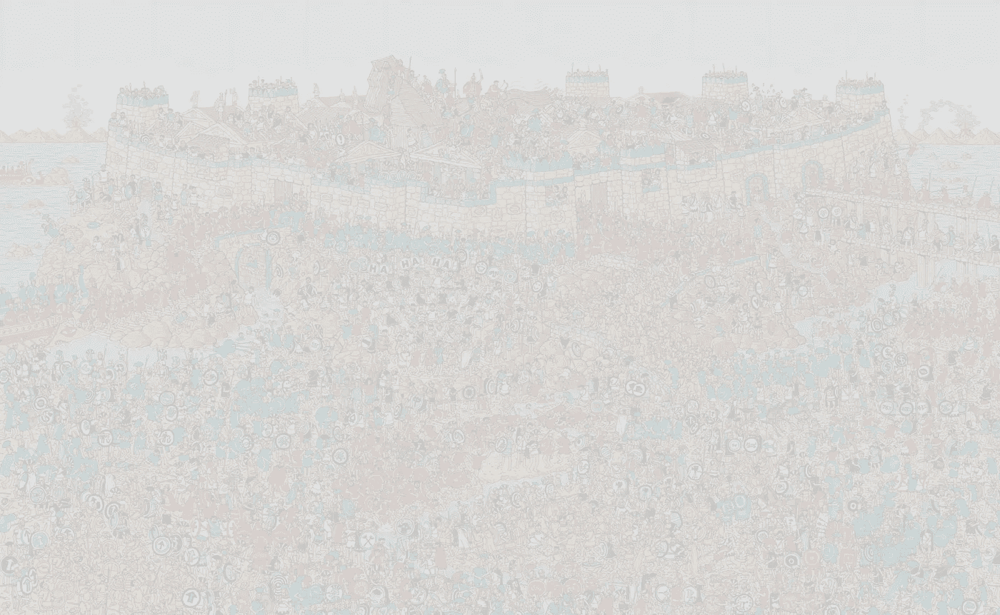*

*Prediction as transparency mask over original.*

*是的，左上角的那个小点就是瓦尔多(讽刺的是，他正是奥尔森建议你开始搜索的地方)。我想强调的是，这不是一张**四舍五入的二元**透明贴图，这些是**原始预测值**。我们可以看到这个模型对它的预测有多么有信心。特写:*

*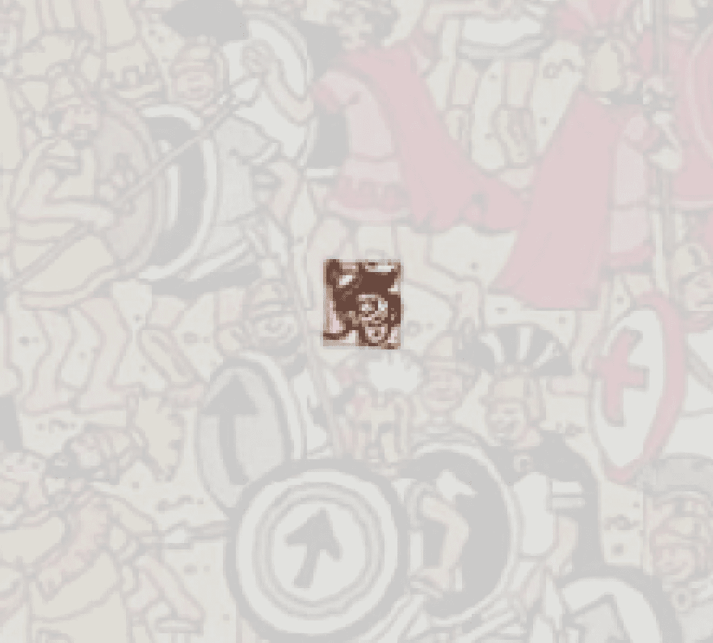*

*我对这种表现非常满意，这在整个训练集中是一致的。自己看吧！*

* [## 训练预测

### 训练集上的 Waldo 预测

flic.kr](https://flic.kr/s/aHsm6dP8sz) 

快速浏览一下训练预测将会告诉您一些事情。

*   该模型已经学会在所有图像中找到瓦尔多
*   这个模型对它的预测非常有信心。
*   该模型有时也会定位其他人物，特别是**文达**

文达是瓦尔多的女性对手:

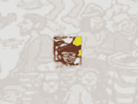

Wenda

在训练集中的大多数解析中，她看起来非常相似，如果不完全像 Waldo 的话。对于电视网来说，这是一个完全合理的错误。由于 Wenda 是一个阴性样本，她的图像不太可能经常被采样；当模特看到她时，她会以为是沃尔多。如果我们在训练中增加她的出现，我相信模特会学着忽略她。

当然，真正的任务是看电视网是否已经学会**概括**瓦尔多的概念，并能够在一张新的照片中找到他，这是**以前从未见过的**:

 [## 测试图像

### 看不见的沃尔多测试图像在哪里

flic.kr](https://flic.kr/s/aHsm2umwRy) 

示例:

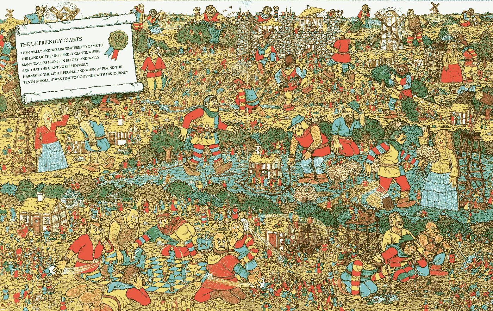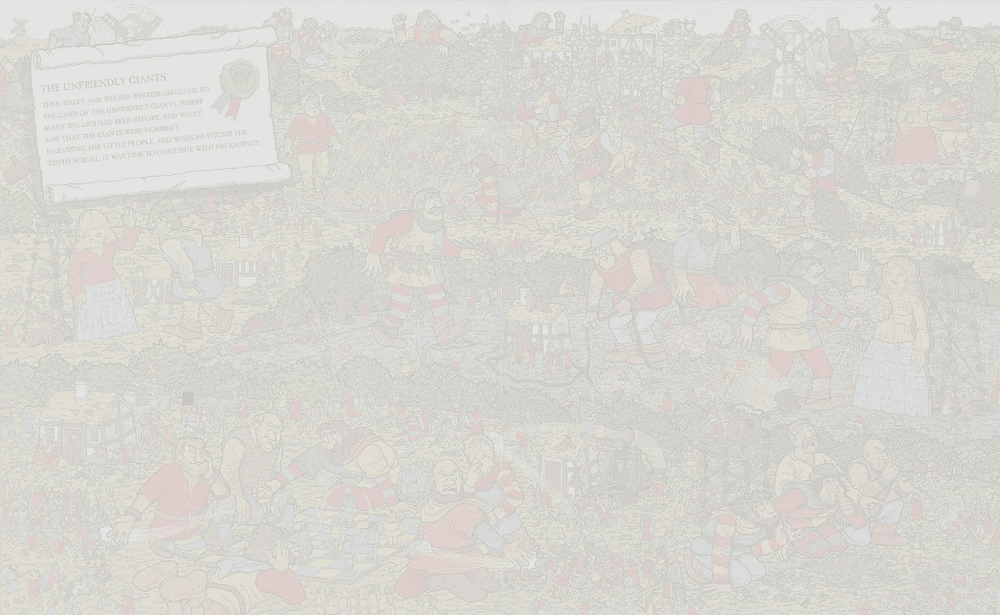

哇！太好了！！！我已经永远解决了沃尔多。

好吧，**不算真的**。我测试的 8 张图片中有 2 张没有阳性结果。

然而，剩下的 6 个人准确而自信地找到了沃尔多、文达或两者。此外，所有图像在负空间中都没有噪声；有假阳性，但没有不确定的“云”。

 [## 测试图像预测

### 对测试图像的预测

flic.kr](https://flic.kr/s/aHsm2dE6cw) 

因此，尽管这个模型并不完美，但它足以证明这个任务**是可以用这个方法**解决的，更重要的是，它是**可推广的**。

我毫不怀疑:

*   完整的数据集
*   正确验证
*   智能批量采样
*   广泛的超参数调整

还有很多空闲时间，有人可以训练一个防弹的沃尔多模型在哪里。

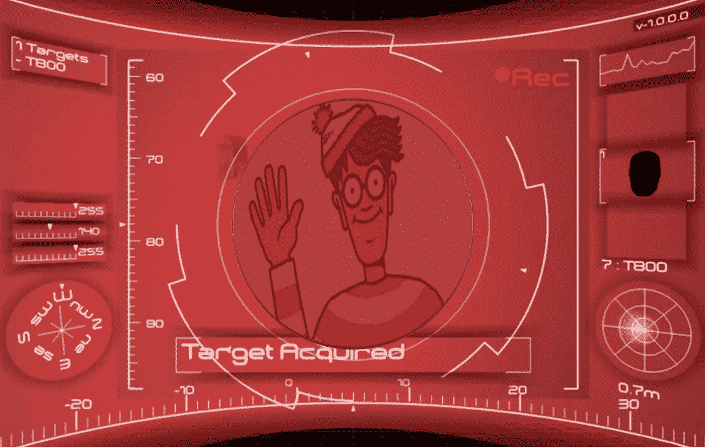

最后一点。

在对 224 x 224 个样本进行训练时，对于我如何准确地为整个图像产生这些预测，可能会有一些困惑。当然，理论上，像提拉米苏这样的完全卷积网络可以处理全尺寸图像。不幸的是，在实践中，原始图像太大，无法加载到内存中，对其进行下采样会破坏分类所需的细节。

我的解决方案是将每张图片的尺寸调整到可以被 224 整除的下一个最大尺寸，然后将它分割成单独的面板，每个面板为 224 x 224。然后，我对这些面板中的每一个进行预测，并将它们重新组合在一起，作为最终的输出。

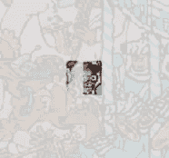

Waldo at panel border

总的来说，与对整个图像的理论预测相比，这样做的危害是可以忽略的，因为这些子面板足够大，可以包含预测所需的信息。

唯一有问题的时候是当镶板真的分开沃尔多的时候。我肯定有办法避免这种情况，但我发现这种方法已经足够好了。

说到方法，你可能想知道为什么我没有在这个任务中使用包围盒回归。同样，这些图像太大，下采样会破坏信息。不仅它们太大，而且盒子可能相对太小。

*可能真正起作用的是分割成面板，将面板整体分类为包含或不包含 Waldo，然后在包含 Waldo 的面板上回归边界框。但那是一个比这个更复杂的方法。*

就是这样！我希望你喜欢这一点，如果你想更深入地了解我的端到端过程，包括代码，请查看我的这个项目库，[有瓦尔多](https://github.com/bckenstler/TheresWaldo)。

如果你是深度学习的新手，或者希望获得高级架构和应用的最新信息，我强烈推荐 [fast.ai](http://fast.ai) 的深度学习 [Part 1](http://course.fast.ai/) 和 [Part 2](http://course.fast.ai/part2.html) 。*