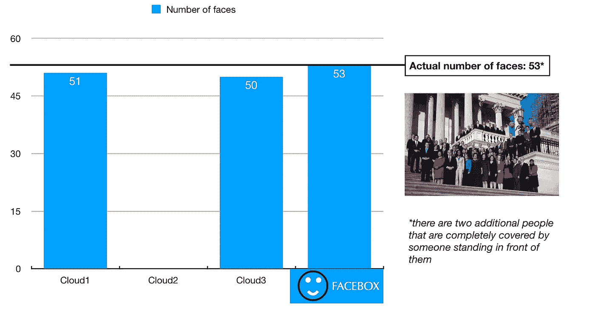
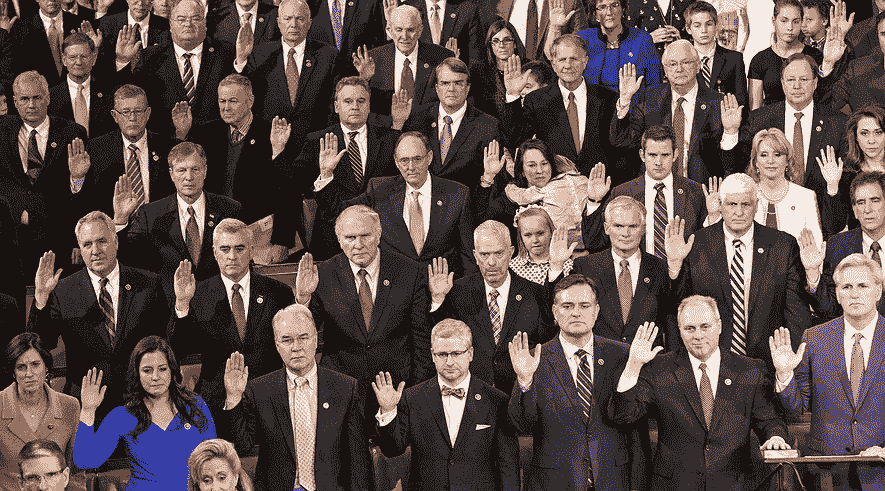
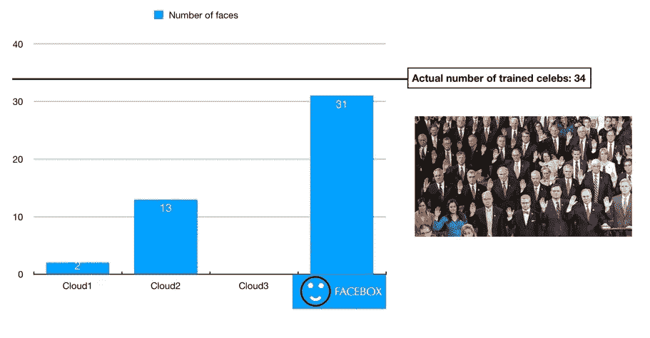
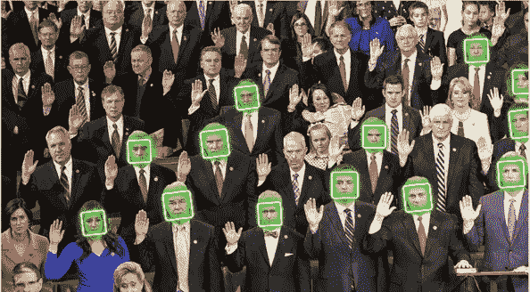
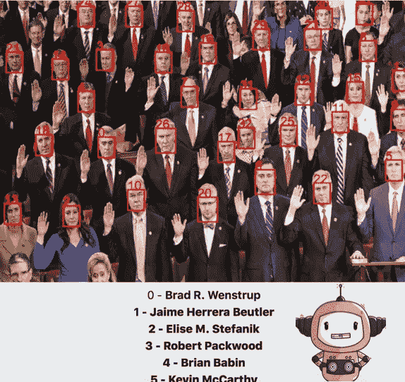

# 哪种人脸识别技术表现最好？

> 原文：<https://medium.com/hackernoon/which-face-recognition-technology-performs-best-c2c839eb04e7>

我将我的初创公司的人脸识别技术与 3 家大型云供应商进行了比较。结果如下。

我最近加入了一家名为 [Machine Box](https://machinebox.io) 的初创公司，我做的第一件事就是在三家大型云供应商面前测试我们的技术。毕竟，机器学习只有在准确的情况下才有用。

这些云厂商提供机器学习即服务(有时也称为认知服务)。它们通常对每个 API 调用收费，并要求将数据(如图像)发送到公共 API 端点。

Machine Box 的一个关键价值主张是它可以在本地运行。无需将数据发送到基础架构之外。但是机器盒子在准确性上能和大家伙相比吗？我想弄清楚。

为了简单起见，我决定比较面部识别技术。机器盒子的面部识别技术叫做 [Facebox](https://blog.machinebox.io/streaming-and-recognize-people-from-a-webcam-with-go-and-facebox-acea645b94ab) 。我挑选了一张有很多人脸的图像，并在 [Facebox](https://machinebox.io/docs/facebox) 中运行，看看它准确地检测到了多少张人脸。然后，我通过大型云供应商的认知服务运行了相同的图像。这些是我的结果:

Facebox detected more faces than the other big cloud vendors’ machine learning services

Facebox 能够捕捉到照片中没有被遮挡的每一张脸。三个云供应商中的两个接近了，但是错过了一些。一个小贩没有看到任何面孔。

接下来，我想比较这些技术的名人识别能力。我使用[一次性教学](https://blog.machinebox.io/machine-learning-model-training-vs-machinebox-teaching-f959f5fa4635)对每一位美国政客进行 Facebox 训练，然后从互联网上随机挑选了一些美国众议院议员的照片。

GOP members of the US House of Representatives

我把照片贴到了 Facebox 和同样的三家云厂商。结果如下:

Comparing Machine Box’s celebrity recognition to 3 big cloud vendors

Facebox 的表现甚至好于预期。奇怪的是，在早期测试中未能检测到任何人脸的云供应商却能够在这张照片中找出一个已知的人。

Cloud vendor number 2

第一个云供应商认出了两个成员。第三家云供应商不提供名人识别服务，也没有任何简单的方法来训练已知的人。

Facebox recognizes almost every member of the House in this photo

Facebox 挑选了除少数议员之外的所有议员。

当考虑面部识别或名人检测时，考虑机器盒子可能是明智的。