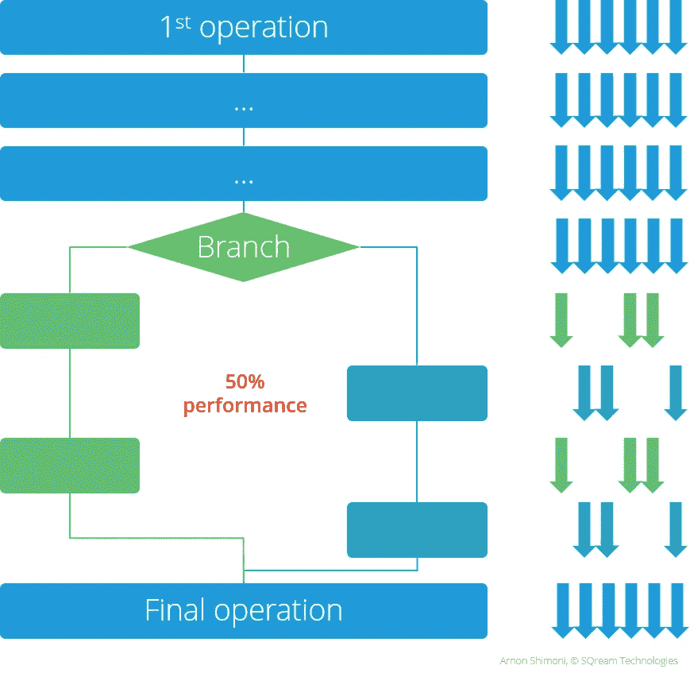
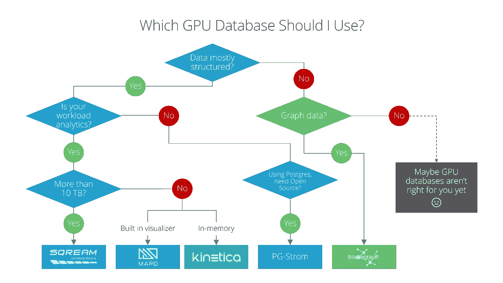

# 哪个 GPU 数据库适合我？

> 原文：<https://medium.com/hackernoon/which-gpu-database-is-right-for-me-6ceef6a17505>

GPU 数据库是数据库世界中最热门的新事物，也是自 5 年前 Hadoop 出现以来最具创新性的趋势。

下面是如何找到适合你的 GPU 数据库的指南。

# 什么是 GPU 数据库？

简单来说，GPU 数据库是一种关系型或非关系型的数据库，它使用 GPU(图形处理单元)来执行一些数据库操作。例如，GPU 数据库通常很快。随后，GPU 数据库在处理许多不同类型的数据或更大量的数据时更加灵活。

大多数 GPU 数据库倾向于专注于分析，他们向一个在 Hadoop 上大数据分析方面被过度销售的市场提供它。

事实是，Hadoop 不是为关系数据分析而设计的，然而 Hadoop 的广泛使用导致了许多旨在实现这一目标的项目的创建，结果好坏参半。Hadoop 现在已经过了它的宣传周期，现在正进入“生产力高原”阶段。

# 充分利用 GPU

GPU 和 CPU 可以很好地合作，当两者都利用其独特的优势时，但这不仅仅是为了性能。

事实上，GPU 的不同架构使其不适合执行特定的操作，如可能因内容而异的文本操作。因为(数千个)GPU 核心喜欢以相同的方式工作，所以拥有会导致代码行为不同的内容将导致性能显著下降——本质上变成部分顺序而非严格并行(在 Nvidia 的 CUDA 中称为分支发散)。

GPU 擅长对许多流中的大量数据执行(相对简单的)重复操作。如果分支分叉，操作启动太少的流(内核)，或者操作不能并行化，它就不能很好地工作。

Nvidia GPUs 在开发人员中如此受欢迎的原因之一是，与优化、矢量化、高效线程化的 CPU 代码相比，像推力、CUB 和现代 GPU 这样的软件包使编写高性能、并行 GPU 代码变得非常容易。

# 用于分析的 GPU

一般来说，GPU 可以用于分析管道中的各种不同阶段。它可以用作主数据库，作为处理管道的一部分，或者仅用于生成的分析数据集，例如，与 TensorFlow 这样的流行框架一起使用。

让我们来看看 GPU 可以在分析管道中提供帮助的两个主要领域。

## 用于流处理的 GPU

新的流处理解决方案，如 FASTDATA.io 的等离子引擎，可以利用 GPU 对进出数据库的数据进行流处理(无论是否使用 GPU)。该工具可用于在 GPU 上执行流数据的分析和/或转换。

FASTDATA 引擎的主要竞争对手是支持 GPU 的 Spark，它是 IBM 的开源插件。

## 用于分析的 GPU 数据库

除了 PG-Strom 和 Brytlyt 之外，其他所有 GPU 数据库都是专门为分析而构建的，PG-Strom 和 Brytlyt 通过增加 GPU 感知部分来改造开源 Postgres RDBMS。

Blazegraph 是另一个例外，因为它是为图形操作而设计的。

这给我们留下了四个玩家，主要处理关系型、结构化的分析，使用 SQL 接口。

下面的图表应该有助于您了解这些 GPU 数据库中哪一个适合您:

## 用于分析的 GPU 数据库

*   [SQream DB](https://sqream.com)
*   [Omnisci](https://www.omnisci.com/) (原 MapD)
*   [Kinetica](http://www.kinetica.com)
*   [BlazingDB](https://blazingdb.com/)
*   [HeteroDB](http://heterodb.com/) (以前的 PG-Strom)
*   [Blazegraph](https://www.blazegraph.com/)

## 用于流处理的 GPU

*   [FASTDATA.io](https://www.fastdata.io/)
*   [IBM Spark GPU](https://github.com/IBMSparkGPU)

> [黑客中午](http://bit.ly/Hackernoon)是黑客如何开始他们的下午。我们是 AMI 家庭的一员。我们现在[接受投稿](http://bit.ly/hackernoonsubmission)并乐意[讨论广告&赞助](mailto:partners@amipublications.com)机会。
> 
> 如果你喜欢这个故事，我们推荐你阅读我们的[最新科技故事](http://bit.ly/hackernoonlatestt)和[趋势科技故事](https://hackernoon.com/trending)。直到下一次，不要把世界的现实想当然！

