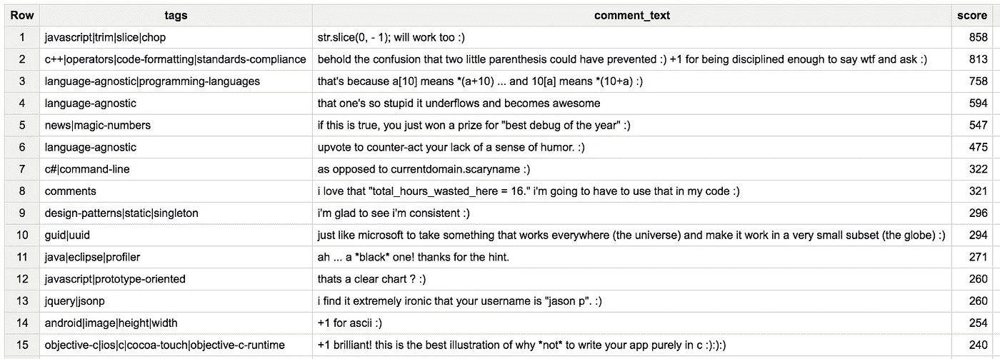
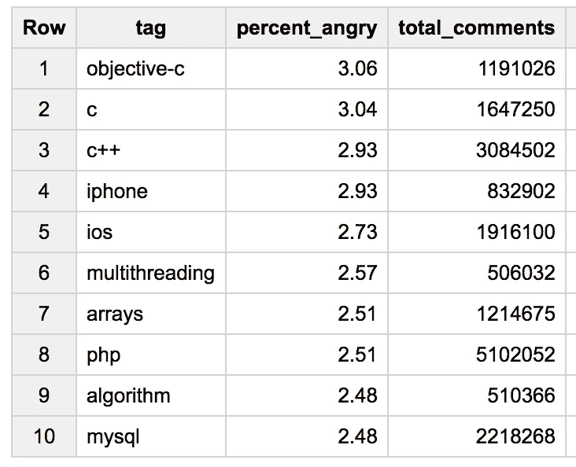
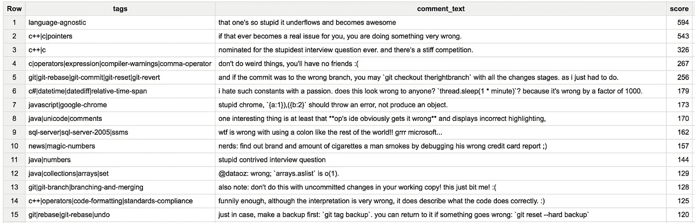

# 哪些编程语言拥有最快乐(也最愤怒)的评论者？

> 原文：<https://medium.com/hackernoon/which-programming-languages-have-the-happiest-and-angriest-commenters-ebe91b3852ed>

现在已经是冬天了，那么还有什么比一边喝着热巧克力，一边在 BigQuery 中查询新的[堆栈溢出数据集更好的呢？它拥有每一个堆栈溢出问题、答案、评论等等——这意味着数据处理的无限可能性。受](https://cloud.google.com/blog/big-data/2016/12/google-bigquery-public-datasets-now-include-stack-overflow-q-a)[帖子](https://medium.com/u/279fe54c149a#.3b7kldtci)的启发，我想看看[评论表](https://bigquery.cloud.google.com/table/bigquery-public-data:stackoverflow.comments?pli=1&tab=schema)(5300 万行！).

# 最开心的栈溢出标签:)

为了衡量快乐的评论，我查看了正文中带有“谢谢”、“谢谢”、“棒极了”或“:)”的评论。我将分析限制在超过 50 万条评论的标签上。下面是[的查询](https://bigquery.cloud.google.com:443/savedquery/513927984416:b3cc596db5ed4ab4bf03fde8f04087c4):

```
#standardSQL
SELECT 
  tag, 
  ROUND((COUNT(case when comment_text like '%thanks%' or comment_text like '%:)%' or comment_text like '%thank you%' or comment_text like '%awesome%' then 1 end) / COUNT(*)) * 100,2) as percent_happy, 
  COUNT(*) total_comments
  FROM (
    SELECT
      LOWER(a.text) as comment_text, 
      SPLIT(b.tags, '|') as tags 
    FROM `bigquery-public-data.stackoverflow.comments` a
    JOIN `bigquery-public-data.stackoverflow.posts_questions` b
    ON a.post_id = b.id
    UNION ALL
    SELECT
      LOWER(b.text) as comment_text, 
      SPLIT(c.tags, '|') as tags 
    FROM `bigquery-public-data.stackoverflow.posts_answers` a
    JOIN (
     SELECT post_id, text FROM `bigquery-public-data.stackoverflow.comments`
    ) b
    ON a.id = b.post_id
    JOIN `bigquery-public-data.stackoverflow.posts_questions` c
    ON c.id = a.parent_id
), UNNEST(tags) tag
GROUP BY 1
HAVING total_comments > 500000
ORDER BY percent_happy DESC
```

下面是 BigQuery 中的结果:


图表显示:

根据这个列表，r、Ruby、HTML / CSS 和 iOS 是评论者最快乐的社区。询问 XML 和正则表达式问题的人似乎也特别感谢帮助。如果你很好奇，这里有 15 个得分最高的快乐评论，它们足够短，可以放在一个屏幕截图中(以及它们的相关标签) :



但是因为人们有时会在网上生气，你可能想知道…

# 最愤怒的堆栈溢出标签:(

对于愤怒的评论，我统计了那些正文中带有“错误”、“恐怖”、“愚蠢”，或者“:(”的。SQL 与上面的相同，只是交换了搜索词。结果如下:



图表显示:

显然，最愤怒的评论是那些与 C 衍生品相关的评论。许多编程概念也在这里结束:多线程、数组、算法和字符串。以下是得分最高的愤怒评论:



这个分析并不完美，因为评论“一个人如此愚蠢，以至于它下溢并变得令人敬畏”出现在两个列表中。这就是像[自然语言 API](https://cloud.google.com/natural-language) 这样的机器学习工具派上用场的地方。

在这两个列表之间，只有一些标签重叠。最容易激动的标签(我把同时出现在快乐和愤怒列表中的标签解释为“容易激动”)是:ios、iphone、objective-c 和 regex 问题。虽然互联网有时看起来像一个黑暗的地方，但似乎每一条愤怒的评论就有大约六条快乐的评论。

# 下一步是什么？

深入研究[堆栈溢出数据集](https://bigquery.cloud.google.com/dataset/bigquery-public-data:stackoverflow?pli=1)，或者查看一些令人敬畏的帖子以获得灵感:

*   [堆栈溢出数据集公告](https://cloud.google.com/blog/big-data/2016/12/google-bigquery-public-datasets-now-include-stack-overflow-q-a)
*   [在 BigQuery 上玩堆栈溢出](http://thedatalane.com/playing-with-stack-overflow-dataset-on-google-bigquery/)
*   总是以“？”结束你的问题

如果你对未来的分析有意见或想法，可以在 Twitter [@SRobTweets](https://twitter.com/srobtweets) 上找我。

[](http://bit.ly/HackernoonFB)[](https://goo.gl/k7XYbx)[](https://goo.gl/4ofytp)

> [黑客中午](http://bit.ly/Hackernoon)是黑客如何开始他们的下午。我们是阿妹家庭的一员。我们现在[接受投稿](http://bit.ly/hackernoonsubmission)并乐意[讨论广告&赞助](mailto:partners@amipublications.com)机会。
> 
> 如果你喜欢这个故事，我们推荐你阅读我们的[最新科技故事](http://bit.ly/hackernoonlatestt)和[趋势科技故事](https://hackernoon.com/trending)。直到下一次，不要把世界的现实想当然！

