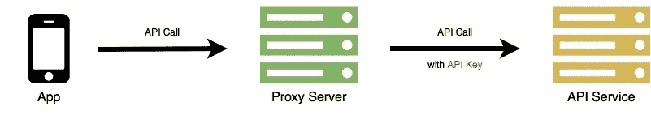
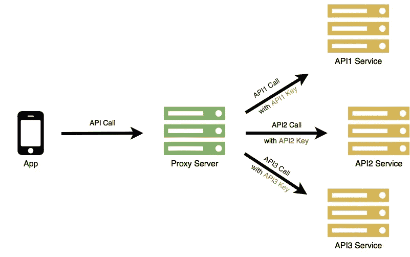
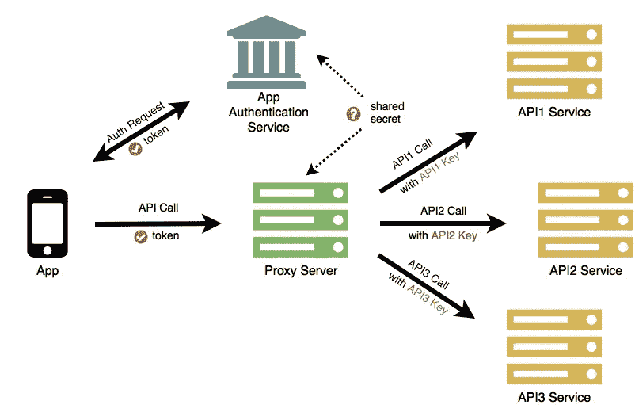

# 白名单和间接就像巧克力和花生酱一样

> 原文：<https://medium.com/hackernoon/whitelists-and-indirection-go-together-like-chocolate-and-peanut-butter-a350786f8381>

## 味道不错的应用程序和 API 安全性


source: [nourishmorelove](https://www.nourishmovelove.com/peanut-butter-chocolate-crunch-cookies/)

如果使用得当，[白名单](https://en.wikipedia.org/wiki/Whitelist)是一种简单有效的安全策略，可以最大限度地减少攻击面。如果你不在名单上，你就进不去。没有例外。像巧克力一样光滑。如果你很容易在列表中找到并伪造一个名字，使用[间接](https://en.wikipedia.org/wiki/Indirection)来增加难度。像花生酱一样粘。它们放在一起味道很棒。

# 应用白名单

白名单是仅允许访问特定资源的实体的列表。每个实体由一个或多个标识符标识，例如用户 id、ip 地址、端口号或 API 密钥。重要的是，这些标识符指定唯一的实体，并且这些标识符不能被其他实体轻易模仿。

如果允许的实体列表很小并且变化很慢，那么维护列表是非常实用的。例如，如果您提供一个通过 API 与后端服务通信的医疗保健移动应用程序，那么您的授权应用程序白名单由您的移动应用程序的已发布和已批准版本组成。随着功能的添加和停用，可以在列表中添加和删除版本。只有当 API 调用包含白名单中的应用版本标识符时，才会被允许。

应用程序经常对各种不同的服务进行 API 调用。什么是好的白名单标识符？

# 谷歌地图 Android API

要使用[谷歌地图应用编程接口](https://developers.google.com/maps/)，你必须在谷歌应用编程接口控制台上注册你的应用程序项目，并获得一个谷歌应用编程接口密钥，你可以将它添加到你的应用程序中。在网页上，您可以调用地图服务，并附加您的 _API_KEY:


```
[https://maps.googleapis.com/maps/api/staticmap?](https://maps.googleapis.com/maps/api/staticmap?)
     center=Brooklyn+Bridge,New+York,NY
    &zoom=13&size=600x300&maptype=roadmap
    &markers=color:blue%7Clabel:S%7C40.702147,-74.015794
    &markers=color:green%7Clabel:G%7C40.711614,-74.012318
    &markers=color:red%7Clabel:C%7C40.718217,-73.998284
    &key=**YOUR_API_KEY**
```

使用静态 API 键作为应用程序或开发人员标识符是非常常见的，但它有多安全呢？有两种基本类型的攻击，对应用程序代码进行逆向工程以找到 API 密钥，以及在 API 调用期间观察传输中的 API 密钥。

在网页上，找到 API 键可能就像在浏览器中查看页面源代码一样简单。在 Android 应用程序中，谷歌建议将密钥放在清单文件中，但这很容易被反编译 APK 的[读取。即使谷歌地图 API 调用使用 HTTPS，如果你能发动一次](https://ibotpeaches.github.io/Apktool/)[中间人攻击](https://www.owasp.org/index.php/Man-in-the-middle_attack)，你就能直接观察到正在传输的 API 密钥。

你可以试着通过混淆或编码来隐藏 API 密钥，但这只会减慢坚定的攻击者的速度。对于 Android maps API，谷歌建议限制访问签名应用的指纹，但这最终只是第二个静态密钥来确定，更困难，但不是不可能。

# API 网关

人们经常引用大卫·惠勒的话[“计算机科学中的所有问题都可以通过另一种间接方式来解决。”](https://en.wikipedia.org/wiki/Fundamental_theorem_of_software_engineering)所以，如果隐藏静态 API 键很难，为什么不把它们从应用程序中移走，放在代理服务器后面，这样可以间接为你调用？



使用这种配置，客户端应用程序在没有 API 键的情况下进行 API 调用，代理服务器重定向 API 调用，附加适当的 API 键。密钥不会存储在应用程序中，也不会在客户端和代理之间传输。

这是一个好的开始，但我们真的有所收获吗？虽然我们已经从应用程序中删除了 API 密钥，但现在任何人都可以调用代理，除非我们为代理服务器创建一个新的应用程序白名单，这意味着一个新的静态标识符，我们将称之为共享应用程序秘密。听起来好像又是同样的问题。

然而，大多数应用程序对多个第三方服务进行 API 调用。现在，至少所有这些服务的 API 密钥都可以在代理后面得到保护。这使得单个应用程序的安全性变得更加重要，但现在所有的 API 服务都可以集中管理。API 密钥可以独立于应用程序进行更新，使用情况可以集中记录并限制费率。大多数商业和开源 API 网关都提供了这些特性的最佳实践实现。



# 应用认证服务

让我们为剩下的共享应用程序秘密再尝试一个间接级别。这一次，我们将对真实应用程序的识别委托给外部服务。

API 代理和认证服务都知道 app secret，但不会直接与 app 本身共享。相反，如果认证成功，应用程序秘密被用于[加密签名](https://jwt.io/)应用程序认证令牌，该令牌被返回给应用程序。然后，应用程序通过每次 API 调用将令牌传递给 API 网关。在将 API 调用以及适当的 API 密钥重定向到第三方服务之前，API 网关使用 app secret 验证令牌签名。



虽然秘密是静态的，但令牌却不是。通过设置到期时间、限制令牌的使用次数或两者兼而有之，令牌的生命周期可能会非常短。这样，如果令牌不知何故被盗，它的价值就相当有限。当每个令牌过期时，应用程序可以请求新的身份验证并接收新的令牌。

此外，认证服务本身可以随时间发展，改进认证策略和/或向令牌添加额外的二级标识符。

定期验证应用程序身份并返回有时间限制的令牌是间接方式优于静态标识键的一大优势。

# 实用的实现

在 CriticalBlue，我们将白名单与间接相结合，为移动应用构建了[approv](https://approov.io)应用认证服务。使用 Approov，只有正版授权的 app 才能调用你的后端 API。

首先将 Approov SDK 放入应用程序中，以启用与身份验证服务的通信。接下来，将您的应用程序注册到身份验证服务，该服务支持强应用程序证明，并生成在服务和后端服务器或 API 网关之间共享的应用程序机密。

要观看它的运行，你可以下载并尝试安卓或 iOS 版的[应用程序演示](https://approov.io)。要了解更多细节，你可以跟随[的移动 API 安全实践教程](https://hackernoon.com/hands-on-mobile-api-security-get-rid-of-client-secrets-a79f111b6844)，该教程展示了如何使用 API 代理服务器和认证服务来移除应用程序中的所有秘密。

将应用认证服务与用户认证服务(如[OpenID-Connect](http://openid.net/connect/)/[oauth 2](https://oauth.net/2/))相结合，可以极大地减少单独使用用户认证时出现的攻击面。

Android 可能有它的好处，但对于应用程序和 API 安全来说，白名单和间接是它们自己的味道。

感谢阅读！如果你能推荐这篇文章(点击❤按钮)，让其他人也能找到，我将不胜感激。