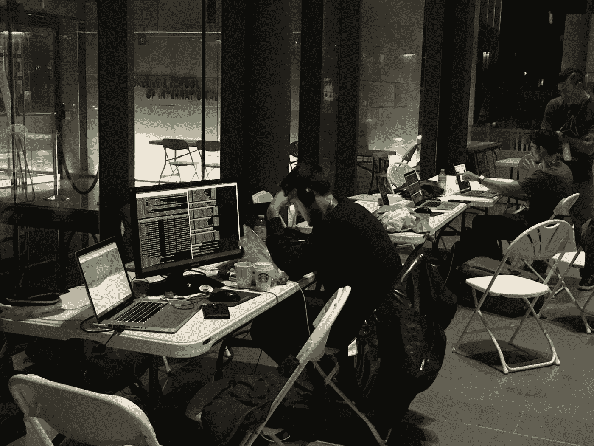

# 区块链是谁？

> 原文：<https://medium.com/hackernoon/who-is-blockchain-5a95b3dfef62>

ETHWaterloo hackathon participant trying to figure out who is Blockchain

两周前，我几乎不知道以太坊是什么。我知道它不同于[比特币](https://hackernoon.com/tagged/bitcoin)，有很多公司在做 ICOs(初始硬币发行)或者现在被称为 TGEs(代币生成事件)。我记得在我们公司的[区块链](https://hackernoon.com/tagged/blockchain)会议上，我突然问道:

**这些钱从哪里来？
乙醚(ETH)是多少？
这是泡沫吗？**

我得到的答案是，嗯…有一群人在写白皮书，然后向人们要钱，这样他们就可以建设未来。我回答，WTF 所以他们连个产品都没有？

**没有…**

只是一群理想主义者，他们对未来有着哲学观点。通过出售他们的代币/硬币，他们将能够资助他们的项目。

> **这和在沃尔玛外面摆桌子卖少女指南饼干有什么区别？**

1.  你不能吃这些代币/硬币
2.  代币/硬币数量有限
3.  每个代币/硬币都不能被复制或再造

我要让你稍微理解一下…你知道你口袋里的钱，是从政府拥有的机器上印出来的。如果他们需要更多，他们可以打印更多(不是一个好主意，但这是可能的)。

区块链上生成的代币/硬币数量有限，一旦用完，就真的用完了。这些代币中的每一个都有一定的价值，这是由市场决定的，除了存储货币价值之外，它还有什么用途。

好了，现在你大概理解了什么是代币/硬币，你需要理解它是如何有限的、不可变的和完全安全的。

> **代币/硬币不就是可以在亚马逊上消费的 PayPal 钱吗？**

**否…**

赋予这些代币/硬币特殊能力的是在后台运行的技术，称为区块链(决定这些代币效用的系统/规则)。

下面是我对什么是区块链的简单解释

想象一下，公司、餐厅、房间里的每个人口袋里都有一张纸。在这张纸上，每一笔交易都有记录。所以…如果鲍勃给安吉拉一个苹果当午餐，每个人都会拿出这张纸并写下来。

现在这看起来像什么？鲍勃给了安吉拉和苹果，史蒂夫把它写在了他的书上。妮可给了亚历克斯一根香蕉，史蒂夫会把它记在他的书上。

> 你看出两者的区别了吗？一个是分散，一个是集中。

在这个比喻中，纸张是一台计算机。每台电脑将下载一份分类账，每 10 秒钟更新一次所有新交易。这意味着比特币的第一个交易区块(又名“创世纪区块”)仍将在 9 年后出现，并将永远存在。你的签证声明或纸质收据也是如此吗？

**交易链中的区块:
【区块 1】→【区块 2】→【区块 3】**

假设你想黑一个区块链，偷一大笔钱。唯一的方法就是控制 51%的电脑。你可以通过在北美释放流星风暴，摧毁大部分电脑和所有的网络塔来做到这一点。或者，你可以尝试一个接一个地侵入数百万台电脑，试图控制 51%或更多。

简而言之，不能(虽然量子计算机似乎可以做到这个黑魔法)。

然而，有一点需要注意……有黑客攻击，但不是在区块链，而是在交易所(人们交易硬币的地方)。大多数黑客攻击是由于人为错误，这和任何事情都一样。如果你在咖啡店里把你的银行账户密码留在一张纸上，如果第二天几百万美元不见了，不要感到惊讶。

**这些钱从哪里来？**

那些在比特币只有几分钱的时候挖掘或购买比特币的人现在正在将他们的硬币转换成不同的代币。简而言之，他们将新财富投资于其他加密货币(ETH、NEO、BAT、LTC 等)。越来越多的人聚集更多的资金，使市值增加到 1700 亿美元(相当于苹果的 21%)。每天都有新的平台建立起来，帮助你将辛苦赚来的美元转换成甜蜜的加密货币。

**乙醚(ETH)是多少？**

现在是 309.35 美元，如果你在今年 3 月买的话，它的价格是 15.76 美元。现在需要注意的一点是，这个市场非常不稳定，很多代币都是骗局，一文不值。有大量的猜测，人们跳上火车告诉人们加密货币是黄金标准。这是谎言。令牌的价值在于能够开发一个社区和一个平台，供其他人在其上构建(至少从以太坊之类的角度来看)。

**这是泡沫吗？**

很不幸。有一大堆没受过教育的人在假 ico 上砸钱。这很好，因为它增加了市值，但就像互联网泡沫一样，许多承诺都不会兑现。当人们给这些骗子数百万美元，期望获得巨大的投资回报时，会发生什么？嗯…我为你感到难过。你很有可能会失去这一切。那么，为什么这是一件好事呢？因为从网络泡沫破裂中诞生了像亚马逊、易趣、贝宝、谷歌这样的公司，以及你所知道的所有大型科技公司。历史可能会重演，在 dogecoin 或 jesuscoin 的废墟上，将会出现一些下一代公司，他们使用的技术可以让世界变得更美好。

我将会写更多的文章来谈论区块链的可行承诺以及它们实际上是如何工作的。

**多余的东西:**
[https://www.gettoby.com/p/33bhs3xy8879](https://www.gettoby.com/p/33bhs3xy8879)