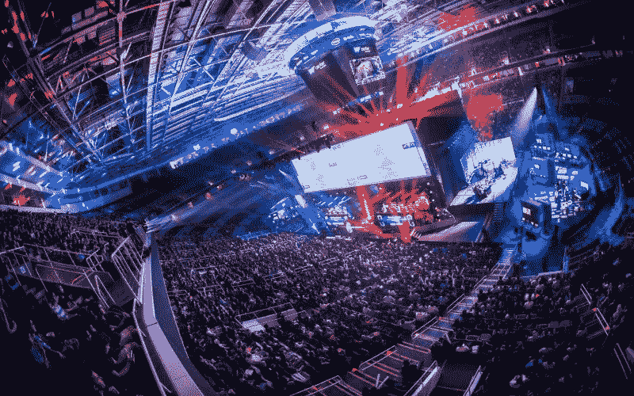
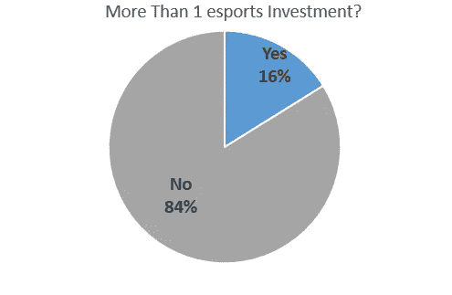
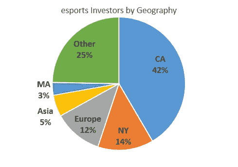

# 谁在投资电竞创业公司？

> 原文：<https://medium.com/hackernoon/who-is-investing-in-esports-startups-by-stephen-hays-of-deep-space-ventures-1efa7a55a60a>

Fans pack a stadium to watch an esports competition

正如我之前在[风险投资论文的诞生](https://hackernoon.com/the-birth-of-a-venture-capital-investment-thesis-afd2903ae12)和[为什么投资电子竞技](https://hackernoon.com/why-invest-in-esports-deab33a4835b)中所写的那样，电子竞技市场规模巨大，用户参与度极高，并且正在以天文数字的速度增长。不可思议的创始人有巨大的潜力，带着优秀的想法，建立企业，为该领域的早期投资者创造可观的回报。

# **那么，到底是谁在投资电子竞技初创公司呢？**

当我试图通过编制投资者名单来回答这个问题时，我对一些结果感到惊讶。

我找到了 421 家投资过电竞创业公司的风投、天使、加速器、家族办公室和公司(战略)。在 421 名投资者中，大多数人只在这个领域进行过一次投资(353 人只有一次投资，占 84%)。我不认为一次性投资者是真正的“电子竞技投资者”，因为许多早期投资者已经在非重点领域进行了投资，但由于这样或那样的原因，他们最终达成了交易(除了关于该领域的论文)。

Only 16% of those invested in esports have more than 1 esports investment

名单上 16%的投资者(421 人中的 68 人)投资了不止一家电子竞技创业公司。在投资过不止一个的人里，有不少值得注意的名字*(见本帖最下方最活跃的名单)*。投资过多个电竞创业公司的投资人，有些是天使或者加速器(有些比较显著，比如 [500 创业公司](https://500.co/)、 [Y Combinator](http://www.ycombinator.com/) 等。).天使投资人通常是大型风投公司的合伙人，他们随后会在融资规模扩大时投资这个领域，他们基金的最低支票规模并不妨碍投资。

Where are the esports investors located?

这一领域投资者的地理分布并不令人惊讶。大部分投资者在加州，其次是纽约和欧洲。我确实期望更多的在亚洲，因为很大比例的电子竞技市场存在于中国、韩国、日本等。

这个领域总共有 421 名投资者，这一头条数字让人们觉得每个人都在涌入电子竞技创业公司，有时，我确实感觉有些轮次被超额认购，和/或竞争激烈。然而，我仍然认为，由于缺乏定期投资该领域的机构投资者，目前该领域对投资者来说有些机会主义(尤其是在早期阶段，当然对那些有一些领域知识的人来说)。

# 电竞领域最活跃的风投有哪些？

在 68 个拥有不止一项电子竞技投资的投资者中，有 50 个是风投(18 个是天使、孵化器、加速器或战略投资者)。我在这里列出了活跃的风投(投资了不止一家电子竞技初创公司)，作为创始人和任何可能感兴趣的人的资源。如果我漏掉了什么人，请告诉我，我会更新名单。编辑这个列表是一项繁重的工作，所以我可能遗漏了一些东西(联系信息在这篇文章的底部)。

除了我在下面列出的最活跃的风投之外，我还整理了一份电子竞技初创公司的所有投资者的 Crunchbase 名单，这些投资者都有 Crunchbase 档案([链接此处](https://goo.gl/7dwTJP))。*注意:你可能需要一个 Crunchbase 账户来查看这个列表。*

下面每个风投公司的名字旁边列出了一些有代表性的投资组合公司。投资列表并不打算包含每个投资者在该领域的每笔交易，而是一个代表性的样本(并按字母顺序列出)。

1.  [Accel Partners](https://www.accel.com/) (猛禽、smash.gg、Discord)
2.  [帮凶](http://www.accomplice.co/)(玩家唤醒，Skillz)
3.  [Advancit Capital](http://www.advancitcapital.com/) (Unikrn、Blitz esports、Sliver.tv、Gamer Sensei)
4.  [放大。拉](http://amplify.la/)(战斗，阿尔法草案)
5.  [阿拉伯天使基金](http://www.arabangel.vc/)(战斗，奇迹)
6.  [BDC IT 风险投资](https://www.bdc.ca/en/bdc-capital/venture-capital/strategic-approach/pages/it-venture-fund.aspx?ref=shorturl-vcitfund) (Battlefy，Repable)
7.  [基准](http://www.benchmark.com/)(前哨站游戏，不和谐，蝎狮游戏)
8.  [Bessemer Venture Partners](https://www.bvp.com/)(Twitch，团队 Solo Mid)
9.  BITKRAFT (Kek，Boom.tv，Runtime.gg)
10.  BLH 风险投资公司
11.  [BoxGroup](http://boxgroup.com/) (Scopely，闪电战电竞)
12.  CAA Ventures (Vulcun，Sliver.tv，Kickback，Vision esports)
13.  [场边](http://courtsidevc.com/)(法奈，甘美科，急速，梁。Pro、Wavedash、VY 电竞)
14.  [CRCM 风投](http://www.crcmvc.com/) (TurningSense，FanAI，VREAL，Gamer Sensei)
15.  [Creandum](https://www.creandum.com/) (RFRSH、无敌舰队互动、Resolution、Playraven、小巨人、[未来](https://hackernoon.com/tagged/future) Play)
16.  横切风险投资 (Vulcun，超级邪恶超级公司，Blitz 电子竞技)
17.  [深空冒险](http://deepspacevc.com/) (Mobalytics，PlayVS，Haste，Battlefy)
18.  [Everblue 管理](http://www.g2esports.com/g2-esports-raises-initial-growth-capital-from-strategic-investors-across-sports-financial-and-entertainment-sectors/) (G2 电竞、Haste、Battlefy、FanAI、Epics.gg、Runtime)
19.  [第一轮](http://firstround.com/) (Boom.tv，BeyondGames，Mobcrush)
20.  [出资者俱乐部](https://fundersclub.com/)(回扣、佣金)
21.  [通用催化剂](http://generalcatalyst.com/) (Mobalytics，超恶 Megacorp)
22.  [GGV 首都](https://www.ggvc.com/) (Mobalytics，诅咒)
23.  [大橡树风险投资](http://www.greatoaksvc.com/)(回扣、爆破)
24.  格雷克罗夫特 (Scopely，Gunslinger Studios，AlphaDraft，FanAI，Sliver.tv)
25.  [赫什互动集团](http://hershfi.com/)(恩维尤斯团队，大师)
26.  指数投资公司(Index Ventures)
27.  [Javelin Venture Partners](https://javelinvp.com/)
28.  [K Cube Ventures](http://www.kcubeventures.co.kr/)(Kokomo Games，Supreme Games)
29.  [伦敦风险投资伙伴](http://www.londonvp.com/) (Dojo Madness、Future Play Games、Plexchat、Gawkbox、Polystream、Supercell、Shark Punch、Radiant Entertainment)
30.  勒德洛风险投资公司
31.  [机械商店冒险](http://machineshop.co/ventures/) (Wavedash 游戏，神仙)
32.  [宏创投](http://www.staymacro.com/) (G2 电竞，蝎狮游戏)
33.  [三月资本合伙人](http://www.marchcp.com/) (Genvid，Wavedash Games，Dojo Madness)
34.  [QB1 Ventures](https://www.qb1ventures.com/) (法耐、Gameco)
35.  [queens bridge Venture Partners](https://qbvp.com/)(alpha draft、Battlefy、Kickback)
36.  [雷恩风险投资](http://www.raine.com/)(道场疯狂，超级邪恶大公司)
37.  [Ridge Ventures](https://ridge.vc/) (前 [IDG 资本合伙人](http://www.idgvc.com/) ) (AlphaDraft，Discord)
38.  [右侧资金管理](http://rightsidecapital.com/) (GameWisp，边线，Matcherino)
39.  罗斯克里夫投资公司
40.  Rubicon 风险投资公司
41.  红杉资本
42.  Signia Venture Partners(超级邪恶的 Megacorp，Funzio，Playdom，Drifter)
43.  [社交开始](https://www.socialstarts.com/)(战斗、游街、边线、游戏翻转)
44.  [星火资本](http://www.sparkcapital.com/) (Discord，Smash.gg)
45.  纯银 VC (战利品箱，法耐，斯基尔兹)
46.  [卡夫集团](http://www.thekraftgroup.com/) (Skillz，看守联盟)
47.  [第三波数字](http://thirdwavedigital.vc/) (Battlefy，Gunslinger Studios)
48.  [前期投资](https://upfront.com/)(打劫货箱，AlphaDraft，VREAL)
49.  [远景创投合伙人](http://www.vvpllc.com/) (Echo Fox，Twin Galaxies)
50.  [火神首都](http://capital.vulcan.com/) (VREAL，Matcherino，嘲讽)

如果我漏掉了你认识的人，请告诉我，我会更新名单。我希望这可以成为电子竞技空间的创始人和投资者的资源，当有新的信息时，我会更新这个列表和相应的统计数据。

随着时间的推移，投资者的名单会发生变化。我和许多风投合作过，他们每天都在积极寻找电子竞技业务的早期和晚期融资。在未来的几个月和几年里，越来越多的投资者将最终出现在这份名单上。

[斯蒂芬·海斯](https://www.linkedin.com/in/stephen-hays-71b571101/)是一名风险投资人，已经投资了许多电子竞技团队和初创公司。

[点击这里在 Twitter 上关注斯蒂芬](https://twitter.com/hazesyah)