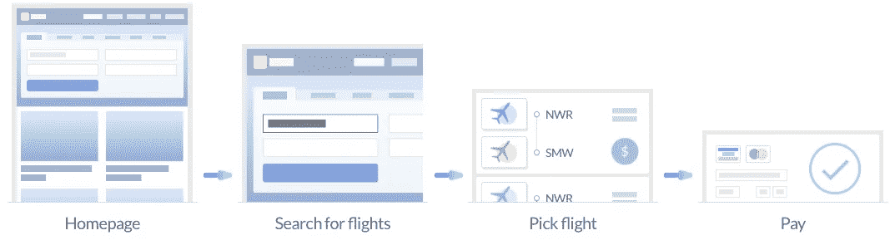
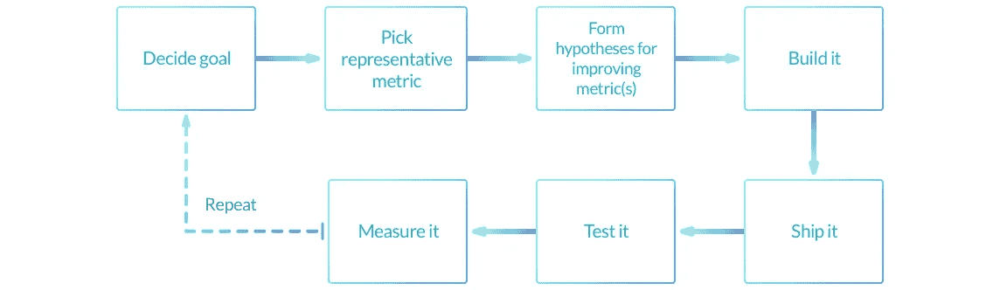
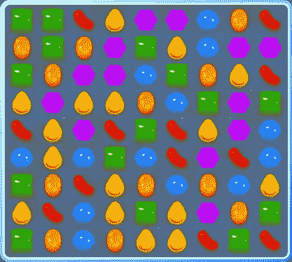
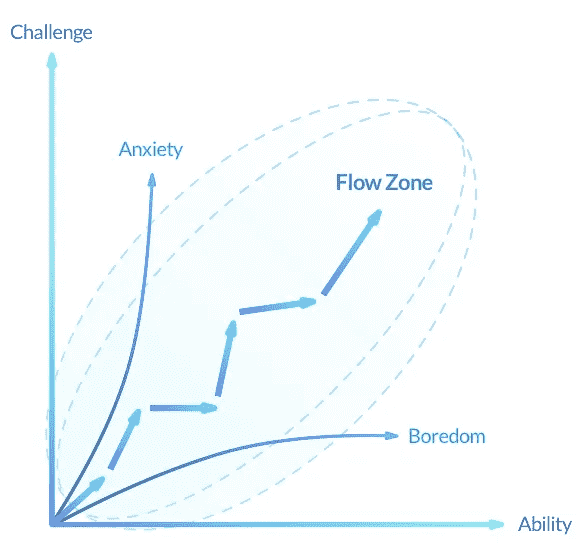
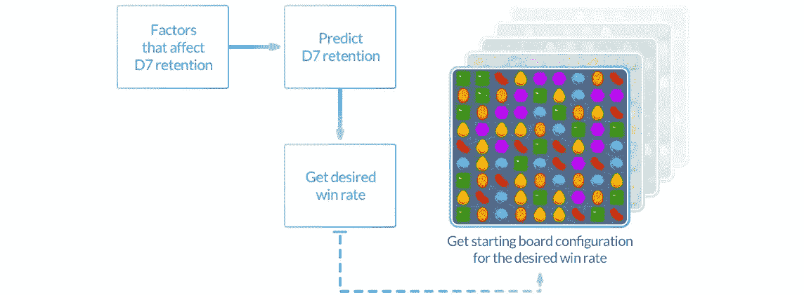

# 哇哇！ML 现在知道什么好玩了？

> 原文：<https://medium.com/hackernoon/whoa-whoa-ml-knows-whats-fun-now-95b219b9ff3b>

Picture by Jastro

乐趣是游戏中的圣杯。提供有趣的体验是制作成功游戏的基本要素。为了成功，我们需要理解和解构乐趣。

在共同创立 Product ML 之前，我是一名游戏产品经理，我试图从基本原则出发考虑这些事情。

产品经理在他们的产品中进行变更和发布特性，以实现特定的目标。这些目标是由战略优先级、战术数据分析和定性用户反馈提供的。目标由指标或 KPI 表示。

假设你是一个航班搜索网站的项目经理。用户漏斗是:

漏斗的每一步都有一个下降率。在漏斗的每一步降低这种下降率会导致更多的用户从你的网站购买机票，最终带来更高的收入。

项目管理比冰淇淋有更多的口味，所以定义典型的项目管理流程是徒劳的，但我还是要尝试一下。

当使用 [ML 来影响核心产品体验](/dynamic-game-difficulty/machine-learning-for-core-product-experience-970ce4352e0f)时，这些产品管理原则保持不变。产品团队通过他们的 ML 模型间接地影响产品。这能改变什么吗？

让我们看一个假想的 ML 驱动版本的第三场比赛游戏，比如《糖果粉碎》

这是一个 9x9 的棋盘，有 81 个可供糖果占据的位置。每个位置可以用 6 种可能的糖果填充(绿色、黄色、橙色、蓝色、红色、紫色)——好吃！当一个级别开始时，开始板可以安排在 6⁸的方式，这是大约 10⁶又名一巴吉里翁方式。每一种安排都会带来不同的难度体验。在实践中，有许多其他因素影响这种难度体验——当匹配成功时，到达棋盘上的新糖果的排列，玩家选择匹配的糖果，使用的助推器等。为简单起见，我们将只关注使用 ML 改变起始板配置。

> “生活是一场纸牌游戏。发给你的手是决定论；你玩它的方式是自由意志”
> ——尼赫鲁

Credit: Games for learning institute

# **建造第一个模型**

在制作 [Khayali Pulav](http://dict.hinkhoj.com/khayali%20pulav%20pakana-meaning-in-english.words) (建造空中楼阁)和将我们的游戏连接到一个我们并不完全理解的 ML 系统之前，让我们先训练一下我们的第一个 ML 模型。

我们希望使用 ML 来改变棋盘配置，因为我们认为改变棋盘配置会影响玩家对乐趣的感知。我们希望玩家处于他们的心流区域。

## 太好了。我们如何量化乐趣？

有趣的一个很好的代理是保持。如果玩家玩得开心，他们会回来再次玩游戏。所以乐趣=保留。我们的目标是提高保留率。对于我们的示例，让我们选择 D7 保留率——技术上定义为从今天起第 7 天登录游戏的玩家百分比。

现在，我们想建立一个模型，在给定特定的启动板配置的情况下，预测用户的 D7 保留时间。由于有无数种可能的启动板配置，我们不可能对每种配置都有足够的观察——在 6⁸，两个玩家有 1 个机会拥有相同的启动板配置。这意味着我们无法从起始电路板配置预测保留时间。我们可以尝试，但该模型将具有抛硬币的预测能力。

> 一种策略是将这一预测分为两个步骤。

> 第 1 步:选择一个代表电路板配置的指标。让我们选择赢率(赢的游戏数与玩过的游戏数)作为代表。然后，我们使用赢率作为输入来预测 D7 保留率
> 
> 第 2 步:决定启动板配置。给定一个玩家想要的赢率，计算出启动板的配置以达到想要的赢率。

喔喔喔！ML 现在正在决定胜率？它肯定会做出愚蠢的决定，比如提高胜率来提高保留率？

只有当更高的成功率实际上导致更高的培训数据保留率时，这种情况才会发生。这就是为什么训练这些模型在真实玩家的游戏中是很重要的。如果真正的玩家像这样，模型将会学习这种效果并做出这样的预测。

在训练 D7 保留模型时，我们还需要了解哪些因素会影响此预测。这些将成为训练模型时的特征。这里有一个(简短的)说明性清单。

> 1.赢率
> 2。安装
> 3 天后。
> 一天中的时间 4。玩家花钱了吗
> 5。玩家通常会使用诸如助推器之类的特殊物品吗

要使用 ML 控制产品体验，我们需要了解我们的目标(D7 保留率)以及影响这些目标的因素。可能有多个相互竞争的目标，比如保留和货币化。类似于“传统”的产品管理，我们需要一个清晰的优先级/权衡的视图，以及一种将这些决策转化为 ML 模型的方法。

最终，完美的产品体验 ML 系统应该是这样工作的:

个性化可能很烦人。我害怕有一天当我在看 YouTube 的时候伟哥广告会出现。但如果做得对，它会带来有趣的产品体验。

更多关于机器学习和产品体验的文章:

*   [*如何利用机器学习构建动态花园*](/towards-data-science/how-to-build-a-dynamic-garden-using-machine-learning-d589468f7c04)
*   [机器学习获取核心产品经验](https://medium.com/p/970ce4352e0f/edit)
*   [*AI、人性与产品设计的未来*](https://hackernoon.com/ai-humanity-and-the-future-of-product-design-4dc566be372e)
*   [机器学习:防止意想不到的后果](https://hackernoon.com/machine-learning-preventing-unintended-consequences-d568207796ce)

在 [*产品 ML*](http://www.productml.com) ，我们相信未来所有的产品都将是动态的。我们正在建立一个平台，重新定义产品管理和用户体验，从使用机器学习的游戏中的动态难度开始。