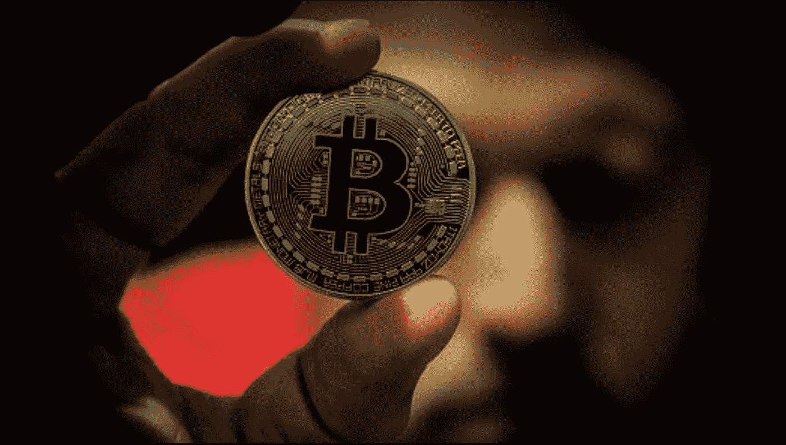

# 比特币价值飙升 47%!

> 原文：<https://medium.com/hackernoon/whopping-47-spike-in-the-bitcoin-value-7a31565e768>

Image Source: Unsplash

在数据的支持下， [**CoinDesk**](https://www.appdupe.com/blog/whopping-47-spike-in-the-bitcoin-value-flash-update/) 宣布，**比特币**的价值从 **$5000** 突然飙升至 **$8101.91** 。

考虑到比特币之前的价值，这实际上是一个革命性的突破。加密货币的悖论仍然是一个泡沫，代币购买者和其他怀疑论者预计这个泡沫很快就会破裂。

根据记录和**常规市场分析**，比特币的具体价值在世界时区 **20:00** 至**20:15**(**UTC**)之间暴涨。快速倒回最近比特币走势的历史，看起来，在**11 月 12 日**交易后，比特币价值以 5000 美元的收盘价跌至谷底。

提交的报告提到，比特币价值跌至如此低位的必要原因是当 [**Segwit2x**](https://support.coinbase.com/customer/portal/articles/2892985-segwit-2x-faq) 决定取消其升级比特币网络的计划。

今年 11 月初，包括 Segwit2X 开发团队在内的一些比特币矿工和比特币社区宣布，他们不再支持**比特币分支**。

为了提高比特币用户的信任度，保持比特币泡沫的稳定，CoinDesk 对其**交易过程**进行了**透明描述**。甚至其他交易所也采取了类似的行动来保护他们的消费者。把自己打造成整个行动中的最大赢家。

经过这么长时间，即使是现在，比特币交易所仍有巨大的机会，因为狂热的用户和投资者的利益。

比特币交易所是你目前能做的最好的事情，因为中间人从每一笔比特币交易中获得了最大收益，无论 BTC 发生什么，他们都有稳定的收入来源。

这是一个十年一次的创业机会，开始一个 [**比特币交易所**](https://www.appdupe.com/blog/whopping-47-spike-in-the-bitcoin-value-flash-update/) 与 [**钱包服务**](https://www.appdupe.com/blog/whopping-47-spike-in-the-bitcoin-value-flash-update/) ，随着每一次疯狂的推动，吃掉 **2.5%的交易费**。

## 一周大概有几百万！