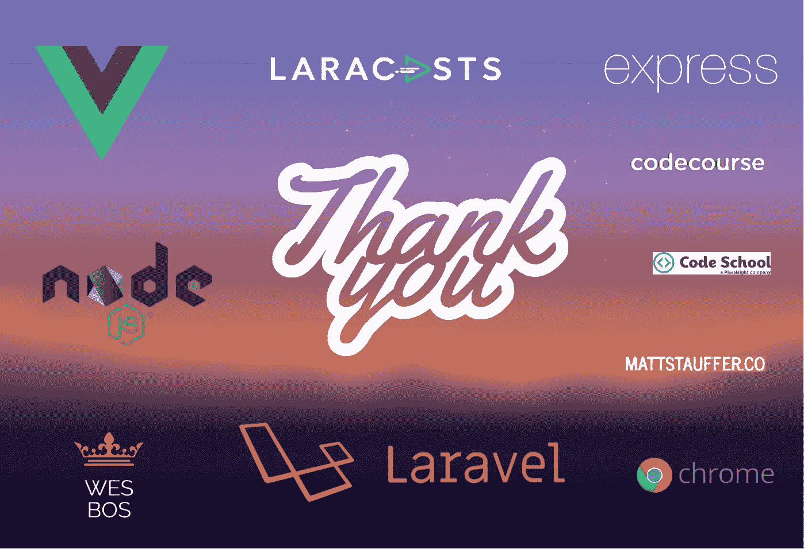

# 谁在你的 2016 年网络开发感谢名单上？

> 原文：<https://medium.com/hackernoon/whos-on-your-2016-web-development-thank-you-list-435b29541c35>

随着 2016 年接近尾声，我毫不羞愧地承认**我完全依赖开源工具、库和框架。**几年前我认输了，从那以后就一直是*框架的福音*—[我当然不是一个人](/@sachagreif/the-state-of-javascript-front-end-frameworks-1a2d8a61510#.735tgia8p)。

对我来说，越固执己见越好*(也许对其他人来说不那么固执)*当涉及到做出技术决策时，我发现[多即是少](https://en.wikipedia.org/wiki/The_Paradox_of_Choice)。

> "如果说我看得更远，那是因为我站在巨人的肩膀上."—艾萨克·牛顿爵士

我感谢我每天使用的许多令人惊叹的开源项目。作为生产力提升的回报，我通过捐款、买书、拉请求、编辑文档和社区参与来支持他们。

我的感谢清单如下。谁在你的名单上？

# 一个简短的题外话…为什么我们应该感恩。

## 网络是由其衍生的开源社区定义的。

网络发展的历史是一条曲折的道路；由发现、实验、实施和社区贡献的时刻来定义。作为 2016 年的 web 开发人员，我们经常在这些阶段之间转换。通过支持和贡献开源社区，我们正在帮助定义我们自己行业的未来。

## 这是一个网络开发人员的绝佳时代。

[虽然看起来很难](https://hackernoon.com/how-it-feels-to-learn-javascript-in-2016-d3a717dd577f)，但这是成为一名网页开发者的大好时机。进入门槛极低，学习的欲望是一个人入门所需要的一切——加上一台低端电脑和一些业余时间。

Web 开发是一项赋能技能——对于那些不熟悉其多种方言的人来说，这似乎很神奇。

## 每个人都受益于开源社区的慷慨。

开源不是[零和增益](https://en.wikipedia.org/wiki/Zero-sum_game)。成功的开源项目对双方都有利:

项目创始人获得领导经验，接触贡献者/测试者，职业机会，演讲演出，甚至潜在的名声。围绕他们的项目形成的社区可以影响整个行业的未来方向(例如 Rails、jQuery、Less/Sass、Angular、React)。

最终用户能够用更少的资源完成更多的工作。通过参与社区，他们还可以获得各种各样的反馈和意见。

# 我的 2016 网络发展感谢清单

话虽如此，我想感谢那些帮助我在 2016 年成为一名更好的 web 开发人员的开源项目和人们——*你的列表将明显不同于我的*。

我感谢他们所有的辛勤工作和奉献精神。他们让我有可能完成看似不可能的事情。

[**Laravel**](https://laravel.com/)**—**[**Taylor Otwell**](https://twitter.com/taylorotwell)
感谢 Taylor ot well 和 Laravel 社区让我的服务器端开发体验变得优雅、富有表现力且轻松愉快— *我敢打赌，您从未想过这句话在 PHP* 中也是可能的。他对微调开发人员体验的持续关注使得 Laravel 使用起来很愉快。我自豪地支持框架和资助其开发的工具生态系统。

[**Vue.js**](https://vuejs.org/)**——**[**尤雨溪**](https://twitter.com/youyuxi)
感谢尤雨溪创建 Vue.js，去年我第一次从 Laravel 社区了解到 vue . js，它就这样“点击”了我。Laravel 和 Vue 之间早期和持续的合作是两个社区的巨大胜利。对 Vue.js 来说，这是伟大的一年，你可以在 Patreon 上支持未来的发展。

[**NodeJS**](https://nodejs.org)
感谢 NodeJS 社区解决了他们的分歧，成立了 [NodeJS 基金会](https://nodejs.org/en/foundation/)。虽然这发生在 2015 年末，但我今年开始与 NodeJS 合作，我很感激它的未来看起来很光明。

[**ExpressJS**](http://expressjs.com/) **ExpressJS 有一段[不可思议的历史](http://thefullstack.xyz/history-express-javascript-framework/)。我感谢 TJ Holowaychuk 创建了 Express，也感谢 Doug Wilson 为保持项目持续进行所做的努力。Express 很容易使用，并且在网络上有很好的记录。**

**[**Lara casts**](https://laracasts.com/)**—**[**Jeffrey Way**](https://twitter.com/jeffrey_way)
感谢 Jeffrey Way 分享他关于 PHP、Laravel、Javascript 和 Vue.js 的知识和经验，也感谢精彩的 Laravel Elixir 工具，它极大地简化了 webpack 资产和组件绑定。**

**[**CodeCourse**](https://twitter.com/teamcodecourse)
感谢 code course 提供如此深入的涵盖 Laravel 和 Vue.js 的课程，我已经学到了很多。**

**[**Matt Stauffer**](https://mattstauffer.co/blog)
感谢 Matt Stauffer 发表的详细而有用的博文，涵盖了 Laravel 的每一个新版本。**

**[**code school**](https://www.codeschool.com)
感谢 code school[帮助儿子学习 Javascript](https://hackernoon.com/how-my-10-year-old-learned-javascript-d8782b586db7) 。**

**[**Wes Bos**](http://wesbos.com/)
感谢 Wes Bos 精彩的 [FlexBox](http://flexbox.io/) 和 [Javascript 30](https://javascript30.com/) 课程——它们确实帮助提高了我的前端开发技能。**

**[**Chrome DevTools 团队**](https://twitter.com/ChromeDevTools)
感谢 Chrome DevTools 团队。我每天使用 DevTools 无数次，无法想象没有它的工作。我几乎认为轻松操作 DOM/CSS、调试 Javascript 和查看网络请求的能力是理所当然的。**

# **谁在你的 2016 年网络开发感谢名单上？**

**如果你还没有这样做，我鼓励你张贴你自己的 web 开发感谢列表。您的列表可能包括开源“推动者”和震动者、项目负责人、一个有用的 Slack/freenode 朋友，甚至是一个花时间在 StackOverflow 或社区论坛上回答一个棘手问题的人。任何人都可以在开源社区产生影响。**

****期待看到你的名单** …**

************

> **[黑客中午](http://bit.ly/Hackernoon)是黑客如何开始他们的下午。我们是 [@AMI](http://bit.ly/atAMIatAMI) 家庭的一员。我们现在[接受投稿](http://bit.ly/hackernoonsubmission)并乐意[讨论广告&赞助](mailto:partners@amipublications.com)机会。**
> 
> **如果你喜欢这个故事，我们推荐你阅读我们的[最新科技故事](http://bit.ly/hackernoonlatestt)和[趋势科技故事](https://hackernoon.com/trending)。直到下一次，不要把世界的现实想当然！**

****